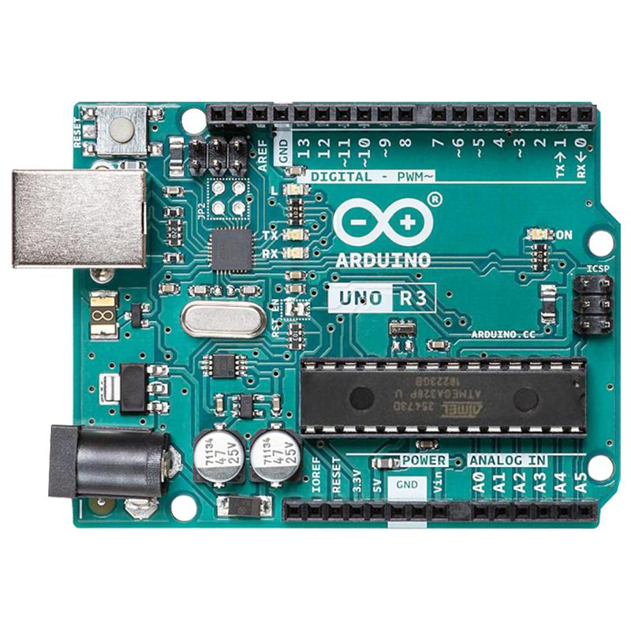
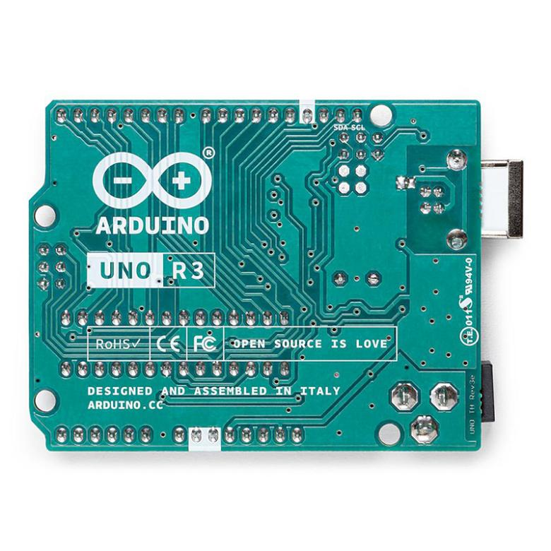
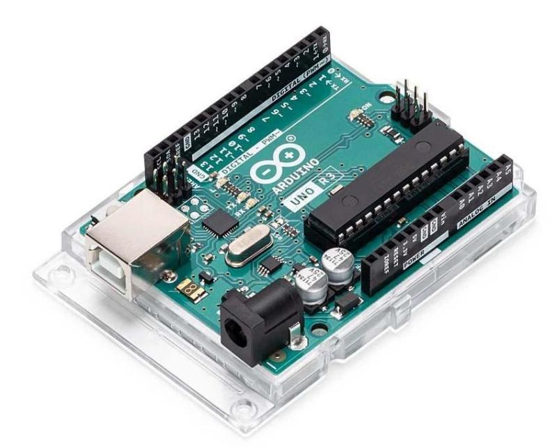
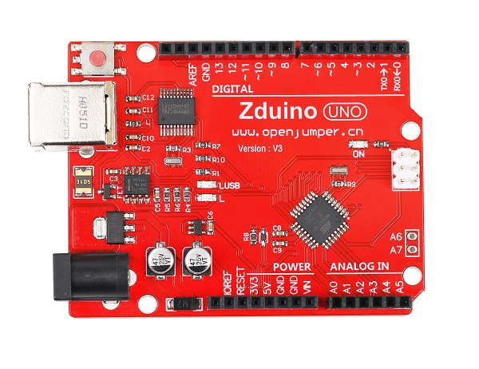
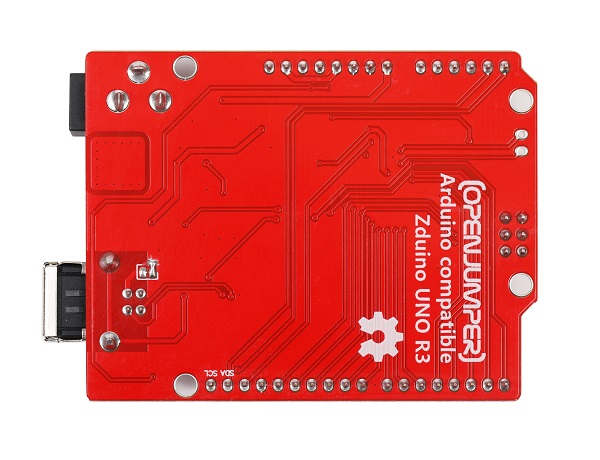
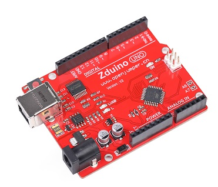
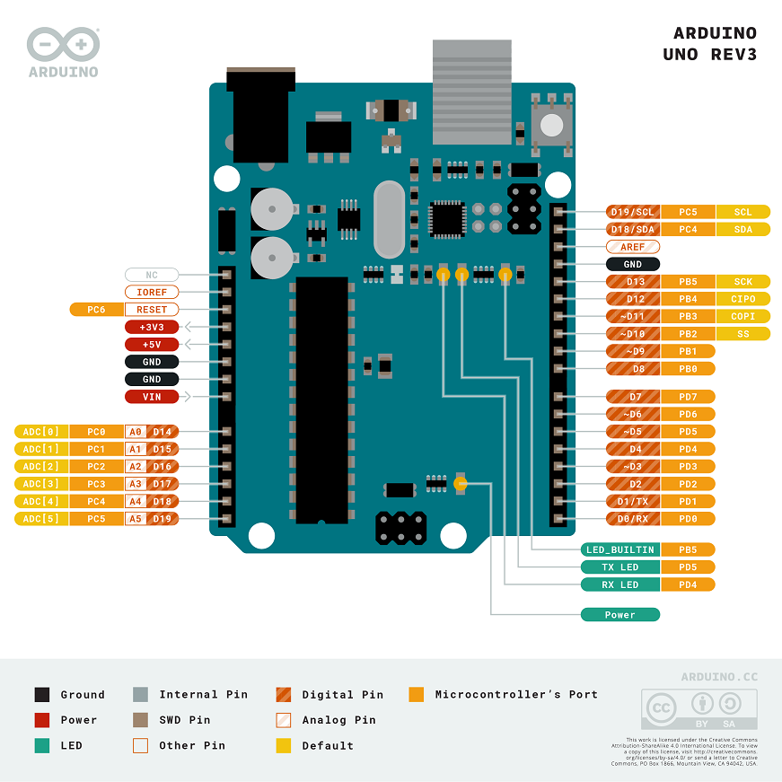

# Arduino Uno R3

<table border="1">

<tr>
  <td align="center"></td>
  <td align="center"></td>
  <td align="center"></td>
</tr>
<tr>
  <td style="background-color:rgb(232,232,232,0.5) "colspan="3" align="center"><a href="https://item.taobao.com/item.htm?id=538536808759"> arduino uno r3</a> </td>
</tr>

<tr>
  <td align="center"></td>
  <td align="center"></td>
  <td align="center"></td>
</tr>
<tr>
  <td style="background-color:rgb(232,232,232,0.5)" colspan="3" align="center"><a href="https://item.taobao.com/item.htm?id=536879527406">zduino uno r3</a></td>
</tr>
</table>

## 概述

Arduino Uno R3是基于ATmega328的微控制器板。它具有 14 个数字输入/输出引脚（其中 6个可用作 PWM 输出）、6个模拟输入、一个 16 MHz 陶瓷谐振器 （CSTCE16M0V53-R0）、一个 USB 连接、一个电源插孔、一个 ICSP 接头和一个复位按键。

它包含支持微控制器所需的一切；只需使用USB电缆将其连接到计算机，或使用AC-DC适配器或电池为其供电即可开始使用。

Uno与以前电路板的不同之处在于它不使用FTDI USB到串行驱动程序芯片。

**R3 版本有以下新的特点：**

 + 1.在 AREF 引脚附近增加了用于TWI通信的SDA和SCL引脚，以及在RESET引脚附近增加IOREF引脚和一个预留引脚。

 + 2.更强的复位电路。

 + 3.ATmega16U2代替8U2。

## 技术参数

|名称|参数  |
| :--| :--|
|微控制器|ATmega328P|
|工作电压|5V|
|输入电压（推荐）|7-9V|
| 数字 I/O 引脚|14个（其中6个提供PWM输出）|
|PWM 数字 I/O 引脚|6个|
|模拟输入引脚|6个|
|每个 I/O 引脚的 DC 电流| 20 mA|
|3.3V 引脚的直流电流|50 mA |
|Flash内存|32 KB（ATmega328P），其中0.5 KB可被用作bootloader |
|SRAM|2 KB （ATmega328P）|
|EEPROM|1 KB （ATmega328P）|
|时钟速率| 16MHz|
|LED_BUILTIN |13|
|尺寸|68.6 mm * 53.4 mm|
|重量|25 克|

## 引脚排列图

## 电源

Arduino Uno板可以通过USB连接或外部电源供电。自动选择电源。
外部（非 USB）电源可以是AC-DC适配器（壁挂式）或电池。该板可用6-20V的外部电源供电。但是，如果供电电压低于7V，则5V引脚的电压可能低于5V，并且电路板可能会变得不稳定。如果使用超过12V，稳压器可能会过热并损坏电路板。推荐范围为 7 - 12V。

电源引脚如下：

+ **Vin：** 当使用外部电源从DC插孔供电时，VIN为外部电源电压。同时也可以通过VIN，GND引脚给板子供电。

+ **5V：** 该引脚从电路板上的稳压器输出一个稳定的5V。该板可由直流电源插孔 （7-12V）、USB 连接器（5V）或电路板 VIN引脚（7-12V）供电。通过5V或3.3V引脚提供电压会绕过稳压器，并可能损坏电路板。我们不建议这样做。

+ **3V3：** 由主板的稳压器产生的 3.3V电源。最大输出电流为50 mA。

+ **GND：** 接地引脚。

+ **IOREF:** 该引脚为主芯片工作提供一个参考电压，一个合适的扩展板可以读取IOREF引脚电压用来选择适当的电源，或者使能工作电压为5V或者3.3V芯片的输出脚的电压转换器。

 

## 存储空间

ATmega328 有 32 KB（其中 0.5 KB被用作bootloader）。它还具有2 KB的SRAM和1 KB的EEPROM（可以使用[EEPROM库](https://www.arduino.cc/en/Reference/EEPROM)进行读取和写入）。

 

## 输入和输出

Uno上的14个数字I/O都可以用作输入或输出，使用[pinMode（）、](https://www.arduino.cc/en/Reference/PinMode)[digitalWrite（）](https://www.arduino.cc/en/Reference/DigitalWrite)和[digitalRead（）](https://www.arduino.cc/en/Reference/DigitalRead)函数。它们的工作电压为5V。每个引脚可以输入或输出20 mA电流，并具有20-50千欧的内部上拉电阻（默认情况下断开）。可以输出或者输入最大40mA的电流。部分引脚带有特殊功能:

* **串口：** 0（RX）和1（TX）。用于接收（RX）和发送（TX）TTL串口数据。这些引脚连接到USB 转 TTL 串口芯片的相应引脚。

* **外部中断：** 2和3。这些引脚可配置为在低值、上升沿或下降沿或值变化时触发中断。

* **PWM：** 3、5、6、9、10 和 11。使用analogWrite（）函数提供8位PWM输出。

* **SPI：** 10(SS)，11(MOSI)，12(MISO)，13(SCK)。支持使用 SPI 库进行 SPI 通信。

* **LED：**  13。有一个由数字引脚13驱动的内置LED。当引脚为高电平时，LED亮，当引脚低电平时熄灭。

* **TWI：** A4或SDA引脚和A5或SCL引脚。使用Wire库支持TWI通信。

* **模拟输入：** Uno有6个模拟输入，标记为A0到A5，每个输入提供10位分辨率（即1024个不同的值）。默认情况下，它们的测量范围从地到5V，但可以使用AREF引脚和al analogReference()功能更改其范围的上限。

* **AREF：** 模拟输入参考电压。与analogReference()一起使用。

* **Reset：** 通过置低来复位微控制器。

## 通信

Uno有许多用于与计算机、另一个Arduino板或其他微控制器进行通信的功能。ATmega328提供UART TTL （5V）串口通信，该通信可在数字引脚0（RX）和1（TX）上使用。板上的ATmega16U2通过USB引导此串行通信，并显示为计算机上软件的虚拟通信端口。16U2 固件使用标准 USB COM 驱动程序，无需外部驱动程序。但是，[在 Windows 上，需要 .inf 文件](http://arduino.cc/en/Guide/Windows#toc4)。Arduino 软件(IDE)包括一个串口监视器，可以与arduino板子相互发送或者接收简单的数据。当使用USB传输数据时，板上的 RX 和 TX LED 将闪烁（但不适用于引脚0和1）。

软件模拟串口库允许用Uno其他数字端口进行串口通信。

ATmega328还支持I2C（TWI）和SPI通信。Arduino软件（IDE）包括一个Wire库，以简化I2C总线的使用。对于SPI通信，请使用[SPI库](https://www.arduino.cc/en/Reference/SPI)。

## 编程

Arduino Uno可以使用（[Arduino 软件](https://www.arduino.cc/en/Main/Software)（IDE））进行编程。从工具>电路板板菜单中选择Arduino Uno（根据主板上的微控制器）。

Arduino Uno上的ATmega328预先烧录了bootloader，您可以在不使用外部硬件编程器的情况下将新代码上传到其中。它使用原始的STK500协议进行通信。

您还可以绕过引导加载程序，使用[Arduino ISP](https://www.arduino.cc/en/Main/ArduinoISP)或类似设备通过ICSP（在线串行编程）标头对微控制器进行编程。

## 自动（软件）复位 

Arduino Uno板可以通过连接计算机上运行的软件进行重置，避免了手动机械的去按下主控器上的复位按键。ATmega8U2/16U2 的其中一条硬件流量控制线（DTR）通过一个 100 nf电容器连接到 ATmega328 的复位引脚。当该线路被置位（取低电平）时，复位按键拉低足够时间从而复位芯片。Arduino 软件使用此功能，只需按界面工具栏中的上传按钮即可上传代码。这意味着bootloader会有个短暂的超时，而DTR信号会在开始下载后良好的协调输出。

此设置还有其他含义。当Uno连接到运行Mac OS X或Linux的计算机时，每次从软件（通过USB）与其建立连接时，它都会重置。在接下来的半秒钟左右，bootloader正在 Uno 上运行。当它在进行编程时将忽略错误数据，在打开连接后将截获发送给板子的前几个字节数据。如果板子上运行一个程序，会在它开始运行时获取一次配置和其他数据，来保证在打开连接后，在发送数据前用来通信的软件等待一秒。

UNO还有一个用来取消自复位的一个跳线。丝印标为“RESET-EN”，这两个焊盘间的连线可以被割断来取消掉自复位功能。同时，你也可以用110欧姆的电阻连接5V和reset引脚来取消自复位功能。

## USB过流保护

Arduino Uno有一个可重置的多保险丝，可保护计算机USB端口免受短路和过电流的影响。虽然大多数计算机都有自己的内部保护，但保险丝提供了额外的保护层。如果USB端口的电流超过500 mA，保险丝将自动断开连接，直到短路或过流被消除。 

 

## 物理特性 

Uno PCB的最大长度和宽度分别为2.7和2.1英寸，USB连接器和电源插座超出了先前的尺寸。四个螺孔使电路板可以固定到其他表面或外壳上。请注意，数字引脚7和8之间的距离为160mil，不是和其他引脚一样的100mil间距。

## 其他资料

[原理图下载](https://content.arduino.cc/assets/UNO-TH_Rev3e_sch.pdf)