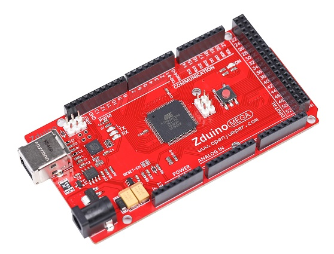

# Arduino MEGA（Zduino MEGA）

<table border="1" width="800" align="center">

<tr height="220">
  <td align="center"></td>
  <td align="center"></td>
  <td align="center"></td>
</tr>
<tr>
  <td style="background-color:rgb(232,232,232,0.5) "colspan="3" align="center"><a href="https://item.taobao.com/item.htm?id=588087482061">Arduino MEGA2560</a> </td>
</tr>

<tr height="220">
  <td align="center"></td>
  <td align="center"></td>
  <td align="center"></td>
</tr>
<tr>
  <td style="background-color:rgb(232,232,232,0.5)" colspan="3" align="center"><a href="https://item.taobao.com/item.htm?id=595608746301">Zduino MEGA2560</a></td>
</tr>
</table>

## 概述

Zduino MEGA是基于Arduino MEGA 2560 的微控制器板，相较于其他型号的Arduino控制器，它提供了更多I/O口与更大运算储存空间。它包含了54个数字输入输出口(其中14个可以作为PWM输出)，16个模拟输入口，4个串口(硬件串口)，同时含有一个USB连接头，一个电源插孔，一个ICSP接口，一个复位按键等支持主控器运行的最小系统。用一根USB数据线连接到电脑，或者一个交流转直流的电源适配器，亦或是一个电池即可让它运行起来。大多数为Aruino  Duemilanove 或 Diecimila设计的扩展板都兼容于Mega。

Zduino Mega2560与之前的版本最大不同在于它未使用USB转串口驱动芯片 FTDI，而是用ATmega16u2作为USB转串口芯片(R2版本则采用ATmega8u2)。

R3版本还有如下几点改动：

1.输出:在引脚AREF旁边添加了SDA和SCL接口，同时在RESET引脚旁边添加了IOREF引脚，允许扩展板采用下面主板提供的电压。使得扩展板不仅兼容主板同时还兼容用5V电压工作的AVR，和用3V3操作的DUE。IOREF为空脚，预留给未来其他用途。  

2.更强的复位电路  

3.Atmega16u2代替8u2

## 技术参数

|名称|参数|
|:---|:---|
|主控芯片 |  ATmega2560|
|工作电压 |  5V|
|输入电压（推荐）|7-9V |
|数字输入输出口  |  54(其中15个可被用作PWM输出)|
|模拟输出口  |  16|
|每个IO口的电流  |   40mA|
|3.3V引脚电流 |  50mA|
|Flash  |  256KB(其中8KB被用作bootloader)|
|SRAM |  8KB|
|EEPROM  |  4KB|
|时钟速率 |  16Mhz|

## 引脚说明

 [引脚说明文档](https://content.arduino.cc/assets/Pinout-Mega2560rev3_latest.pdf)

## 功能说明

+ **电源**  
   Zduino Mega可以通过USB连接线或者外部电源供电，当两者同时接入时，可以自动选择供电。
   外部电源可以来至交流转直流电源适配器或者是电池，从主板上DC插孔接入。主板允许外部电源范围为6-20V。如果外部供电低于7V，5V输出引脚可能少于5V，同时板子工作不稳定。如果外部供电超过12V，稳压芯片可能过热损坏主板。电压推荐范围为7-12V。

  + **1.VIN：** 当使用外部电源从DC插孔供电时，VIN为外部电源电压。同时也可以通过VIN，GND引脚给板子供电。

  + **2.5V：** 当用USB或者外部电源供电时，5V引脚输出标准的5V。如果通过5V或者3。3V给板子供电有可能会损坏主板，我们不推荐这样做。

  + **3.3.3V：** 由主板上的稳压芯片提供，最大输出电流为50mA。

  + **4.GND：** 接地引脚。

  + **5.IOREF：** 该引脚为主芯片工作提供一个参考电压，一个合适的扩展板可以读取IOREF引脚电压用来选择适当的电源，或者使能工作电压为5V或者3.3V芯片的输出脚的电压转换器。

+ **存储空间**

   Zduino MEGA 有256KB的Flash(其中8KB被用作bootloader)，8KB的SRAM和4KB的EEPROM。

+ **输入输出**

   通过使用pinMode()，digitalWrite()， 和 digitalRead() 函数，MEGA上54个数字I/O引脚中的每一个都可以作为输入输出端口。每个引脚都有一个20-50千欧的内部上啦电阻(默认断开)，可以输出或者输入最大40mA的电流。部分引脚带有特殊功能:

   + **1.UART：** Serial:0(RX)和1(TX)；Serial1: 19(RX)和18(TX)； Serial 2: 17(RX) 和16(TX)； Serial3: 15(RX)和14(TX)。   使用接收(RX)和发送(TX)TTL串口数据。0和1这两个引脚连接在USB转串口芯片ATmega16u2通信引脚上。

   + **2.TWI：** 20(SDA)和21(SCL)通过使用Wire库来支持TWI通信。(注意这两个针脚和Duemilanove   UNO版本的TWI引脚位置是不一样的)

   + **3.外部中断：** 2(外部中断0) 3(外部中断1) 18(外部中断5) 19(外部中断4) 20(外部中断3) 21(外部中断2)这些引脚可以被配置成当一个低电平或者一个高电平或一个电平跳变可以触发外部中断。

   + **4.PWM：** 2-13 44-46能使用analogWrite()函数支持8位的PWM输出。

   + **5.SPI：** 53(SS)，51(MOSI)，50(MISO)，52(SCK)。这些引脚支持SPI通信。SPI引脚同时扩展在ICSP处，这里与UNO、Duemilanove 或 Diecimila兼容。

   + **6.LED：** 13.有一个内置的LED在数字脚13上，当引脚是高电平时，LED亮，引脚为低电平时，LED不亮。

   + **7.模拟输入：** Zduino MEGA具有16个模拟输入口，每个模拟输入都有10位分辨率（即1024个不同的值）。默认情况下，模拟输入量为0-5V，也可以通过AREF引脚改变这个上限。

   + **8.AREF：** 模拟输入信号参考电压通过analogReference()函数使用。

   + **9.Reset：** 通过置低来复位arduino，通常用在带复位按键的扩展板上。

+ **通信**

   Zduino MEGA有一系列与电脑或者另外的arduino或其他主控器通信的工具。MEGA提供4个TTL电平的硬件串口通信。ATmega16u2还允许通过USB在电脑上虚拟COM端口来进行虚拟串行(CDC)通信，这个芯片使用标准的USB串行驱动(在Windows上需要一个。inf文件)，16u2固件使用的标准USB串口驱动，不需要额外的驱动。arduino软件还包含了一个串口监视器，可以与arduino板子相互发送或者接收简单的数据。当使用USB传输数据时，板子上RX、TX LED会闪烁(这个特性不是适用于0、1端口)。

   还提供一个软件模拟串口库允许你用Mega2560其他数字端口进行串口通信。

   同时 ATmega2560支持I2C(TWI)和SPI通信，arduino软件自带了一个TWI（I2C）通信的 wire库。如果要SPI通信可以使用SPI库。

+ **编程**

   Zduino MEGA可以通过[Aduino软件](http://arduino.cc/en/Main/Software)进行编程。

   Zduino MEGA上的ATmega2560芯片里烧写了bootloader，使得你可以不通过外部的硬件编程器也可以上传新的程序到UNO中。bootloader使用STK500协议通信。

   你还可以绕过引导程序，使用外部编程器通过ICSP(在线串行编程)引脚烧写程序。

+ **自动复位**

   Zduino  MEGA连上电脑建立连接就可以通过软件控制主控器复位，避免了手动机械的去按下主控器上的复位按键。ATmega16u2上的DTR引脚通过一个100nf的电容连接到ATmega2560的复位引脚上，当DTR触发(拉低)，复位按键拉低足够时间从而复位芯片。Arduino 软件利用这一特性，就可以让你仅在软件中点击upload按键就可以下载程序。这意味着bootloader会有个短暂的超时，而DTR信号会在开始下载后良好的协调输出。

   这种设置还有一些其他含义，当MEGA被连接到其他跑MAC OS X或者Linux，每次通过软件复位连接，过半秒左右，Mega2560将运行bootloader。当它在进行编程时将忽略错误数据，在打开连接后将截获发送给板子的前几个字节数据。如果板子上运行一个程序，会在它开始运行时获取一次配置和其他数据，来保证在打开连接后，在发送数据前用来通信的软件等待一秒。

   UNO还有一个用来取消自复位的一个跳线。丝印标为“RESET-EN”，这两个焊盘间的连线可以被割断来取消掉自复位功能。同时，你也可以用110欧姆的电阻连接5V和reset引脚来取消自复位功能。

+ **USB过电流保护**

   Zduino MEGA有一个自恢复保险丝，防止短路或过流，从而保护您的计算机的USB端口。虽然大多数计算机提供都带有内部保护，但保险丝也可以提供额外的保护。如果电流超过500 mA，保险丝会自动断开连接防止短路或过载。

+ **物理特性**

   Zduino MEGA 的PCB长宽分别为4和2.1英寸，USB接口和电源插孔超出这个尺寸。有四个固定孔可以将板子固定在其他表面或者外壳上。需要注意的是7、8数字引脚之间的距离是160mil(0.16“）。而不是和其他脚一样的100 mil 间距。

   MEGA2560兼容大多数为UNO、Diecimila 或Duemilanove设计的扩展板。数字引脚0-13(和相邻的AREF、GND引脚)，模拟输入0-5，电源接口，ICSP接口是在相同位置。然后主串口在相同的位置也就是0和1引脚，还有外部中断0和1(2和3引脚)在同一位置，SPI接口是通过ICSP引出。需要注意的是I2C引脚是在在MEGA的20和21引脚，而不是像Diecimila 或Duemilanove模拟口4和5。

## 相关文档：

+ [2560原理图资料](http://openjumper.cn/wp-content/uploads/2012/08/2560.pdf)

+ [2560尺寸图](http://download.openjumper.cn/dimensioniMega.dxf)

