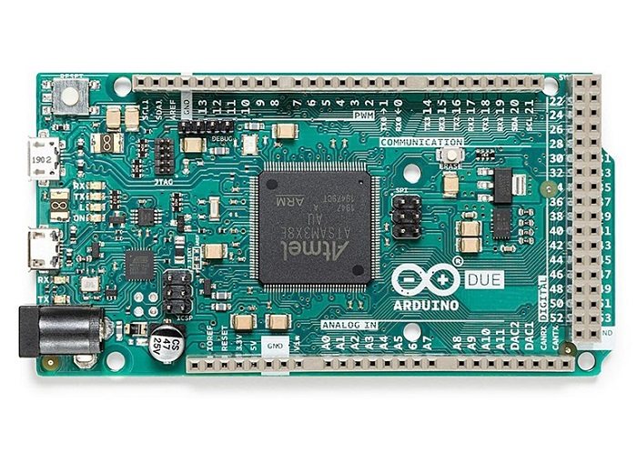
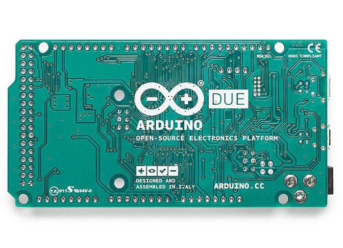
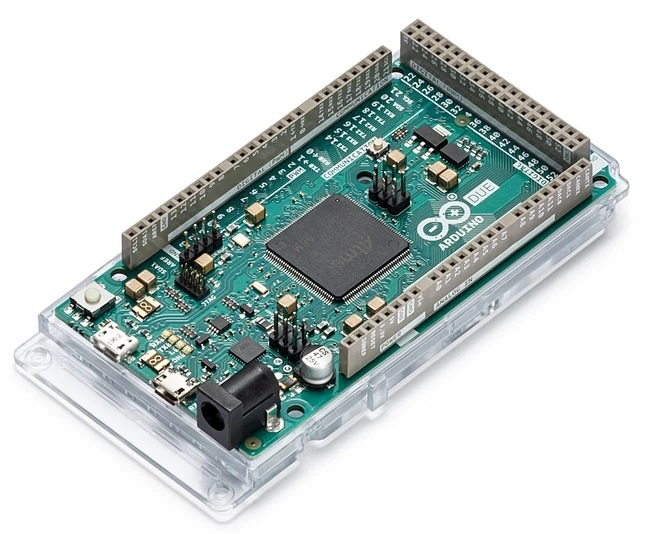
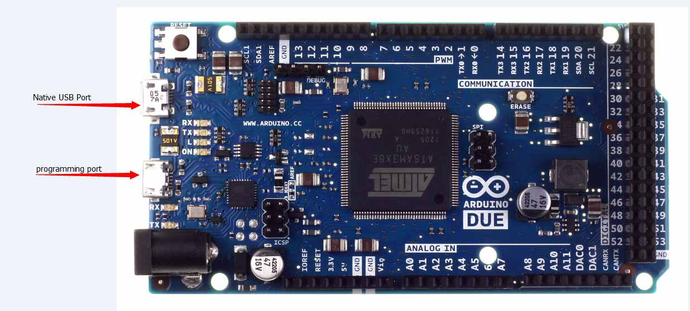

# Arduino Due

<table border="1">
<tr height="240">
  <td align="center"></td>
  <td align="center"></td>
  <td align="center"></td>
</tr>
<tr>
  <td style="background-color:rgb(232,232,232,0.5) "colspan="3" align="center"> <a href="https://item.taobao.com/item.htm?id=596231855812">Arduino Due</a> </td>
</tr>
</table>

## 概述

Arduino Due 是一块基于 Atmel SAM3X8E CPU的微控制器板。它是第一块基于 32位ARM核心的arduino。 它有54个数字IO口 （其中12个可用于PWM输出），12个模拟输入口，4路UART硬件串口， 84 MHz的时钟频率，一个USB OTG接口， 两路DAC（模数转换），两路TWI，一个电源插座，一个SPI接口，一个JTAG接口，一个复位按键和一个擦写按键。

**注意:**   
   不同于其他arduino，arduino due的工作电压为3.3V。IO口可承载电压也为3.3V。如果你使用更大的电压，比如5V到一个IO口，可能会烧了芯片。

电路板上已经包含控制运行所需的各种部件，你仅需要通过USB连接到电脑或者通过AC-DC适配器、电池连接到电源插座就可以让控制器开始运行。arduino due兼容工作在3.3V且引脚排列符合1.0 arduino标准的arduino扩展板。

## ARM核心的优势

使用32位ARM核心的Due相较于以往的使用8位AVR核心的其他arduino更强大。明显的差别有：

+ 32位核心在一个时钟能处理32位的数据；

+ 84Mhz的CPU时钟频率；

+ 96 KBytes的SRAM；

+ 512 KBytes的Flash；

+ 一个DMA控制器, 他能减轻 CPU做大量运算时的压力。

## 原理图及参考设计

[arduino-Due-reference-design.zip](http://arduino.cc/en/Main/ArduinoBoardDue)

[Schematic: arduino-Due-schematic.pdf](http://arduino.cc/en/Main/ArduinoBoardDue)

## 参数

|名称|参数|
|:--|:--|
|微控制器 | AT91SAM3X8E|
|工作电压 | Voltage 3.3V|
|输入电压（推荐）|7-9V |
|数字I/O引脚  |54 (其中12路PWM输出)|
|模拟输入通道 | Pins 12|
|模拟输出通道 |Pins 2 (DAC)|
|IO口总输出电流 |130 mA|
|3.3V端口输出能力  | 800 mA|
|5V端口输出能力  | 800 mA|
|Flash    |512 KB （所有空间都可以储存用户程序）|
|SRAM  | 96 KB (两个部分: 64KB and 32KB)|
|时钟速率|  84 MHz|

## 电源

Arduino Due可以通过Micro USB接口或外接电源供电，电源可以自动被选择。

外部（非USB）电源可以用AC-DC适配器（wall-wart）或电池。 适配器可以插在一个2.1毫米规格中心是正极的电源插座上，以此连接到控制器电源。控制器能支持6到20V电压输入。如果输入电压低于7V, 5V引脚可能得到的电压会低于5V，控制器运行可能会不稳定。如果使用输入电压超过12V, 可能会造成控制器过热，甚至损坏损坏。推荐输入电压范围为7到12V。电源相关引脚如下：

+ VIN： Arduino 使用外部电源时的输入电压引脚(你可以通过这个引脚供电，或者当DC座供电时，通过这个引脚使用DC电源)
  
+ 5V： 通过板载稳压芯片输出的5V的电压引脚。你可以从DC电源口、USB、VIN三处给控制器供电。也可以绕过稳压IC，直接从5V、3V3引脚供电，但不建议这样使用。
  
+ 3.3V：  通过板载稳压芯片输出的3.3V的电压引脚。 最大电流800 mA。该电压也是 SAM3X 的工作电压。
  
+ GND： 接地引脚。
  
+ IOREF： 该引脚提供arduino微控制器的工作参考电压. 一个适合的arduino扩展板能够读取 IOREF 引脚电压选择合适的电源， 或者提供3.3V或5V的电平转换。

## 存储空间

SAM3X有512 KB (两块256 KB)用于存储用户程序的Flash空间。ATMEL已经在生产芯片时，将bootloader预烧写进了ROM里。 SRAM有96 KB，由两个连续空间64 KB和32 KB组成。 所有可用存储空间 (Flash, RAM 和 ROM) 都可以直接寻址。你可以通过板子上的擦写按钮，擦除SAM3X 的 Flash 中的数据. 这个操作将删除当前加载的项目。在通电状态下，按住擦写按钮几秒钟，即可擦写。
## 输入和输出

**Digital I/O: 0至53号引脚**

> 使用pinMode(), digitalWrite(), anddigitalRead() 函数，每一个IO都可以作为输入输出端口。他们工作在3.3V。每一个IO都可以输出 3 mA 或者 15 mA电流，或者输入6 mA 或者 9 mA电流。他们也都有100K 欧 的内部上拉电阻 (默认状态下不上拉)。另外,一些引脚有特殊功能：

**Serial: 0 (RX) and 1 (TX)**

**Serial 1: 19 (RX) and 18 (TX)**

**Serial 2: 17 (RX) and 16 (TX)**

**Serial 3: 15 (RX) and 14 (TX)** 

> 串口发送接受端口（工作在3.3V电平）。其中0，1连接到了 ATmega16U2 的对应串口上，用于USB转UART通信。

**PWM: 引脚 2 to 13**

> 使用analogWrite()函数提供8位的 PWM 输出。 可以通过analogWriteResolution() 函数改变PWM输出精度。

**SPI:** SPI接口 (在其他arduino上称作ICSP接口)

>可以通过SPI库是SPI接口用于通信。SPI 引脚已经引出到了6针接口位置， 可以和 Uno、Leonardo、Mega2560兼容。 这个SPI针仅用于和其他SPI设备通信，不能用于 SAM3X 的程序烧写。Due的SPI可以通过Due专用的扩展库来使用其高级特性。

**CAN:** CANRX 和 CANTX 

> 硬件支持CAN，但arduino目前并不提供该API

**“L” LED: 13**

> 有一个内置的LED在数字脚13上，当引脚是高电平时，LED亮，引脚为低电平时，LED不亮。因为13脚带有PWM输出功能，因此可以进行亮度调节。

**TWI 1: 20 (SDA) 和 21 (SCL)**

**TWI 2: SDA1 和 SCL1。**

> 支持使用Wire库来进行TWI通信

**模拟输入: A0 到 A11**

> Arduino Due有12路模拟输入端， 每一路都有12位精度（0-4095）。默认情况下， 模拟输入精度为10位， 和其他型号的 Arduino 控制器一样。通过analogReadResolution()你可以改变ADC的采样精度。 Due的 analog inputs引脚测量范围为 0 至 3.3V。如果测量高于3.3V电压，可能会烧坏 SAM3X。analogReference() 函数在Due上是无效的。

**AREF** 
> 引脚通过一个电阻桥接到 SAM3X 模拟参考脚。 如果要使用 AREF 脚，你需要先从PCB上拆下BR1这个电阻。

**DAC1 and DAC2**

> 通过analogWrite() 函数提供12位精度的模拟输出 (4096个等级) 。 可以通过Audio库创建音频输出。

## 其他引脚

**AREF** 

> 模拟输入参考电压。通过analogReference()使用。

**Reset**

> 接低复位控制器。典型应用是通过该脚来连接扩展板上的复位按键。

## 通信

Arduino Due 可以通过多种方式与电脑、其他arduino 或者其他控制器通信, 也可以和其他不同的设备通信，像手机、平板、相机等等。SAM3X提供一组硬件UART和3组TTL (3.3V) 电平的UARTs 来进行串行通信。

程序下载接口连接着 ATmega16U2, 他虚拟了一个COM口在(Windows需要一个 .inf文件来识别该设备, 而OSX 和 Linux 可以自动识别). SAM3X 的硬件UART也连接着ATmega16U2。 串口 RX0和TX0通过ATmega16U2 提供了用于下载程序的串口转USB通信。ArduinoIDE包含了一个串口监视器， 可以通过串口监视发送或接收简单的数据。当数据通过16U2传输时 或者 USB连接电脑时（并不是0，1上的串口通信），板子上的RX和TX两个LED会闪烁。

原生的USB口虚拟串行CDC通信，这样可以提供一个串口，与串口监视器 或者 你电脑上其他应用相连。这个USB口也可以用来模拟一个 USB鼠标或者键盘。要使用这个功能，请查看鼠标键盘库支持页面 。这个原生USB口也可以作为USB 主机去连接其他外设，如鼠标, 键盘、智能手机. 要使用这个功能， 请查看USBHost支持页面。

SAM3X 也支持TWI和SPI通信。ArduinoIDE中可以通过Wire库轻而易举的使用TWI总线；使用SPI库可以进行SPI通信，细节方面请查看SPI支持页面。

## 编程

Arduino Due通过ArduinoIDE中的“download”下载程序。在SAM3X的arduino上 上传程序和AVR控制器有所不同，这是因为flash在上传程序前，需要被擦写。 SAM3X 的ROM中的程序会进行上传任务，但运行该程序的前提是SAM3X的flash空间是空的。

两个USB接口都可以给Due下载程序, 由于芯片擦除方式的影响，更推荐使用编程端口：

**编程端口:** 

使用这个端口下载, 你需要在arduinoIDE中选择”Arduino Due (Programming Port)”作为你的板子。连接编程端口 (靠近DC座的那一个) 到你的电脑。编程端口使用16U2来作为USB转serial连接到SAM3X 的第一UART(RX0 and TX0)。16U2上有两个针连接到连接到SAM3X的复位和擦除脚。在1200波特率下，打开和关闭串口会触发SAM3X的硬擦写程序，在通信之前通过串口触发 SAM3X 的擦写和复位引脚。推荐使用这个端口，上传程序到arduino。相对于使用原生USB端口软擦写芯片，使用编程端口硬擦写更稳定可靠。即使主芯片坏了，该端口仍旧会工作。

**原生端口:** 

使用这个端口下载, 你需要在arduinoIDE中选择  “Arduino Due (Native USB Port)” 作为你的板子。连接原生USB端口 (靠近复位按键的那一个) 到你的电脑。在1200波特率下，打开和关闭串口会触发SAM3X的软擦写程序：flash空间被擦写、程序倒转到bootloader区。如果主芯片损坏，软擦写程序 会不工作，这是因为该程序完全在SAM3X 上。开关原生USB端口baudrate 不会复位SAM3X。

不同于其他的Arduino控制器使用avrdude上传程序, Due上传程序依赖于 bossac。

ATmega16U2固件源码能在arduino库中找到。你可以使用外部编程器，通过ISP接口烧写固件 (覆盖DFU bootloader)。更多信息请参考相关文档。

## USB过流保护

Arduino Due上有一个自恢复保险丝，短路或者过流时，可以自动断开，从而保护你的电脑USB.。大部分电脑都带有内部过流保护，这个保险丝可以提供一层额外保护。 当电流大于500MA时，这个保险丝会自动断开，直到没有过载或者短路现象。

翻译自arduino.cc <http://arduino.cc/en/Main/ArduinoBoardDue>

