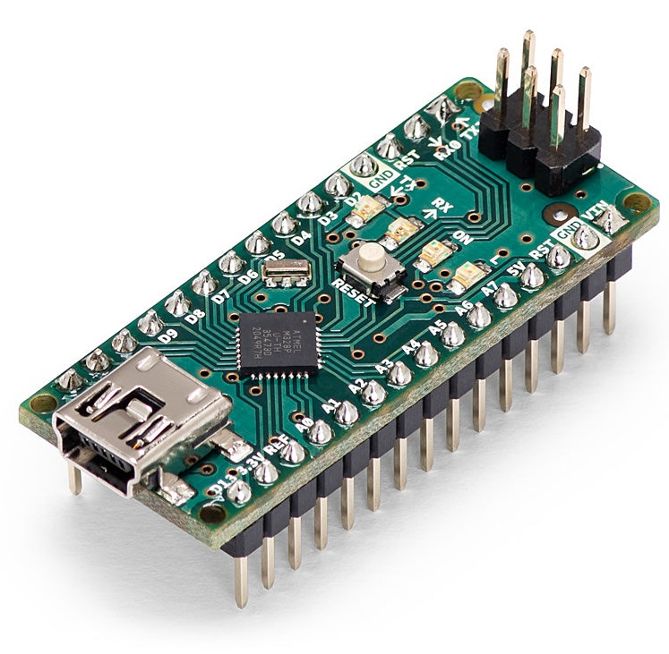
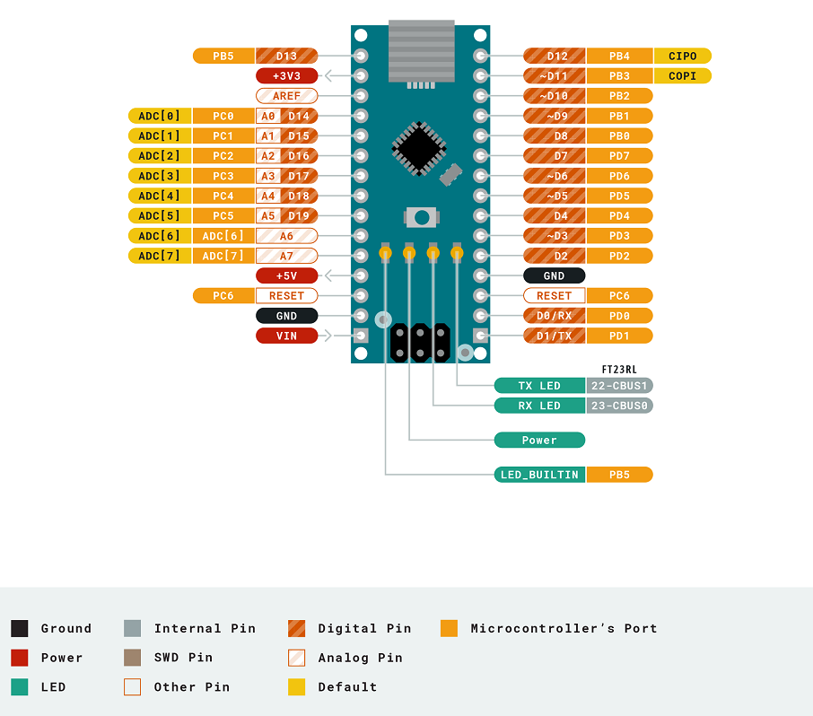

# Arduino Nano

## 简介
Arduino Nano是一款基于ATmega328（Arduino Nano 3.x）的小型，完整且对面包板友好的板。它或多或少具有与Arduino Duemilanove相同的功能，但包装不同。它仅缺少直流电源插孔，并且与Mini-B USB电缆而不是标准电缆配合使用。

Arduino Nano是Arduino USB接口的微型版本，最大的不同是没有电源插座以及USB接口是Mini-B型插座。Arduino Nano是尺寸非常小的而且可以直接插在面包板上使用。其处理器核心是ATmega328(Nano3.0)，同时具有14路数字输入/输出口（其中6路可作为PWM输出），8路模拟输入，一个16MHz晶体振荡器，一个mini-B USB口，一个ICSP header和一个复位按钮。

[点我购买](https://item.taobao.com/item.htm?id=707149287018)

## 技术参数

|名称|参数|
|:--|:--|
|处理器 |ATmega328|
|工作电压| 5V|
|输入电压（推荐）| 7-9V|
|数字IO脚 |22个(其中6路作为PWM输出）|
|模拟输入脚 |8个|
|IO脚直流电流 |40 mA|
|Flash Memory |32 KB （其中2 KB 用于 bootloader）|
|SRAM |2 KB|
|EEPROM |1 KB |
|FT232RL FTDI| USB接口芯片|
|工作时钟 |16 MHz|
|PWM|6|
|功耗|19mA|
|尺寸|18*45mm|
|重量|7g|

## 引脚说明

## 电源

Arduino Nano可以通过Mini-B USB连接，6-20V非稳压外部电源（引脚30）或5V稳压外部电源（引脚27）供电。电源自动选择到最高电压源。

## 存储器

ATmega328包括了32KB Flash，其中2KB用于Bootloader。同时还有2KB SRAM和1KB EEPROM。

## 输入输出

Nano上的14个数字引脚中的每一个都可以使用pinMode（），digitalWrite（）和digitalRead（）函数用作输入或输出。它们的工作电压为 5V。每个引脚可以输入输出最大电流为 40 mA ，并具有一个 20-50 KΩ的内部上拉电阻（默认断开）。此外，有些引脚还有特定的功能:

+ 串行：0号（RX） 和 1号（TX）。用于接收（RX）和传输（TX）TTL 串行数据。这些引脚连接到 FTDI USB 转 TTL 串行芯片的相应引脚。

+ 外部中断：2号和3号。触发中断引脚，可设成上升沿、下降沿或同时触发。

+ 脉冲宽度调制PWM：3、5、6、9、10 和 11。提供6路8位PWM输出。

+ SPI： 10（SS），11（MOSI），12（MISO），13（SCK）；SPI通信接口。

+ LED： 13号，有一个内置 LED 连接到数字引脚 13。当引脚为高电平时，LED 亮起，当引脚为低电平时，LED 熄灭。

Nano有8个模拟输入，每个输入提供10位分辨率（即1024个不同的值）。默认情况下，它们的测量电压从0到5V，但可以使用 analogReference（） 函数更改其范围的上限。模拟引脚 6 和 7 不能用作数字引脚。此外，某些引脚具有专用功能：

+ I2C：A4（SDA）和A5（SCL）。支持使用Wire库的 I2C （TWI） 通信。

板上还有其他几个引脚：

+ AREF:模拟输入信号的参考电压。与 analogReference（） 一起使用。

+ RESET:信号为低时复位单片机芯片。

## 通信
Arduino Nano具有许多用于与计算机，另一个Arduino或其他微控制器进行通信的功能。ATmega328 提供 UART TTL （5V） 串行通信，可通过数字引脚 0 （RX） 和 1 （TX） 使用。板上的FTDI FT232RL通过USB和FTDI驱动程序（包含在Arduino软件中）通过USB进行这种串行通信，为计算机上的软件提供虚拟com端口。Arduino软件包括一个串行监视器，可以将简单的文本数据发送到Arduino板和从Arduino板发送。当数据通过 FTDI 芯片和 USB 连接到计算机传输时，板上的 RX 和 TX LED 将闪烁（但不适用于引脚 0 和 1 上的串行通信）。软件串行库允许在Nano的任何数字引脚上进行串行通信。ATmega328还支持I2C （TWI）和SPI通信。Arduino软件包括一个Wire库，以简化I2C总线的使用。

## 编程

Arduino Nano可以使用Arduino软件进行编程（下载）。从“工具>开发板”菜单中选择“Arduino Duemilanove or Nano w/ ATmega328”（根据开发板上的微控制器）。Arduino Nano上的ATmega328预刻了一个引导加载程序，您可以在不使用外部硬件编程器的情况下将新代码上传到其中。它使用原始 STK500 协议进行通信。您还可以绕过引导加载程序，并使用 Arduino ISP 或类似产品通过 ICSP（在线串行编程）接头对微控制器进行编程。

## 自动（软件）复位

Arduino Nano提供了自动复位设计，可以通过主机复位。这样通过Arduino软件下在程序到Nano中软件可以自动复位，不需要在复位按钮。

## 其他资料

[原理图下载](http://download.openjumper.cn/NanoV3.3_sch.pdf)