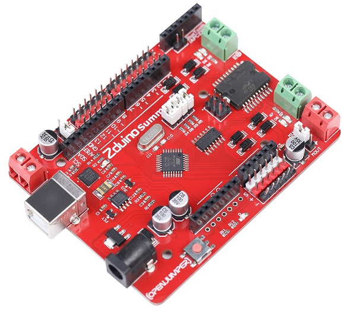

# Zduino SUMMER

<table border="1">
<tr>
  <td align="center"></td>
  <td align="center"></td>
  <td align="center"></td>
</tr>
<tr>
  <td style="background-color:rgb(232,232,232,0.5) "colspan="3" align="center"> <a href="https://item.taobao.com/item.htm?id=538537344735"> Zduino Summer</a> </td>
</tr>
</table>

## 概述

Zduino Summer是一款基于Arduino UNO的专用于智能小车设计开发的微控制器板。主板集成了Arduino UNO与L298电机驱动，具有两路大电流电机输出通道，另外集成了连接传感器需要的扩展口、蓝牙（BlueTooth）及无线模块APC220的扩展接口，此外还有独立的舵机供电接口，并且完全兼容UNO引脚位置。
Zduino Summer将传感器扩展板（部分）、L298P电机驱动、Arduino UNO的三合一控制板，一切都集成在这876mm×682mm的电路板中，单独一层就能使用以上所有功能。相反，如果你利用三种扩展板叠加的结构，将会损失一些功能，并占用大量的空间。

 
## 技术参数

| 名 称| 	性 能|  	说 明| 
|:--|:--|:--|
| 处理器 | ATmega328p|  	
| 工作电压 | 5V 	| 
| 外部输入电压（推荐）|  7～9V |
| 数字I/O脚 | 14个 | 其中3、5、6、9、10、11号端口可用于PWM输出| 
| 模拟输入脚 | 6个 | 
| 每个I/O直流输出能力 | 40 mA|  整个处理器工作电流不得超过200mA| 
| 3.3V直流输出能力 | 250 mA | 
| Flash Memory | 32 KB|  其中0.5 KB 用于 bootloader| 
| SRAM | 2 KB | 	
| EEPROM | 	1 KB 	| 
| 工作时钟 | 16 MHz | 	
| 下载芯片 	| CP2102 | 
| 电机驱动 | L298P | 
 |尺寸|876mm × 682mm  |

**兼容性：**  

Arduino Duemilanove （168 or 328）（兼容）

Arduino UNO（兼容）
  
Arduino Mega 1280 （不兼容）
    
Arduino Mega 2560 （不兼容）

 
## 输入电源

Zduino Summer可以通过2种方式供电，而且能自动选择供电方式。

1、外部电源可以通过AC/DC适配器或者电池，通过DC 2.1电源插座给Zduino Summer供电，如果使用外部电源供电，推荐输入电压7~9V，电压过大可能会烧坏稳压芯片。

2、使用MicroUSB线缆通过板载MicroUSB口给Zduino Summer供电。

3、Zduino Summer自身最小功耗：≤2W

**电源输入优先：**  

电源输入自动切换（输入电压≥7V时）： 

1、优先权：VIN ＞ USB  

2、竞争：DC插座输入与VIN间，电压高者优先  

 
**电源引脚：**

+ **VIN** —— VIN是input voltage的缩写，表示有外部电源时的输入端口。

    + 1、当不使用USB供电时，外接电源可以通过此引脚提供电源。（如电池供电，电池正极接VIN端口，负极接GND端口）  
    + 2、当外部直流电源接入DC电源插座时，可以通过VIN端口向外部附加板供电；

+ **5V** —— 通过稳压器或USB供电产生的5V电压，为Zduino Summer上或附加板的5V芯片供电。

+ **3V3** —— 通过稳压器或USB供电产生的3.3V电压，最大驱动电流250mA。

+ **GND** —— 参考地。

+ **舵机供电接口** —— 单独引入的舵机供电接口，在I/O口输出方波的同时，用跳帽选择舵机外部供电，方便连接舵机，供电范围：5～7V（根据舵机工作电压定）。  
     > 跳线功能：  
      > >SOUT：可以给8 ～ 13号的扩展接口独立供电，方便舵机等大功率设备的使用。  
       > >SIN：由电路板提供5V驱动。  
      >
     >注意：当选择使用SOUT时，我们推荐使用外接DC 5V电源，则接在数字口上的传感器不会受到影响。接入6 ~ 12V的电源时，5V的传感器将无法工作。

+ **电机供电接口** —— 提供给L298驱动电压，通过跳帽选择该电压连接至L298驱动电压，此驱动电压必须使用L298才能正常工作，不具备给主控板供电的功能。推荐供电范围：7 ~ 12V 。  

   **跳线功能：**

    >MIN：由DC插座或VIN端供电输入。   
    >MOUT：由电机供电接口端供电输入。  
  
**使用注意事项：**

+ DC插座错误的接入电源正负极性，不会导致Zduino Summer的直接损坏，但应避免此类现象出现。  
  
+ 如果输入的电源电压小于7V，5V的输出口可能小于5V而导致不稳定。推荐使用7～9V的直流供电。
  
+ I/O口带载能力有限，具体参看“技术规格”。若需带动大电流负载，请设计相应的驱动电路。  

## 存储器

ATmega328包括了片上32KB Flash，其中0.5KB用于Bootloader。同时还有2KB SRAM和1KB E2PROM。

## 输入输出

+ **14路数字输入输出口：**  
      工作电压为5V，每一路能输出和接入最大电流为40mA。除此之外，有些端口有特定的功能。  
      直接引出Arduino控制器板载I/O口，并为每个I/O口都配置了VCC、GND接口，方便传感器（电子积木接口）插接使用。

     + 串口信号RX（0号端口）、TX（1号端口）：TTL电平的串口信号收发。  
     + 外部中断（2、3号端口）：触发中断引脚，可设成上升沿、下降沿或同时触发。  
     + 脉冲宽度调制(PWM)（3、5、6、9、10、11号端口）：提供6路8位PWM输出，引脚位标示有“～”符号。

+  **6路模拟输入（A0到A5号端口）：**  
      直接引出Arduino控制器板载I/O口，并为每个I/O口都配置了VCC、GND接口，方便传感器（电子积木接口）插接使用。  
      每一路具有10位的分辨率（即输入有1024个不同值），默认输入信号范围为0到5V，可以通过AREF调整输入上限。

+ **AREF：** 模拟输入信号的参考电压。可以在AREF外接电压基准芯片来获得更高的精度，AREF电压输入范围2V到直流供电电压，但不得大于供电电压。  
      模拟输入信号参考电压通过 analogReference() 函数使用。  

+ **IOREF：** 能够使扩展板适应主板的电压（连接到板子上的VCC）  

+ **RST：** 信号为低时复位单片机芯片。通常用在带复位按键的扩展板上。  

+ **串口（UART）：**   
      ATmega328内置的UART可以通过数字口0（RX）和1（TX）与外部实现串口通信；使用CP2102（USBtoRS232芯片）完成MCU片上UART与电脑间的串口通讯及程序下载。

+ **TWI：**   SDA（A4)和SCL（A5)通过使用Wire库来支持TWI通信。

 
## 传感器扩展接口

在每个I/O口旁引出了传感器扩展接口，S连接旁边I/O口，＋，－分别连接5V，GND。
需要注意的是8——13接口旁的“＋”，可以通过跳帽选择外部电源给这8——13接口供电。

 
## L298电机接口

电机驱动器采用LGS公司优秀的大功率电机专用驱动芯片L298P，可直接驱动2路直流电机，驱动电流最大达2A。输出端采用高速肖特基二极管作为保护。

控制端口为4个，减少对Arduino数字端口的开销，不但起到节约控制器端口，而且控制程序也更为简单。

电机驱动芯片通过跳帽连接I/O口4，5，6，7。其中5，6可输出PWM，可以控制电机调向以及调速。其中4，5号I/O口控制电机1。6，7号I/O控制电机2。 

电机驱动恒定输出电流2A。在使用控制电机功能时应注意，驱动芯片需要外部供电，可以通过跳帽切换，由DC插座供电或者接线端子外部供电。

**接口引脚功能表：**

|板标示符号 |名 称 |功   能|
|:--|:--|:--|
|＋ 	|电机供电接口| 为电机提供电源的接口，需对应你的电机参数选择输入电源，且输入电源不应高于25V。|
|VIN||接电源正|
|GND||接电源地|
|－M1＋|电机接口1|连接直流电机1的端口|
|－M2＋|电机接口2|连接直流电机2的端口,接上使能跳帽后方可使用本扩展板的功能|

（出厂默认使能）INA使能跳帽电机A正反转控制PWMA电机A PWM输出控制INB电机B正反转控制PWMB电机B PWM输出控制 

1、D5、D6  LED：M1电机端口输出电压及正反转指示。

2、D7、D8  LED：M2电机端口输出电压及正反转指示。

> 注意事项：
>> 1、电源输入电压不得高于25V。  
>> 2、直流电机或舵机的正负极性不能接错。

**跳帽说明：**

|INA |PWMA |功能|INB |PWMB |功能|	
|:--|:--|:--|:--|:--|:--|
|X |Open |电机1控制禁止 |X |Open |电机2控制禁止|
|Enable |Enable |电机1正反转可调（调速） |Enable |Enable |电机2正反转可调（调速）|
|Open |Enable |电机1正转（调速）| Open |Enable |电机2正转（调速）|

**注：** 
> 1、Enable：跳帽短接  Open：跳帽打开   X：跳帽任意状态；  
> 2、电机正反转控制需由程序代码对相应引脚进行置位才能控制。

 
## AP220/Bluetooh V3蓝牙无线数传接口

### 引脚定义

|引脚 |功能|
|:--|:--|
|GND 	|接地|
|VCC| +5V|
|CS |AT模式设置引脚（跳帽选择直连VCC）|
|TX |	数字口1|
|RX |	数字口0|
|NC |	无连接|

**OpenJumper蓝牙模块接口**

支持OpenJumper蓝牙2.0模块直接插接。通信占用0、1号两个数字端口。

 
### 指示灯

+ P： 电源指示灯。

+ L： 指示13号I/O口状态。当引脚是高电平时，LED亮；引脚为低电平时，LED不亮。

+ D5、D6、D7、D8： 电机接口状态指示（参见图10）。

 
## 其他文档

 [Zduino-Summer-datasheet](http://openjumper.cn/wp-content/uploads/2013/09/Zduino-Summer-datasheet.rar)

## 驱动下载

+ Windows:<http://pan.baidu.com/s/1mgwTqK4>

+ Linux: <http://pan.baidu.com/s/1hqn7XXy>

+ Mac: <http://pan.baidu.com/s/1dDvLBFz>

+ mac： [驱动2下载](http://openjumper.cn/wp-content/uploads/2013/06/SiLabsUSBDriverDisk.dmg_.zip)