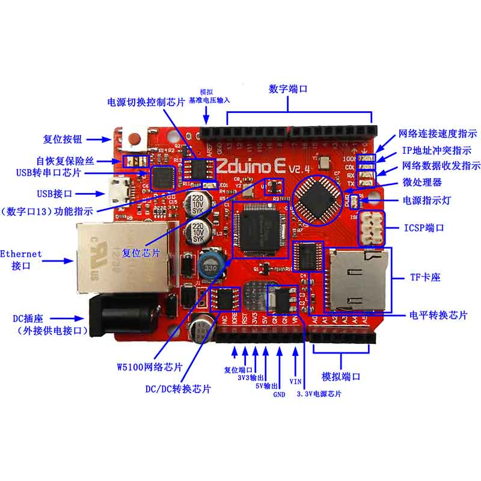

# Zduino Ethernet V2（Arduino Ethernet兼容控制器）

## 概述

Zduino Ethernet是基于Arduino Ethernet的微控制器板，我们在官方原作基础上，集成了USB下载、POE供电、TF插槽等功能，并且完全兼容UNO引脚位置。使用它，你可以快速的将你的控制器接入互联网从而搭建你的网络应用。

## 引脚说明

使用方法，见相关文档中数据手册

## 相关文档

+ [Zduino-Etherne-v2.4-Datasheet](http://www.openjumper.cn/wp-content/uploads/2012/08/Zduino-Etherne-v2.4-Datasheet.pdf)

+ [W5100_Datasheet_v1.2.4_cn](http://www.openjumper.cn/wp-content/uploads/2012/08/W5100_Datasheet_v1.2.4_cn.pdf)

+ [Zduino ethernet schematic](http://www.openjumper.cn/wp-content/uploads/2012/08/Zduino-ethernet-schematic.pdf)

## 驱动程序

+ mac: [Mac_OSX_VCP_Driver](http://openjumper.cn/wp-content/uploads/2012/08/Mac_OSX_VCP_Driver.rar)

+ Liunx:[cp210x-3.1.0.tar](http://openjumper.cn/wp-content/uploads/2012/08/cp210x-3.1.0.tar.gz)
  
+ windows:[Zduino-cp210x-VCP-Windows](http://openjumper.cn/wp-content/uploads/2012/08/Zduino-cp210x-VCP-Windows.rar)
