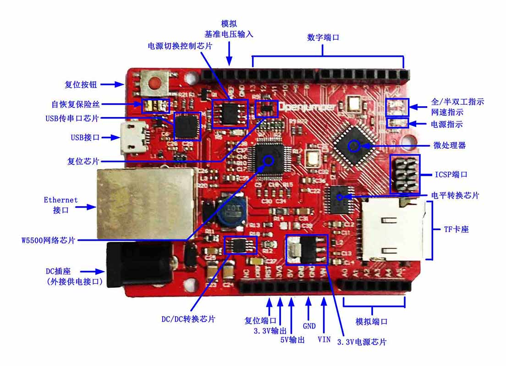

# Zduino EthernetV3（Arduino Ethernet兼容控制器）使用手册

## 一、Zduino Ethernet概述

Zduino Ethernet是基于Arduino Ethernet的微控制器板，我们在官方原作基础上，集成了USB下载、POE供电、TF插槽等功能，并且完全兼容UNO引脚位置。使用它，你可以快速的将你的控制器接入互联网从而搭建你的网络应用。

板载以W5500为核心的网络模块，可以使Arduino成为简单的Web服务器或者通过网络控制读写Arduino的数字和模拟接口等网络应用。可直接使用IDE中的Ethernet库文件便可实现一个简单Web服务器。同时支持MicroSD卡（TF卡）读写，功能强悍。 

## 二、技术规格

|名称 | 性能 |	说明|
|:-------|:------|:-------|
|处理器 |	ATmega328p 	||
|工作电压 |	5V 	||
|输入电压（推荐） |	7～9V ||
|输入POE模块电压（推荐） |	7～30V 	|需支持48V，参见“高级进阶”|
|数字I/O脚| 	14个 |	其中3、5、6、9、10、11号端口可用于PWM输出；10、11、12、13号端口用于SPI通信；4号端口用于TF卡片选；10号端口为W5500片选；2号端口可通过短接电路板背面的INT空焊盘，启用中断功能（参见“高级进阶”）。|
|模拟输入脚 |	6个 	||
|每个I/O直流输出能力 |	40 mA |	整个处理器工作电流不得超过200mA|
|3.3V直流输出能力 |	50 mA ||
|Flash Memory |	32 KB |	其中0.5 KB 用于 bootloader|
|SRAM| 	2 KB||
|EEPROM |	1 KB ||
|工作时钟 |	16 MHz ||

**其他:** TCP/IP Ethernet控制器W5500支持Power Over Ethernet供电输入MicroSD卡（TF卡）座MicroUSB下载 

**说明:** 支持Micro SD卡读/写；Ethernet和MicroSD卡共用SPI口，通过4、10号端口分时复用。4、10号端口置高后，可继续接入其他的SPI设备。

**外形尺寸:** Arduino Ethernet的最大尺寸为5.5cm × 7.5cm。

**模块兼容性**

+ Arduino Duemilanove （168 or 328）（兼容）

+ Arduino UNO（兼容）

+ Arduino Mega 1280 （不兼容）

+ Arduino Mega 2560 （不兼容）

## 三、使用注意事项

1、电源输入

电源正负极性错误的接入Zduino Ethernet，不会导致Zduino Ethernet的直接损坏，但应避免此类现象出现。  
如果输入的电源电压小于7V，5V的输出口可能小于5V而导致不稳定。推荐使用7～12V的直流供电。

<div align=center>
</div>

<center>图1：SPI口相应端口示意图</center>

2、因为W5500和Micro SD卡共用一个SPI口，不能在同一时间激活使用（参见图1标示）。

> 如果你同时想用两个，这必须在相应的程序里进行分时复用控制处理。

3、不插Micro SD卡的时，4号端口可做他用。

4、10号端口为低的时候，SPI口可做他用。

5、I/O口带载能力有限，具体参看“技术规格”。若需带动大电流负载，请设计相应的驱动电路。

## 四、Zduino Ethernet硬件介绍

### 硬件分布识别图

<div align=center>
 </div>

<center>图2：硬件分布识别图</center>

### W5500介绍

W5500是一款集TCP/IP协议、MAC和PHY（10/100M Base T）于一体的网络芯片，支持直接总线接口、间接总线接口和 SPI总线，Arduino IDE内置的Ethernet库仍兼容于W5500。直接把W5500当外部RAM使用，MCU初始化一下I/O，寄存器等就能使用了。是一种简易快速拓展Ethernet的方案，在稳定性及高效性方面表现也非常突出。

### 特点

+ 支持硬件 TCP/IP 协议：TCP, UDP, ICMP, IPv4, ARP, IGMP, PPPoE

+ 支持 8 个独立端口（Socket）同时通讯

+ 支持掉电模式

+ 支持网络唤醒

+ 支持高速串行外设接口（SPI 模式 0，3）
  
+ 内部 32K 字节收发缓存

+ 内嵌 10BaseT/100BaseTX 以太网物理层（PHY）

+ 支持自动协商（10/100-Based 全双工/半双工）

+ 不支持 IP 分片

+ 3.3V 工作电压，I/O 信号口 5V 耐压；

+ LED 状态显示（全双工/半双工，网络连接，网络速度，活动状态）

+ 48 引脚 LQFP 无铅封装（7x7mm, 0.5mm 间距）

### 硬件功能图

<div align=center>
 </div>
<center>图3：W5500硬件功能图</center>

### 输入电源

Zduino Ethernet可以通过3种方式供电，而且能自动选择供电方式。

1、外部电源可以通过AC/DC适配器或者电池通过DC3.5电源插座给Zduino Ethernet供电。

2、使用Power Over Ethernet电源模块通过Ethernet口给Zduino Ethernet供电。

3、使用MicroUSB线缆通过板载MicroUSB口给Zduino Ethernet供电。

4、Zduino Ethernet自身最小功耗：≤2W

### 电源输入优先

电源输入自动切换（输入电压≥7V时）：

1、优先权：POE ＞ DC插座、VIN ＞ USB

2、竞争：DC插座输入与VIN间，电压高者优先

### 电源引脚说明

<div align=center>
 </div>

<center>图4：电源端口分布示意图</center>

+ VIN—— VIN是input voltage的缩写，表示有外部电源时的输入端口。

   + 当不使用USB供电时，外接电源可以通过此引脚提供电源。（如电池供电，电池正极接VIN端口，负极接GND端口）
   
   + 当外部直流电源接入DC电源插座时，可以通过VIN端口向外部附加板供电；
   
   + 当使用POE方式供电时，VIN则不具备向外部附加板供电的功能（POE标准的电压过高，可能会损坏扩展板）。

+  5V——通过稳压器或USB供电产生的5V电压，为Zduino Ethernet上或附加板的5V芯片供电。

+  3V3——通过稳压器或USB供电产生的3.3V电压，最大驱动电流300mA。
  
+  GND——参考地。
  
### 存储器

ATmega328包括了片上32KB Flash，其中0.5KB用于Bootloader。同时还有2KB SRAM和1KB E2PROM。

### 输入输出

<div align=center>
 </div>
<center>图5：数字输入输出端口分布示意图</center>

<br/>

+ 16路数字输入输出口：
  
     工作电压为5V，每一路能输出和接入最大电流为40mA。除此之外，有些端口有特定的功能.

   + 串口信号RX（0号端口）、TX（1号端口）：TTL电平的串口信号收发。

   + 外部中断（2、3号端口）：触发中断引脚，可设成上升沿、下降沿或同时触发。

   + 脉冲宽度调制(PWM)（3、5、6、9、10、11号端口）：提供6路8位PWM输出，引脚位标示有“～”符号。

   + SPI（10号端口(SS)，11号端口(MOSI)，12号端口(MISO)，13号端口(SCK)）：SPI通信接口。

   + TWI（I2C）：SDA（2号端口）和SCL（3号端口）通过使用Wire库来支持TWI通信。
<div align=center>
 </div>

<center>图6：模拟输入口分布示意图</center>

+ 6路模拟输入（A0到A5号端口）：

    每一路具有10位的分辨率（即输入有1024个不同值），默认输入信号范围为0到5V，可以通过AREF调整输入上限。

+ AREF：  
    模拟输入信号的参考电压。可以在AREF外接电压基准芯片来获得更高的精度，AREF电压输入范围2V到直流供电电压，但不得大于供电电压。

+ RST：信号为低时复位单片机芯片。
### 通信接口

+ 串口：

    ATmega328内置的UART可以通过数字口0（RX）和1（TX）与外部实现串口通信；使用CP2102（USBtoRS232芯片）完成MCU片上UART与电脑间的串口通讯及程序下载。

+ TWI/SPI 接口：

    ATmega328还支持TWI（I2C）和SPI通信。arduino软件有一个用于简化TWI（I2C）通信的wire库。SPI通信可以使用SPI库。

    SPI(Serial Peripheral Interface–串行外设接口)总线系统是一种同步串行外设接口，它可以使MCU与Ethernet及MicroSD等外围设备以串行方式进行通信以交换信息。

+  Ethernet接口：

    Ethernet可以使Arduino成为简单的Web服务器或者通过网络控制读写Arduino的数字和模拟接口等网络应用。

+  MicroSD卡接口：

    MicroSD卡接口可以使Zduino Ethernet具备数据实时存储，利于海量数据的查阅、传输。
### 程序下载

1、Arduino Ethernet可以通过MicroUSB口下载程序。

2、可以直接通过外部ISP编程器下载程序。

## 五、使用前准备

你需要准备以下

1、一块Arduino Ethernet；

2、一条MicroUSB电缆；

3、一台具备USB1.1或USB2.0口的电脑；

4、CP210x（USB to RS232）驱动程序；

5、Arduino IDE（IDE就是arduino的软件程序开发环境）；

下载地址：<http://arduino.cc/en/Main/Software>

现在的最新版本为1.0.5，下载后自己找地方解压缩放好就行了。

### 串口驱动安装（以WinXP为例）

将Zduino Ethernet拆了包装，使用MicroUSB电缆连接到电脑，会出现识别到新硬件显示。
<div align=center>
 </div>

<center>图7：串口驱动安装1</center>

然后选择制定位置安装相应驱动，
<div align=center>
 </div>


<center>图8：串口驱动安装2</center>

然后选择你下载好的CP210x驱动所在目录，

<div align=center>
 </div>

<center>图9：串口驱动安装3</center>


点击下一步，就可以安装好驱动了。（安装分别有二次：CP2102 USB驱动、USBto串口驱动）

<div align=center>
 </div>
<center>图10：串口驱动安装4</center>

 

安装好驱动后，就可以显示是COM端口号，（图11）显示的是COM3端口。

<div align=center>
 </div>
<center>图11：串口驱动安装5</center>

其他系统安装驱动，可参阅Arduino中文社区内的教程：

arduino驱动安装方法　<http://www.arduino.cn/thread-1008-1-1.html>

arduino驱动安装失败的解决方法  <http://www.arduino.cn/thread-2485-1-1.html>

### Arduino的IDE

接着我们介绍下Arduino的IDE界面，以Arduino 1.0.3 IDE为例，首先进入软件目录。然后就可以看到arduino.exe文件，双击打开IDE。

<div align=center>
 </div>
<center>图12：ArduinoIDE文件</center>

 

首先映入眼帘的是下图的界面，工具栏按钮功能依次为“编译”–“下载”–“新建程序”–“打开程序”–“保存程序”–“串口监视器”

<div align=center>
 </div>
<center>图13：ArduinoIDE界面</center>

Arduino IDE默认为英文界面，可以通过以下方式改为本土语言（以中文简体为例）

<div align=center>
 </div>

<div align=center>
 </div>

<center>图14：ArduinoIDE界面更改</center>

关闭并重新启动Arduino IDE，即可完成界面设置。

<div align=center>
 </div>

<center>图15：ArduinoIDE界面更改成功</center>

注意：新建标签名称必须为英文字母开头。

## 六、模块功能测试

### 数字I/O口测试


<div align=center>
 </div>

<center>图16：Zduino Ethernet 数字I/O口测试连接示意图</center>

 <br/>

将下面的代码粘贴入arduino IDE中，
```
/*
让8个LED依次点亮熄灭
*/
void setup()
{
  for (int i=2; i<=9; i++)    //通过循环的方式设置2-9号引脚为输出状态
  {
    pinMode(i,OUTPUT);
  }
}

void loop()
{
  for (int x=2; x<=9; x++)   //通过循环的方式依次让每个引脚的led在1秒内完成明灭
  {
    digitalWrite(x,HIGH);
    delay(500);
    digitalWrite(x,LOW);
    delay(500);
  }
}
```
下载成功后，Zduino Ethernet驱动LED灯，会依次点亮。

### 模拟I/O口测试

Zduino Ethernet模拟口可以测量0～5V的电压，然后对应返回0～1024的数值，
<div align=center>
 </div>

<center>图17：Zduino Ethernet 模拟I/O口测试连接示意图</center>

 

使用1KΩ电阻的目的是在测量端悬空的情况下，将GND的基准电平引导到测量口，避免接口因悬空而受到干扰。

将下面的代码粘贴入arduino IDE中，
```
/*
 使用Zduino Ethernet模拟口测量电压
 */

float temp;   //创建一个浮点型变量temp作为存储空间准备存放数据
void setup()
{
  Serial.begin(9600);     //使用9600的波特率进行串口通讯
}
void loop()
{
   int V1 = analogRead(A3);       //使用了A3口             
 // 从A3口读取电压数据存入刚刚创建整数型变量V1，模拟口的电压测量范围为0-5V 返回的值为0-1024
  float vol = V1*(5.0 / 1023.0);               
//我们将 V1的值换算成实际电压值存入浮点型变量 vol
  if (vol == temp)                             
//这部分的判断是用来过滤重复的数据，只有本次的电压值和上次不一时才进行输出
  {
    temp = vol;                //比较完成后，将这次的值存入比对比用的变量temp
  }
  else
  { 
    Serial.print(vol);             //串口输出电压值，并且不换行  
    Serial.println(" V");           //串口输出字符V，并且换行
    temp = vol;
    delay(1000);                 //输出完成后等待1秒钟，用于控制数据的刷新速度。
  }
}
```
用电脑来接收Zduino Ethernet传回的数据，所以下载完程序不能把编译器关闭，而是参见（图13），点击打开串口监视器。

然后用红色的线测量电池正极，黑色的线测量电池负极串口监视器里就会以1秒一次的速度刷新电压值，2次的电压值有波动是正常的。精度不怎么高？对的，简单测试嘛。
<div align=center>
 　　 </div>

　<center>a.未接电池时　　　　　　　　　　　　　　　　　　　　b.接入电池后</center>


<center>图18：串口监视器显示A/D采集的结果</center>


### W5500网络及MicroSD（TF）卡读写测试

本次测试使用Zduino Ethernet驱动MicroSD卡，在TF卡中进行文件读写。需要使用Arduino的SD新的库文件，测试用的是kingmax 4G（FAT16）的MicroSD卡。

注意：4G以上（含4G）MicroSD卡需将其格式化为FAT16才可正确读取文件。

编译程序前，需到以下网址下载Sdfat库文件，本例程下载的是sdfatlib20121219.zip。

下载地址：<http://code.google.com/p/sdfatlib/downloads/list>

建议先用电脑单机通过交叉网线与Zduino Ethernet连接，测试OK后，再连入现有路由网络。

本例程默认IP地址为192.168.5.80。

根据你的局域网设置的不同，一般只需要修改IP地址就可以了：

    byte ip[] = { 192, 168, 1, 80 };


将MicroSD卡接入电脑，在上面分别拷贝几个文件及新建个目录，例程文件如下，

<div align=center>
 </div>

<center>图19：拷贝的文件</center>

插入已拷贝文件MicroSD卡及网线，

<div align=center>
 </div>

<center>图20：准备测试</center>

 

将下面的代码粘贴入arduino IDE中，
```
/*  本例程代码可以通过Ethernet使用浏览器访问microSD卡内的内容。打开的文件暂时限定为TXT文件，无法显示双字节文字，无法读取目录内文件。  */

#include <SdFat.h>
#include <SdFatUtil.h>
#include <Ethernet.h>
#include <SPI.h>

/************ ETHERNET STUFF ************/
byte mac[] = { 0xDE, 0xAD, 0xBE, 0xEF, 0xFE, 0xED };  //MAC地址
byte ip[] = { 192, 168, 5, 80 };     //IP地址
EthernetServer server(80);

/************ SDCARD STUFF ************/
Sd2Card card;
SdVolume volume;
SdFile root;
SdFile file;

// store error strings in flash to save RAM
#define error(s) error_P(PSTR(s))

void error_P(const char* str) {
  PgmPrint("error: ");
  SerialPrintln_P(str);
  if (card.errorCode()) {
    PgmPrint("SD error: ");
    Serial.print(card.errorCode(), HEX);
    Serial.print(',');
    Serial.println(card.errorData(), HEX);
  }
  while(1);
}

void setup() {
  Serial.begin(9600);

  PgmPrint("Free RAM: ");
  Serial.println(FreeRam());  

  // initialize the SD card at SPI_HALF_SPEED to avoid bus errors with
  // breadboards.  use SPI_FULL_SPEED for better performance.
  pinMode(10, OUTPUT);                       // set the SS pin as an output (necessary!)
  digitalWrite(10, HIGH);                    // but turn off the W5500 chip!

  if (!card.init(SPI_HALF_SPEED, 4)) error("card.init failed!");

  // initialize a FAT volume
  if (!volume.init(&card)) error("vol.init failed!");

  PgmPrint("Volume is FAT");
  Serial.println(volume.fatType(),DEC);
  Serial.println();

  if (!root.openRoot(&volume)) error("openRoot failed");

  // list file in root with date and size
  PgmPrintln("Files found in root:");
  root.ls(LS_DATE | LS_SIZE);
  Serial.println();

  // Recursive list of all directories
  PgmPrintln("Files found in all dirs:");
  root.ls(LS_R);

  Serial.println();
  PgmPrintln("Done");

  // Debugging complete, we start the server!
  Ethernet.begin(mac, ip);
  server.begin();
}

void ListFiles(EthernetClient client, uint8_t flags) {
  // This code is just copied from SdFile.cpp in the SDFat library
  // and tweaked to print to the client output in html!
  dir_t p;

  root.rewind();
  client.println("<ul>");
  while (root.readDir(&p) > 0) {
    // done if past last used entry
    if (p.name[0] == DIR_NAME_FREE) break;

    // skip deleted entry and entries for . and  ..
    if (p.name[0] == DIR_NAME_DELETED || p.name[0] == '.') continue;

    // only list subdirectories and files
    if (!DIR_IS_FILE_OR_SUBDIR(&p)) continue;

    // print any indent spaces
    client.print("<li><a href=\"");
    for (uint8_t i = 0; i < 11; i++) {
      if (p.name[i] == ' ') continue;
      if (i == 8) {
        client.print('.');
      }
      client.print((char)p.name[i]);
    }
    client.print("\">");

    // print file name with possible blank fill
    for (uint8_t i = 0; i < 11; i++) {
      if (p.name[i] == ' ') continue;
      if (i == 8) {
        client.print('.');
      }
      client.print((char)p.name[i]);
    }

    client.print("</a>");

    if (DIR_IS_SUBDIR(&p)) {
      client.print('/');
    }

    // print modify date/time if requested
    if (flags & LS_DATE) {
       root.printFatDate(p.lastWriteDate);
       client.print(' ');
       root.printFatTime(p.lastWriteTime);
    }
    // print size if requested
    if (!DIR_IS_SUBDIR(&p) && (flags & LS_SIZE)) {
      client.print(' ');
      client.print(p.fileSize);
    }
    client.println("</li>");
  }
  client.println("</ul>");
}

// How big our line buffer should be. 100 is plenty!
#define BUFSIZ 100

void loop()
{
  char clientline[BUFSIZ];
  int index = 0;

  EthernetClient client = server.available();
  if (client) {
    // an http request ends with a blank line
    boolean current_line_is_blank = true;

    // reset the input buffer
    index = 0;

    while (client.connected()) {
      if (client.available()) {
        char c = client.read();

        // If it isn't a new line, add the character to the buffer
        if (c != '\n' && c != '\r') {
          clientline[index] = c;
          index++;
          // are we too big for the buffer? start tossing out data
          if (index >= BUFSIZ) 
            index = BUFSIZ -1;

          // continue to read more data!
          continue;
        }

        // got a \n or \r new line, which means the string is done
        clientline[index] = 0;

        // Print it out for debugging
        Serial.println(clientline);

        // Look for substring such as a request to get the root file
        if (strstr(clientline, "GET / ") != 0) {
          // send a standard http response header
          client.println("HTTP/1.1 200 OK");
          client.println("Content-Type: text/html");
          client.println();

          // print all the files, use a helper to keep it clean
          client.println("<h2>Files:</h2>");
          ListFiles(client, LS_SIZE);
        } else if (strstr(clientline, "GET /") != 0) {
          // this time no space after the /, so a sub-file!
          char *filename;

          filename = clientline + 5; // look after the "GET /" (5 chars)
          // a little trick, look for the " HTTP/1.1" string and 
          // turn the first character of the substring into a 0 to clear it out.
          (strstr(clientline, " HTTP"))[0] = 0;

          // print the file we want
          Serial.println(filename);

          if (! file.open(&root, filename, O_READ)) {
            client.println("HTTP/1.1 404 Not Found");
            client.println("Content-Type: text/html");
            client.println();
            client.println("<h2>File Not Found!</h2>");
            break;
          }

          Serial.println("Opened!");

          client.println("HTTP/1.1 200 OK");
          client.println("Content-Type: text/plain");
          client.println();

          int16_t c;
          while ((c = file.read()) > 0) {
              // uncomment the serial to debug (slow!)
              //Serial.print((char)c);
              client.print((char)c);
          }
          file.close();
        } else {
          // everything else is a 404
          client.println("HTTP/1.1 404 Not Found");
          client.println("Content-Type: text/html");
          client.println();
          client.println("<h2>File Not Found!</h2>");
        }
        break;
      }
    }
    // give the web browser time to receive the data
    delay(1);
    client.stop();
  }
}
```

编译、下载完成后，继续打开串口监视器。

从串口监视器中可以看到如下（图21：a.）画面，
<div align=center>
 　　　 </div>


<center>图21：a.串口监视器显示MicroSD卡中的文件、目录情况 　　　　　　2网络状态指示灯变化</center>

通过浏览器，输入Zduino Ethernet的固定IP地址：192.168.5.80，显示如下：

<div align=center>
 </div>

<center>图22：浏览器显示MicroSD卡中的文件、目录</center>

看到了MicroSD卡中文件及目录了吧。
***

下面我们再看下TEST.TXT内写了什么，

<div align=center>
 </div>

同时，浏览器连接Zduino Ethernet成功后，串口监视器也可见信息的变化，

<div align=center>
 </div>

<center>图24：浏览器连接Zduino Ethernet成功后，串口监视器可见信息变化</center>


相应的程序下载到Zduino Ethernet并运行起来之后，Zduino Ethernet实际上就成为了一个Web Server，因此我们可以通过浏览器来进行访问。

 

## 七、相关库下载

+ sdfatlib SD卡读写库文件下载

   <http://code.google.com/p/sdfatlib/downloads/list>


+ Ethernet库主页下载

   <http://arduino.cc/en/Guide/ArduinoEthernetShield>

+ 库文件下载

    [Wiznet-W5500-library-for-Arduino-master](http://www.openjumper.cn/wp-content/uploads/2014/05/Wiznet-W5500-library-for-Arduino-master.zip)

目前新的IDE已不再适用于旧的W5500库文件，请以Github地址：<https://github.com/Wiznet/WIZ_Ethernet_Library>  参考为准！

**How to use the WIZ Ethernet library and evaluate existing Ethernet example.**

All other steps are the same as the steps from the Arduino Ethernet Shield. You can find examples in the Arduino IDE, go to Files->Examples->Ethernet, open any example, then copy it to your sketch file (gr_sketch.cpp) and change configuration values properly. After that, you can check if it is work well. For example, if you choose ‘WebServer’, you should change IP Address first and compile and download it. Then you can access web server page through your web browser of your PC or something.

## 八、高级进阶

因涉及硬件的调整修改，建议具备一定动手能力的用户进行操作。

### 中断启用

2号端口可通过短接Zduino Ethernet电路板背面的2个INT空焊盘，启用中断功能。

<div align=center>
 </div>

<center>图25：INT焊盘位置</center>