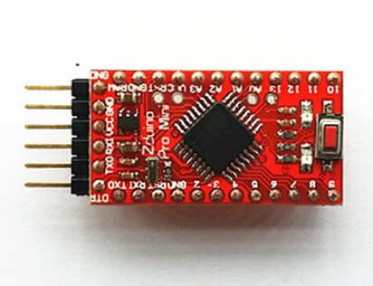

# Zduino Pro Mini

## 概述

Zrduino ProMini是Arduino Mini的半定制版本，所有外部引脚通孔没有焊接，与Mini版本管脚兼容。Zrduino ProMini的处理器核心是ATmega328，同时具有14路数字输入/输出口（其中6路可作为PWM输出），6路模拟输入，一个晶体谐振，一个复位按钮。

## 技术规格

|名称|参数|
|:--|:--|
|处理器 |ATmega328|
|工作电压 | 5V|
|输入电压(推荐) | 7-9V|
|数字IO脚 |14 (其中6路作为PWM输出）|
|模拟输入脚| 8|
|IO脚直流电流 |40 mA|
|Flash Memory |32 KB （其中2 KB 用于 bootloader）|
|SRAM  |2KB （ATmega328）|
|EEPROM |1KB （ATmega328）|
|工作时钟 |16 MHz|

## 电源

Arduino ProMini可以通过FTDI线或者焊接6脚Header，也可以通过电源引脚接入外部直流电源。 电源引脚说明
+ RAW — 外部直流电源接入引脚，raw代表接入的可以是电池或者其他直流电源。
+ VCC — 通过稳压器产生的3.3V或者5V电压。
+ GND — 地脚。

## 输入输出

+ **14路数字输入输出口：** 工作电压为5V，每一路能输出和接入最大电流为40mA。每一路配置了20-50K欧姆内部上拉电阻（默认不连接)。除此之外，有些引脚有特定的功能
+ **串口信号RX（0号）、TX（1号）:** 提供TTL电压水平的串口接收信号，可以与6脚Header通孔相连。
+ **外部中断（2号和3号）：** 触发中断引脚，可设成上升沿、下降沿或同时触发。
+ **脉冲宽度调制PWM（3、5、6、9、10 、11）：** 提供6路8位PWM输出。
+ **SPI（10(SS)，11(MOSI)，12(MISO)，13(SCK)）：** SPI通信接口。
+ **LED（13号）：** Arduino专门用于测试LED的保留接口，输出为高时点亮LED，反之输出为低时LED熄灭。
+ **6路模拟输入A0到A5：** 每一路具有10位的分辨率（即输入有1024个不同值），默认输入信号范围为0到5V，可以通过AREF调整输入上限。除此之外，有些引脚有特定功能。
+ **TWI接口（SDA A4和SCL A5）：** 支持通信接口（兼容I2C总线）。
+ **Reset：** 信号为低时复位单片机芯片。

## 通信接口

+ **串口：** ATmega168内置的UART可以通过数字口0（RX）和1（TX）与外部实现串口通信
+ **TWI（兼容I2C）接口:** SDA A4和SCL A5
+ **SPI 接口：** 10(SS)，11(MOSI)，12(MISO)，13(SCK)

## 下载程序

+ **串口下载**：Arduino ProMini上的ATmega328已经预置了bootloader程序，因此可以通过Arduino软件直接下载程序。需要USB转串口下载器。
+ **ICSP下载：** 可以直接通过连线328P的的ICSP 引脚直接下载程序到ATmega328。需要ICSP下载器。
  
## 注意要点

Arduino ProMini提供了自动复位设计，可以通过主机复位。这样通过Arduino软件下在程序到ProMini中软件可以自动复位，不需要在复位按钮。

## 扩展阅读

<http://arduino.cc/en/Main/ArduinoBoardProMini>