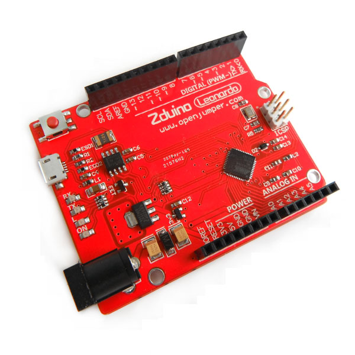

# Zduino Leonardo(Arduino Leonardo兼容)

## 概述

Arduino Leonardo是基于ATmega32u4一个微控制器板，它有20个数字输入/输出引脚(其中7个可用于PWM输出、12个可用于模拟输入)，一个16 MHz的晶体振荡器，一个Micro USB接口，一个DC接口，一个ICSP接口，一个复位按钮。它包含了支持微控制器所需的一切，你可以简单地通过把它连接到计算机的USB接口，或者使用AC-DC适配器，再或者用电池来驱动它。 Leonardo不同于之前所有的arduino控制器，他直接使用了ATmega32u4的USB通信功能，取消了USB转UART芯片。这使得Leonardo不仅可以作为一个虚拟的(CDC)串行/ COM端口，还可以作为鼠标或者键盘连接到计算机。它还有很多不同的地方，我们会在入门页面中介绍。

## 技术规格

|名称|参数|
|:--|:--|
|微控制器 | ATmega32u4|
|工作电压 | 5V|
|输入电压（推荐）| 7-9V|
|数字I/O引脚  |  20|
|PWM通道  |  7|
|模拟输入通道  |  12|
|每个I/O直流输出能力 | 40毫安|
|3.3V端口输出能力   | 50毫安|
|Flash |32 KB（ATmega32u4）其中4 KB由引导程序使用|
|SRAM  | 2.5 KB（ATmega32u4）|
|EEPROM  | 1 KB（ATmega32u4）|
|时钟速度 | 16MHz|

## 电源   

Arduino Leonardo可以通过Micro USB接口或外接电源供电。电源可以自动被选择。外部(非USB)电源可以用AC-DC适配器(wall-wart)或电池。适配器可以插在一个2.1毫米规格中心是正极的电源插座上，以此连接到控制器电源。从电池的信息，可以插在电源连接器的GND和VIN引脚头。 可以输入6V-20V的外部电源。但是，如果低于7V，5V引脚将提供小于5V的电源，控制板可能会不稳定。如果使用大于12V的电源稳压器可能过热，从而损坏电路板。推荐的范围是7V-12V。 电源引脚如下：

+ **VIN：** 使用外接电源(而不是从USB连接或其它稳压电源输入的5V)。您可以通过此引脚提供的电压，或者，通过该引脚使用电源座输入的电压。
+ **5V：** 稳压电源是供给电路板上的微控制器和其他组件使用的电源。可以从VIN输入通过板上稳压器，或通过USB或其他5V稳压电源提供。
+ **3V3：** 板上稳压器产生一个3.3V的电源。最大电流为50毫安。
+ **GND：** 接地引脚。
+ **IOREF：** 电压板的I / O引脚工作 ​​(连接到板子上的VCC，在Leonardo上为5V)。

## 存储空间  

ATmega32u4具有32KB的Flash(其中4KB被引导程序使用)。它还有2.5KB的SRAM和1KB的EEPROM(EEPROM的读写可以参见EEPROM库)。输入和输出 通过使用pinMode()，digitalWrite()，and digitalRead() 函数，Leonardo上的20个I/O引脚中的每一个都可以作为输入输出端口。每个引脚都有一个20-50千欧的内部上啦电阻(默认断开)，可以输出或者输入最大40ma的电流。此外部分引脚还有专用功能：  

+ **UART：** 0(RX)和1(TX) 使用ATmega32U4硬件串口，用于接收(RX)和发送(TX)的TTL串行数据。需要注意的是，Leonardo，的Serial类是指USB(CDC)的通信，而引脚0和1的TTL串口使用Serial1类。
+ **TWI：** 2(SDA)和3(SCL)通过使用Wire库来支持TWI通信。
+ **外部中断：** 2和3，这些引脚可以被配置成当一个低电平或者一个高电平或一个电平跳变可以触发的外部中断。
+ **PWM：** 3、5、6、9、10、11、13能使用analogWrite()函数支持8位的PWM输出。
+ **SPI：** ICSP引脚。能通过使用SPI库支持SPI通信。需要注意的是，SPI引脚没有像UNO连接到任何的数字I/O引脚上，他们只能在ICSP端口上工作。这意味着，如果你的扩展板，没有连接6脚的ICSP引脚，那它将无法工作。
+ **模拟输入：** A0〜A5，A6~A11(数字引脚4 6 8 9 10 12) ，Leonardo有12个模拟输入，A0到A11，都可以作为数字I / O口。引脚A0-A5的位置上与UNO相同；A6-A11分别是数字I / O引脚4 6 8 9 10和12。每个模拟输入都有10位分辨率(即1024个不同的值)。默认情况下，模拟输入量为0-5V，也可以通过AREF引脚改变这个上限。

## 其他引脚：

+ **AREF：** 模拟输入信号参考电压通过analogReference()函数使用。
+ **Reset：** 通过置低该线路来复位arduino，通常用在带复位按键的扩展板上。

## 通信

要让Leonardo与电脑、其他arduino或者其他的微控制器通信，有多种设备。在0、1上ATmega32u4提供了UART TTL(5V)的通信方式，32u4还允许通过USB在电脑上虚拟COM端口来进行虚拟串行(CDC)通信。这个芯片使用标准的USB串行驱动(在Windows上需要一个.inf文件)，可以作为一个全速USB2.0设备。arduino软件包含了一个串口监视器，可以与arduino板子相互发送或者接收简单的数据。当使用USB传输数据时，板子上RX、TX LED会闪烁(这个特性不是适用于0、1端口)。 SoftwareSerial库能让任意的数字I/O口进行串行通信。 ATmega32u4还支持TWI(I2C)和SPI通信。arduino软件有一个用于简化TWI(I2C)通信的 wire库。SPI通信可以使用SPI库。 Leonardo可以作为鼠标、键盘出现，也可以通过编程来控制这类键盘鼠标输入设备。

## 编程

Leonardo可以通过arduino软件来编程，选择Tool>board>Arduino Leonardo(根据你的控制器型号选择)。更多参考和教程。 Leonardo的ATmega32u4芯片烧写了一个引导程序，使得你可以不通过外部的硬件编程器也可以上传新的程序到Leonardo。bootloader使用AVR109协议通信。 你还可以绕过引导程序，使用外部编程器通过ICSP(在线串行编程)引脚烧写程序。  

## 自动复位和引导程序的启动

在Leonardo中被设定为在上传时，软件建立连接让控制器复位，从而免去了我们手动按下复位按钮的操作。当Leonardo 作为虚拟(CDC)串行/COM端口以1200波特率运行时，复位功能将被促发，串口也将关闭。此时，处理器会复位，USB连接会断开(即虚拟(CDC)串行/COM端口会断开)。处理器复位后，引导程序紧接着启动，大概要等待8秒来完成这个过程。引导程序也可以通过按板子上复位按钮来启动。注意当板子第一次通电时，如果有用户程序，他将直接跳转到用户程序区，而不启动bootloader。 Leonardo 最好的复位处理方式是在上传程序前让arduino软件端试图启动复位功能，而不是你手动点击复位按钮。如果软件没有让控制板自动复位，你也可以通过手动按下复位按钮从而让板子复位运行引导程序。

## USB过流保护

Leonardo有一个自恢复保险丝，防止短路或过流，从而保护您的计算机的USB端口.虽然大多数计算机提供都带有内部保护，但保险丝也可以提供额外的保护。如果电流超过500 mA，保险丝会自动断开连接防止短路或过载。

## 物理特征

Leonardo PCB的最大长度和宽度分别为2.7和2.1英寸，超越前维延长的USB接口和电源插孔.。有四个固定孔可以将板子固定在其他表面或者外壳上。注意，7、8数字引脚之间的距离是160mil(0.16“)，而不是和其他脚一样的100 mil 间距。

相关文档：[LEONARDO](http://openjumper.cn/wp-content/uploads/2012/08/LEONARDO.pdf)

## 常见问题：

[关于leonardo在模拟USB设备后，无法下载的问题](https://openjumper.cn/leonardo-download/)

## 应用示例：

[LEONARDO做的无线鼠标](https://openjumper.cn/leonardo-mouse/)
