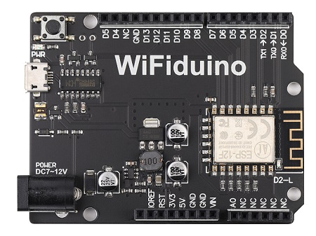
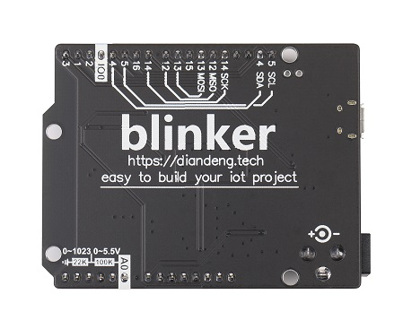
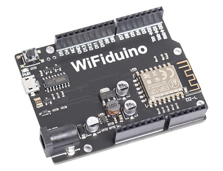
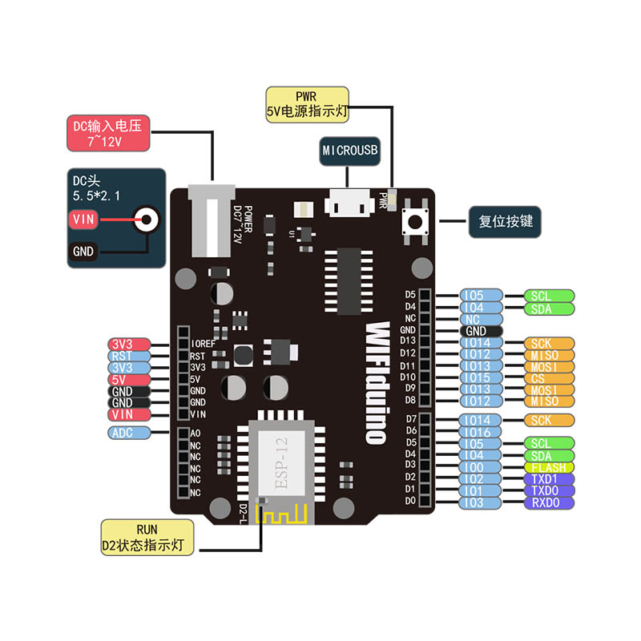

# WIFIduino

<table border="1" align="center">

<tr>
  <td align="center"></td>
  <td align="center"></td>
  <td align="center"></td>
</tr>
<tr>
  <td style="background-color:rgb(232,232,232,0.5) "colspan="3" align="center"> <a href="https://item.taobao.com/item.htm?id=574851022145">WIFIduino</a> </td>
</tr>
</table>

## 概况

WiFiduino-8266是使用esp8266作为核心的开发板，相对于传统Arduino控制器，WiFiduino-8266提供了WiFi支持，配合物联网软件平台blinker可以更轻松地构建物联网项目。

## 硬件参数
|名称 |参数|
|:--|:--|
|主芯片|esp8266| 
|工作电压|3.3V| 
|输入电压(推荐)|7-9V|
|数字I/O|11个|
|模拟I/O| 1个|
|PWM输出 |11个|
| I/O输出能力|12ma|
|flash| 4MB|
|ram|160KB （其中用户可使用48.5KB）|
|时钟频率| 80/160 MHz|
|板子长宽|68.6 mm * 53.4 mm|
|重量|25g|

## 引脚说明

所有I/O输入电压都不得高于3.3V。

+ **D0~D13：** 数字输入引脚。

    需要注意的是，部分引脚是复用的(见开发板背面连线)。你可以使用Dx（如D9）或Dx引脚板子背面印刷的数字（如13）控制对应的IO口，如 a=digitalRead(D9)与a=digitalRead(13)是等效的

+ **PWM：** 所有数字I/O都可用于PWM输出

+ **串口：** Serial(TX0/RX0)可用于和计算机或其他设备通信，Serial1(TX1)只有输出端口，可用向其他设备发送数据
  
+ **SPI：** MISO\MOSI\SCK引脚可用于SPI通信  
  
+ **IIC：** 实际上D0~D13都可以用作IIC通信。为了兼容Arduino引脚位，你可以使用SCL/SDA（D5/D4）做IIC通信

+ **下载引脚**： 程序烧写时，会使用到TX0\RX0\IO0三个引脚，如需使用，请烧写完成后，再连接外设
  
+ **A0：** 只能做模拟输入使用，输入电压范围为0~3.3V  

 + **LED**：开发板上有两个LED指示灯  
    + L：该LED连接到D2引脚，可以使用宏LED_BUILTIN编程控制  
   
    + PWR： 电源指示灯，开发板通电后会亮

+ **电源:** WiFiduino-8266工作电压3.3V，可以从以下几种方式供电:
    + DC电源座： 推荐输入7~9V电压  

    + USB口： 5V供电

    + VIN： 可输入7~9V供电。当使用DC电源座供电时，该引脚可以获得DC口电压
  
    + 5V引脚： 可以输入5V供电。当使用其他方式供电时，该引脚可以获得5V电压

    + 3.3V引脚： 可以输入3.3V直接给esp8266供电。当使用其他方式供电时，该引脚可以获得3.3V电压

由于wifiduino主芯片使用的是esp8266，芯片引脚数量限制与arduino UNO不能做到完全兼容。

需要注意的是：部分引脚是复用的D7=D13 、D8=D12、D9=D11

## 示例程序

[ArduinoIDE运行wifiduino示例程序](https://arduino.me/s/7?aid=863)

## 其他资料

[esp8266-12f规格书](http://wiki.ai-thinker.com/_media/esp8266/esp-12f_%E8%A7%84%E6%A0%BC%E4%B9%A6-%E4%B8%AD%E6%96%87%E7%89%88_1_.pdf)

[wifiduino原理图](https://arduino.me/a/1290)
