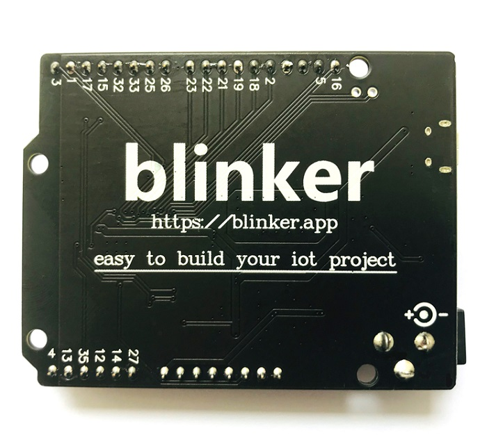
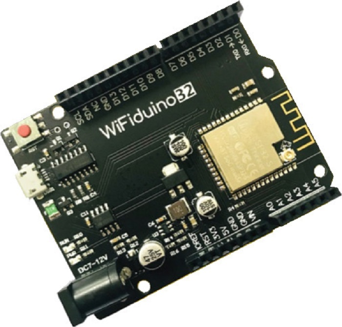
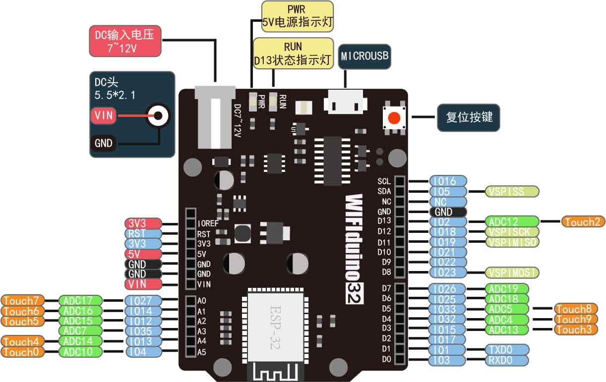
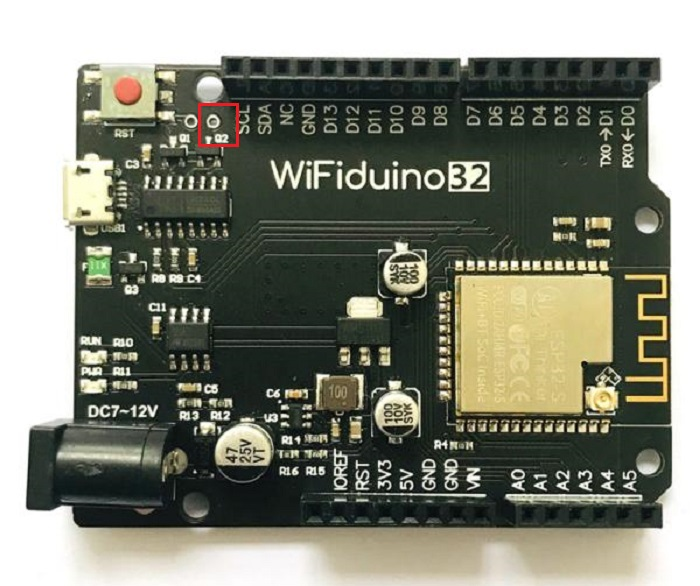

# wifiduino32
<table border="1" align="center">

<tr>
  <td align="center"></td>
  <td align="center"></td>
  <td align="center"></td>
</tr>
<tr>
  <td style="background-color:rgb(232,232,232,0.5) "colspan="3" align="center"> <a href="https://item.taobao.com/item.htm?id=627479039592">WIFIduino32</a> </td>
</tr>
</table>

## 概况

WiFiduino-32是使用esp32-s作为核心的开发板，相对于传统Arduino控制器，WiFiduino-32提供了WiFi和蓝牙的支持，同时具有更大的ram 以及程序存储空间可以运行更大的程序构建大型项目以及物联网项目。

## 硬件参数

|名称 |参数|
|:--|:--|
|主芯片|esp32|
|工作电压|3.3V|
|输入电压(推荐)|7-9V|
|数字模拟I/O |22个（所有引脚都可作为模拟输入）|
|PWM输出 |16个（ 所有引脚都配置成pwm输出）|
|I/O输出能力|12ma|
|flash |4MB|
|ram | 520KB|
|时钟频率|  80/240 MHz |
|板子长宽  |68.6 mm * 53.4 mm |
|重量 |25g|

## 引脚说明

所有I/O输入电压都不得高于3.3V。

+ **D0——D13和A0——A5：** 数字和模拟输入引脚（所有可用引脚都可配置为数字或模拟引脚）。(注意：如果使用wifi通信，模拟输入功能引脚只有A3 D4 D5引脚可用，这是esp32硬件资源决定的)
+ **PWM：** 所有I/O都可用于PWM输出
+ **串口：** Serial(TX0/RX0)可用于和计算机或其他设备通信，除D2-D5其他引脚均可设置为串口引脚，总共可同时设置3对串口。
+ **SPI：** MISO\MOSI\SCK引脚可用于SPI通信, 可以配置任意可用引脚。
+ **IIC：** 可以配置任意可用引脚。为了兼容Arduino引脚位，你可以使用SCL/SDA（D5/D4）做IIC通信
+ **下载引脚：** 程序烧写时，会使用到TX0\RX0\IO0三个引脚，如需使用，请烧写完成后，再连接外设
+ **LED：** 开发板上有两个LED指示灯
+ **run:** 该LED连接到D13引脚，可以使用宏LED_BUILTIN编程控制
+ **PWR：** 电源指示灯，开发板通电后会亮
+ **电源：** WiFiduino-32工作电压3.3V，可以从以下几种方式供电：
+ **DC电源座：** 推荐输入7~12V电压
+ **USB口：** 5V供电
+ **VIN：** 可输入7~12V供电。当使用DC电源座供电时，该引脚可以获得DC口电压
+ **5V引脚：** 可以输入5V供电。当使用其他方式供电时，该引脚可以获得5V电压。
+ **3.3V引脚：** 可以输入3.3V直接给esp32供电。当使用其他方式供电时，该引脚可以获得3.3V电压。

## 引脚定义

## 使用注意

如果出现主板 **持续重启** 或者上传过程中 **显示连接超时无响应** 的情况时，需要先手动将主板的IO0拉低，**也就是将主板的Q2与主板的GND相连** ，在重新上电或下载

## 其他资料

esp32芯片资料：<https://docs.ai-thinker.com/esp32/spec/esp32s> 

arduinoIDE开发环境搭建： <https://arduino.me/a/684>

wifiduino32原理图：<http://download.openjumper.cn/wifiduino32.pdf>