# OJ-ESP32开发板

## 产品简介

OJ-ESP32开发板是基于乐鑫科技的 ESP32-WROOM-32E模组的小型开发板。ESP32-WROOM-32E采用的是 ESP32-D0WD-V3 芯片具有可扩展、自适应的特点，ESP32 是双核的，含有 2 个处理器，可被单独控制。用户可以关闭CPU的电源，利用低功耗协处理器监测外设的状态变化或某些模拟量是否超出阈值。内置 Wi-Fi 和蓝牙，可以运行32位程序。CPU时钟频率的调节范围为 80MHz到240MHz。并具有 512kB RAM。它还具有多种可用的外设，包括电容式触摸传感器、霍尔传感器、SD 卡接口、以太网接口、高速 SPI、UART、I2S和 I2C 等。
LED具有低电压驱动，环保节能，亮度高，散射角度大，一致性好，超低功率，超长寿命等优点。将控制电路集成于LED上面，电路变得更加简单，体积小，安装更加简便。
<table border="1" align="center">

<tr>
  <td align="center">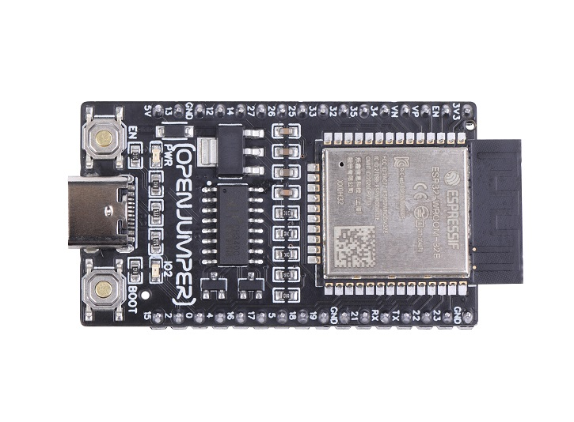</td>
  <td align="center">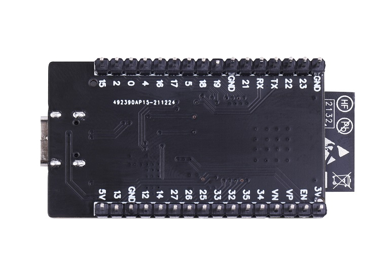</td>
  <td align="center">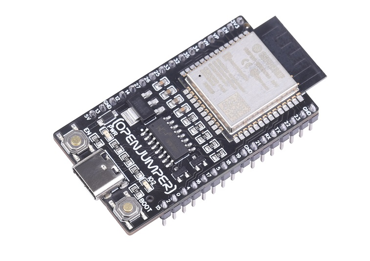</td>
</tr>
<tr>
  <td style="background-color:rgb(232,232,232,0.5) "colspan="3" align="center"> <a href="https://item.taobao.com/item.htm?id=667395317550"><font style="font-size:16px">OJ-ESP32开发板</font></a> </td>
</tr>
</table>


## 产品特点

+ **支持wifi&蓝牙连接**

   OJ-ESP32开发板是一款基于 ESP32-WROOM-32E 模组的小型开发板，支持 Wi-Fi 和蓝牙功能。开发板具有丰富的外设，用户可轻松实现产品开发。

+ **开发方便迅速**
  
   OJ-ESP32开发板具有卓越的射频性能，用户进行应用设计和开发时无需考虑射频和天线设计。开发板上已包含基本的系统需求，用户只需连上 USB 线，即可进行开发。

+ **特性灵活丰富**
  
   主板完整电路包括 USB-UART 桥接器、Reset 和 Boot 按键、LDO 稳压器和 typeC 连接器等重要组件。关键的 GPIO 口均已引出供开发者使用。


+ **性能稳定**
  
    ESP32 性能稳定，工作温度范围达到 –40°C 到 +125°C。集成的自校准电路实现了动态电压调整，可以消除外部电路的缺陷并适应外部条件的变化。

+ **高度集成**
  
   ESP32 将天线开关、RF balun、功率放大器、接收低噪声放大器、滤波器、电源管理模块等功能集于一体。ESP32 只需极少的外围器件，即可实现强大的处理性能、可靠的安全性能。

+ **超低功耗**
  
    ESP32 专为移动设备、可穿戴电子产品和物联网应用而设计，具有业内高水平的低功耗性能，包括精细分辨时钟门控、省电模式和动态电压调整等。

+ **扩展方便**
  
    Openjumper为OJ-ESP32匹配了专用[传感器扩展板](https://www.openjumper.com/doc/ojxm39)，帮助用户可以连接更多的外设，轻松上手产品开发。


## 技术参数

+ 工作电压：3.3V

+ 供电电压：5V

+ 开发板尺寸：55*28mm

+ flash：可选 4/8/16 MB 
  
+ GPIO： 26 个 
  
+ 天线选型：板载 PCB 天线
  
+ 晶振：40 MHz 

+ 时钟频率：80MHz~240MHz


## 引脚说明

|序号| 名称 |类型|功能|
|:--|:--|:--|:--|
|1|3V3|P|供电|
|2|EN|I|高电平：芯片使能；低电平：芯片关闭；注意：不能让 EN 管脚浮空。|
|3|VP|I|GPIO36, ADC1_CH0, RTC_GPIO0|
|4|VN|I|GPIO39, ADC1_CH3, RTC_GPIO3|
|5|IO34|I|GPIO34, ADC1_CH6, RTC_GPIO4|
|6|IO35|I|GPIO35, ADC1_CH7,RTC_GPIO5|
|7|IO32|IO|GPIO32, XTAL_32K_P (32.768 kHz 晶振输入), ADC1_CH4, TOUCH9,RTC_GPIO9|
|8|IO33|IO|GPIO33, XTAL_32K_P (32.768 kHz 晶振输入), ADC1_CH5, TOUCH8,RTC_GPIO8|
|9|IO25|IO|GPIO25, DAC_1, ADC2_CH8, RTC_GPIO6, EMAC_RXD0|
|10|IO26|IO|GPIO26, DAC_2, ADC2_CH9, RTC_GPIO7, EMAC_RXD1|
|11|IO27|IO|GPIO27, ADC2_CH7, TOUCH7, RTC_GPIO17, EMAC_RX_DV|
|12|IO14|IO|GPIO14, ADC2_CH6, TOUCH6, RTC_GPIO16, MTMS, HSPICLK,HS2_CLK, SD_CLK, EMAC_TXD2|
|13|IO12|IO|GPIO12, ADC2_CH5, TOUCH5, RTC_GPIO15, MTDI, HSPIQ,HS2_DATA2, SD_DATA2, EMAC_TXD3|
|14|GND|P|接地|
|15|IO13|IO|GPIO13, ADC2_CH4, TOUCH4, RTC_GPIO14, MTCK, HSPID,HS2_DATA3, SD_DATA3, EMAC_RX_ER|
|16|5V|P|供电|
|17|IO15|IO|GPIO15, ADC2_CH3, TOUCH3, MTDO, HSPICS0, RTC_GPIO13,HS2_CMD, SD_CMD, EMAC_RXD3|
|18|IO2|IO|GPIO2, ADC2_CH2, TOUCH2, RTC_GPIO12, HSPIWP, HS2_DATA0,SD_DATA0|
|19|IO0|IO|GPIO0, ADC2_CH1, TOUCH1, RTC_GPIO11, CLK_OUT1,EMAC_TX_CLK|
|20|IO4|IO|GPIO4, ADC2_CH0, TOUCH0, RTC_GPIO10, HSPIHD, HS2_DATA1,SD_DATA1, EMAC_TX_ER|
|21|IO16|IO|GPIO16, HS1_DATA4, U2RXD, EMAC_CLK_OUT|
|22|IO17|IO|GPIO17, HS1_DATA5, U2TXD, EMAC_CLK_OUT_180|
|23|IO5|IO|GPIO5, VSPICS0, HS1_DATA6, EMAC_RX_CLK|
|24|IO18|IO|GPIO18, VSPICLK, HS1_DATA7|
|25|IO19|IO|GPIO19, VSPIQ, U0CTS, EMAC_TXD0|
|26|GND|P|接地|
|27|IO21|IO|GPIO21, VSPIHD, EMAC_TX_EN|
|28|RX|IO|GPIO3, U0RXD, CLK_OUT2|
|29|TX|IO|GPIO1, U0TXD, CLK_OUT3, EMAC_RXD2|
|30|IO22|IO|GPIO22, VSPIWP, U0RTS, EMAC_TXD1|
|31|IO23|IO|GPIO23, VSPID, HS1_STROBE|
|32|GND|P|接地|

注：P：电源，I：输入，O：输出。
    
虽然ESP32的引脚数比常用的处理器少，但在引脚上复用多个功能时不会遇到任何问题。
    
ESP32引脚的电压电平为3.3伏。如果要将ESP32连接到其他工作电压为5伏的设备，则应使用电平转换器转换电压电平。

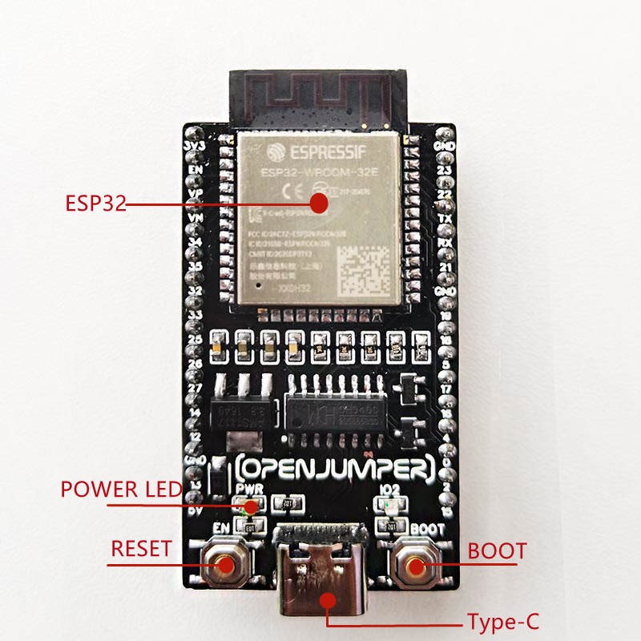

+ **电源引脚：** 开发板有两个电源引脚， 5V和3.3V。您可以使用这两个引脚来向其他设备和模块供电。

+ **GND引脚：** 开发板有3个接地引脚。

+ **启用引脚（EN）：** 该引脚用于启用和禁用模块。引脚为高电平时启用模块，低电平禁用模块。
  
+ **输入/输出引脚（GPIO）：** 可以使用GPIO引脚与LED、开关和其他输入/输出设备进行通信。

+ **DAC：** ESP32开发板有两个数模转换器，精度为8位。
  
+  **SPI：** 该开发板上有两个SPI接口，可用于连接显示屏、SD / microSD存储卡模块、外部闪存等。
  
+ **I2C：** SDA和SCL引脚用于I2C通信。
  
+ **串行通信（UART）：** 该开发板上有两个UART串行接口。使用这些引脚，您可以在两个设备之间传输高达5Mbps的信息。 UART0还具有CTS和RTS控制。
  
+ **PWM：** 几乎所有ESP32输入/输出引脚都可用于PWM（脉冲宽度调制）。使用这些引脚可以控制电机、LED灯和颜色等。


## ESP32模式

**ESP32芯片有5种模式：**

+ 活动模式：在这种模式下，Wi-Fi和蓝牙发射器和接收器的所有部分都是活动的。在这种情况下，电流消耗在80和260mA之间。

+ 调制解调器睡眠模式：处理器仍处于活动状态，但Wi-Fi和蓝牙已禁用。在这种情况下，电流消耗在3到20mA之间。

+ 轻度睡眠模式：主处理器停止工作，但RTC单元和ULP处理器单元仍处于活动状态。电流消耗约为0.8 mA。

+ 深度睡眠模式：只有RTC单元处于活动状态。在这种情况下，Wi-Fi和蓝牙通信的数据存储在RTC的存储器中。在此模式下，电流消耗在10到150μA之间。

+ 休眠模式：除了用于时钟的RTC定时器和连接到RTC的一些I/O引脚外，所有单元均被禁用。 RTC定时器或连接的引脚可以将芯片从此状态唤醒。在这种情况下，电流消耗约为2.5μA。

## 应用范围

+ 通用低功耗 IoT 传感器集线器

+ 通用低功耗 IoT 数据记录器

+ 摄像头视频流传输

+ 语音识别
  
+ 图像识别

+ 家庭自动化

+ 工业自动化

+ 智慧农业

+ 音频设备

+ 健康/医疗/看护

+ Wi-Fi 玩具

+ 可穿戴电子产品

+ 智能家居控制板


## 使用方法

**所需的材料**

+ ESP32开发板

+ Arduino IDE

### 在Arduino IDE上安装ESP32

Arduino IDE默认没有集成esp32扩展包，因此需要单独安装。esp32扩展包可以通过Arduino IDE中开发板管理器安装，也可以使用离线安装包。安装esp32扩展包后，即可在Arduino IDE菜单>工具>开发板中选择对应的开发板。
     
注意：您需要Arduino IDE 1.8.5或更高版本才能在其上安装ESP32。

先安装好ArduinoIDE

下载[Arduino IDE](https://arduino.me/download)

**方法一：** 打开Arduino IDE **菜单>文件>首选项** ，在附加开发板管理器网址输入框中，填入以下网址：
<https://www.arduino.me/package_esp32_index.json>

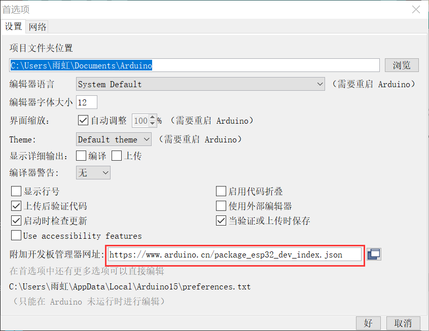

然后打开Arduino IDE **菜单>工具>开发板>开发板管理器** ，在开发板管理器中搜索安装ESP32

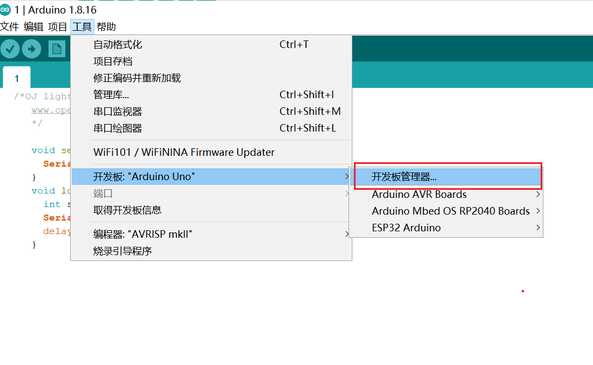 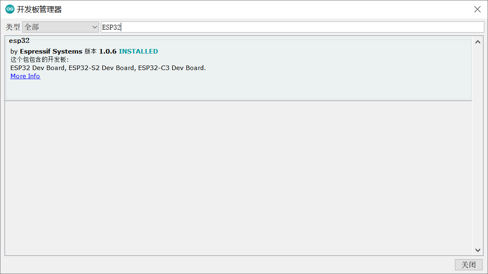

**方法二：** 

打开Arduino IDE **菜单>文件>首选项** ，在附加开发板管理器网址输入框中，填入以下网址：
<https://www.arduino.me/package_esp32_index.json>


然后关闭Arduino IDE，在社区下载打包好的esp32安装包，直接运行并解压即可。

从[Arduino 社区网站](https://arduino.me/a/esp32)下载ESP32 package。

也可以使用直接下载链接：<https://www.123pan.com/s/dJrKVv-tyYB>

如果安装过其他版本的esp32 package，请先删除，再使用本安装包。

删除方法：文件管理器地址栏输入 %LOCALAPPDATA%/Arduino15/packages，回车进入，然后删除掉其中的esp32文件夹。

运行完成后，再打开Arduino IDE，即可在 **菜单栏>工具>开发板** 中找到使用的esp32开发板

**推荐使用方法二安装**

要上传代码，请从“工具”菜单中选择开发板类型。然后选择连接到电路板的串口并单击上传。

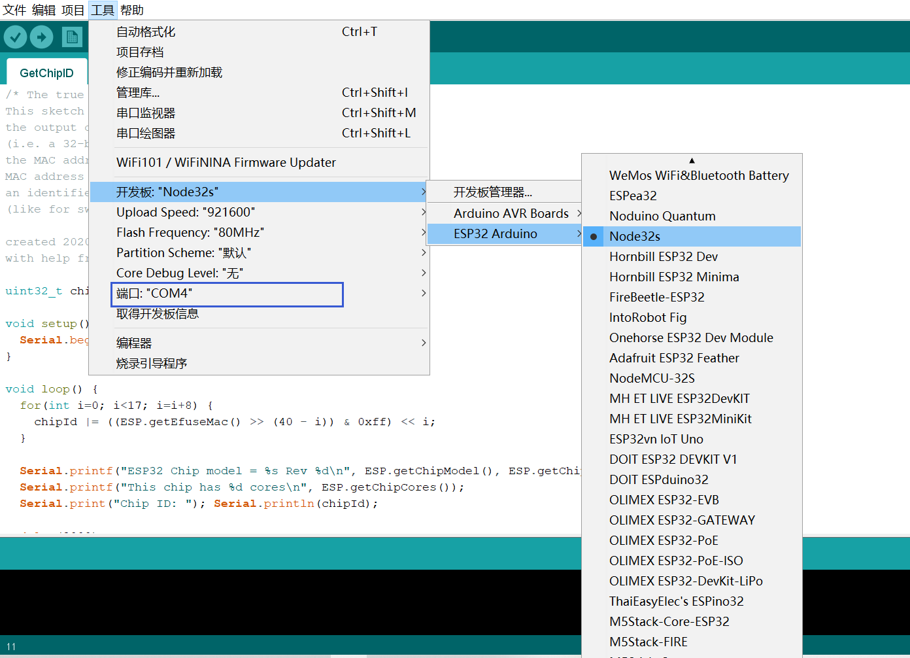

**基于OJ-esp32开发板 板卡推荐选择Node32s或NodeMCU-32S**

### 使用示例测试ESP32

打开Arduino IDE的一个示例程序 

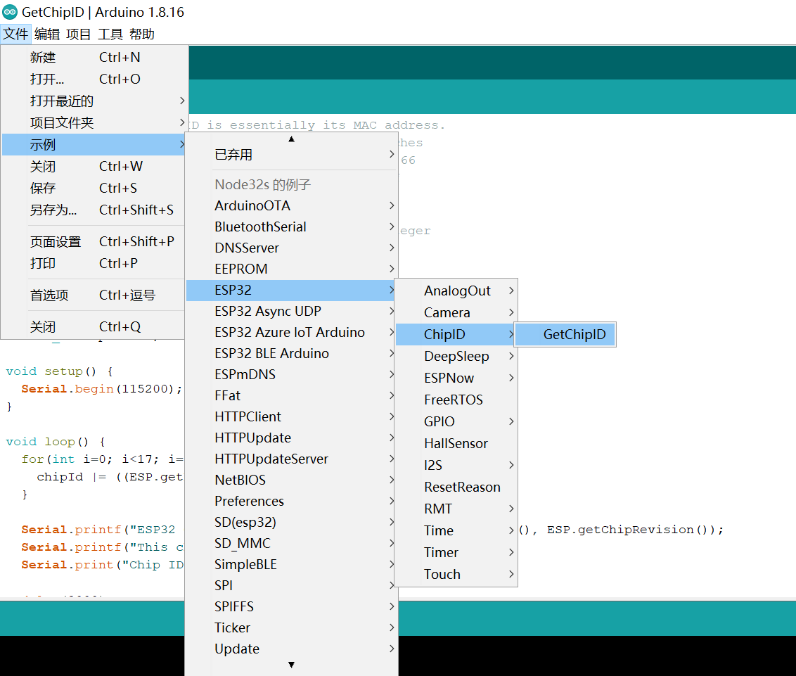

选择COM口

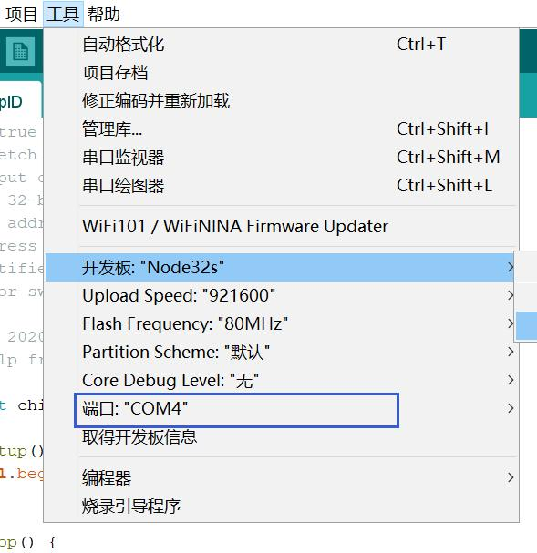

复制代码到Arduino IDE

```C++
uint32_t chipId = 0;

void setup() {
	Serial.begin(115200);
}

void loop() {
	for(int i=0; i<17; i=i+8) {
	  chipId |= ((ESP.getEfuseMac() >> (40 - i)) & 0xff) << i;
	}

	Serial.printf("ESP32 Chip model = %s Rev %d\n", ESP.getChipModel(), ESP.getChipRevision());
	Serial.printf("This chip has %d cores\n", ESP.getChipCores());
  Serial.print("Chip ID: "); Serial.println(chipId);
  
	delay(3000);

}
```

确保正确设置上传波特率。通常，此波特率应为115200。OJ-ESP32开发板不用按“Boot”按钮，也能正常上传。

编译上传代码，单击“上传”选项


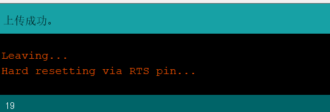

上传成功后，打开串口监视器，可看到芯片ID打印结果:

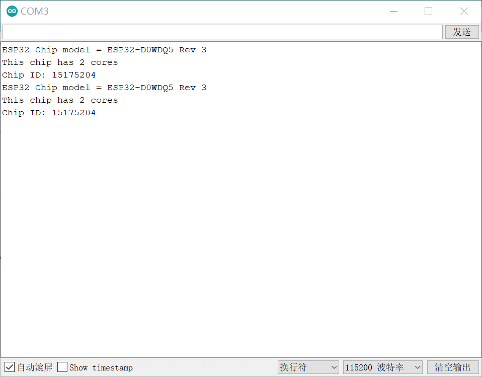

## esp32 & WiFi接入

### Arduino IDE安装好esp32扩展

### 下载并安装blinker APP

Android下载：在android应用商店搜索“blinker”下载安装
IOS下载：在app store中搜索“blinker”下载

### 下载并安装blinker Arduino库

[点击下载](https://diandeng.tech/dev)

通过Arduino IDE 菜单>项目>加载库>添加.ZIP库 导入到库，如图：

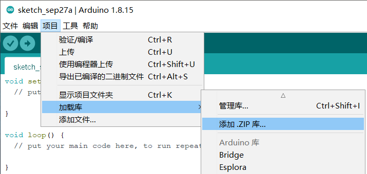

## 在app中添加设备，获取Secret Key

+ 进入App，点击右上角的“+”号，然后选择 添加设备

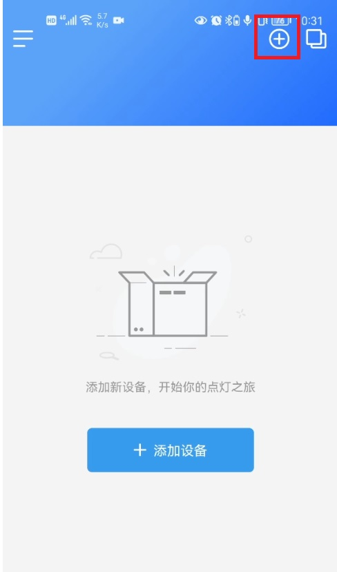

+ 点击选择Arduino > WiFi接入

+ 复制申请到的Secret Key

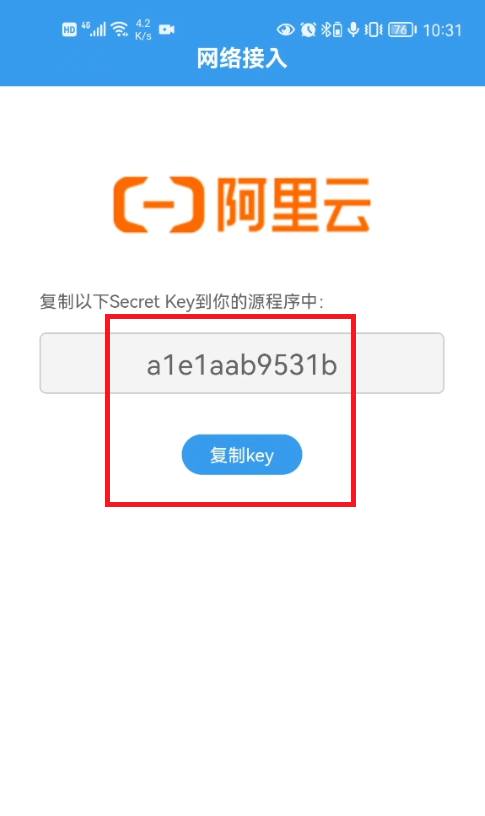

### DIY界面

+ 在设备列表页，点击设备图标，进入设备控制面板

+ 首次进入设备控制面板，会弹出向导页

+ 在向导页点击 载入示例，即可载入示例组件

### 编译并上传示例程序

打开Arduino IDE，通过 文件>示例>Blinker>Blinker_Hello/Hello_WiFi 打开例程

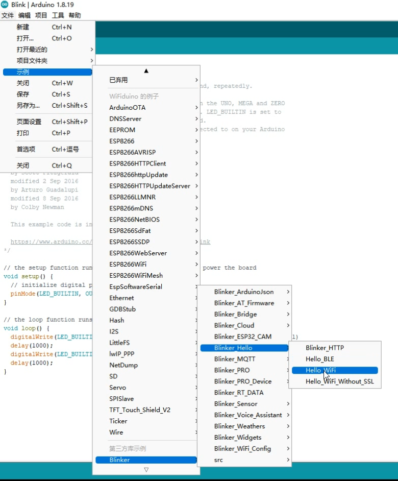

在程序中找到保存Secret Key、WiFi名称和密码的变量，填入您要连接的WiFi名和密码，如：

    注意：esp系列芯片只能连接2.4G WiFi热点
```
char auth[] = "abcdefghijkl"; //上一步中在app中获取到的Secret Key
char ssid[] = "abcdefg"; //您的WiFi热点名称
char pswd[] = "123456789"; //您的WiFi密码
```

编译并上传程序到esp32开发板，打开串口调试器

当看到提示“MQTT Connected!”，说明设备已经成功连接到MQTT服务器


### 完整示例程序

```C++
#define BLINKER_PRINT Serial
#define BLINKER_WIFI

#include <Blinker.h>

char auth[] = "Your Device Secret Key";
char ssid[] = "Your WiFi network SSID or name";
char pswd[] = "Your WiFi network WPA password or WEP key";

// 新建组件对象
BlinkerButton Button1("btn-abc");
BlinkerNumber Number1("num-abc");

int counter = 0;

// 按下按键即会执行该函数
void button1_callback(const String & state) {
    BLINKER_LOG("get button state: ", state);
    digitalWrite(LED_BUILTIN, !digitalRead(LED_BUILTIN));
}

// 如果未绑定的组件被触发，则会执行其中内容
void dataRead(const String & data)
{
    BLINKER_LOG("Blinker readString: ", data);
    counter++;
    Number1.print(counter);
}

void setup() {
    // 初始化串口
    Serial.begin(115200);

    #if defined(BLINKER_PRINT)
        BLINKER_DEBUG.stream(BLINKER_PRINT);
    #endif
    
    // 初始化有LED的IO
    pinMode(LED_BUILTIN, OUTPUT);
    digitalWrite(LED_BUILTIN, HIGH);
    // 初始化blinker
    Blinker.begin(auth, ssid, pswd);
    Blinker.attachData(dataRead);
    Button1.attach(button1_callback);
}

void loop() {
    Blinker.run();
}
```

### 为什么设备显示不在线？

+ **blinker App如何判断设备是否在线？**

   blinker App在 App打开时、进入设备页面时、在设备页面中每隔一定时间 会向设备发送心跳请求，内容为 {"get":"state"} 。
   设备收到请求后，会返回 {"state":"online"} ，app接收到这个返回，即会显示设备在线。

+ **程序没有成功上传到开发板**

     解决办法：重新上传，上传后打开串口监视器，确认程序正确运行

+ **程序中没有设置正确的ssid和密码，导致没有连接上网络**

    解决办法：设置后再重新上传程序，上传后打开串口监视器，确认程序正确运行

+ **程序错误，导致程序运行不正确**

   解决办法：先使用并理解blinker例程，再自由发挥

+ **开发板供电不足**

   解决办法：换电源 或 换USB口

### 为什么无法切换到局域网通信？

+ **路由器开启了AP隔离功能或禁止了UDP通信，从而阻止了局域网中设备的发现和通信**

   解决办法：关闭路由器AP隔离功能 或 允许UDP通信；如果找不到相关设置，通常可重置路由器解决

 + **mdns没有及时发现设备**

   解决办法：在首页下拉刷新，可以重新搜索局域网中的设备
   
## ESP32蓝牙接入

**在安装好软件和所需库后使用**

### 编译并上传示例程序

打开Arduino IDE，通过 **文件>示例>Blinker>Blinker_Hello/Hello_BLE** 打开例程

编译并下载程序到esp32，打开串口调试器

### 在app中添加设备

+ 确保蓝牙模块已通电

+ 进入App，点击右上角的“+”号，然后选择 添加设备

+ 点击选择Arduino > 蓝牙接入

+ 等待搜索设备

+ 点击选择要接入的设备


在APP中点击刚才您添加的设备，即可进入控制界面，点点按钮就可以控制Arduino上的LED灯开关

## 其他文档

ArduinoIDE程序开发：
<https://zhuanlan.zhihu.com/p/105178847?utm_source=wechat_session>

相关文档:
<https://docs.espressif.com/projects/esp-idf/zh_CN/latest/esp32/hw-reference/esp32/get-started-devkitc.html>


API参考

H/W参考

模组技术规格书：
<https://www.espressif.com/sites/default/files/documentation/esp32-wroom-32e_esp32-wroom-32ue_datasheet_cn.pdf>