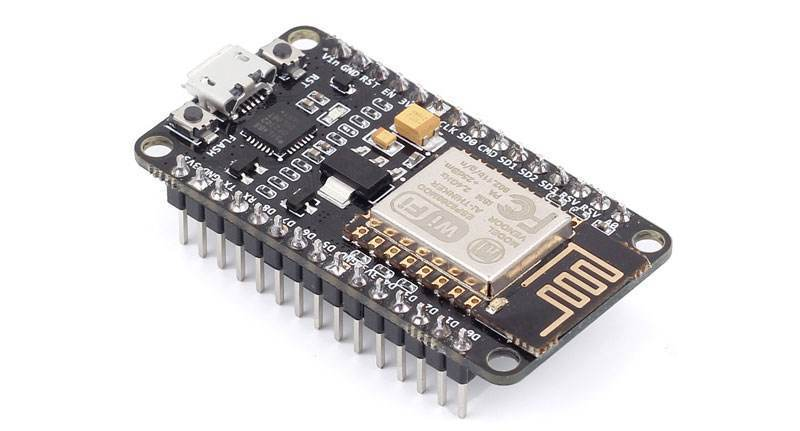
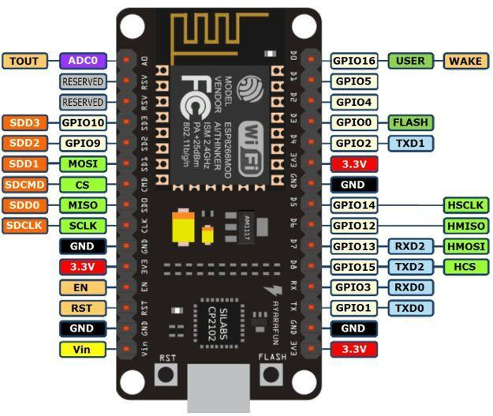

# NodeMCU

[点我购买](https://item.taobao.com/item.htm?id=585416764720)

## 一 、概述

**NodeMCU，** 是一个开源的物联网平台。 它使用Lua脚本语言编程。该平台基于eLua 开源项目，底层使用ESP8266 sdk 0.9.5版本。该平台使用了很多开源项目，例如 lua-cjson， spiffs。 NodeMCU包含了可以运行在 esp8266 Wi-FiSoC芯片之上的固件，以及基于ESP-12模组的硬件。

## 二、准备工具

### 2.1、ESPlorer NodeMCU IDE工具

下载地址：https://esp8266.ru/esplorer/  
Github：https://github.com/4refr0nt/ESPlorer  

### 2.2、ESP8266Flasher 固件烧录工具

windows 64位的: <https://github.com/nodemcu/nodemcu-flasher/blob/master/Win64/Release/ESP8266Flasher.exe>  

windows 32位的: <https://github.com/nodemcu/nodemcu-flasher/blob/master/Win32/Release/ESP8266Flasher.exe>

## 三、相关链接

NodeMCU官方:<https://github.com/nodemcu/>  

NodeMCU官方ESP8266Flasher 固件烧录工具: <https://github.com/nodemcu/nodemcu-flasher>  

NodeMCU官方英文手册（完整）：<https://nodemcu.readthedocs.io/en/master/>  

NodeMCU官方中文手册： <https://github.com/nodemcu/nodemcu-firmware/wiki/nodemcu_api_cn>  

NodeMCU官方固件下载： <https://nodemcu-build.com>  

## 四、使用方法

1.下载安装esp8266库文件，可以直接通过Arduino-IED搜索

2.下载安装ch340 usb转串口驱动

3.连接主板后选择端口号，并将板卡型号选择为 Node mcu。

## 五、常见问题解决方案

1.为什么连接主板后未显示端口

> 答：需要安装ch340 usb转串口的驱动  

 2.为什么无法选择nodemcu主板

> 答：需要先安装esp8266拓展库文件之后才会这个主板型号

3.为什么安装驱动之后还是无法显示串口

> 答：安转驱动之后无法显示串口可能是因为数据线不支持数据传输，可以尝试更换数据线。

4.为何会出现上传失败

> 答：上传失败检查是否选择了正确的程序、板卡以及端口。

注：上传程序时主板的led会闪烁，使用过程中芯片有微微发热现象属于正常现象

如果出现timed out wait for packet header的错误提示，可以尝试按住flash按钮之后，断电、再上电、然后下载程序，整个过程中不要松开按钮。