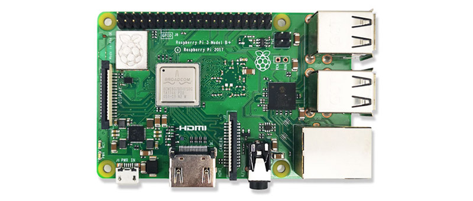
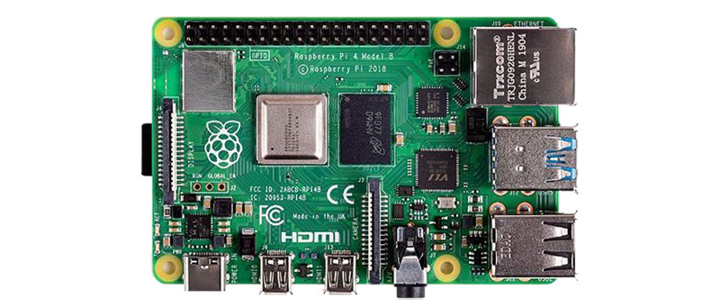

# 树莓派3代B+型（树莓派4代B型）

[点我购买](https://item.taobao.com/item.htm?id=584225565273)

[点我购买](https://item.taobao.com/item.htm?id=601081861757)

## 选型、安装、设置

### 简介
***
Raspberry Pi(中文名为“树莓派”,简写为RPi，(或者RasPi / RPI) 是为学习计算机编程教育而设计)，**只有信用卡大小的微型电脑，其系统基于Linux。 随着Windows 10 IoT的发布，我们也将可以用上运行Windows的树莓派** 。 自问世以来，受众多计算机发烧友和创客的追捧，曾经一“派”难求。别看其外表“娇小”，内“心”却很强大，视频、音频等功能通通皆有，可谓是“麻雀虽小，五脏俱全”。

### 用Raspberry Pi 能做什么？
***
就像其他任何一台运行Linux 系统的台式计算机或者便携式计算机那样，利用Raspberry Pi 可以做很多事情。当然，也难免有一点点不同。普通的计算机主板都是依靠硬盘来存储数据，但是Raspberry Pi 来说使用SD 卡作为“硬盘”，你也可以外接USB 硬盘。利用Raspberry Pi 可以编辑Office 文档、浏览网页、玩游戏—如《雷神之锤》（Quake ）。Raspberry Pi 的低价意味着其用途更加广泛，将其打造成卓越的多媒体中心也是一个不错的选择。利用Raspberry Pi 可以播放视频，甚至可以通过电视机的USB 接口供电。

### 树莓派选型
***
Raspberry有几种型号，对于大多数人来说，Raspberry Pi 4 Model B是一种选择。Raspberry Pi 4 Model B是最新，最快和最容易使用的。考虑价格因素的话，可以选择 Raspberry Pi 3b或者3b+，又或者Zero,他们的区别是内存或者硬件接口的加减配。所以可以根据自己是实际需求选择对应的型号。

具体型号的相关参数可以在官网中查看：<https://www.raspberrypi.org/products/>

Raspberry Pi 4带有1GB，2GB或4GB RAM。对于大多数教育目的和许多业余爱好者项目来说，1GB足够了。作为台式计算机，我们建议使用2GB。 Raspberry Pi Zero和Zero W体积更小，所需功率更少，因此它们对于诸如机器人之类的便携式项目很有用。通常，使用Raspberry Pi 4启动项目并在拥有可以使用较小Pi的有效原型的情况下迁移到Pi Zero更为容易。

### 使用树莓派所需的装备
***
一、8G以上安装了树莓派系统的microSD卡（[安装系统参考 Windows下安装树莓派系统到SD卡](https://shumeipai.nxez.com/2013/09/07/raspberry-pi-under-windows-system-installation-to-sd-card.html)、[使用 Etcher 给 SD 卡安装树莓派系统](https://www.arduino.cn/forum.php?mod=viewthread&tid=84723&highlight=%E6%A0%91%E8%8E%93%E6%B4%BE%2B%E7%B3%BB%E7%BB%9F)）

二、如果是树莓派1、2、3代的话，需要5V/2.5A以上的MicroUsb接口电源适配器，如果使用3B+以上版本，比如树莓派4，推荐用3A以上的电源适配器。需要注意的是树莓派4电源线接口是typeC。

三、USB接口的键盘鼠标一套。 您可以使用蓝牙键盘和鼠标，但是第一次安装时需要USB键盘和鼠标。

四、电视或电脑屏幕，要查看Raspbian桌面环境，您需要一个屏幕以及用于将屏幕和Pi连接起来的连接线。屏幕可以是电视或计算机显示器。如果屏幕上有内置扬声器，则Pi可以使用这些扬声器播放声音。

五、HDMI线，用于接显示器，或者HDMI转VGA的，或者HDMI转DVI的，主要看你的显示器接口。

六、附件配件（非必须）

树莓派保护壳、耳机或扬声器、网线。大型Raspberry Pi型号（但Pi Zero / Zero W没有）具有标准的以太网端口，可将它们连接到Internet。要将Pi Zero连接到互联网，您需要一个USB到以太网适配器。Raspberry Pi 4、3和Pi Zero W也可以无线连接到Internet。

### 连接树莓派
***

1.先将安装好系统的microSD卡插入树莓派。注意卡插入的方向。

2.再将USB接口的键盘和鼠标接上树莓派。

3.用HDMI线连接树莓派和电视或显示器。如果你的显示器是 VGA 接口输出，那么还需要一根 HDMI 转 VGA 线缆。如果你用的是树莓派4，你也可以用相同方法在另外一个HDMI接口插入第二个液晶屏。

4.如果要通过以太网将Raspberry Pi连接到Internet，请使用网线将Raspberry Pi上的以太网端口连接到墙上或Internet路由器上的以太网插座。如果要使用无线连接，或者不想连接到互联网，则无需执行此操作。 树莓派3以上的版本可以通过无线连接互联网。

5.如果您使用的屏幕上有扬声器，则声音将通过这些扬声器播放。或者，根据需要将耳机或扬声器连接到音频端口。

6.接上电源线，并打开电源。

### 启动树莓派
***
当你看到树莓派主板上红色电源指示灯亮起，绿色指示灯间或闪烁说明系统已经开始启动。顺利的话这时会看到树莓派的 Logo。

如果不出意外，那么系统将会进入设置向导。

单击下一步开始设置。

设置您的国家/地区，语言和时区，然后再次单击下一步。

输入您的Raspberry Pi的新密码，然后单击“ 下一步”。

选择名称，输入密码并点击下一步连接到您的WiFi网络。

注意：如果您的Raspberry Pi型号没有无线连接，则不会看到此屏幕。

单击“ 下一步”，让向导检查Raspbian的更新并安装它们（这可能需要一些时间）。

单击完成或重新启动以完成设置。 （注意：仅在需要完成更新时才需要重启 ）

