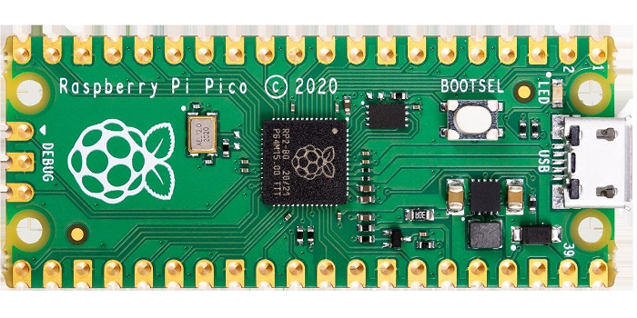
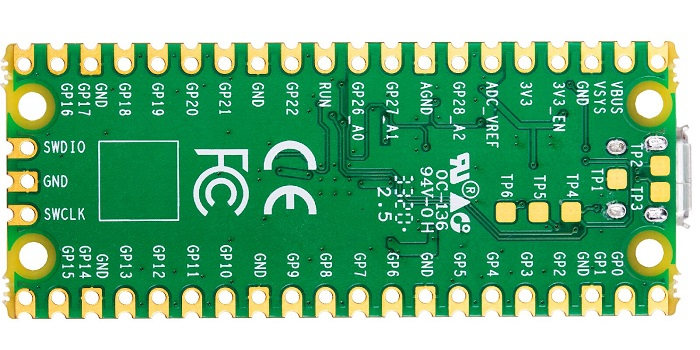
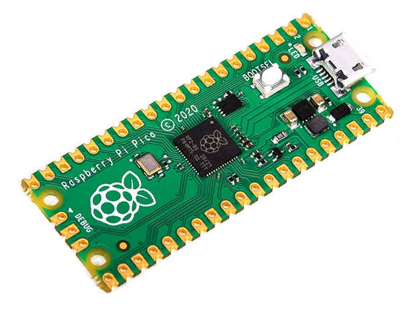
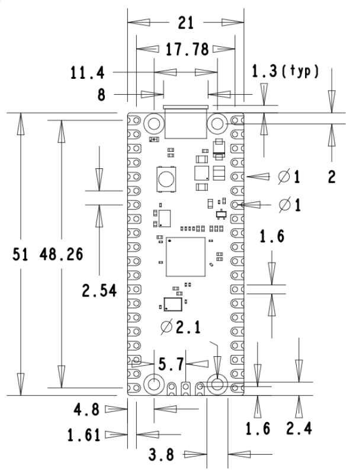
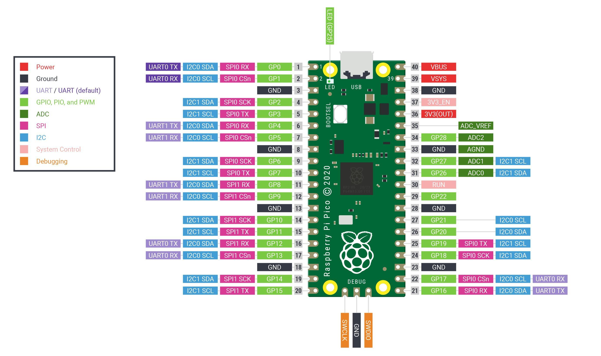
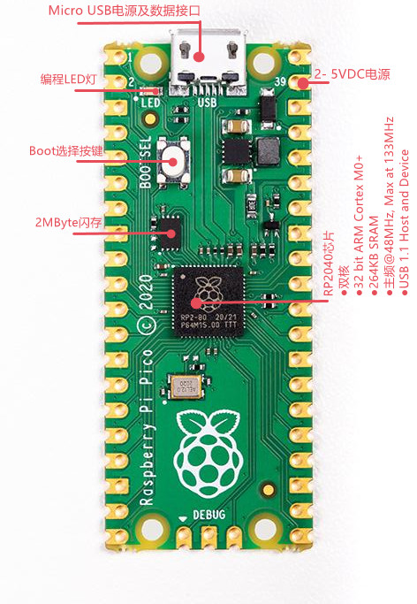

# Raspberry Pi Pico单片机开发板

<table border="1">
<tr>
  <td align="center"></td>
  <td align="center"></td>
  <td align="center"></td>
</tr>
<tr>
  <td style="background-color:rgb(232,232,232,0.5) "colspan="3" align="center"><a href="https://item.taobao.com/item.htm?id=649168790397)"> Raspberry Pi Pico</a> </td>
</tr>
</table>

## 产品概述

Raspberry Pi Pico是一款树莓派官方设计的低成本，高性能的微控制器开发板，具有灵活数字接口。是一款便捷灵活、 方便上手的开源电子原型平台。由树莓派基金会推出，不同于以往任意一款树莓派， Raspberry Pi Pico定位为高性能单片机控制器，致力于解决树莓派不够擅长的硬件控制领域的不足，是补足树莓派产品功能生态的重要板块。其本身作为下位机可以支持树莓派、PC端(包括Windows系统、Linux系统、Mac系统)等多种开发平台。拥有丰富的GPIO及外设资源支持。其整体开发体系包含硬件电路板和官方提供的SDK (软件开发包)。硬件上采用Raspberry官方自主研发的RP2040微控制器芯片,搭载了ARM Cortex M0+ 双核处理器，高达133MHz运行频率，内置了264KB SRAM和2MB的内存，还板载26个多功能的GPIO引脚。可以使用 MicroPython、C、C++等多种语言开发。且配套有完善的开发资料教程，可方便快速入门开发，并嵌入应用到产品中。 

## 产品特性

+ 采用了Raspberry Pi 官方自主设计的 RP2040微控制器芯片

+ 搭载双核 ARM Cortex M0 + 处理器，运行频率高达 133MHz 灵活时钟

+ 内置264KB的SRAM和2MB的片上Flash
  
+ 可通过专用QSPI总线支持最高16 MB的片外闪存
  
+ 邮票孔设计，可直接焊接集成到用户自主设计的底板上

+ USB1.1主机和设备支持

+ 支持低功耗睡眠和休眠模式

+ 可通过USB识别为大容量存储器进行拖放式下载程序

+ 多达26个多功能的GPIO引脚
  
+ 2个SPI，2个I2C，2个UART，3个12位ADC，16个可控PWM通道

+ 精确的片上时钟和定时器

+ 温度传感器

+ 片上加速浮点库

+ 8个可编程I/O (PIO)状态机，用于自定义外设支持 

+ 1个带4个报警的定时器，1个实时计数器

## 产品参数

|名称|参数|
|:--|:--|
|产品名称 |Raspberry Pi Pico|
|产品尺寸|51mm*21mm|
|控制芯片|RP2040 (ARM Cortex MO+双核133MHz处理器264KSRAM)|
|Flash|2MByte|
|USB端口类型|Micro-USB|
|供电方式|USB-5V、VSYS-1.8V-5.5V|
|供电电压|5V|
|输出电压|5V/3.3V|
|GPIO电平|3.3V|
|工作电流|不大于300mA|
|工作温度|-20°C ~ 80°C|
|引脚数量|40pin|
|ADC精度|12位500KPS ADC|
|开发语言|MicroPython、C、C++|
|烧录方式|识别为大容量存储器拖放式下载|
|开发环境|Visual Studio Code、Eclipse|

## 引脚说明

一些RP2040 GPIO引脚用于内部电路板功能，它们是：

|引脚 | I/O |功能|
|:--|:--|:--|
|GPIO29 |IP |在ADC模式（ADC3）中用于测量VSYS/3|
|GPIO25| OP| 连接到用户LED|
|GPIO24 |IP |VBUS检测-如果存在VBUS，则为高，否则为低|
|GPIO23| OP |控制板载SMPS节能引脚|

除了GPIO和接地引脚外，40引脚接口上还有7个其他引脚：

+ PIN40：VBUS
  
   VBUS是micro USB输入电压，micro USB端口连接到引脚1。

+ PIN39：VSYS

   VSYS是主控板输入电压，可在1.8V~5.5V的范围内变化，由车载设备使用SMPS为RP2040及其GPIO生成3.3V。

+ PIN37：3V3_EN

   3V3_EN连接到板载SMPS启用引脚，并通过100K电阻器拉高（至VSYS）。要禁用3.3V（这也会使RP2040断电），将该引脚短接至低位。

+ PIN36：3V3

   3V3是RP2040及其I/O的主要3.3V电源，由车载SMPS产生。

+ PIN35：ADC_VREF

   ADC_VREF是ADC电源（和参考）电压，通过对3.3V电源进行滤波在Pico上生成。

+ PIN33：AGND

   AGND是GPIO26~29的地参考，在这些信号下有一个单独的模拟接地在这个引脚终止。如果未使用ADC或ADC性能不重要，则该引脚可以连接到数字电路地。

+ PIN30：RUN

   RUN是RP2040启用引脚，具有一个内部（片上）上拉电阻器，电阻为3.3V，约为50KΩ。重置RP2040，短接该引脚。

## Raspberry Pi Pico的工作条件

+ 最高工作温度85°C（包括自加热）

+ 最低工作温度-20°C

+ VBUS 5V+/-10%

+ VSYS最小1.8V

+ VSYS最大电压5.5V

## Flash编程

可使用串行线调试端口或专用USB接口（重新）编程板载2字节QSPI闪存大容量存储设备模式。

重新编程Pico闪存的最简单方法是使用USB模式。要执行此操作，请断开电路板电源，然后按住在电路板通电期间按下BOOTSEL按钮（例如，在连接USB时按住BOOTSEL）。然后，Pico将显示为USB大容量存储设备。将一个特殊的.uf2文件拖到磁盘上会将该文件写入闪存并重新启动Pico。

USB引导代码存储在RP2040上的ROM中，因此不会被意外覆盖。

## 通用IO

GPIO0-GPIO22仅为数字，GPIO26-GPIO28可以用作数字GPIO或ADC输入（软件可选）。

需要注意的一点是，支持ADC的GPIO26-29在VDDIO（3V3）导轨上有一个内部反向二极管，因此输入电压不得超过VDDIO加上约300mV。此外，如果RP2040未通电，则向其施加电压GPIO引脚将通过二极“泄漏”到VDDIO导轨中。正常数字GPIO引脚0-25（以及调试引脚）不受此限制，因此当RP2040未通电时，可以安全地向这些引脚施加电压。

## 其他资料

[官方资料](https://www.raspberrypi.com/documentation/microcontrollers/raspberry-pi-pico.html)

[下载引脚排列图](https://datasheets.raspberrypi.com/pico/Pico-R3-A4-Pinout.pdf)

[下载Fritzing配件](https://datasheets.raspberrypi.com/pico/Pico-R3-Fritzing.fzpz)