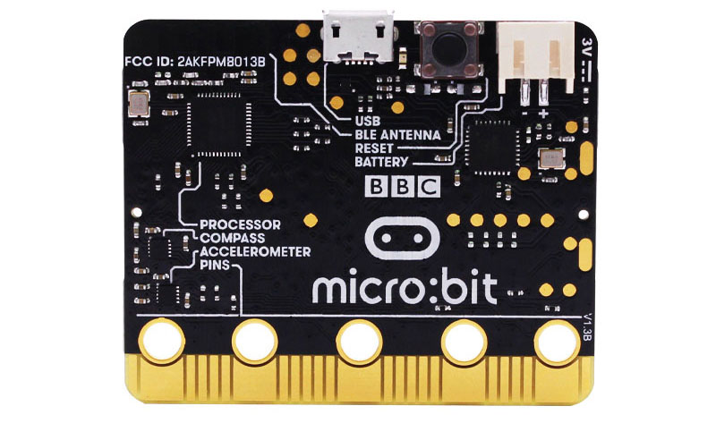
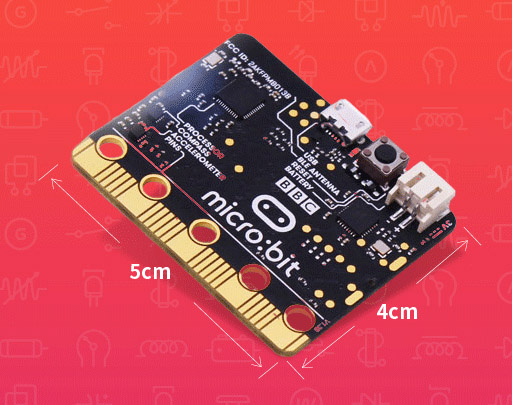
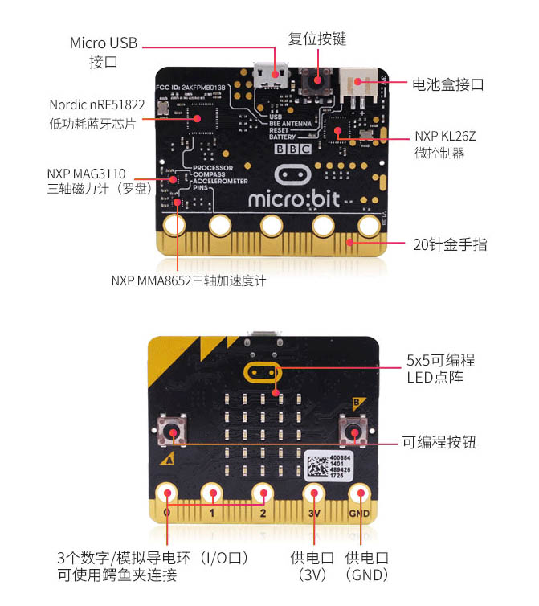
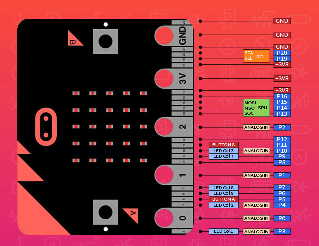
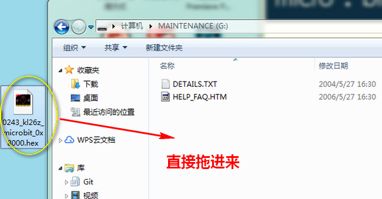

# microbit控制器

[点我购买](https://item.taobao.com/item.htm?id=567919074155)
## 产品介绍

micro:bit有什么功能?

micro:bit仅有信用卡的一半大小，搭载了5x5可编辑LED点阵，两颗可编程按键，加速度计，电子罗盘，温度计，蓝牙等电子模块。

特点：操作简单，魅力十足，包容性强

* 支持微软开发的PXT图形化编程界面

* 支持Windows/macos/ios/安卓等多种操作系统

- 编程环境基于WEB服务，无需额外下载编译器
  
- 电脑端通过USB烧写、仿真程序
  
- 移动端通过蓝牙无线烧写、仿真程序
  
- 支持包括javasript/phython/mbedc在内的多种主流编程语言

## 产品参数

+ 工作电压：3.3V

* 供电电压：

    Micro USB程序烧录/供电口：5V

   PH2.0电源接口：3-3.3V

   鳄鱼夹接口：3-3.3V

- 检测范围：0-3.3V
- 处理器：ARM Cortex- MO微处理器
- 工作温度：0-85°C

- 接口类型：

    Micro USB程序烧录/供电口
 
    PH2.0 3V供电口

    4mm鳄鱼夹接口x5

    金手指接口x20

- 产品尺寸：43*52mm 
- 包装尺寸:105x55x30mm
- 重量：8.6g

## micro:bit和Arduino的区别?
***

|       名称       |                       Micro:bi                       |          Arduino          |
|:-------------|:--------------------------------------------------|:-----------------------|
|     适合人群     |                学生与爱好者(小学以上)                |  学生与爱好者(高中以上)   |
|      处理器      |                  32位ARM Cortex MO                   |    8位单片机ATmega328P    |
|       尺寸       |                      43mm*52mm                       |         53mm*69mm         |
|    编程环境.     |              在线编程工具+本地编程工具               | 本地编程工具(Arduino IDE) |
|     编程语言     |           图形化编程： MicroPython;Scratch           |          C；C++           |
|     板载原件     | I/O信号口；蓝牙；加速度计；电子罗盘；按钮；LED点阵屏 |     I/O信号口；LED灯      |
| 如何连接外部设备 |                    鳄鱼夹；扩展板                    |       跳线；扩展板        |
|     兼容电压     |                          3V                          |           3V-5V           |

## 引脚说明

**micro:bit 官方网站：**<http://microbit.org/micro:bit>

**官方中文网站：**<http://microbit.org/zh-CN/micro:bit>

**开始编程：**<http://microbit.org/zh-CN/code/micro:bit>

**创意分享：**<http://microbit.org/zh-CN/ideas/micro:bit>

**快速入门指引：**<http://microbit.org/zh-CN/guide/>

**MICROBIT盘符变为MAINTENANCE的原因及恢复方法：**

正常情况下，Micorbit与电脑连接后是出现MICROBIT的盘符，表明可正常烧写程序 （请注意，虽然烧写的方式是将.hex文件拷贝进盘符，但所拷贝的文件并不会被看到，也就是说MICROBIT盘符内始终应该只有DETAILS.TXT和MICROBIT.HTM两个文件） ; 一旦盘符变为了MAINTENANCE，意味着你的bit进入了维护模式，有以下两种原因:

+ 在插上USB的同时按下了复位按键自主进入到了维护模式（重新拔插后恢复）

+ 在使用microbit的拔插过程中固件丢失（无法自动回到正常状态）, 在固件丢失的这种情况下，我们只需要重新烧入固件即可恢复 都给你提供好了，是比较新的固件。

[固件下载](http://download.openjumper.cn/0250_kl26z_microbit_0x8000.hex)

之后看到进度条走完后就能恢复MICROBIT盘了。
