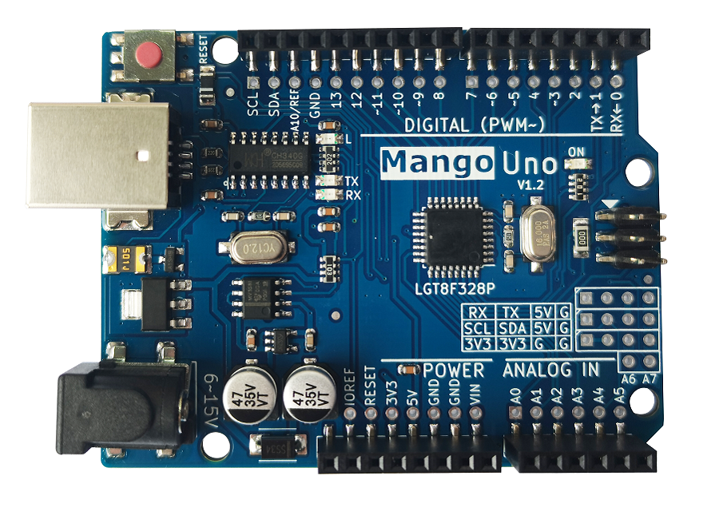
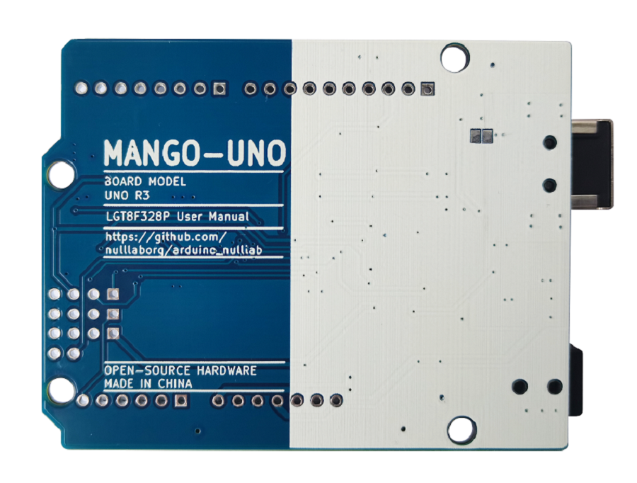
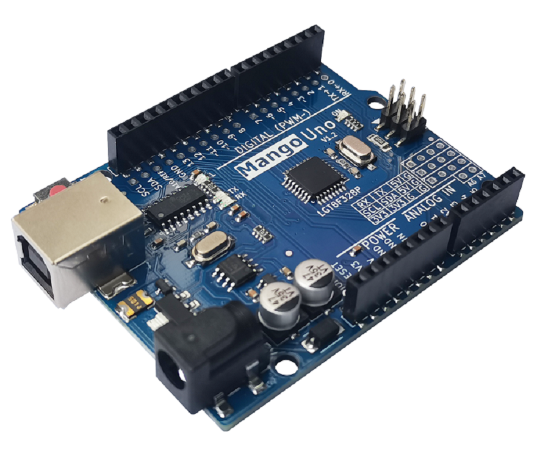
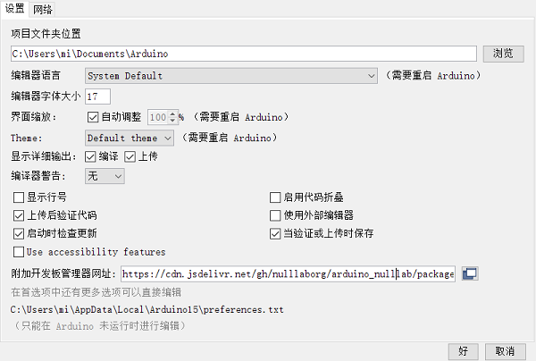
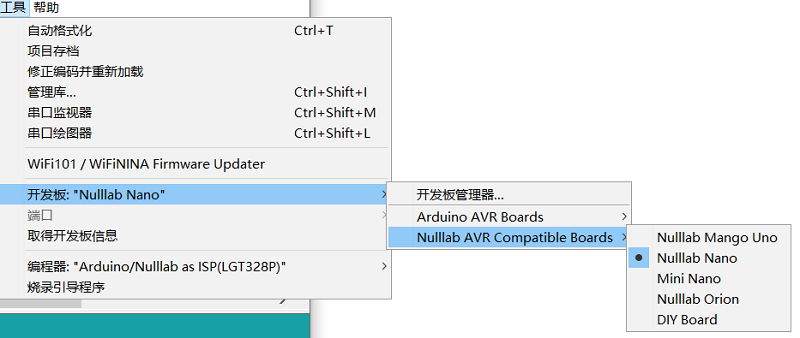
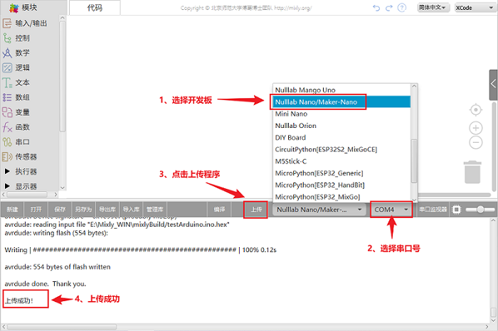
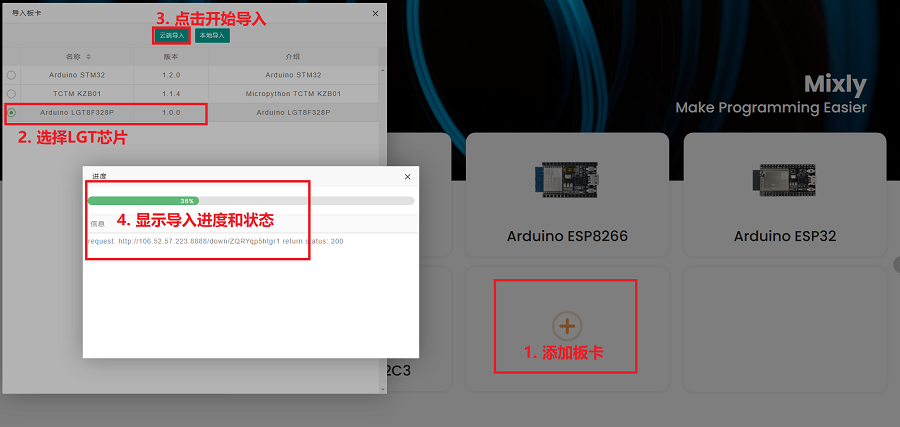
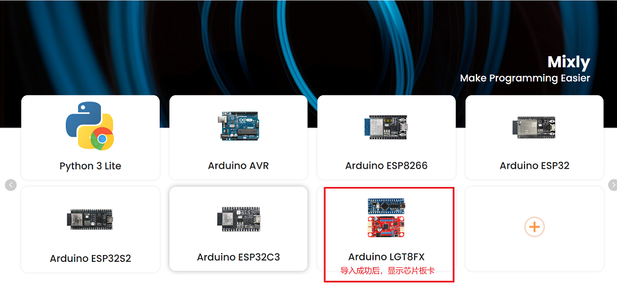
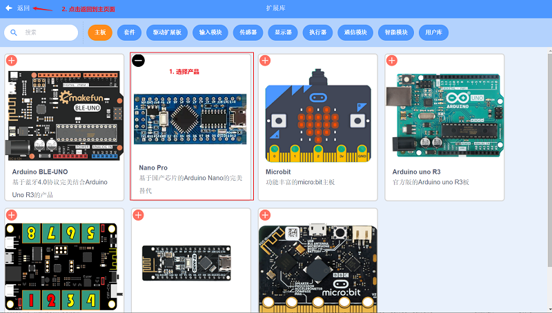
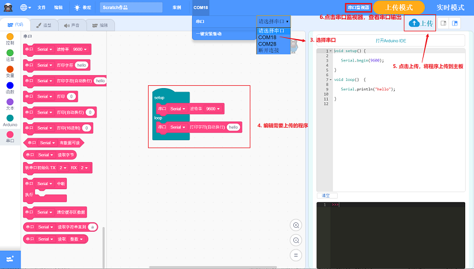

# LGTduino UNO主控板

## 简介

<table border="1">

<tr>
  <td align="center"></td>
  <td align="center"></td>
  <td align="center"></td>
</tr>
<tr>
  <td style="background-color:rgb(232,232,232,0.5) "colspan="3" align="center"> <a href="https://item.taobao.com/item.htm?id=674769901898">Mango UNO主控板</a></td>
</tr>
</table>

这是一款基于国产芯片LGT8F328P芯片的Arduino UNO兼容板。它是一颗增强8位RISC内核，针对原来架构的做了优化，指令执行速度快了一些，同时优化了flash部分，增加定时器3，内置晶振，增加DAC输出，主频最高可到32M，功耗更低。

## LGT8F328P和Atmega328P芯片对比

LGT8FX8P系列微控制器目前主要包括LGT8F328P-SSOP20，LQFP32，LQFP48三个封装芯片。

+ 增强8位RISC内核, 支持16位数字运行扩展, 在1.8V – 5.5V的工作范围内, **支持内部晶振，可运行在最高32MHz的核心频率;**

+  LGT8F328P内部32K字节FLASH程序存储器, 2K字节数据SRAM, 内置将FLASH模拟为EEPROM的控制逻辑, 可以根据应用需要将程序FLASH的一部分划分为数据FLASH空间, 通过EEPROM控制器实现类似EEPROM的接口访问，**如果使用eerom的话总flash只有30K，比他Atmega328P少2K；**

+ LGT8F328P集成更多硬件资源和外设, 包括12位ADC，timer3， 高精度1.024/2.048/4.096V内部参考电压， 8位DAC以及高速模拟比较器，A8(D23)，A9(24)，A10(25)，A11(D26)模拟输入口，D22，REST，晶振引脚都可以配置成GPIO口;

+ LGT8F328P架构设计比较新，外设功能远远强于Atmega328P。尤其是程序加密能力更是远超Atmega328P

## 技术参数

|名称 |参数 |
|:--|:--|
|MCU|LGT8F328P|
|工作电压| 5V|
|输入电压(推荐)| 7-9V|
|FLASH|32KB|
|SRAM|2KB|
|E2PROM|0K,1K,2K,4K可配置（与FLASH共享）|
|PWM|6路|
|主频|内部16MHz（最大32MHz）|
|ADC|6通道12位|
|DAC|1通道8位|
|UART|1路|
|analogRead范围|0~4095精度|
|内部基准|1.024V、2.048V、4.096V ±0.5%|
|其它外设|SPI、TWI(I2C)、GUID（全局设备号）|
|尺寸|68.6 mm * 53.4 mm|

## Nulllab开发板Arduino IDE支持包

### 方法一、网络安装

1、文件->首选项，得到如下界面

2、在附加开发板管理器网址输入如下网址：

https://cdn.jsdelivr.net/gh/nulllaborg/arduino_nulllab/package_nulllab_boards_index_zh.json

3、工具->开发板->开发板管理 搜索nulllab,选择最新版本安装（如果搜索不到，请安装arduino IDE1.8.15以上）

### 方法二、手动安装

1、[直接下载最新软件支持包](https://gitee.com/link?target=http%3A%2F%2F39.108.252.158%3A8089%2Fnulllab_arduino-1.0.4.zip)

2、将解压并修改名字到arduino-ide\hardware\arduino_nulllab-master\avr\这个目录下要看到 boards.txt和platform.txt文件

3、重新打开Arduino IDE应用程序

4、开发板选择 

## Mixly1.0支持包

1、下载支持LGT主板的[Mixly安装脚本window版](https://gitee.com/link?target=https%3A%2F%2Fgithub.com%2Fnulllaborg%2Farduino_nulllab%2Freleases%2Fdownload%2Fv1.0.4%2FLGT_Mixly_Update.bat)，[Mixly安装脚本Mac版](https://gitee.com/link?target=https%3A%2F%2Fgithub.com%2Fnulllaborg%2Farduino_nulllab%2Freleases%2Fdownload%2Fv1.0.4%2FLGT_Mixly_Update.sh)

a、将 **LGT_Mixly_Update** 放到 **Mixly_WIN** 根目录下

b、**双击运行-->输入y-->回车**

2、打开Mixly，按下面提示即可以编译上传程序

## Mixly2.0支持包

经过nulllab团队和mixly官方联系，Mixly2.0官方云端已自带LGT芯片的库，所以导入比较方便，下载最新版本的Mixly安装包，打开Mixly2.0软件，或者 **双击软件左上角Mixly图标** 课件见到选择主板首页，然后操作下图步骤；

## Magicblock（基于scratch3.0）图像化软件支持

1、[下载MagicBlock](https://gitee.com/link?target=http%3A%2F%2Fwww.emakefun.com%2Fuploads%2Fsoftware%2FMagicBlockSetup.exe)

2、安装好MagicBlock，并且打开MagicBlock

3、点击MagicBlock左下角的产品选择按钮，主板选择Nano Pro；

点击返回，即可以图形化编程。如下图 

## 其他资料

[示例程序](https://maifile.cn/pdf/d72656299653.pdf)

[Nulllab软件包](https://gitee.com/nulllab/nulllab_arduino)