# ESP32-CAM摄像头开发板

<table border="1">

<tr>
  <td align="center">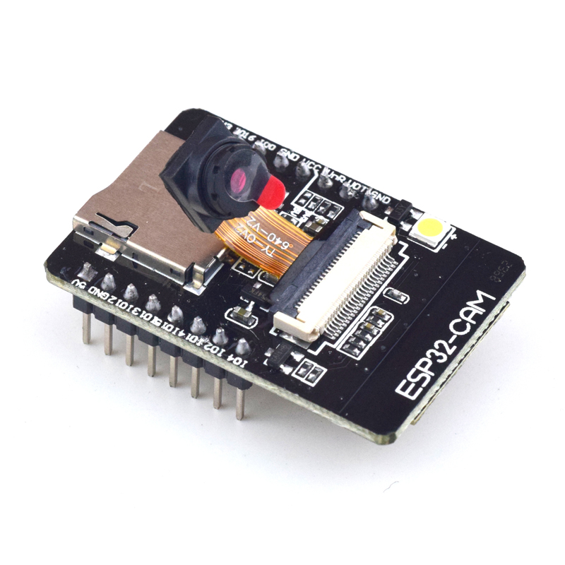</td>
  <td align="center">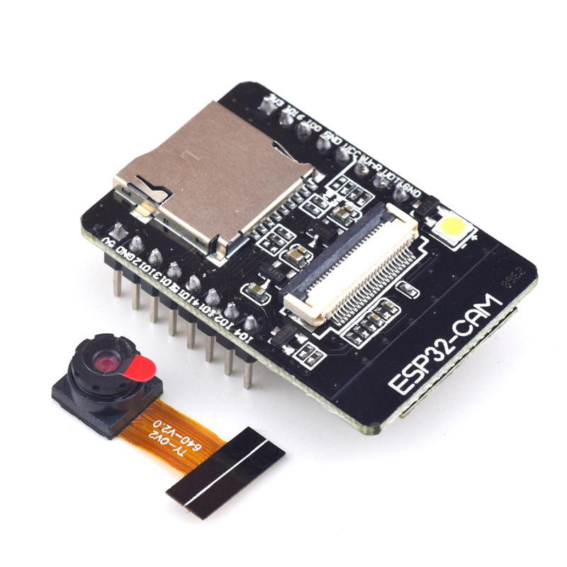</td>
  <td align="center">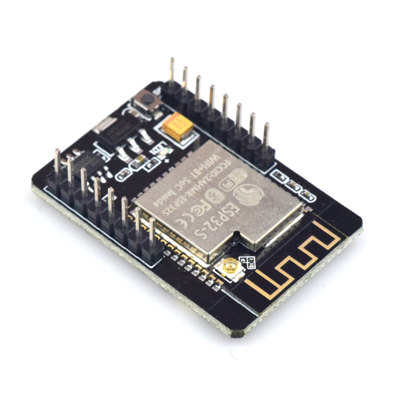</td>
</tr>
<tr>
  <td style="background-color:rgb(232,232,232,0.5) "colspan="3" align="center"> <a href="https://item.taobao.com/item.htm?id=672310972398">ESP32-CAM</a></td>
</tr>
</table>

## 概述

ESP32-CAM 拥有业内极富竞争力的小尺寸摄像头模组，该模块可以作为最小系统独立工作，尺寸仅为 27 * 40.5  *4.5mm，深度睡眠电流最低达到 6mA。

ESP-32CAM 可广泛应用于各种物联网场合，适用于家庭智能设备、工业无线控制、无线监控、QR 无线识别，无线定位系统信号以及其它物联网应用，是物联网应用的理想解决方案。

ESP-32CAM 采用 DIP 封装，直接插上底板即可使用，实现产品的快速生产，为客户提供高可靠性的连接方式，方便应用于各种物联网硬件终端场合。

## PCB天线/IPEX座二选一说明

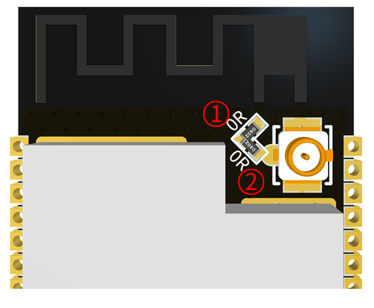

1、模组默认连接到PCB板载天线(即只接①处的OR电阻); 

2、如需使用IPEX座外接天线，只接②处的OR电阻即可(需自行更换OR电阻位置);

3、OR电阻只能放在①或②的位置上，对应使用不同天线,不能同时放置!

## 产品特性

+ 体积超小的 802.11b/g/n Wi-Fi + BT/BLE SoC模块

+ 采用低功耗双核 32 位 CPU，可作应用处理器

+ 主频高达 240MHz，运算能力高达 600 DMIPS

+ 内置 520 KB SRAM，外置 4M PSRAM

+  支持 UART/SPI/I2C/PWM/ADC/DAC 等接口

+ 支持 OV2640 和 OV7670 摄像头，内置闪光灯

+ 支持图片 WiFI 上传

+ 支持 TF 卡 - 支持多种休眠模式。

+ 内嵌 Lwip 和 FreeRTOS

+ 支持 STA/AP/STA+AP 工作模式

+ 支持 Smart Config/AirKiss 一键配网

+ 支持二次开发

## 注意

+ 1.请保证模块输入电源至少5V 2A,否则图片会有几率出现水纹。

+ 2.ESP32 GPIO32管脚控制摄像头电源，当摄像头工作时，请把GPIO32拉低。

+ 3.由于IO0连接摄像头XCLK,使用时请把IO0悬空，请勿接高低电平。

+ **4.出厂已含有默认固件，不另外提供下载，如需重烧其他固件请谨慎操作。**

## 应用场景

+ 家庭智能设备图传

+ 无线监控

+ 智慧农业

+ QR无线识别

## 产品技术规格

<table border="1">

<tr>
  <td>名称</td>
  <td>参数</td>
</tr>

<tr>
  <td>模块型号</td>
  <td>ESP32-CAM</td>
</tr>

<tr>
  <td>封装</td>
  <td>DIP-16</td>
</tr>

<tr>
  <td>尺寸</td>
  <td>27*40.5*4.5（±0.2）mm</td>
</tr>

<tr>
  <td>SPI Flash</td>
  <td>默认 32Mbit</td>
</tr>

<tr>
  <td>RAM </td>
  <td>内部 520KB+外部 4M PSRAM</td>
</tr>

<tr>
  <td>蓝牙</td>
  <td>蓝牙 4.2 BR/EDR 和 BLE 标准</td>
</tr>

<tr>
  <td>Wi-Fi</td>
  <td>802.11 b/g/n/e/i</td>
</tr>

<tr>
  <td>支持接口</td>
  <td>UART、SPI、I2C、PWM</td>
</tr>

<tr>
  <td>支持 TF 卡 </td>
  <td>最大支持 4G</td>
</tr>

<tr>
  <td>IO 口 </td>
  <td>9 个</td>
</tr>

<tr>
  <td>串口速率 </td>
  <td>默认 115200 bps</td>
</tr>

<tr>
  <td>图像输出格式 </td>
  <td>JPEG(仅 OV2640 支持),BMP,GRAYSCALE</td>
</tr>

<tr>
  <td>频谱范围</td>
  <td>2412 ~2484MHz</td>
</tr>

<tr>
  <td>天线形式 </td>
  <td>板载 PCB 天线 , 增益 2dBi</td>
</tr>

<tr>
  <td rowspan="3">发射功率</td>
  <td>802.11b: 17±2 dBm (@11Mbps)</td>
</tr>

<tr>
<td>802.11g: 14±2 dBm (@54Mbps)</td>
</tr>

<tr>
<td>802.11n: 13±2 dBm (@MCS7)</td>
</tr>

<tr>
  <td rowspan="5">接收灵敏度</td>
  <td>CCK, 1 Mbps : -90dBm</td>
</tr>

<tr>
<td>CCK, 11 Mbps: -85dBm</td>
</tr>

<tr>
<td>6 Mbps (1/2 BPSK): -88dBm</td>
</tr>

<tr>
<td>54 Mbps (3/4 64-QAM): -70dBm</td>
</tr>

<tr>
<td>MCS7 (65 Mbps, 72.2 Mbps): -67dBm</td>
</tr>

<tr>
  <td rowspan="5">功耗</td>
  <td>关闭闪光灯:180mA@5V</td>
</tr>

<tr>
<td>开启闪光灯并且亮度调到最大:310mA@5V</td>
</tr>

<tr>
<td>Deep-sleep:最低功耗可以达到 6mA@5V</td>
</tr>

<tr>
<td>Moderm-sleep:最低可达到 20mA@5V</td>
</tr>

<tr>
<td>Light-sleep:最低可达到 6.7mA@5V</td>
</tr>

<tr>
  <td>安全性</td>
  <td>WPA/WPA2/WPA2-Enterprise/WPS</td>
</tr>

<tr>
  <td>供电范围 </td><td>5V</td>
</tr>

<tr>
  <td>工作温度</td>
  <td>-20 ℃ ~ 85 ℃</td>
</tr>

<tr>
  <td>存储环境</td>
  <td>-40 ℃ ~ 90 ℃ , < 90%RH</td>
</tr>

<tr>
  <td>重量</td>
  <td>10g</td>
</tr>

</table>

### ESP32-CAM 模块图片输出格式速率

|大小|QQVGA |QVGA |VGA| SVGA|
|:--|:--|:--|:--|:--|
|JPEG| 6| 7| 7 |8|
|BMP| 9 |9| -| -|
|GRAYSCALE |9| 8| -| -|

测试环境：摄像头型号：OV2640 XCLK:20MHz，模块通过 WiFi 传输图片到电脑浏览器

## 硬件结构

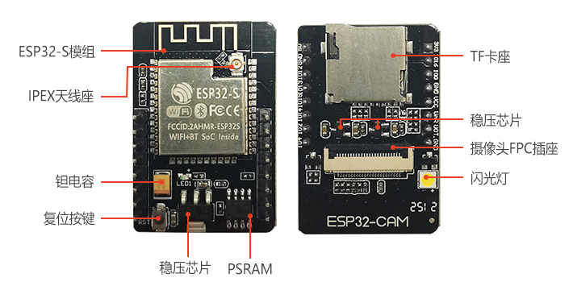

## 管脚定义

|CAM|ESP32|SD|ESP32|
|:--|:--|:--|:--|
|D0 |PIN5| CLK |PIN14|
|D1| PIN18 |CMD |PIN15|
|D2 |PIN19 |DATA0| PIN2|
|D3| PIN21 |DATA1/闪光灯 |PIN4|
|D4| PIN36 |DATA2 |PIN12|
|D5| PIN39| DATA3| PIN13|
|D6 |PIN34|
|D7| PIN35|
|XCLK| PIN0|
|PCLK |PIN22|
|VSYNC| PIN25|
|HREF| PIN23|
|SDA| PIN26|
|SCL |PIN27|
|POWER PIN| PIN32|

下图显示了ESP32-CAM引脚排列。

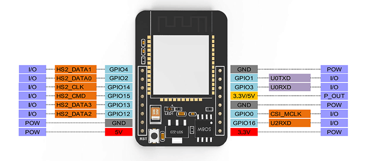

有三个GND引脚和两个引脚用于电源：3.3V或5V。

GPIO 1和GPIO 3是串行引脚。您需要这些引脚才能将代码上传到您的电路板。此外，GPIO 0也起着重要作用，因为它确定ESP32是否处于闪烁模式。当GPIO 0连接到GND时，ESP32处于闪烁模式。

以下引脚内部连接到microSD卡读卡器：

+ GPIO 14：CLK

+ GPIO 15：CMD

+ GPIO 2：数据0

+ GPIO 4：数据1（也连接到板载LED）

+ GPIO 12：数据2

+ GPIO 13：数据3

## 视频流服务器

按照以下步骤使用您可以在本地网络上访问的ESP32-CAM构建视频流式Web服务器。 

**1.安装ESP32插件**

在本例中，我们使用Arduino IDE对ESP32-CAM板进行编程。因此，您需要安装Arduino IDE以及ESP32插件。如果您还没有安装ESP32插件，请按照下一个教程之一进行操作：

[在Arduino IDE中安装ESP32板](https://arduino.me/a/esp32)

**2. CameraWebServer示例代码**

在Arduino IDE中，转到文件 > 示例 > ESP32 > 相机，然后打开CameraWebServer示例。

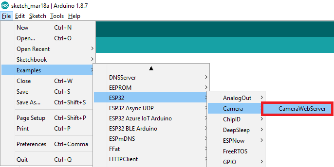

应加载以下代码。 

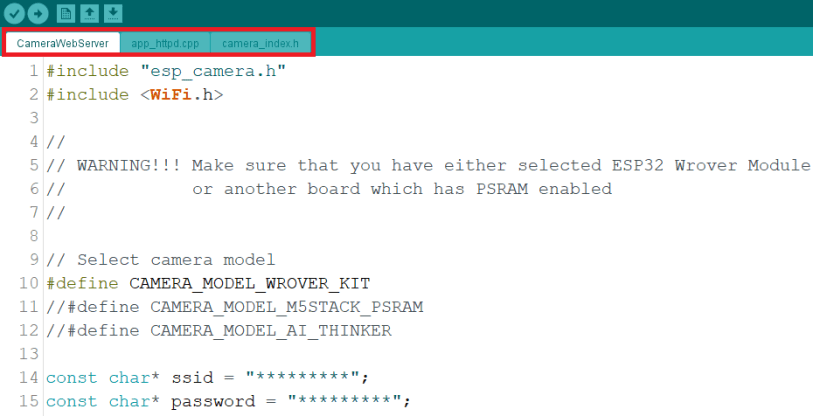

如果在Arduino IDE中找不到代码，可以从GitHub存储库下载。下载后，解压缩该文件夹，然后打开CameraWebServer.ino文件。

在上载代码之前，您需要在以下变量中插入网络凭据：

  const char* ssid = "REPLACE_WITH_YOUR_SSID";const char* password = "REPLACE_WITH_YOUR_PASSWORD";

然后，确保选择正确的相机模块。在这种情况下，我们使用AI-THINKER模型。

所以，请注释所有其他模型并取消注释此模型

  #define CAMERA_MODEL_AI_THINKER

现在，代码已准备好上传到您的ESP32

### ESP32-CAM上传代码

使用FTDI编程器将ESP32-CAM板连接到计算机。按照下一个原理图：

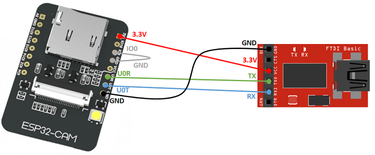

重要提示： GPIO 0需要连接到GND，以便您能够上传代码。

要上传代码，请执行以下步骤：

+ 转到工具 > 板，然后选择ESP32 Wrover模块

+ 转到工具 > 端口，然后选择ESP32连接的COM端口

+ 在工具 > 分区方案中，选择“ 巨大的APP（3MB无OTA） ”

+ 按下ESP32-CAM板载RESET按钮

+ 然后，单击上传按钮以上载代码。

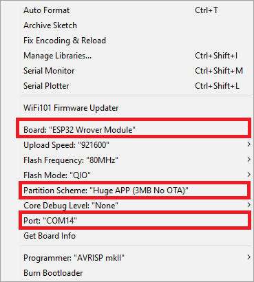

重要提示：如果无法上传代码，请仔细检查GPIO 0是否已连接到GND，并在“ 工具”菜单中选择了正确的设置。您还应该按下板载重置按钮以在闪烁模式下重新启动ESP32。

### 获取IP地址

上传代码后，断开GPIO 0与GND的连接。

以波特率115200打开串行监视器。按ESP32-CAM板载复位按钮。

ESP32 IP地址应打印在串行监视器中。

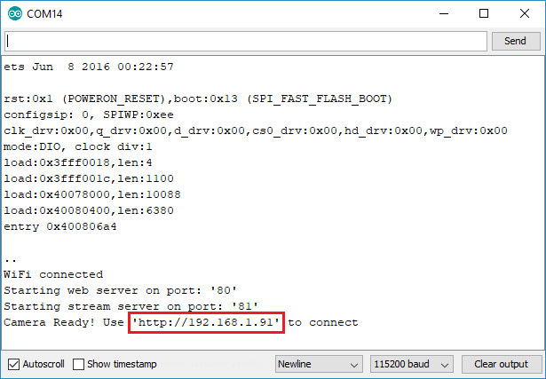

### 访问视频流服务器

现在，您可以在本地网络上访问您的相机流媒体服务器。打开浏览器并键入ESP32-CAM IP地址。按Start Streaming按钮开始视频流。

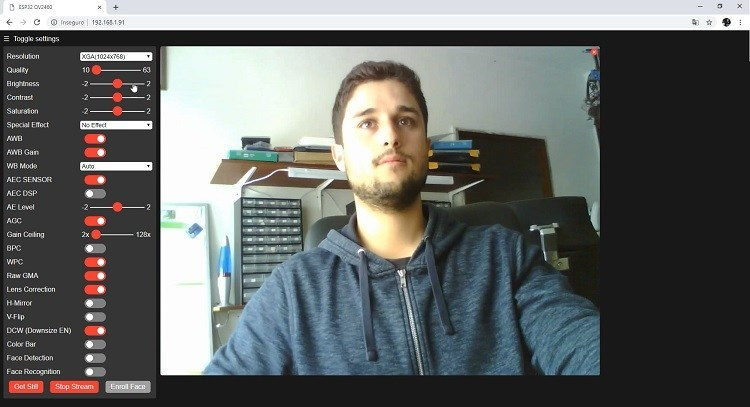

您还可以通过单击“ 获取静止”按钮来拍摄照片。不幸的是，此示例不保存照片，但您可以修改它以使用板载microSD卡存储拍摄的照片。

您还可以使用多种相机设置来调整图像设置。

最后，您可以进行人脸识别和检测。

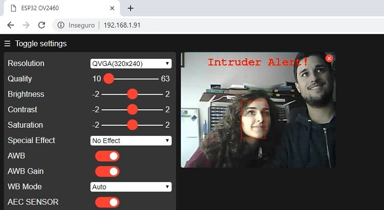

首先，您需要注册一张新面孔。它将多次尝试挽救面部。在注册新用户之后，它应该稍后检测到面部

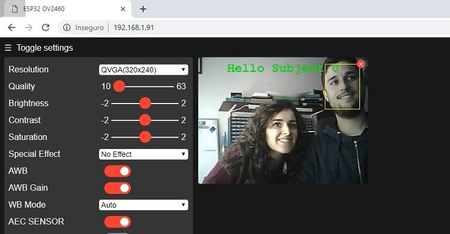

就是这样。现在，您可以使用图库中的示例启动并运行带有面部检测和识别功能的视频流式Web服务器。

## 其他资料 

+ [ESP32-CAM原理图](https://docs.ai-thinker.com/_media/esp32/docs/esp32_cam_sch.pdf)

+ [摄像头规格](https://docs.ai-thinker.com/_media/esp32/docs/ov2640_ds_1.8_.pdf)

+ [其他资料](https://pan.baidu.com/s/1xt7L3gszLaO0t4XzLA0Dbg?pwd=ap7f)  提取码： ap7f  