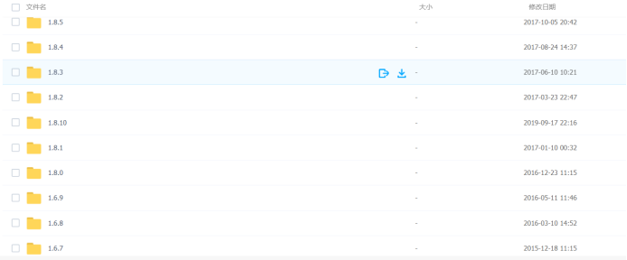
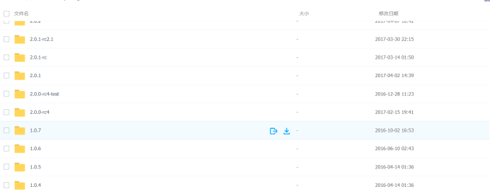
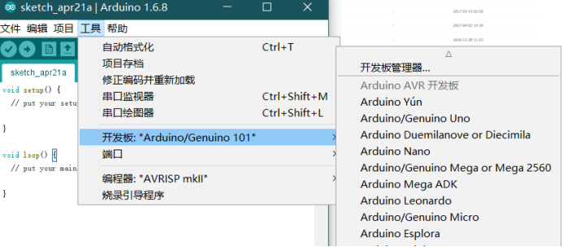
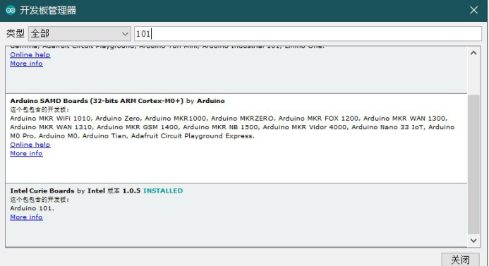
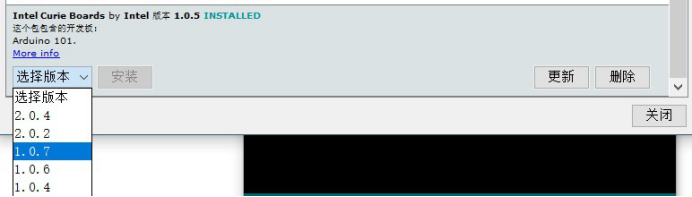
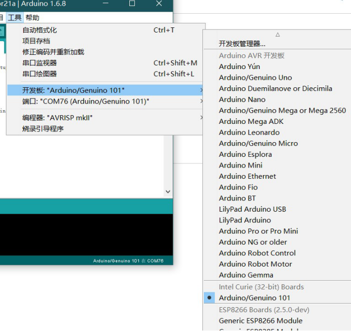

# Arduino 101使用说明

由于Arduino 101停产已经很久，使用最新版本的Arduino IDE无法正常编译Arduino101主板，同时由于国外网络的原因无法正常添加Arduino101的旧版本拓展库，我们需要自己下载旧版本Arduino IDE并且手动添加旧版的拓展库从而达到编译Arduino 101的目的。

## 步骤一 下载旧版本IDE

我们可以在下面的帖子里下载旧版的IDE

<https://arduino.me/a/2632>

这里推荐下载1.68

## 步骤二 下载旧版本的Arduino 101拓展库

我们在<https://www.arduino.cn/forum.php?mod=viewthread&tid=19423&highlight=arduino%2B101>中下载

这里可以下载1.04-1.07版本的拓展库

## 步骤三 

我们将下载好的拓展库，移动到

## 步骤四

打开arduino1.68版本

在工具中选择开发板管理器

在开发板管理器中搜索101

选择最下方的Arduino 101

并选择要安装版本的拓展库

