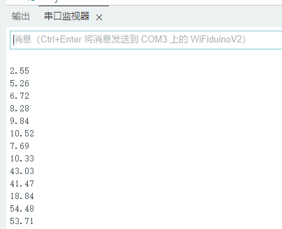

# WiFiduino V2

## 使用前请先解锁

**首先给WiFiduinoV2主板的GPIO11解锁**

点击下载解锁文件: <http://download.openjumper.cn/pstio11%E8%A7%A3%E9%94%81.exe>

下载完成后，先把主板接入电脑，然后双击运行打开.exe解锁文件


首先输入你的串口编号，我这里的串口编号是1，就输入1，然后回车


然后根据提示输入：BURN（必须大写），再次回车，显示ok即解锁成功。

## 产品简介

WiFiduinoV2是使用esp32-C3作为核心的开发板，相对于之前的wididuino控制器，WiFiduinoV2不仅提供了WiFi，还带有蓝牙功能，配合物联网软件平台blinker可以更轻松地构建物联网项目。

ESP32-C3 是一款安全稳定、低功耗、低成本的物联网芯片，搭载RISC-V 32位单核处理器，支持 2.4 GHz WiFi和Bluetooth5 (LE)，为物联网产品提供行业领先的射频性能、完善的安全机制和丰富的内存资源。ESP32-C3 对 Wi-Fi 和 Bluetooth 5 (LE) 的双重支持降低了设备配网难度，适用于广泛的物联网应用场景。
<table border="1">
<tr>
  <td align="center"></td>
  <td align="center"></td>
  <td align="center"></td>
</tr>
<tr>
<td style="background-color:rgb(232,232,232,0.5) "colspan="3" align="center"> <a href="https://item.taobao.com/item.htm?id=696843715193"><font style="font-size:16px">WiFiduino V2</font></a></td>
</tr>
</table>


## ESP32-C3特点

ESP32-C3 搭载 RISC-V 32 位单核处理器，时钟频率高达 160 MHz。具有 22 个可编程 GPIO 管脚、内置 400 KB SRAM，支持通过 SPI、Dual SPI、Quad SPI 和 QPI 接口外接多个 flash，满足各类物联网产品功能需求。

集成 2.4 GHz Wi-Fi 和支持长距离的 Bluetooth 5 (LE)，有助于构建覆盖范围更广、射频性能更强的物联网设备。它还支持蓝牙 Mesh (Bluetooth Mesh) 协议和乐鑫 Wi-Fi Mesh，在较高的工作温度下仍能保持卓越的射频性能。

支持基于 RSA-3072 算法的安全启动和基于 AES-128/256-XTS 算法的 flash 加密功能，确保设备安全连接


## 硬件参数

**WiFiduinoV2与WiFiduino对比**

|名称 |WiFiduinoV2|WiFiduino|
|--|--|--|
|主芯片|esp32-c3|esp8266|
|工作电压|3.3V|3.3V|
|输入电压(推荐)|7-9V|7-9V|
|数字I/O|14个|11个|
|模拟I/O|6个|1个|
|PWM输出|4个|11个|
|I/O电流|除D7、D8默认电流为40mA，其余引脚的默认电流为20mA|12mA|
|flash|4MB| 4MB|
|sram|400k|160KB（其中用户可使用48.5KB）|
|时钟频率|160MHz|80/160 MHz|
|功能支持|WiFi、蓝牙|WiFi|
|USB接口|Type-c接口|Micro-B接口|
|板子长宽|68.6 mm * 53.4 mm|68.6 mm * 53.4 mm|
|重量|25g|25g|


## 引脚说明


所有I/O输入电压都不得高于3.3V。

+ **D0~D13：** 数字输入引脚。

+ **A0~A5：** 模拟接口，输入电压范围为0~3.3V 

    + A2与D13重用,A3与D11重用

    + A4与SCL重用，A4与SDA重用

+ **LED**：开发板上有4个LED指示灯  

    + 13：该LED连接到D13引脚，可以使用宏LED_BUILTIN编程控制  
   
    + PWR： 电源指示灯，开发板通电后会亮

    + RX、TX：串口指示灯

+ **电源:** WiFiduinoV2工作电压3.3V，可以从以下几种方式供电:

    + DC电源座： 推荐输入7~9V电压  

    + USB口： 5V供电

    + VIN： 可输入7~9V供电。当使用DC电源座供电时，该引脚可以获得DC口电压
  
    + 5V引脚： 可以输入5V供电。当使用其他方式供电时，该引脚可以获得5V电压

    + 3.3V引脚： 可以输入3.3V直接给主板供电。当使用其他方式供电时，该引脚可以获得3.3V电压

## ArduinoIDE使用wifiduinoV2教程


**下载最新版本的Arduino IDE**

<https://arduino.me/download>

根据自己的电脑系统来选择下载


**下载安装ESP32库**

先打开Arduino IDE菜单>文件>首选项，在其他开发板管理地址输入框中，输入这个网址：https://www.arduino.me/package_esp32_index.json ，然后点确定。


下载最新的ESP32库：<https://arduino.me/a/esp32>

双击打开安装


**选择正确的板卡和串口号**


Flash Mdoe 选: DIO


**给主板上电，保存上传程序，观察现象**

### 点亮板载LED

```C++
// the setup function runs once when you press reset or power the board
void setup() {
  // initialize digital pin LED_BUILTIN as an output.
  pinMode(13, OUTPUT);
}

// the loop function runs over and over again forever
void loop() {
  digitalWrite(13, HIGH);   // turn the LED on (HIGH is the voltage level)
  delay(1000);                       // wait for a second
  digitalWrite(13, LOW);    // turn the LED off by making the voltage LOW
  delay(1000);                       // wait for a second
} 

```
程序上传成功后，会看到主板的13 LED灯间隔1秒亮一次，并一直重复。

### Blinker wifi测试

wifiduinoV2接入wifi教程可参考资料：https://www.openjumper.com/doc/ojkz26-oj-esp32

可直接跳到 ESP32&WIFI 接入部分

```C++
#define BLINKER_WIFI

#include <Blinker.h>

char auth[] = "Your Device Secret Key";
char ssid[] = "Your WiFi network SSID or name";
char pswd[] = "Your WiFi network WPA password or WEP key";

// 新建组件对象
BlinkerButton Button1("btn-abc");
BlinkerNumber Number1("num-abc");

int counter = 0;

// 按下按键即会执行该函数
void button1_callback(const String & state)
{
    BLINKER_LOG("get button state: ", state);
    digitalWrite(13, !digitalRead(13));
}

// 如果未绑定的组件被触发，则会执行其中内容
void dataRead(const String & data)
{
    BLINKER_LOG("Blinker readString: ", data);
    counter++;
    Number1.print(counter);
}

void setup()
{
    // 初始化串口
    Serial.begin(115200);
    BLINKER_DEBUG.stream(Serial);
    BLINKER_DEBUG.debugAll();
    
    // 初始化有LED的IO
    pinMode(13, OUTPUT);
    digitalWrite(13, HIGH);
    // 初始化blinker
    Blinker.begin(auth, ssid, pswd);
    Blinker.attachData(dataRead);

    Button1.attach(button1_callback);
}

void loop() {
    Blinker.run();
}
```
程序上传后，可用blinker APP控制 开灯、关灯。


### Blinker 蓝牙测试

**wifiduino V2 蓝牙接入**

先上传程序，然后在Blinker APP中添加设备，选择独立设备，蓝牙接入


设备添加成功后，点击开始使用，再点击载入示例，就可以看到控制界面了，点击“点我开关灯”按钮，可以观察到主板上的LED灯可以通过Blinker APP控制亮灭。


```C++
#define BLINKER_BLE

#include <Blinker.h>

BlinkerButton Button1("btn-abc");
BlinkerNumber Number1("num-abc");

int counter = 0;

void button1_callback(const String & state)
{
    BLINKER_LOG("get button state: ", state);
    digitalWrite(13, !digitalRead(13));
}

void dataRead(const String & data)
{
    BLINKER_LOG("Blinker readString: ", data);
    counter++;
    Number1.print(counter);
}

void setup()
{
    Serial.begin(115200);
    BLINKER_DEBUG.stream(Serial);
    
    pinMode(13, OUTPUT);
    digitalWrite(13, HIGH);
    
    Blinker.begin();
    Blinker.attachData(dataRead);

    Button1.attach(button1_callback);
}

void loop()
{
    Blinker.run();
}
```

### 蜂鸣器示例程序

将蜂鸣器接到WiFiduinoV2主板的A5接口

在编译上传程序之前，先下载安装[ESP32Tone.h](http://download.openjumper.cn/ESP32Tone.zip)库文件，将下载的压缩文件解压放在arduinoIDE安装目录下的libraries里。

```C++
#include <ESP32Tone.h>

#define tpin A5

void setup(){

}

void loop(){
   tone(A0, 131, 1000, 0);
   tone(A1, 131, 1000, 0);
   tone(A2, 131, 1000, 0);
   tone(A3, 131, 1000, 0);
   tone(A4, 131, 1000, 0);
   tone(A5, 131, 1000, 0);
   tone(D0, 131, 1000, 0);
   tone(D1, 131, 1000, 0);
   tone(D2, 131, 1000, 0);
   tone(D3, 131, 1000, 0);
   tone(D4, 131, 1000, 0);
   tone(D5, 131, 1000, 0);
   tone(D6, 131, 1000, 0);
   tone(D7, 131, 1000, 0);
   tone(D8, 131, 1000, 0);
   tone(D9, 131, 1000, 0);
   tone(D10, 131, 1000, 0);
   tone(D11, 131, 1000, 0);
   tone(D12, 131, 1000, 0);
   tone(D13, 131, 1000, 0);
   
   tone(A0, 165, 1000, 0);
   tone(A1, 165, 1000, 0);
   tone(A2, 165, 1000, 0);
   tone(A3, 165, 1000, 0);
   tone(A4, 165, 1000, 0);
   tone(A5, 165, 1000, 0);
   tone(D0, 165, 1000, 0);
   tone(D1, 165, 1000, 0);
   tone(D2, 165, 1000, 0);
   tone(D3, 165, 1000, 0);
   tone(D4, 165, 1000, 0);
   tone(D5, 165, 1000, 0);
   tone(D6, 165, 1000, 0);
   tone(D7, 165, 1000, 0);
   tone(D8, 165, 1000, 0);
   tone(D9, 165, 1000, 0);
   tone(D10, 165, 1000, 0);
   tone(D11, 165, 1000, 0);
   tone(D12, 165, 1000, 0);
   tone(D13, 165, 1000, 0);

}
```


### 超声波示例程序

接线说明

VCC——5V

GND——GND

trig——D2

echo——D3

```C++
float checkdistance(int trigpin,int echopin) {
  digitalWrite(trigpin, LOW);
  delayMicroseconds(2);
  digitalWrite(trigpin, HIGH);
  delayMicroseconds(10);
  digitalWrite(trigpin, LOW);
  float distance = pulseIn(echopin, HIGH) / 58.00;
  delay(100);
  return distance;
}

float disval;

void setup(){
  pinMode(D2, OUTPUT);
  pinMode(D3, INPUT);
  Serial.begin(9600);
}

void loop(){
  disval = checkdistance(D2,D3);
  Serial.println(disval);

}
```
打开串口监视器可以看到超声波测量的数据：



### DHT11示例程序

```
#include <DHT.h>

volatile float item;
DHT dht1(D12, 11);

void setup(){
  item = 0;
  Serial.begin(9600);
   dht1.begin();
}

void loop(){
  item = dht1.readTemperature();
  Serial.println(item);

}
```

打开串口监视器可以看到DHT11测试的数据：


### OLED示例程序

接线说明

VCC——5V

GND——GND

SCL——A5

SDA——A4

上传程序前先安装U8g2的库文件

```C++
#include <U8g2lib.h>
#include <Wire.h>

U8G2_SSD1306_128X64_NONAME_F_SW_I2C u8g2(U8G2_R0,  A5, A4, U8X8_PIN_NONE);

void page1() {
  u8g2.setFont(u8g2_font_timR08_tf);
  u8g2.setFontPosTop();
  u8g2.setCursor(0,20);
  u8g2.print("openjumper");
}

void setup(){
  u8g2.setI2CAddress(0x3C*2);
  u8g2.begin();
  u8g2.enableUTF8Print();

}

void loop(){
  u8g2.firstPage();
  do
  {
    page1();
  }while(u8g2.nextPage());

}
```

上传程序后，可看到在OLED屏幕上显示“openjumper”


## 其他资料


+ [ESP32 C3资料](https://www.espressif.com.cn/sites/default/files/documentation/esp32-c3_datasheet_cn.pdf)

+ [wifiduinoV2原理图](http://download.openjumper.cn/WIFIduinoV2_2022-09-21.pdf)

+ [示例程序下载](http://download.openjumper.cn/wifiduinoV2%E7%A4%BA%E4%BE%8B%E7%A8%8B%E5%BA%8F.zip)