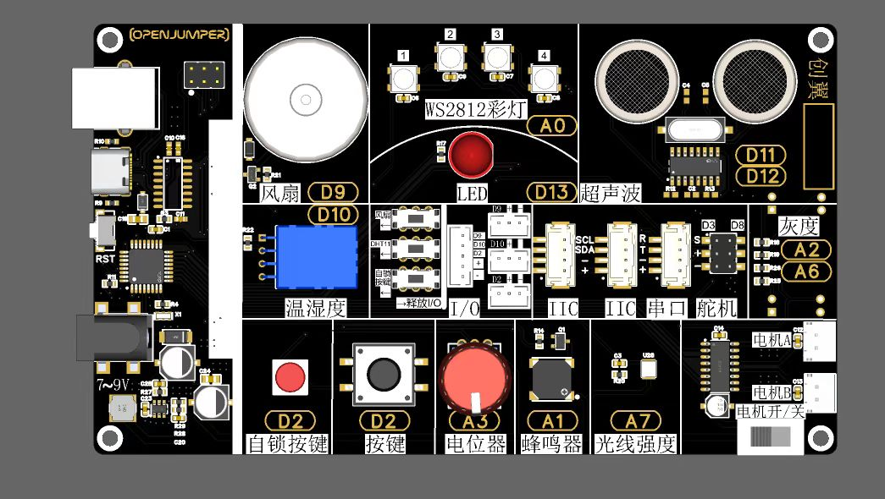
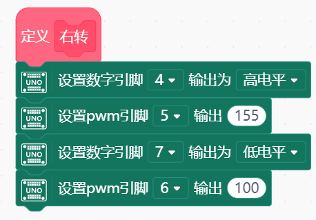

# 金牛创客板

## 产品简介

金牛创客板是一款基于Arduino开发的集成主板，其特点包括多个传感器、执行器、显示器以及输入/输出接口、传感器接口、通信接口等功能。该主板可用于许多应用场景，如机器人控制、智能家居等。

<table border="1">
<tr>
  <td align="center"></td>
  <td align="center"></td>
</tr>
</table>

## 产品参数

|名称|参数|
|--|--|
|型号|JN01|
|微控制器|ATmega328P|
|工作电压|5V|
|输入电压|7-9V|
|数字 I/O 引脚|14个（其中6个提供PWM输出）|
|PWM 数字 I/O 引脚|6个|
|模拟输入引脚|6个|
|每个 I/O 引脚的 DC 电流|20 mA|
|Flash内存|	32 KB（ATmega328P），其中0.5 KB可被用作bootloader|
|SRAM	|2 KB （ATmega328P）|
|EEPROM|	1 KB （ATmega328P）|
|时钟速率	|16MHz|
|尺寸	|145.1 mm * 84.2 mm|
|重量	|90 克|

## 主要功能

|数量|功能|接口|
|--|--|--|
|1个|LED红灯| D13|
|4个|2812RGB彩色灯| A0|
|1个|按钮 |D2|
|1个|自锁开关|D2|
|1个|旋钮电位器|A3|
|1个|DHT11温湿度传感器|D10|
|1个|光线传感器|A7|
|2路|个板载电机驱动|D4-D7|
|2路|灰度传感器|A2/A6|
|1个|超声波传感器|D11/D12|
|1个|蜂鸣器|A1|
|2路|舵机接口|D3/D8|
|1路|串口接口|
|2路|IIC接口|

*备注：该套件推荐使用mind+编程软件，以下示例基于mind+。*

## Mind+介绍及下载安装

1. 下载和安装Mind+软件在Mind+官方网站上下载和安装Mind+软件，并根据提示进行设置。（https://mindplus.cc/）

### 简介

Mind+是一款免费的图形化编程软件，可以帮助初学者和儿童更加轻松地学习和使用Arduino。它支持Arduino开发板、micro:bit、ESP8266等多种硬件平台，并提供了丰富的图形化编程模块。

### 步骤

#### 1. 下载和安装Mind+软件

在Mind+官方网站上下载和安装Mind+软件，并根据提示进行设置。（<https://mindplus.cc/>）

**安装软件**

Windows下安装

**1.1 - 下载软件**

在Mind+官网下载软件：<http://mindplus.cc>

下载Mind+软件到电脑中。

**1.2 - 双击安装包进行安装**

第一步可以选择语言，点击OK继续安装。

之后根据提示进行安装，待进度条走完即完成完成。这一步若出现问题请查看文末常见问题解决。

**1.3 - 安装驱动**

仅在第一次使用软件时需要安装驱动，如果安装不成功可以查看本页面后续的常见问题。
如果软件版本低于V1.6.0，则需要先在桌面图标上右键选择以管理员身份运行。

点击 **连接设备 > 一键安装串口驱动** ，之后根据提示操作确认安装即可。

如果出现如下提示说明已经安装过这个驱动，关闭即可。

#### 2. 连接Arduino开发板

将Arduino开发板通过USB线连接到计算机，并在Mind+软件中选择正确的串口和开发板类型。

#### 3. 创建项目并添加模块

创建一个新的Mind+项目，并从左下角扩展中选择主板型号，中择合适的模块，如DHT11温湿度传感器模块等。

#### 4. 拖拽程序语句并连接

我们可以在左侧的项目栏中选择我们所需要的语句，将其拖出，并使用正确的顺序连接在一起。

#### 5. 上传程序到Arduino开发板中

在Mind+软件中选择上传程序，将编写好的代码上传到Arduino开发板中。

#### 6. 调试和验证

通过串口监视器或其他调试工具，查看Arduino开发板输出的状态和信息，并根据需要进行调整和优化。

上传完成之后，我们可以通过打开串口，来观察主板连接的传感器的数据。

#### 7. 扩展和应用

利用Mind+提供的丰富模块和社区资源，扩展和优化您的项目，并应用到各种实际场景中。

## 应用示例

以下是一些使用金牛教育集成主板的应用示例：

### LED闪烁

LED灯珠是一种常见的光电器件，广泛应用于室内外照明、车载照明、数码产品、广告牌、游戏机等领域

### RGB彩灯应用

ws2812彩灯是一种智能数字LED灯，它可以通过数据线控制，实现各种颜色的显示效果。它是由三根电线（电源、地线和数据线）组成，这些电线可以连接到微控制器或其他设备上，以便通过编程来控制灯光的运行模式。

ws2812彩灯具有广泛的应用，例如：

家居装饰：ws2812彩灯可以用于家居装饰，例如安装在墙壁、天花板、橱柜等处，打造出独特的氛围和视觉效果。

舞台表演：ws2812彩灯可以用于舞台、演唱会等场合，为演出增添光彩夺目的效果。

商业展示：ws2812彩灯可以用于商业展示，例如商场、展厅、展览馆等，突出产品的亮点和特色。

在扩展页面选择显示器中的ws2812 RGB灯

### 普通按键与自锁开关的区别

普通按键是一种常用的电子元件，它通常用于控制数字信号的输入。当按下按钮时，电路中断，产生一个高电平或低电平的信号输出，松开按钮时信号变为相反的状态。

自锁开关也是一种常用的电子元件，它通常用于控制电路的开关。和普通按键不同的是，自锁开关可以在两个状态之间切换，并且保持其状态不变，直到再次操作。

因此，普通按键适合短暂性的控制应用，如触发器、游戏手柄等；而自锁开关适合长期性的控制应用，如电源开关、汽车门锁等。

### 旋钮电位器

旋钮电位器又称为可变电阻器，是一种电阻值可以通过旋转来改变的电子元件。在Arduino中，旋钮电位器通常用于控制模拟信号的大小，比如控制LED灯的亮度、直流电机的速度等。

### DHT11温湿度传感器测试

DHT11温湿度传感器是一种数字式温湿度传感器，能够通过单总线接口读取环境的温度和湿度数据。它由一个集成了传感器元件和电路的模块组成，广泛应用于温湿度监测、气象仪器、温室自动化控制、空调控制等领域。

在扩展页面的传感器页面，找到DHT11温湿度传感器并选中，

### 光线传感器

光敏电阻是一种基于光控原理的电子元件，它的电阻值会随着光照强度的变化而发生变化。光敏电阻通常由半导体材料制成，并且有不同的灵敏度和响应时间。

### 灰度传感器

灰度传感器是一种用于检测环境亮度的传感器，它能够通过捕捉光线的强度来获取物体表面的灰度值，通常灰度传感器可以用来制作巡线机器人。

### 超声波测距

超声波传感器是一种基于超声波原理的测距传感器，能够通过发射和接收超声波信号，来实现对目标物体距离的精确测量。

在扩展页面的传感器中，选择超声波测距传感器。

### 蜂鸣器

蜂鸣器是一种能够发出声音的电子元件，通常由振膜、震动器等部件组成。它可以通过输入电信号产生不同频率的声音。电机驱动案例

### 舵机驱动示例

在扩展页面的执行器中选择舵机模块，注意，我们所使用的舵机为180度舵机。

### 电机驱动示例

设置高电平时，车轮为正转，设置低电平是车轮为反转。

PWM引脚的作用是控制速度，如果我们用X来表示小车的速度，当电机正转时，我们需要在PWM输出中填入（255-X），当电机反转时，则直接填入X。

例：电机正转时，我们需要小车的速度为100，则我们需要在PWM的输出中填入（255-100）=155。电机反转时，也就是低电平，我们直接填入100即可。

## 综合应用示例

## 小车电机测试

首先我们选择函数栏，来分别定义5个函数 分别对应小车的前进、后退、左转、右转、停止

其中设置高电平时，车轮为正转，设置低电平是车轮为反转。

PWM引脚的作用是控制速度，如果我们用X来表示小车的速度，当电机正转时，我们需要在PWM输出中填入（255-X），当电机反转时，则直接填入X。

例：电机正转时，我们需要小车的速度为100，则我们需要在PWM的输出中填入（255-100）=155。电机反转时，也就是低电平，我们直接填入100即可。

 

设置好函数之后，可以在函数了看到我们自定义的几个函数模块，接下来只要直接调用此函数，就可以让小车按照你的要求去运动。

我们让小车依次按照前后左右停的顺序行动。

如果发现小车在行动的时候，有一侧的车轮方向是相反的，直接调换电机红黑线的顺序即可。

经过调整后，如果小车可以按照前前进、后退、左转、右转的顺序行动，说明接线没有问题，小车已经调试完成，可以进行接下来的实验了。

### 巡线小车

在已经定义好小车五种运动方式的情况下，我们可以直接通过程序定义小车巡线过程中的判断。

A6与A2是我们的灰度传感器，我们将使用灰度传感器完成我们的巡线功能。

通过测试，我们发现灰度传感器在黑线上的数值大概是160-200左右，所以当两个灰度传感器的数值都大于250或是都小于250的时候，就说明小车正在黑线上行驶或是黑线在两个灰度传感器之间。

当右侧的灰度传感器检测到黑线，而左侧并没有碰到时，说明小车向左偏离，我们就需要小车向右行驶，同理，当左侧灰度传感器检测到黑线时，就需要小车向左行驶。

### 避障小车

 
首先我们对于小车运动的定义函数还是不变。这次我们要通过避障传感器来控制小车的运动。

 
首先我们可以看到基础的判断逻辑和巡线小车区别不大，不同点就在于传感器的引脚不同。

其中最大的不同点在于，避障小车在三个传感器都检测到障碍物时，设置了一个倒退并转向的运动方式，这样就可以让小车有效的避免在障碍物前，来回移动的问题。

舵机复位及机械臂抓取

首先在安装机械臂的过程中，我们需要先复位机械臂的舵机部分。

我们将3号抬升舵机初始化设置为45度。

8号夹子舵机初始化设置为30度。

安装过程中需要对舵机及主板持续供电，避免角度偏移。

安装好机械臂之后，我们可以通过控制舵机的角度，来实现抓取的动作。

抓取的动作主要分为3步

第一步:

机械臂复位，台式舵机和夹子舵机均处于复位的位置。

第二步:

夹子舵机张开，抬升舵机降低，这一步可以让被夹取物体处于夹子的中间。

第三步：

夹子闭合抓紧物体，机械臂抬升完成抓取的动作。

## 常见问题

以下是一些常见问题及解答：

Q：为什么主板无法正常连接到计算机？

    A：请检查连接线是否正确连接、驱动程序是否安装正确等。

Q：连接舵机或者机械爪为何容易导致主板发热？

    A：当舵机承受超出其标称负载的压力时，它会试图继续旋转，这会导致电流急剧上升，从而使驱动电路产生大量热量，并可能导致主板发烫。
  
  所以在使用舵机的时候应防止发生堵转，使用机械爪时，根据需要进行适当的校准和调整。