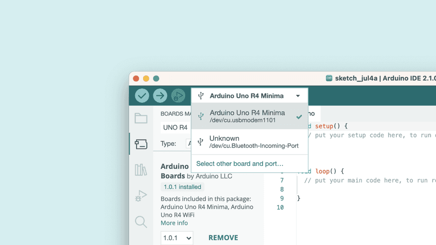

# Arduino UNO R4 Minima

<table border="1">
<tr>
  <td align="center"></td>
  <td align="center"></td>
  <td align="center"></td>
</tr>
<tr>
<td style="background-color:rgb(232,232,232,0.5) "colspan="3" align="center"> <a href="https://item.taobao.com/item.htm?id=728466241901"><font style="font-size:16px">Arduino UNO R4 Minima</font></a></td>
</tr>
</table>

## 简介

Arduino UNO R4 Minima是一款全新的开发板，它采用了Renesas的RA4M1微处理器，提供了更强的处理能力、更大的内存和更多的外设。它保持了UNO的标准尺寸和5V的工作电压，兼容现有的扩展板和配件。无论你是初学者还是资深的电子爱好者，这款强大而可靠的开发板都能让你的项目更加精彩。它还具有12位DAC、CAN总线、运算放大器等额外的板载外设，支持24V的输入电压范围，支持SWD调试和HID功能。Arduino UNO R4 Minima是你创新探索的完美伙伴。


## UNO R4 Minima特点

+ **与UNO形状兼容性：** UNO R4 Minima保持了与其前身UNO R3相同的形状、引脚排列和5V工作电压。这确保了现有扩展板和项目的无缝过渡，利用了已经为Arduino UNO建立的广泛而独特的生态系统。

+ **扩展的内存和更快的时钟：** 为更精确的计算和轻松处理复杂项目的能力做好准备。UNO R4 Minima 拥有更大的内存和更快的时钟速度，使您能够轻松处理要求苛刻的任务。

+ **额外的板载外设：** UNO R4 Minima引入了一系列板载外设，包括12位DAC、CAN总线和运算放大器。这些附件的组件为您提供了扩展能力和设计灵活性。

+ **扩展24V容差：** UNO R4 Minima现在支持更广泛的输入电压范围，允许高达24V的电源。这使得它能够无缝集成电机、LED灯带和其他执行器，通过使用单一电源简化您的项目。

+ **SWD连接器：** 调试是任何项目的关键方面。只需将外部调试器连接到UNO R4 Minima，轻松监视系统内部工作。保持控制并获得有价值的见解。

+ **HID支持：** UNO R4 Minima具有内置HID（人机接口设备）支持，使其能够在通过USB电缆连接到计算机时模拟鼠标或键盘。这个方便的功能使发送按键和鼠标移动到计算机变得轻而易举，增强了可用性和功能性。

准备好解锁Arduino UNO R4 Minima带来的无限可能性吧。它卓越的特点和增强的功能使它成为您创新探索的完美伙伴。

## 引脚接口说明


|微控制器||Renesas RA4M1 (Arm® Cortex®-M4)|
|--|--|--|
|USB|USB-C|编程端口|
|引脚|数字引脚|14|
||模拟引脚|6|
||DAC|1|
||PWM|6|
|通信接口|UART|1|
||I2C|1|
||SPI|1|
||CAN|1|
|电源|工作电压|	5V|
||外部供电电压|	6-24V|
||IO引脚输出电流|8ma|
|时钟速度|Main core|48MHz|
|存储|RA4M1|256kb Flash,32kb RAM|
|外形尺寸|长 * 宽 | 53.34mm*68.85mm|

## Arduino UNO R3 和 R4比较
|产品名称|Arduino Uno Rev 3|Arduino UNO R4 Minima |Arduino UNO R4 WiFi （预购）|
|--|--|--|--|
|微控制器|微芯片 ATmega328P （8 位 AVR RISC）|瑞萨电子 RA4M1（32 位 ARM Cortex-M4）|瑞萨电子 RA4M1（32 位 ARM Cortex-M4）|
|工作电压|5V|5V|5V|
|输入电压|7-9 V|6-20 V|6-20 V|
|数字 IO 引脚|14|14|14|
|PWM 数字 IO 引脚|6|6|6|
|模拟输入引脚|6|6|6|
|每个 I/O 引脚的直流电流|20毫安|8毫安|8毫安|
|时钟速度|16兆赫|48兆赫|48兆赫|
|闪存|32 KB|256 KB|256 KB|
|SRAM|2 KB|32 KB|32 KB|
|USB|USB-B|USB-C|USB-C|
|DAC（12 位）|–|1|1|
|SPI|1|2|2|
|I2C|1|2|2|
|CAN|–|1|1|
|运算放大器|–|1|1|
|SWD|–|1|1|
|RTC|–|–|1|
|Qwiic I2C connector|–|–|1|
|发光二极管矩阵|–|–|12*8（96 个红色指示灯）|

两款Arduino UNO R4板均采用瑞萨电子RA4M1处理器，采用Arm Cortex-M4架构，时钟频率提高至48MHz，内置32kB RAM和256kB闪存。板载外设非常丰富，包括12位DAC、CAN总线和运算放大器。工作电压仍为 5V，但输入电压范围已扩展到 24V，以适应更多的外部设备连接，例如多个电机、LED 灯条和驱动器。

此外，还增加了一个Qwiic连接器，以便于连接相应的传感器和附件。R4还支持HID功能，可以模拟鼠标，键盘甚至游戏控制器。USB连接接口已升级为广泛使用的USB-C接口。

Arduino UNO R4 Minima提高了时钟速度，增加了内存和存储空间，并增加了各种外设支持，并增加了输入电压功能，以满足各种外围设备的需求。

Arduino UNO R4 WiFi 搭载乐信科技的乐鑫 ESP32-S3 芯片，不仅提供 Wi-Fi 和蓝牙连接，还拥有时钟速度高达 240MHz 的强大微处理器、512kB 的 SRAM 和 384kB 的 ROM。此外，它还具有一个用于关闭开发板的OFF引脚，以及一个内置实时时钟（RTC）和一个用于为RTC供电的VRTC引脚。此外，R4 WiFi板具有12x8红色LED矩阵，可用于绘制图案或显示信息。

综上所述，Arduino UNO R4 WiFi 版本搭载乐鑫 S3 WiFi 模块，为创客、教育工作者和发烧友提供了拓展创意的机会。另一方面，Arduino UNO R4 Minima为那些寻求新微控制器而无需额外功能的人提供了一个经济实惠的选择。

## 快速使用教程

要使用Arduino UNO R4 Minima板，您需要安装UNO R4 Minima板包，该封装是瑞萨电子Arduino Core设备的一部分。

要安装它，您需要选择下载一个版本的Arduino IDE，您可以从Arduino软件页面下载。在本指南中，我们将使用最新版本的IDE2。

### 需要软件和硬件

+ Arduino UNO R4 Minima

+ Arduino IDE

### 下载并安装 IDE

1.首先，我们需要下载Arduino IDE

2.在本地计算机上安装 Arduino IDE。

3.打开 Arduino IDE。


### 安装板包

要安装主板软件包，请从左侧菜单中打开“主板管理器”。搜索 UNO R4 Minima并安装最新版本（或要使用的版本）。


您现在应该能够在电路板选择器中选择您的电路板。此时，您需要通过USB-C数据线将主板连接到计算机。



恭喜，您现在已经通过Arduino IDE成功安装了UNO R4 Minima板包。

### 编译和上传程序

要编译和上传程序，您可以使用：

+ 用于编译代码的复选标记。

+ 向右箭头上传代码。

UNO R4 Minima 板有几个示例可用，可以通过文件>示例，直接在 IDE 中打开这些示例。这些示例可以直接使用，无需外部库。


## 进阶教程

### Arduino UNO R4 Minima ADC 分辨率

您将学习如何更改Arduino UNO R4 Minima板上的模数转换器（ADC）。默认情况下，分辨率设置为 10 位，可以更新为 12 位 （0-4096） 和 14 位 （0-65355） 分辨率，以提高模拟读数的准确性。

**需要硬件和软件**

+ Arduino IDE

+ Arduino R4 Minima

+ [Arduino Renesas Core](https://github.com/arduino/ArduinoCore-renesas)

模数转换器（ADC）将模拟信号转换为数字信号。Arduino 板上的标准分辨率设置为 10 位 （0-1023）。UNO R4 Minima 支持高达 14 位的分辨率，可以从模拟信号中提供更精确的值。

要更新分辨率，您只需要使用 analogReadResolution（） 命令。

要使用它，只需将其包含在 中，然后用于从模拟引脚检索值。setup()analogRead()
```
void setup(){
  analogReadResolution(14); //change to 14-bit resolution
}

void loop(){
  int reading = analogRead(A3); // returns a value between 0-65355
}
```

### Arduino UNO R4 Minima CANbus例程

在本例程中，您将学习如何在Arduino UNO R4 Minima板上使用CAN控制器。CAN控制器嵌入在UNO R4 Minima的微控制器（RA4M1）中。CAN是一种主要用于汽车行业的串行协议。

请注意，CAN控制器需要外部收发器才能工作。本教程中提供了说明和硬件示例。

**目标**

+ 获取内置 CAN 库的概述
+ 了解如何将电路板连接到CAN收发器模块
+ 在两个 Arduino 板之间发送 CAN 报文

**需要硬件和软件**

+ Arduino IDE
+ Arduino R4 Minima
+ Arduino Renesas Core
+ CAN收发器模块*
+ 跳线

在本教程中，我们使用 SN65HVD230 分线模块。

**控制器局域网 （CAN）**

CAN总线使用两根电线：CAN高电平和CAN低电平。在Arduino UNO R4 Minima上，这些引脚是：

+ D5/CANRX0 （接收）
+ D4/CANTX0（传输）

但是，要与其他CAN设备通信，您需要一个收发器模块。在本教程中，我们将使用 SN65HVD230 分线。要连接它，您可以按照以下部分中提供的电路图进行操作。

在本教程中，我们将使用一个简单的示例，在两个UNO R4 Minima设备之间发送CAN报文。如果您愿意，您还可以将现有的CAN设备连接到UNO R4 Minima。

电路
要连接CAN收发器，请遵循下表和电路图：

|UNO R4 Minima|CAN收发器|
|--|--|
|D5 （CANRX0）	|CANRX|
|D4 （CANTX0）	|CANRX|
|5V	|VIN/VCC/5V|
|GND|GND|

然后，在CAN收发器之间，连接以下内容：

|CAN收发器 1|CAN收发器 2|
|--|--|
|CANH (HIGH)|	CANH (HIGH)|
|CANL (LOW)|	CANL (LOW)|

**代码示例**

以下代码示例需要上传到每个 UNO R4 Minima 板，一个将发送消息，一个将接收它。这些示例在瑞萨电子内核中可用，使用 Arduino IDE，您可以通过导航到 **CANWrite/CANRead > Arduino_CAN > File > Example** 来访问它们。

使用的库内置于核心中，因此如果您安装了核心，则无需安装库。

要初始化库，请使用 ，其中指定了 CAN 比特率。选择：CAN.begin(CanBitRate::BR_250k)

+ BR_125k （125000）
+ BR_250k （250000）
+ BR_500k （500000）
+ BR_1000k （1000000）

**可以写**

要发送CAN报文，您可以创建一个对象，该对象应包含、大小和报文数据。下面是有关如何创建此类对象的示例。CanMsgCAN_ID
```
uint8_t const msg_data[] = {0xCA,0xFE,0,0,0,0,0,0};
memcpy((void *)(msg_data + 4), &msg_cnt, sizeof(msg_cnt));
CanMsg msg(CAN_ID, sizeof(msg_data), msg_data);
```

在您制作了CAN报文后，我们可以使用该方法将其发送出去。以下示例创建一个 CAN 消息，该消息在每次执行时都会增加。CAN.write()void loop()
```C++
#include <Arduino_CAN.h>

static uint32_t const CAN_ID = 0x20;

void setup()
{
  Serial.begin(115200);
  while (!Serial) { }

  if (!CAN.begin(CanBitRate::BR_250k))
  {
    Serial.println("CAN.begin(...) failed.");
    for (;;) {}
  }
}

static uint32_t msg_cnt = 0;

void loop()
{
  /* Assemble a CAN message with the format of
   * 0xCA 0xFE 0x00 0x00 [4 byte message counter]
   */
  uint8_t const msg_data[] = {0xCA,0xFE,0,0,0,0,0,0};
  memcpy((void *)(msg_data + 4), &msg_cnt, sizeof(msg_cnt));
  CanMsg msg(CAN_ID, sizeof(msg_data), msg_data);

  /* Transmit the CAN message, capture and display an
   * error core in case of failure.
   */
  if (int const rc = CAN.write(msg); rc < 0)
  {
    Serial.print  ("CAN.write(...) failed with error code ");
    Serial.println(rc);
    for (;;) { }
  }

  /* Increase the message counter. */
  msg_cnt++;

  /* Only send one message per second. */
  delay(1000);
}
```

**可以读取**

要读取传入的CAN报文，请先使用检查数据是否可用，然后再使用来读取该报文。CAN.available()CAN.read()

```C++
#include <Arduino_CAN.h>

void setup()
{
  Serial.begin(115200);
  while (!Serial) { }

  if (!CAN.begin(CanBitRate::BR_250k))
  {
    Serial.println("CAN.begin(...) failed.");
    for (;;) {}
  }
}

void loop()
{
  if (CAN.available())
  {
    CanMsg const msg = CAN.read();
    Serial.println(msg);
  }
}
```
### Arduino UNO R4 Minima RTC 时钟例程

在本例程中，您将学习如何访问Arduino UNO R4 Minima板上的实时时钟（RTC）。RTC嵌入在UNO R4 Minima的微控制器（RA4M1）中。

**目标**

+ 设置 RTC 的开始日期
+ 以日历格式从RTC访问日期/时间。
+ 以 Unix 格式访问时间。

**需要硬件和软件**

+ Arduino IDE
+ Arduino R4 Minima
+ Arduino Renesas Core

**实时时钟**

UNO R4 Minima上的RTC可以使用瑞萨内核中包含的RTC库进行访问。该库允许您设置/获取时间以及使用警报来触发中断。

有许多使用 RTC 的实际示例，本页中提供的示例将帮助您开始使用它。

**设置时间**

```C++
RTCTime startTime(30, Month::JUNE, 2023, 13, 37, 00, DayOfWeek::WEDNESDAY, SaveLight::SAVING_TIME_ACTIVE)
```

```C++
RTC.setTime(startTime)
```

要设置 RTC 的开始时间，您可以创建一个对象。在这里，您可以指定日，月，年，小时，分钟，秒，并指定星期几以及夏令时模式。RTCTime

然后，若要设置时间，请使用该方法。setTime()

例：

```C++
#include "RTC.h"

void setup() {
  Serial.begin(9600);

  RTC.begin();
  
  RTCTime startTime(30, Month::JUNE, 2023, 13, 37, 00, DayOfWeek::WEDNESDAY, SaveLight::SAVING_TIME_ACTIVE);

  RTC.setTime(startTime);
}

void loop(){
}
```
**获取时间**

    RTC.getTime(currentTime)

要检索时间，我们需要创建一个对象，并使用该方法检索当前时间。RTCTimegetTime()

此示例设置并获取时间，并将其存储在名为 .RTCTimecurrentTime

```C++
#include "RTC.h"

void setup() {
  Serial.begin(9600);

  RTC.begin();
  
  RTCTime startTime(30, Month::JUNE, 2023, 13, 37, 00, DayOfWeek::WEDNESDAY, SaveLight::SAVING_TIME_ACTIVE);

  RTC.setTime(startTime);
}

void loop(){
RTCTime currentTime;

// Get current time from RTC
RTC.getTime(currentTime);
}
```

**打印日期和时间**

上面的例子展示了如何设置和获取时间并将其存储在对象中。可以通过一系列方法检索此数据：

+ getDayOfMonth()
+ getMonth()
+ getYear()
+ getHour()
+ getMinutes()
+ getSeconds()

下面的示例从对象打印出日期和时间。currentTime

```C++
#include "RTC.h"

void setup() {
  Serial.begin(9600);

  RTC.begin();
  
  RTCTime startTime(30, Month::JUNE, 2023, 13, 37, 00, DayOfWeek::WEDNESDAY, SaveLight::SAVING_TIME_ACTIVE);

  RTC.setTime(startTime);
}

void loop() {
  RTCTime currentTime;

  // Get current time from RTC
  RTC.getTime(currentTime);

  // Print out date (DD/MM//YYYY)
  Serial.print(currentTime.getDayOfMonth());
  Serial.print("/");
  Serial.print(Month2int(currentTime.getMonth()));
  Serial.print("/");
  Serial.print(currentTime.getYear());
  Serial.print(" - ");

  // Print time (HH/MM/SS)
  Serial.print(currentTime.getHour());
  Serial.print(":");
  Serial.print(currentTime.getMinutes());
  Serial.print(":");
  Serial.println(currentTime.getSeconds());

  delay(1000);
}
```
**Unix**

    currentTime.getUnixTime()

若要检索 Unix 时间戳，请使用该方法。getUnixTime()

```C++
#include "RTC.h"

void setup() {
  Serial.begin(9600);

  RTC.begin();
  
  RTCTime startTime(30, Month::JUNE, 2023, 13, 37, 00, DayOfWeek::WEDNESDAY, SaveLight::SAVING_TIME_ACTIVE);

  RTC.setTime(startTime);
}

void loop() {
  RTCTime currentTime;

  // Get current time from RTC
  RTC.getTime(currentTime);
  
  //Unix timestamp
  Serial.print("Unix timestamp: ");
  Serial.println(currentTime.getUnixTime());

  delay(1000);
}
```
**周期性中断**

定期中断允许您设置重复回调。

要使用它，您需要使用以下方法初始化定期回调：setPeriodicCallback()

    RTC.setPeriodicCallback(periodic_cbk, Period::ONCE_EVERY_2_SEC)

您还需要创建一个将调用的函数：

    void periodic_cbk() { code to be executed }

下面的示例每 2 秒闪烁一盏灯：

```C++
#include "RTC.h"

const int LED_ON_INTERRUPT  = 22;

void setup(){
  RTC.begin();
  if (!RTC.setPeriodicCallback(periodic_cbk, Period::ONCE_EVERY_2_SEC)) {
    Serial.println("ERROR: periodic callback not set");
  }
}

void loop() {
}

void periodic_cbk() {
  static bool clb_st = false;
  if(clb_st) {
    digitalWrite(LED_ON_INTERRUPT,HIGH);
  }
  else {
    digitalWrite(LED_ON_INTERRUPT,LOW);
  }
  clb_st = !clb_st;
 
  Serial.println("PERIODIC INTERRUPT");
}
```

可以使用以下枚举指定期间：

+ ONCE_EVERY_2_SEC
+ ONCE_EVERY_1_SEC
+ N2_TIMES_EVERY_SEC
+ N4_TIMES_EVERY_SEC
+ N8_TIMES_EVERY_SEC
+ N16_TIMES_EVERY_SEC
+ N32_TIMES_EVERY_SEC
+ N64_TIMES_EVERY_SEC
+ N128_TIMES_EVERY_SEC
+ N256_TIMES_EVERY_SEC

**告警回调**

RTC.setAlarmCallback(alarm_cbk, alarmtime, am)

```C++
#include "RTC.h"

void setup() {
  Serial.begin(9600);

  RTC.begin();

  RTCTime alarmtime;
  alarmtime.setSecond(35);

  AlarmMatch am;
  am.addMatchSecond();

  if (!RTC.setAlarmCallback(alarm_cbk, alarmtime, am)) {
    Serial.println("ERROR: alarm callback not set");
  }
}

void alarm_cbk() {
  Serial.println("ALARM INTERRUPT");
}
```

### Arduino UNO R4 Minima DAC例程

Arduino UNO R4 Minima具有内置DAC（数模转换器），用于将数字信号转换为模拟信号。此功能可用于构建大量有趣的音频项目，也可以用作专业实验室设备或廉价的函数发生器。

**目标**

+ 关于UNO R4 Minima上的DAC功能，
+ PWM和DAC技术之间的差异，
+ 如何生成波形（锯齿波），
+ 如何在压电扬声器上输出此波形。

**需要硬件和软件**

要按照本文进行操作，您将需要以下硬件：

+ Arduino UNO R4 Minima
+ 压电蜂鸣器
+ 电位计
+ 跳线

**电路**

本教程所需的电路如下图所示：

压电蜂鸣器连接到UNO R4


**模拟输出 VS.脉宽调制**

对于许多需要模拟输出的用例，使用PWM（脉宽调制）而不是真正的模拟输出将产生基本相同的结果。数字输出引脚只能完全导通（高电平）或完全关断（低电平），但通过非常快速地以精确的时序打开和关闭，可以控制平均电压并模拟模拟输出。这种方法称为PWM。

例如，在调光 LED 时，您可以自由使用 PWM 数字引脚作为模拟输出引脚，LED 的变暗效果与使用 DAC 输出相同。

然而，情况并非总是如此，对于许多用途，您需要使用真正的模拟输出才能获得所需的结果。其中一种情况是音频目的，其中PWM输出根本不会提供与真正的模拟输出相同的声音质量，并且首先需要一些摆弄才能工作。

**代码**

本教程的代码分为两部分，一部分是主程序，另一部分是包含预生成的锯齿波的头文件。

通过这个程序，我们预先生成了一个锯齿波。您也可以在程序开始时或期间动态生成它，但这样做会降低效率而不会获得任何性能。因此，走这条路是最佳做法。

波形作为样本存储在数组中，对于程序的每个循环，我们将DAC输出值更新为数组中的下一个值。

打开一个新程序并将以下代码粘贴到窗口中。
```C++
/*
  Simple Sawtooth Waveform generator with Arduino UNO R4 Minima

 */

#include "Waveforms.h"

#define oneHzSample 10000 / maxSamplesNum  // sample for the 1Hz signal expressed in microseconds


int i = 0;
int sample;


void setup() {
  analogWriteResolution(12);  // set the analog output resolution to 12 bit (4096 levels)
  analogReadResolution(12);  // set the analog input resolution to 12 bit (4096 levels)
}

void loop() {

  sample = map(analogRead(A5), 0, 4095, 0, 1000);

  analogWrite(DAC, waveformsTable[i]);  // write the selected waveform on DAC0

  i++;
  if (i == maxSamplesNum)  // Reset the counter to repeat the wave
    i = 0;

  delayMicroseconds(sample);  // Hold the sample value for the sample time
}
```

现在，您需要创建将保存波形的头文件。单击 Arduino IDE 窗口右上角的三个点，选择“新建选项卡”，并将新文件命名为“Waves.h”。

在 Arduino IDE 中创建新的头文件


然后将以下代码粘贴到空文件中。
```C++
#ifndef _Waveforms_h_
#define _Waveforms_h_

#define maxSamplesNum 120

static int waveformsTable[maxSamplesNum] = {

    0x22, 0x44, 0x66, 0x88, 0xaa, 0xcc, 0xee, 0x110, 0x132, 0x154,
    0x176, 0x198, 0x1ba, 0x1dc, 0x1fe, 0x220, 0x242, 0x264, 0x286, 0x2a8,
    0x2ca, 0x2ec, 0x30e, 0x330, 0x352, 0x374, 0x396, 0x3b8, 0x3da, 0x3fc,
    0x41e, 0x440, 0x462, 0x484, 0x4a6, 0x4c8, 0x4ea, 0x50c, 0x52e, 0x550,
    0x572, 0x594, 0x5b6, 0x5d8, 0x5fa, 0x61c, 0x63e, 0x660, 0x682, 0x6a4,
    0x6c6, 0x6e8, 0x70a, 0x72c, 0x74e, 0x770, 0x792, 0x7b4, 0x7d6, 0x7f8,
    0x81a, 0x83c, 0x85e, 0x880, 0x8a2, 0x8c4, 0x8e6, 0x908, 0x92a, 0x94c,
    0x96e, 0x990, 0x9b2, 0x9d4, 0x9f6, 0xa18, 0xa3a, 0xa5c, 0xa7e, 0xaa0,
    0xac2, 0xae4, 0xb06, 0xb28, 0xb4a, 0xb6c, 0xb8e, 0xbb0, 0xbd2, 0xbf4,
    0xc16, 0xc38, 0xc5a, 0xc7c, 0xc9e, 0xcc0, 0xce2, 0xd04, 0xd26, 0xd48,
    0xd6a, 0xd8c, 0xdae, 0xdd0, 0xdf2, 0xe14, 0xe36, 0xe58, 0xe7a, 0xe9c,
    0xebe, 0xee0, 0xf02, 0xf24, 0xf46, 0xf68, 0xf8a, 0xfac, 0xfce, 0xff0
  

};

#endif
```

**测试出来**

将代码上传到电路板后，它应该开始在DAC上产生锯齿波振荡，根据频率，该振荡可用于在压电蜂鸣器或扬声器上产生声音。如果您手头有示波器，将其探头连接到DAC输出可能是一个有趣的练习，所以看看波是什么样子的。

现在尝试扭转电位计，听听声音如何变化。

### Arduino UNO R4 Minima EEPROM例程

在本例程中，您将学习如何访问Arduino UNO R4 Minima板上的EEPROM（内存）。EEPROM嵌入在UNO R4 Minima的微控制器（RA4M1）中。

**目标**

+ 写入EEPROM存储器，

+ 从EEPROM存储器读取。

**需要硬件和软件**

+ Arduino IDE
+ Arduino R4 Minima
+ Arduino Renesas Core

**EEPROM**

电子可擦除可编程只读存储器（EEPROM）是一种存储器，可用于存储断电后可检索的数据。此内存可以有效地在运行时用于记录数据，这些数据可用于在系统重新联机时重新初始化。

写入EEPROM存储器时，我们指定两个参数：地址和值。每个字节可以保存一个介于 0-255 之间的值。

    EEPROM.write(0,15); //writes the value 15 to the first byte

我们正在将值 写入内存中可用的第一个字节 .150

要读取此内存的值，我们只需使用：

    EEPROM.read(0); //reads first byte

使用 EEPROM 时还有几种可用的方法，您可以在 EEPROM 指南中阅读更多相关信息。

请注意：EEPROM是一种写入周期有限的存储器。写入此内存时要小心，因为可能会显著缩短此内存的寿命。

**EEPROM 写入**

有关如何写入EEPROM的最小示例可以在下面找到：

```C++
#include <EEPROM.h>

int addr = 0;
byte value = 100; 

void setup() {
  EEPROM.write(addr, val);
}
void loop(){ 
}
```
**EEPROM 读取**

有关如何从EEPROM读取的最小示例可以在下面找到：

```C++
#include <EEPROM.h>

int address = 0;
byte value;

void setup() {
  Serial.begin(9600);
  value = EEPROM.read(addr);
  while (!Serial) {
    ;
  }

  Serial.print("Address 0: ");
  Serial.println(addr);
}

void loop() {
}
```

### Arduino UNO R4 Minima USB HID例程

在本例程中，您将学习如何使用带有键盘和鼠标 API 的 Arduino UNO R4 Minima 板模拟鼠标/键盘。

此功能可用于创建游戏控制器、键盘扩展或其他 HID 设备。

**目标**

+ 学习如何模拟键盘（按键），
+ 了解如何模拟鼠标（x，y 坐标）。

**需要硬件和软件**

+ Arduino IDE
+ Arduino R4 Minima
+ Arduino Renesas Core

**人机接口设备 （HID）**

人机接口设备 （HID） 是为人类设计的设备（键盘、鼠标、游戏控制器等），经常通过 USB 将数据发送到计算机。当您按下键盘上的某个键时，您将数据发送到计算机，计算机会读取数据并进而激活相应的键。

UNO R4 Minima 内置了对 HID 的支持，这是大多数现代开发板上的功能，但在以前的 UNO 修订版中没有。

若要将主板转换为 HID，可以使用内核中内置的键盘/鼠标 API。

**键盘**

要使用键盘功能，我们需要在程序的顶部包含库。Keyboard 类包含几个可用于模拟键盘的方法。

```C++
#include <Keyboard.h>

Keyboard.method()
```

**键盘示例**

要模拟键盘，我们可以使用 和 方法。这将模拟按键，以及释放按键。下面的示例每秒打印一个“w”。press()releaseAll()

```C++
#include <Keyboard.h>

void setup() {
  Keyboard.begin();
  delay(1000);
}

void loop() {
  Keyboard.press('w');
  delay(100);
  Keyboard.releaseAll();
  delay(1000); 
}
```

**鼠标**

要使用鼠标功能，我们需要在程序的顶部包含库。Mouse 类包含几个可用于模拟鼠标的方法。

```C++
#include <Mouse.h>

Mouse.method();
```

**鼠标示例**

下面的示例稍微来回移动鼠标的两个轴（10 磅）。
```C++
#include <Mouse.h>

void setup() {
  Mouse.begin();
  delay(1000);
}

void loop() {
  Mouse.move(10,10);
  delay(1000);
  Mouse.move(-10,-10);
  delay(1000); 
}
```

## FAQ

+ **我可以使用与Arduino UNO R3兼容的硬件与Arduino UNO R4 Minima一起使用？**

  + 可以，Arduino UNO R4 Minima是专门设计的，以确保与以前的扩展板和为Arduino UNO R3开发的兼容硬件兼容。UNO R4 Minima 保持相同的机械和电气兼容性，允许您将现有的扩展板和硬件与新板无缝使用。这样可以轻松升级到UNO R4 Minima，而无需对项目进行重大更改或调整。

+ **我能否在UNO R4 Minima中使用为UNO R3开发的程序？**

  + 可以，如果您的程序是使用Arduino API开发的。如果您正在使用仅适用于AVR架构的说明，则需要进行一些更改以确保兼容性。

+ **所有库是否都与UNO R3兼容，并且也与UNO R4 Minima兼容？**

  + 不是，一些UNO R3库使用AVR架构的指令与UNO R4 Minima的架构不兼容，但是有些库已经作为我们早期采用者计划的一部分移植或基于Arduino API。

## 参考资料

[芯片手册](https://docs.arduino.cc/resources/datasheets/ABX00080-datasheet.pdf?_gl=1*45zr7r*_ga*MTc5MjExMzY4Ny4xNjg4NDQxMzcy*_ga_NEXN8H46L5*MTY4OTA0MzMzNi4yLjEuMTY4OTA0NDkwNi4wLjAuMA..)


[原理图](https://docs.arduino.cc/resources/schematics/ABX00080-schematics.pdf?_gl=1*xgoz1z*_ga*MTc5MjExMzY4Ny4xNjg4NDQxMzcy*_ga_NEXN8H46L5*MTY4OTA0MzMzNi4yLjEuMTY4OTA0NDkwMi4wLjAuMA..)
