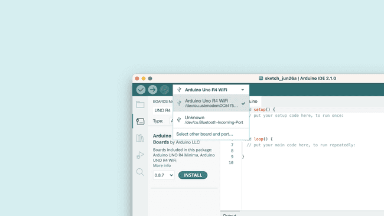

# Arduino UNO R4 WiFi

<table border="1">
<tr>
  <td align="center"></td>
  <td align="center"></td>
  <td align="center"></td>
</tr>
<tr>
<td style="background-color:rgb(232,232,232,0.5) "colspan="3" align="center"> <a href="https://item.taobao.com/item.htm?id=728466241901"><font style="font-size:16px">Arduino UNO R4 WiFi</font></a></td>
</tr>
</table>

## 简介

新的Arduino UNO R4 WiFi采用Renesas RA4M1（Arm Cortex®-M4）运行，速度为48MHz，比UNO R3快3倍。此外，SRAM从 R3 的2kB增加到32kB，闪存从32kB增加到256kB，以此来适应更复杂的项目。此外，根据Arduino社区的要求，USB端口升级为USB-C，并且最大电源供应电压增加到24V。该板提供了一个CAN总线，允许用户通过连接多个扩展板来最小化布线并执行不同的任务，最后，新板还包括一个12位模拟DAC。

该版本配备了Espressif S3 WiFi模块，为制造商、教育工作者和爱好者提供了更多的创意机会。

UNO R4为那些寻求新的微控制器而没有额外功能的人提供了一个划算的选择。

在UNO R3成功的基础上，UNO R4是所有人最好的原型和学习工具。在保留UNO系列已知的特性（标准外形系数、屏蔽兼容性、5V电压、鲁棒性）的同时，增加了新的功能。

由于其强大的设计和可靠的性能，UNO R4是对Arduino生态系统的一个有价值的补充。它适合初学者和有经验的电子爱好者用于部署它们自己的项目。

## 特征（UNO R4）

**硬件向后兼容性**

UNO R4保持了与Arduino UNO R3相同的引脚排布和5V工作电压。这意味着，现有的扩展板和项目可以轻松地移植到新的板子上。

**新的板载外设**

UNO R4板具有多个令人兴奋的新外设，包括12位DAC、CAN总线、运算放大器和SWD端口。这些新增加的外设扩展了开发者的可能性，使得更高级的项目成为可能。

**更多的内存和更快的时钟**

随着存储容量的增加（16倍）和时钟速度的提高（3倍），UNO R4 Minima可以执行更精确的计算并处理更复杂的项目。这使得制造商能够构建更复杂和先进的项目。

**通过USB-C进行人机交互设备通信**

UNO R4可以在连接到其USB-C端口时模拟鼠标或键盘，该功能使得制造者可以轻松地创建快速而酷炫的界面。

**较大的电压范围和电气稳定性**

UNO R4板可以使用高达24V的电源，这得益于其改进的热设计。电路设计中采用了多重保护措施，以降低不熟悉使用者的接线错误对板子或电脑造成的损坏风险。此外，RA4M1微控制器的引脚具有过流保护功能，可以提供额外的保护，防止错误发生。

**电容触摸支持**

UNO R4板上使用的RA4M1微控制器原生支持电容触摸。

## 特点（UNO R4 WiFi）

**具备WiFi和蓝牙功能**

UNO R4 WiFi具有ESP32-S3-MINI协处理器，可增强RA4M1微控制器的功能。具备WiFi和蓝牙连接功能，使得开发者可以轻松连接到互联网并创建物联网项目。

**板载12x8的LED矩阵**

UNO R4 WiFi板载了一个明亮的12x8红色LED矩阵（总共96个点）。该功能非常适合使用动画或绘制传感器数据的创意项目，无需任何额外的硬件。

**QwiicI2C连接器**

UNO R4 WiFi板上配备了一个行业标准的Qwiic I2C连接器，可方便快捷地进行原型设计。通过I2C连接，可以连接各种兼容模块，使得创客们可以轻松创建自定义项目并扩展UNO R4 WiFi的功能。

**运行时错误诊断**

UNO R4 WiFi板具有内置的错误捕捉机制，可以检测到可能导致板卡崩溃的操作，例如除以零。当检测到错误时，板卡会在串行监视器上打印出详细的错误说明和原因。

**支持电池供电的RTC**

UNO R4具有额外的引脚，可以关闭主微控制器，同时保持内部RTC由外部电池供电
特征(UNO R4 Minima)

**强大且价格合理**

UNO R4 Minima以具有竞争力的价格提供了令人印象深刻的性能。这款板子是一个特别实惠的选择，巩固了Arduino让高端技术普及化的承诺。

**SWD引脚用于调试**

板载的SWD端口为制造商提供了一种简单可靠的方式来连接第三方调试探针。这个特性确保了项目的可靠性，并允许高效地调试任何潜在问题。

## 技术参数

|微控制器||Renesas RA4M1 (Arm® Cortex®-M4)|
|--|--|--|
|USB|USB-C|编程端口|
|引脚|数字引脚|14|
||模拟引脚|6|
||DAC|1|
||PWM|6|
||外部中断|2，3|
|通信接口|UART|1|
||I2C|1|
||SPI|1|
||CAN|1|
|电源|工作电压|5V（内置esp32-s3 是3.3V）|
||外部供电电压|6-24V|
||IO引脚输出电流|8ma|
|时钟速度|Main core|48MHz|
||ESP32-S3|最高到240M|
|存储|RA4M1|256kb Flash,32kb RAM|
||ESP32-S3|384kb ROM,512kb SRAM|
|外形尺寸|长 * 宽|53.34mm*68.85mm|
		

## 引脚定义


## Arduino UNO R3 和 R4比较

|产品名称|Arduino Uno Rev 3|Arduino UNO R4 Minima |Arduino UNO R4 WiFi （预购）|
|--|--|--|--|
|微控制器|微芯片 ATmega328P （8 位 AVR RISC）|瑞萨电子 RA4M1（32 位 ARM Cortex-M4）|瑞萨电子 RA4M1（32 位 ARM Cortex-M4）|
|工作电压|5V|5V|5V|
|输入电压|7-9 V|6-20 V|6-20 V|
|数字 IO 引脚|14|14|14|
|PWM 数字 IO 引脚|6|6|6|
|模拟输入引脚|6|6|6|
|每个 I/O 引脚的直流电流|20毫安|8毫安|8毫安|
|时钟速度|16兆赫|48兆赫|48兆赫|
|闪存|32 KB|256 KB|256 KB|
|SRAM|2 KB|32 KB|32 KB|
|USB|USB-B|USB-C|USB-C|
|DAC（12 位）|–|1|1|
|SPI|1|2|2|
|I2C|1|2|2|
|CAN|–|1|1|
|运算放大器|–|1|1|
|SWD|–|1|1|
|RTC|–|–|1|
|Qwiic I2C connector|–|–|1|
|发光二极管矩阵|–|–|12*8（96 个红色指示灯）|

两款Arduino UNO R4板均采用瑞萨电子RA4M1处理器，采用Arm Cortex-M4架构，时钟频率提高至48MHz，内置32kB RAM和256kB闪存。板载外设非常丰富，包括12位DAC、CAN总线和运算放大器。工作电压仍为 5V，但输入电压范围已扩展到 24V，以适应更多的外部设备连接，例如多个电机、LED 灯条和驱动器。

此外，还增加了一个Qwiic连接器，以便于连接相应的传感器和附件。R4还支持HID功能，可以模拟鼠标，键盘甚至游戏控制器。USB连接接口已升级为广泛使用的USB-C接口。

Arduino UNO R4 Minima提高了时钟速度，增加了内存和存储空间，并增加了各种外设支持，并增加了输入电压功能，以满足各种外围设备的需求。

Arduino UNO R4 WiFi 搭载乐信科技的乐鑫 ESP32-S3 芯片，不仅提供 Wi-Fi 和蓝牙连接，还拥有时钟速度高达 240MHz 的强大微处理器、512kB 的 SRAM 和 384kB 的 ROM。此外，它还具有一个用于关闭开发板的OFF引脚，以及一个内置实时时钟（RTC）和一个用于为RTC供电的VRTC引脚。此外，R4 WiFi板具有12x8红色LED矩阵，可用于绘制图案或显示信息。

综上所述，Arduino UNO R4 WiFi 版本搭载乐鑫 S3 WiFi 模块，为创客、教育工作者和发烧友提供了拓展创意的机会。另一方面，Arduino UNO R4 Minima为那些寻求新微控制器而无需额外功能的人提供了一个经济实惠的选择。

## 快速使用教程

要使用Arduino UNO R4 WiFi板，您需要安装UNO R4 WiFi开发板，它是Arduino UNO R4 Core的一部分。

要安装它，您需要先安装Arduino IDE，您可以从Arduino官网下载。在此教程中我们将使用最新版本的 IDE 2。

### 需要软件和硬件

+ Arduino UNO R4 WiFi

+ Arduino IDE

### 下载并安装 IDE

首先，我们需要下载Arduino IDE

在本地计算机上安装 Arduino IDE。

打开 Arduino IDE。


安装板包

要安装主板软件包，请从左侧菜单中打开“开发板管理器”。搜索 UNO R4 WiFi 并安装最新版本（或您要使用的版本）。安装 UNO R4 WiFi 板包。


在电路板选择器中选择您的电路板。此时，您需要通过 USB-C数据线将主板连接到计算机。找到Arduino UNO R4 WiFi板。



### 编译和上传程序

要编译和上传程序，您可以使用：

+ 点击复选按键编译代码。

+ 点击向右箭头上传代码。

UNO R4 WiFi 开发板有几个示例，可通过文件>示例直接在 IDE 中访问这些示例。这些示例可以直接使用，无需外部库。


俄罗斯方块动画素描
UNO R4 WiFi预装了俄罗斯方块动画。如果您已覆盖该程序，但希望恢复俄罗斯方块动画，则可以到[Arduino官网](https://docs.arduino.cc/tutorials/uno-r4-wifi/r4-wifi-getting-started)找到改程序：


## 进阶教程

### Arduino UNO R4 WIFI ADC例程

您将学习如何更改Arduino UNO R4 WiFi板上的模数转换器（ADC）。默认情况下，分辨率设置为 10 位，可以更新为 12 位 （0-4096） 和 14 位 （0-16383） 分辨率，以提高模拟读数的准确性。

**需要硬件和软件**

+ Arduino IDE

+ Arduino R4 WiFi

+ Arduino Renesas Core

模数转换器（ADC）将模拟信号转换为数字信号。Arduino 板上的标准分辨率设置为 10 位 （0-1023）。UNO R4 WiFi 支持高达 14 位的分辨率，可以从模拟信号中提供更精确的值。

要更新分辨率，您只需要使用 analogReadResolution（） 命令。

要使用它，只需将其包含在 中，然后用于从模拟引脚检索值。setup()analogRead()

```C++
void setup(){
  analogReadResolution(14); //change to 14-bit resolution
}

void loop(){
  int reading = analogRead(A3); // returns a value between 0-16383
}
```
### 使用Arduino UNO R4 WIFI 板载LED矩阵

Arduino UNO R4 WiFi配备了内置的12x8 LED矩阵，可以编程以显示图形，动画，充当界面，甚至玩游戏。

矩阵及其API被开发为以几种不同的方式进行编程，每种方式都适用于不同的应用。本例程将引导您了解对 LED 矩阵进行编程的基本概念，并帮助您开始创建自己的动画，同时重点介绍处理 LED 以创建动画和图像的两种不同方法。这使您可以更轻松地决定哪种方法最适合您的需求！

**需要硬件和软件**

+ Arduino UNO R4 WiFi

+ UNO R4 Core（最新版本）

+ Arduino IDE

**初始化矩阵**

要使用 LED 矩阵库，需要将一些内容添加到您的程序中才能起步。

首先，在程序的顶部包含库，如下所示：

    #include "Arduino_LED_Matrix.h"

然后，您需要在程序中创建一个 LED 矩阵对象，方法是在第一条对象正下方添加以下行：

    ArduinoLEDMatrix matrix;

最后，通过在以下位置添加此行来启动 LED 矩阵：void setup()

    matrix.begin();

整个事情应该看起来像这样;
```C++
#include "Arduino_LED_Matrix.h"

ArduinoLEDMatrix matrix;

void setup() {
  Serial.begin(115200);
  matrix.begin();
}
```

**如何编写框架**

UNO R4 WiFi 的 LED 矩阵库的工作原理是创建一个帧，然后将其加载到显示帧的缓冲区中。

帧是我们所说的“图像”，在矩阵上的任何给定时刻显示。如果动画是一系列图像，则帧是该系列中的这些图像之一。

为了控制UNO R4 WiFi上的8x12 LED矩阵，您需要内存中至少为96位的空间。该库提供了两种方法来执行此操作。

第一种是简单地制作一个二维字节数组，如下所示：
```C++
byte frame[8][12] = {
  { 0, 0, 1, 1, 0, 0, 0, 1, 1, 0, 0, 0 },
  { 0, 1, 0, 0, 1, 0, 1, 0, 0, 1, 0, 0 },
  { 0, 1, 0, 0, 0, 1, 0, 0, 0, 1, 0, 0 },
  { 0, 0, 1, 0, 0, 0, 0, 0, 1, 0, 0, 0 },
  { 0, 0, 0, 1, 0, 0, 0, 1, 0, 0, 0, 0 },
  { 0, 0, 0, 0, 1, 0, 1, 0, 0, 0, 0, 0 },
  { 0, 0, 0, 0, 0, 1, 0, 0, 0, 0, 0, 0 },
  { 0, 0, 0, 0, 0, 0, 0, 0, 0, 0, 0, 0 }
};
```

此选项很容易理解，因为您可以在数组的模式中看到图像，并且在运行时很容易编辑。上面数组中的那些形成了一个心形，这就是你在屏幕上看到的图像。

要定位单个像素，请选择其地址并更改值，请注意，您需要从 0 开始计数。因此，以下行将定位左起第三个像素和顶部第二个像素，然后将其打开：

```C++
frame[2][1] = 1;

matrix.renderBitmap(frame, 8, 12);
```

但是，此方法占用的内存多于所需内存。即使每个 LED 只需要一个位来存储其状态，您使用的是 32 位（一个字节）。存储帧的内存效率更高的方法是使用 <> 位整数数组。

```C++
unsigned long frame[] = {
  0x3184a444,
  0x42081100,
  0xa0040000
};
```

无符号长变量可容纳 32 位，96/32 为 3，因此无符号长阵列是保存 LED 矩阵所需所有位的有效方法。

但是这些十六进制值与像素的位置有何关系？要找出答案，请将十六进制值转换为二进制值。下面是一个可以执行此操作的代码片段：

```C++
for (int b = 0; b < 3; b++) {
    Serial.println(frame[b], BIN);
  }
  ```

这将打印出数组的所有位值。输出将如下所示：

```C++
110001100001001010010001000100
1000010000010000001000100000000
10100000000001000000000000000000
```

但是，此方法不会显示所有位。每个数组元素应有 32 位。如果添加零以显示每个元素的所有 32 位，则得到：

```C++
00110001100001001010010001000100
01000010000010000001000100000000
10100000000001000000000000000000
```

现在把它分成 12 位的组，你就会重新得到心形图案：

```C++
001100011000
010010100100
010001000100
001000001000
000100010000
000010100000
000001000000
000000000000
```
提示：如果您通过按 CTRL/命令 + F 并搜索“1”突出显示页面上的所有“1”，您可以更轻松地看到心。

如果您有多个不同的框架，则可以像这样加载和显示它们：
```C++
const uint32_t happy[] = {
    0x19819,
    0x80000001,
    0x81f8000
};

const uint32_t heart[] = {
    0x3184a444,
    0x44042081,
    0x100a0040
};

  matrix.loadFrame(happy);
  delay(500);

  matrix.loadFrame(heart);
  delay(500);
```
**测试出来**

让我们应用这些概念，使用两个基本程序在您的板上显示不同的框架。首先，让我们创建 3x32 位整数帧并逐个加载它们。

这是一个程序，它将首先在您的矩阵上加载一个笑脸，然后将其更改为心形。
```C++
#include "Arduino_LED_Matrix.h"

ArduinoLEDMatrix matrix;

void setup() {
  Serial.begin(115200);
  matrix.begin();
}

const uint32_t happy[] = {
    0x19819,
    0x80000001,
    0x81f8000
};
const uint32_t heart[] = {
    0x3184a444,
    0x44042081,
    0x100a0040
};
  
void loop(){
  matrix.loadFrame(happy);
  delay(500);

  matrix.loadFrame(heart);
  delay(500);
}
```
程序非常简单，但结果非常富有表现力，可以帮助您轻松指示项目的状态。

现在，让我们更改方法并创建一个在运行时更改的位图。此程序包括几个功能，每个功能绘制脸部的一部分，然后通过关闭某些像素来眨眼左眼。
```C++
#include "Arduino_LED_Matrix.h"

ArduinoLEDMatrix matrix;

void setup() {
  Serial.begin(115200);
  matrix.begin();
}

uint8_t frame[8][12] = {
  { 0, 0, 0, 0, 0, 0, 0, 0, 0, 0, 0, 0 },
  { 0, 0, 0, 0, 0, 0, 0, 0, 0, 0, 0, 0 },
  { 0, 0, 0, 0, 0, 0, 0, 0, 0, 0, 0, 0 },
  { 0, 0, 0, 0, 0, 0, 0, 0, 0, 0, 0, 0 },
  { 0, 0, 0, 0, 0, 0, 0, 0, 0, 0, 0, 0 },
  { 0, 0, 0, 0, 0, 0, 0, 0, 0, 0, 0, 0 },
  { 0, 0, 0, 0, 0, 0, 0, 0, 0, 0, 0, 0 },
  { 0, 0, 0, 0, 0, 0, 0, 0, 0, 0, 0, 0 }
};

void leftEye(){
  //Left eye
  frame[1][3] = 1;
  frame[1][4] = 1;
  frame[2][3] = 1;
  frame[2][4] = 1;
}

void wink(){
  //Wink with the left eye
  frame[1][3] = 0;
  frame[1][4] = 0;
  frame[2][3] = 1;
  frame[2][4] = 1;
}

void rightEye(){
  //Right eye
  frame[1][8] = 1;
  frame[1][9] = 1;
  frame[2][8] = 1;
  frame[2][9] = 1;
}

void mouth(){
  //Mouth
  frame[5][3] = 1;
  frame[5][9] = 1;
  frame[6][3] = 1;
  frame[6][4] = 1;
  frame[6][5] = 1;
  frame[6][6] = 1;
  frame[6][7] = 1;
  frame[6][8] = 1;
  frame[6][9] = 1;
}

void loop(){
leftEye();
rightEye();
mouth();

matrix.renderBitmap(frame, 8, 12);

delay(1000);
wink();

matrix.renderBitmap(frame, 8, 12);
delay(1000);
}
```

**动画生成**

Arduino官方开发了一种工具，用于生成要在浏览器中的 LED 矩阵上渲染的帧和动画。

[单击此处](https://ledmatrix-editor.arduino.cc/)转到 LED 矩阵工具。

制作完动画之后，你可以按照前面讨论过的格式，从工具中导出它们。

您可以在其网站上找到有关如何使用此工具的更多提示。


### Arduino UNO R4 WIFI RTC使用

在本例程中，您将学习如何访问Arduino UNO R4 WiFi板上的实时时钟（RTC）。RTC嵌入在UNO R4 WiFi的微控制器（RA4M1）中。

**该例程目标是：**

+ 设置 RTC 的开始日期
+ 以日历格式从RTC访问日期/时间。
+ 以 Unix 格式访问时间。

**需要硬件和软件**

+ Arduino IDE
+ Arduino UNO R4 WiFi
+ Arduino Renesas Core

**实时时钟**

UNO R4 WiFi上的RTC可以使用瑞萨电子内核中包含的RTC库进行访问。该库允许您设置/获取时间以及使用警报来触发中断。

    UNO R4 WiFi 具有一个 VRTC 引脚，用于保持板载 RTC 运行，即使在电路板电源被切断时也是如此。为此，请向VRTC引脚施加1.6 - 3.6 V范围内的电压。

**设置时间**

+ RTCTime startTime(30, Month::JUNE, 2023, 13, 37, 00, DayOfWeek::WEDNESDAY, SaveLight::SAVING_TIME_ACTIVE)

+ RTC.setTime(startTime)

要设置 RTC 的开始时间，您可以创建一个对象。在这里，您可以指定日，月，年，小时，分钟，秒，并指定星期几以及夏令时模式。RTCTime

然后，若要设置时间，请使用该方法。setTime()

例：
```C++
#include "RTC.h"

void setup() {
  Serial.begin(9600);

  RTC.begin();
  
  RTCTime startTime(30, Month::JUNE, 2023, 13, 37, 00, DayOfWeek::WEDNESDAY, SaveLight::SAVING_TIME_ACTIVE);

  RTC.setTime(startTime);
}

void loop(){
}
```

**获取时间**

+ RTC.getTime(currentTime)

要检索时间，我们需要创建一个对象，并使用该方法检索当前时间。RTCTimegetTime()

此示例设置并获取时间，并将其存储在名为 .RTCTimecurrentTime
```C++
#include "RTC.h"

void setup() {
  Serial.begin(9600);

  RTC.begin();
  
  RTCTime startTime(30, Month::JUNE, 2023, 13, 37, 00, DayOfWeek::WEDNESDAY, SaveLight::SAVING_TIME_ACTIVE);

  RTC.setTime(startTime);
}

void loop(){
RTCTime currentTime;

// Get current time from RTC
RTC.getTime(currentTime);
}
```

**打印日期和时间**

上面的例子展示了如何设置和获取时间并将其存储在对象中。可以通过一系列方法检索此数据：

+ getDayOfMonth()
+ getMonth()
+ getYear()
+ getHour()
+ getMinutes()
+ getSeconds()

下面的示例从对象打印出日期和时间。currentTime
```C++
#include "RTC.h"

void setup() {
  Serial.begin(9600);

  RTC.begin();
  
  RTCTime startTime(30, Month::JUNE, 2023, 13, 37, 00, DayOfWeek::WEDNESDAY, SaveLight::SAVING_TIME_ACTIVE);

  RTC.setTime(startTime);
}

void loop() {
  RTCTime currentTime;

  // Get current time from RTC
  RTC.getTime(currentTime);

  // Print out date (DD/MM//YYYY)
  Serial.print(currentTime.getDayOfMonth());
  Serial.print("/");
  Serial.print(Month2int(currentTime.getMonth()));
  Serial.print("/");
  Serial.print(currentTime.getYear());
  Serial.print(" - ");

  // Print time (HH/MM/SS)
  Serial.print(currentTime.getHour());
  Serial.print(":");
  Serial.print(currentTime.getMinutes());
  Serial.print(":");
  Serial.println(currentTime.getSeconds());

  delay(1000);
}
```

**Unix**

+ currentTime.getUnixTime()

若要检索 Unix 时间戳，请使用该方法。getUnixTime()
```C++
#include "RTC.h"

void setup() {
  Serial.begin(9600);

  RTC.begin();
  
  RTCTime startTime(30, Month::JUNE, 2023, 13, 37, 00, DayOfWeek::WEDNESDAY, SaveLight::SAVING_TIME_ACTIVE);

  RTC.setTime(startTime);
}

void loop() {
  RTCTime currentTime;

  // Get current time from RTC
  RTC.getTime(currentTime);
  
  //Unix timestamp
  Serial.print("Unix timestamp: ");
  Serial.println(currentTime.getUnixTime());

  delay(1000);
}
```

**周期性中断**

定期中断允许您设置重复回调。

要使用它，您需要使用以下方法初始化定期回调：setPeriodicCallback()

+ RTC.setPeriodicCallback(periodic_cbk, Period::ONCE_EVERY_2_SEC)

您还需要创建一个将调用的函数：

+ void periodic_cbk() { code to be executed }

下面的示例每 2 秒闪烁一盏灯：
```C++
#include "RTC.h"

const int LED_ON_INTERRUPT  = 22;

void setup(){
  RTC.begin();
  if (!RTC.setPeriodicCallback(periodic_cbk, Period::ONCE_EVERY_2_SEC)) {
    Serial.println("ERROR: periodic callback not set");
  }
}

void loop() {
}

void periodic_cbk() {
  static bool clb_st = false;
  if(clb_st) {
    digitalWrite(LED_ON_INTERRUPT,HIGH);
  }
  else {
    digitalWrite(LED_ON_INTERRUPT,LOW);
  }
  clb_st = !clb_st;
 
  Serial.println("PERIODIC INTERRUPT");
}
```

可以使用以下枚举指定期间：

+ ONCE_EVERY_2_SEC
+ ONCE_EVERY_1_SEC
+ N2_TIMES_EVERY_SEC
+ N4_TIMES_EVERY_SEC
+ N8_TIMES_EVERY_SEC
+ N16_TIMES_EVERY_SEC
+ N32_TIMES_EVERY_SEC
+ N64_TIMES_EVERY_SEC
+ N128_TIMES_EVERY_SEC
+ N256_TIMES_EVERY_SEC

**告警回调**

+ RTC.setAlarmCallback(alarm_cbk, alarmtime, am)

```C++
#include "RTC.h"

void setup() {
  Serial.begin(9600);

  RTC.begin();

  RTCTime alarmtime;
  alarmtime.setSecond(35);

  AlarmMatch am;
  am.addMatchSecond();

  if (!RTC.setAlarmCallback(alarm_cbk, alarmtime, am)) {
    Serial.println("ERROR: alarm callback not set");
  }
}

void alarm_cbk() {
  Serial.println("ALARM INTERRUPT");
}
```

### Arduino UNO R4 WIFI USB HID例程

在本例程中，您将学习如何使用带有键盘和鼠标API的Arduino UNO R4 WiFi板模拟鼠标/键盘。
此功能可用于创建游戏控制器、键盘扩展或其他 HID 设备。

**需要硬件和软件**
+ Arduino IDE
+ Arduino UNO R4 WiFi
+ Arduino Renesas Core

**人机接口设备 （HID）**

人机接口设备 （HID） 是为人类设计的设备（键盘、鼠标、游戏控制器等），经常通过 USB 将数据发送到计算机。当您按下键盘上的某个键时，您将数据发送到计算机，计算机会读取数据并进而激活相应的键。

UNO R4 WiFi 内置了对 HID 的支持，这是大多数现代开发板上的功能，但在以前的 UNO 修订版中没有。

若要将主板转换为 HID，可以使用内核中内置的键盘/鼠标 API。

**键盘**

要使用键盘功能，我们需要在程序的顶部包含库。Keyboard 类包含几个可用于模拟键盘的方法。

```C++
#include <Keyboard.h>

Keyboard.method()
```
**键盘示例**

要模拟键盘，我们可以使用 和 方法。这将模拟按键，以及释放按键。下面的示例每秒打印一个“w”。press()releaseAll()

```C++
#include <Keyboard.h>

void setup() {
  Keyboard.begin();
  delay(1000);
}

void loop() {
  Keyboard.press('w');
  delay(100);
  Keyboard.releaseAll();
  delay(1000); 
}
```
**鼠标**

要使用鼠标功能，我们需要在程序的顶部包含库。Mouse 类包含几个可用于模拟鼠标的方法。
```C++
#include <Mouse.h>

Mouse.method();
```
**鼠标示例**

下面的示例稍微来回移动鼠标的两个轴（10 磅）。

```C++
#include <Mouse.h>

void setup() {
  Mouse.begin();
  delay(1000);
}

void loop() {
  Mouse.move(10,10);
  delay(1000);
  Mouse.move(-10,-10);
  delay(1000); 
}
```

### Arduino UNO R4 WIFI  网络示例

Arduino UNO R4 WiFi 内置 ESP32-S3 模块，可让您连接到 Wi-Fi® 网络并执行网络操作。包括HTTPS，MQTT，UDP在内的协议已经过测试和支持，在本文中，您将找到许多可以帮助您入门的示例。

Wi-Fi®支持通过Arduino UNO R4 Core附带的内置库启用。安装核心会自动安装库。WiFiS3WiFiS3


将电路板连接到互联网的最简单方法是通过Arduino物联网云平台。在这里，您可以配置、编程、监控和同步您的设备，而无需编写任何网络代码。

**需要硬件和软件**

+ Arduino UNO R4 WiFi
+ Arduino IDE

**例子**

本例程中列出的示例已经过测试和验证，可以正常工作。大多数示例要求您输入本地 Wi-Fi® 网络的和。作为标准做法，在我们的所有示例中，我们将其存储在单独的头文件（称为 ）中。SSIDPASSWORDarduino_secrets.h

您需要创建此文件，或删除每个示例顶部的文件。该文件应包含：#include "arduino_secrets.h"
```C++
//arduino_secrets.h header file
#define SECRET_SSID "yournetwork"
#define SECRET_PASS "yourpassword"
```
将网络和密码存储在单独的文件中可以最大程度地降低意外共享Wi-Fi®凭据的风险。

**接入点**
```C++
/*
  WiFi Web Server LED Blink

  A simple web server that lets you blink an LED via the web.
  This sketch will create a new access point (with no password).
  It will then launch a new server and print out the IP address
  to the Serial Monitor. From there, you can open that address in a web browser
  to turn on and off the LED on pin 13.

  If the IP address of your board is yourAddress:
    http://yourAddress/H turns the LED on
    http://yourAddress/L turns it off

  created 25 Nov 2012
  by Tom Igoe
  adapted to WiFi AP by Adafruit
 */

#include "WiFiS3.h"

#include "arduino_secrets.h" 

///////please enter your sensitive data in the Secret tab/arduino_secrets.h
char ssid[] = SECRET_SSID;        // your network SSID (name)
char pass[] = SECRET_PASS;        // your network password (use for WPA, or use as key for WEP)
int keyIndex = 0;                 // your network key index number (needed only for WEP)

int led =  LED_BUILTIN;
int status = WL_IDLE_STATUS;
WiFiServer server(80);

void setup() {
  //Initialize serial and wait for port to open:
  Serial.begin(9600);
  while (!Serial) {
    ; // wait for serial port to connect. Needed for native USB port only
  }
  Serial.println("Access Point Web Server");

  pinMode(led, OUTPUT);      // set the LED pin mode

  // check for the WiFi module:
  if (WiFi.status() == WL_NO_MODULE) {
    Serial.println("Communication with WiFi module failed!");
    // don't continue
    while (true);
  }

  String fv = WiFi.firmwareVersion();
  if (fv < WIFI_FIRMWARE_LATEST_VERSION) {
    Serial.println("Please upgrade the firmware");
  }

  // by default the local IP address will be 192.168.4.1
  // you can override it with the following:
  WiFi.config(IPAddress(192,48,56,2));

  // print the network name (SSID);
  Serial.print("Creating access point named: ");
  Serial.println(ssid);

  // Create open network. Change this line if you want to create an WEP network:
  status = WiFi.beginAP(ssid, pass);
  if (status != WL_AP_LISTENING) {
    Serial.println("Creating access point failed");
    // don't continue
    while (true);
  }

  // wait 10 seconds for connection:
  delay(10000);

  // start the web server on port 80
  server.begin();

  // you're connected now, so print out the status
  printWiFiStatus();
}


void loop() {
  
  // compare the previous status to the current status
  if (status != WiFi.status()) {
    // it has changed update the variable
    status = WiFi.status();

    if (status == WL_AP_CONNECTED) {
      // a device has connected to the AP
      Serial.println("Device connected to AP");
    } else {
      // a device has disconnected from the AP, and we are back in listening mode
      Serial.println("Device disconnected from AP");
    }
  }
  
  WiFiClient client = server.available();   // listen for incoming clients

  if (client) {                             // if you get a client,
    Serial.println("new client");           // print a message out the serial port
    String currentLine = "";                // make a String to hold incoming data from the client
    while (client.connected()) {            // loop while the client's connected
      delayMicroseconds(10);                // This is required for the Arduino Nano RP2040 Connect - otherwise it will loop so fast that SPI will never be served.
      if (client.available()) {             // if there's bytes to read from the client,
        char c = client.read();             // read a byte, then
        Serial.write(c);                    // print it out to the serial monitor
        if (c == '\n') {                    // if the byte is a newline character

          // if the current line is blank, you got two newline characters in a row.
          // that's the end of the client HTTP request, so send a response:
          if (currentLine.length() == 0) {
            // HTTP headers always start with a response code (e.g. HTTP/1.1 200 OK)
            // and a content-type so the client knows what's coming, then a blank line:
            client.println("HTTP/1.1 200 OK");
            client.println("Content-type:text/html");
            client.println();

            // the content of the HTTP response follows the header:
            client.print("<p style=\"font-size:7vw;\">Click <a href=\"/H\">here</a> turn the LED on<br></p>");
            client.print("<p style=\"font-size:7vw;\">Click <a href=\"/L\">here</a> turn the LED off<br></p>");

            // The HTTP response ends with another blank line:
            client.println();
            // break out of the while loop:
            break;
          }
          else {      // if you got a newline, then clear currentLine:
            currentLine = "";
          }
        }
        else if (c != '\r') {    // if you got anything else but a carriage return character,
          currentLine += c;      // add it to the end of the currentLine
        }

        // Check to see if the client request was "GET /H" or "GET /L":
        if (currentLine.endsWith("GET /H")) {
          digitalWrite(led, HIGH);               // GET /H turns the LED on
        }
        if (currentLine.endsWith("GET /L")) {
          digitalWrite(led, LOW);                // GET /L turns the LED off
        }
      }
    }
    // close the connection:
    client.stop();
    Serial.println("client disconnected");
  }
}

void printWiFiStatus() {
  // print the SSID of the network you're attached to:
  Serial.print("SSID: ");
  Serial.println(WiFi.SSID());

  // print your WiFi shield's IP address:
  IPAddress ip = WiFi.localIP();
  Serial.print("IP Address: ");
  Serial.println(ip);

  // print where to go in a browser:
  Serial.print("To see this page in action, open a browser to http://");
  Serial.println(ip);

}
```

**与 WPA 连接**

```C++
/*
 This example connects to an unencrypted WiFi network.
 Then it prints the MAC address of the WiFi module,
 the IP address obtained, and other network details.

 created 13 July 2010
 by dlf (Metodo2 srl)
 modified 31 May 2012
 by Tom Igoe
 */
#include <WiFiS3.h>

#include "arduino_secrets.h" 
///////please enter your sensitive data in the Secret tab/arduino_secrets.h
char ssid[] = SECRET_SSID;        // your network SSID (name)
char pass[] = SECRET_PASS;    // your network password (use for WPA, or use as key for WEP)
int status = WL_IDLE_STATUS;     // the WiFi radio's status

void setup() {
  //Initialize serial and wait for port to open:
  Serial.begin(9600);
  while (!Serial) {
    ; // wait for serial port to connect. Needed for native USB port only
  }

  // check for the WiFi module:
  if (WiFi.status() == WL_NO_MODULE) {
    Serial.println("Communication with WiFi module failed!");
    // don't continue
    while (true);
  }

  String fv = WiFi.firmwareVersion();
  if (fv < WIFI_FIRMWARE_LATEST_VERSION) {
    Serial.println("Please upgrade the firmware");
  }

  // attempt to connect to WiFi network:
  while (status != WL_CONNECTED) {
    Serial.print("Attempting to connect to WPA SSID: ");
    Serial.println(ssid);
    // Connect to WPA/WPA2 network:
    status = WiFi.begin(ssid, pass);

    // wait 10 seconds for connection:
    delay(10000);
  }

  // you're connected now, so print out the data:
  Serial.print("You're connected to the network");
  printCurrentNet();
  printWifiData();

}

void loop() {
  // check the network connection once every 10 seconds:
  delay(10000);
  printCurrentNet();
}

void printWifiData() {
  // print your board's IP address:
  IPAddress ip = WiFi.localIP();
  Serial.print("IP Address: ");
  
  Serial.println(ip);

  // print your MAC address:
  byte mac[6];
  WiFi.macAddress(mac);
  Serial.print("MAC address: ");
  printMacAddress(mac);
}

void printCurrentNet() {
  // print the SSID of the network you're attached to:
  Serial.print("SSID: ");
  Serial.println(WiFi.SSID());

  // print the MAC address of the router you're attached to:
  byte bssid[6];
  WiFi.BSSID(bssid);
  Serial.print("BSSID: ");
  printMacAddress(bssid);

  // print the received signal strength:
  long rssi = WiFi.RSSI();
  Serial.print("signal strength (RSSI):");
  Serial.println(rssi);

  // print the encryption type:
  byte encryption = WiFi.encryptionType();
  Serial.print("Encryption Type:");
  Serial.println(encryption, HEX);
  Serial.println();
}

void printMacAddress(byte mac[]) {
  for (int i = 5; i >= 0; i--) {
    if (mac[i] < 16) {
      Serial.print("0");
    }
    Serial.print(mac[i], HEX);
    if (i > 0) {
      Serial.print(":");
    }
  }
  Serial.println();
}
```

**扫描网络**
```C++
/*
 This example  prints the board's MAC address, and
 scans for available WiFi networks using the NINA module.
 Every ten seconds, it scans again. It doesn't actually
 connect to any network, so no encryption scheme is specified.

 Circuit:
 * Arduino UNO R4 WiFi

 created 13 July 2010
 by dlf (Metodo2 srl)
 modified 21 Junn 2012
 by Tom Igoe and Jaymes Dec
 */


#include <WiFiS3.h>

void setup() {
  //Initialize serial and wait for port to open:
  Serial.begin(9600);
  while (!Serial) {
    ; // wait for serial port to connect. Needed for native USB port only
  }

  // check for the WiFi module:
  if (WiFi.status() == WL_NO_MODULE) {
    Serial.println("Communication with WiFi module failed!");
    // don't continue
    while (true);
  }

  String fv = WiFi.firmwareVersion();
  if (fv < WIFI_FIRMWARE_LATEST_VERSION) {
    Serial.println("Please upgrade the firmware");
  }
}

void loop() {
  byte mac[6];
  // scan for existing networks:
  Serial.println("Scanning available networks...");
  listNetworks();
  WiFi.macAddress(mac);
  Serial.println();
  Serial.print("Your MAC Address is: ");
  printMacAddress(mac);
  delay(10000);
}

void listNetworks() {
  // scan for nearby networks:
  Serial.println("** Scan Networks **");
  int numSsid = WiFi.scanNetworks();
  if (numSsid == -1) {
    Serial.println("Couldn't get a WiFi connection");
    while (true);
  }

  // print the list of networks seen:
  Serial.print("number of available networks:");
  Serial.println(numSsid);

  // print the network number and name for each network found:
  for (int thisNet = 0; thisNet < numSsid; thisNet++) {
    Serial.print(thisNet);
    Serial.print(") ");
    Serial.print(WiFi.SSID(thisNet));
    Serial.print(" Signal: ");
    Serial.print(WiFi.RSSI(thisNet));
    Serial.print(" dBm");
    Serial.print(" Encryption: ");
    printEncryptionType(WiFi.encryptionType(thisNet));
  }
}

void printEncryptionType(int thisType) {
  // read the encryption type and print out the name:
  switch (thisType) {
    case ENC_TYPE_WEP:
      Serial.println("WEP");
      break;
    case ENC_TYPE_WPA:
      Serial.println("WPA");
      break;
    case ENC_TYPE_WPA2:
      Serial.println("WPA2");
      break;
    case ENC_TYPE_WPA3:
      Serial.print("WPA3");
      break;   
    case ENC_TYPE_NONE:
      Serial.println("None");
      break;
    case ENC_TYPE_AUTO:
      Serial.println("Auto");
      break;
    case ENC_TYPE_UNKNOWN:
    default:
      Serial.println("Unknown");
      break;
  }
}


void printMacAddress(byte mac[]) {
  for (int i = 5; i >= 0; i--) {
    if (mac[i] < 16) {
      Serial.print("0");
    }
    Serial.print(mac[i], HEX);
    if (i > 0) {
      Serial.print(":");
    }
  }
  Serial.println();
}
```

**扫描网络（高级）**
```C++
/*
  This example  prints the board's MAC address, and
  scans for available WiFi networks using the NINA module.
  Every ten seconds, it scans again. It doesn't actually
  connect to any network, so no encryption scheme is specified.
  BSSID and WiFi channel are printed

  Circuit:
  * Arduino UNO R4 WiFi

  This example is based on ScanNetworks

  created 1 Mar 2017
  by Arturo Guadalupi
*/


#include <WiFiS3.h>

void setup() {
  //Initialize serial and wait for port to open:
  Serial.begin(9600);
  while (!Serial) {
    ; // wait for serial port to connect. Needed for native USB port only
  }

  // check for the WiFi module:
  if (WiFi.status() == WL_NO_MODULE) {
    Serial.println("Communication with WiFi module failed!");
    // don't continue
    while (true);
  }

  String fv = WiFi.firmwareVersion();
  if (fv < WIFI_FIRMWARE_LATEST_VERSION) {
    Serial.println("Please upgrade the firmware");
  }

  // scan for existing networks:
  Serial.println();
  Serial.println("Scanning available networks...");
  listNetworks();

  // print your MAC address:
  byte mac[6];
  WiFi.macAddress(mac);
  Serial.print("MAC: ");
  printMacAddress(mac);
}

void loop() {
  delay(10000);
  // scan for existing networks:
  Serial.println("Scanning available networks...");
  listNetworks();
}

void listNetworks() {
  // scan for nearby networks:
  Serial.println("** Scan Networks **");
  int numSsid = WiFi.scanNetworks();
  if (numSsid == -1)
  {
    Serial.println("Couldn't get a WiFi connection");
    while (true);
  }

  // print the list of networks seen:
  Serial.print("number of available networks: ");
  Serial.println(numSsid);

  // print the network number and name for each network found:
  for (int thisNet = 0; thisNet < numSsid; thisNet++) {
    Serial.print(thisNet + 1);
    Serial.print(") ");
    Serial.print("Signal: ");
    Serial.print(WiFi.RSSI(thisNet));
    Serial.print(" dBm");
    Serial.print("\tChannel: ");
    Serial.print(WiFi.channel(thisNet));
    byte bssid[6];
    Serial.print("\t\tBSSID: ");
    printMacAddress(WiFi.BSSID(thisNet, bssid));
    Serial.print("\tEncryption: ");
    printEncryptionType(WiFi.encryptionType(thisNet));
    Serial.print("\t\tSSID: ");
    Serial.println(WiFi.SSID(thisNet));
    Serial.flush();
  }
  Serial.println();
}

void printEncryptionType(int thisType) {
  // read the encryption type and print out the name:
  switch (thisType) {
    case ENC_TYPE_WEP:
      Serial.print("WEP");
      break;
    case ENC_TYPE_WPA:
      Serial.print("WPA");
      break;
    case ENC_TYPE_WPA2:
      Serial.print("WPA2");
      break;
    case ENC_TYPE_WPA3:
      Serial.print("WPA3");
      break;  
    case ENC_TYPE_NONE:
      Serial.print("None");
      break;
    case ENC_TYPE_AUTO:
      Serial.print("Auto");
      break;
    case ENC_TYPE_UNKNOWN:
    default:
      Serial.print("Unknown");
      break;
  }
}

void print2Digits(byte thisByte) {
  if (thisByte < 0xF) {
    Serial.print("0");
  }
  Serial.print(thisByte, HEX);
}

void printMacAddress(byte mac[]) {
  for (int i = 5; i >= 0; i--) {
    if (mac[i] < 16) {
      Serial.print("0");
    }
    Serial.print(mac[i], HEX);
    if (i > 0) {
      Serial.print(":");
    }
  }
  Serial.println();
}
```

**简单的网络服务器**

```C++
/*
  WiFi Web Server LED Blink

 A simple web server that lets you blink an LED via the web.
 This sketch will print the IP address of your WiFi module (once connected)
 to the Serial Monitor. From there, you can open that address in a web browser
 to turn on and off the LED_BUILTIN.

 If the IP address of your board is yourAddress:
 http://yourAddress/H turns the LED on
 http://yourAddress/L turns it off

 This example is written for a network using WPA encryption. For
 WEP or WPA, change the WiFi.begin() call accordingly.

 Circuit:
 * Arduino UNO R4 WiFi
 * LED attached to pin 9

 created 25 Nov 2012
 by Tom Igoe
 */

#include "WiFiS3.h"

#include "arduino_secrets.h" 
///////please enter your sensitive data in the Secret tab/arduino_secrets.h
char ssid[] = SECRET_SSID;        // your network SSID (name)
char pass[] = SECRET_PASS;    // your network password (use for WPA, or use as key for WEP)
int keyIndex = 0;                 // your network key index number (needed only for WEP)

int led =  LED_BUILTIN;
int status = WL_IDLE_STATUS;
WiFiServer server(80);

void setup() {
  Serial.begin(9600);      // initialize serial communication
  pinMode(led, OUTPUT);      // set the LED pin mode

  // check for the WiFi module:
  if (WiFi.status() == WL_NO_MODULE) {
    Serial.println("Communication with WiFi module failed!");
    // don't continue
    while (true);
  }

  String fv = WiFi.firmwareVersion();
  if (fv < WIFI_FIRMWARE_LATEST_VERSION) {
    Serial.println("Please upgrade the firmware");
  }

  // attempt to connect to WiFi network:
  while (status != WL_CONNECTED) {
    Serial.print("Attempting to connect to Network named: ");
    Serial.println(ssid);                   // print the network name (SSID);

    // Connect to WPA/WPA2 network. Change this line if using open or WEP network:
    status = WiFi.begin(ssid, pass);
    // wait 10 seconds for connection:
    delay(10000);
  }
  server.begin();                           // start the web server on port 80
  printWifiStatus();                        // you're connected now, so print out the status
}


void loop() {
  WiFiClient client = server.available();   // listen for incoming clients

  if (client) {                             // if you get a client,
    Serial.println("new client");           // print a message out the serial port
    String currentLine = "";                // make a String to hold incoming data from the client
    while (client.connected()) {            // loop while the client's connected
      if (client.available()) {             // if there's bytes to read from the client,
        char c = client.read();             // read a byte, then
        Serial.write(c);                    // print it out to the serial monitor
        if (c == '\n') {                    // if the byte is a newline character

          // if the current line is blank, you got two newline characters in a row.
          // that's the end of the client HTTP request, so send a response:
          if (currentLine.length() == 0) {
            // HTTP headers always start with a response code (e.g. HTTP/1.1 200 OK)
            // and a content-type so the client knows what's coming, then a blank line:
            client.println("HTTP/1.1 200 OK");
            client.println("Content-type:text/html");
            client.println();

            // the content of the HTTP response follows the header:
            client.print("<p style=\"font-size:7vw;\">Click <a href=\"/H\">here</a> turn the LED on<br></p>");
            client.print("<p style=\"font-size:7vw;\">Click <a href=\"/L\">here</a> turn the LED off<br></p>");
            
            // The HTTP response ends with another blank line:
            client.println();
            // break out of the while loop:
            break;
          } else {    // if you got a newline, then clear currentLine:
            currentLine = "";
          }
        } else if (c != '\r') {  // if you got anything else but a carriage return character,
          currentLine += c;      // add it to the end of the currentLine
        }

        // Check to see if the client request was "GET /H" or "GET /L":
        if (currentLine.endsWith("GET /H")) {
          digitalWrite(LED_BUILTIN, HIGH);               // GET /H turns the LED on
        }
        if (currentLine.endsWith("GET /L")) {
          digitalWrite(LED_BUILTIN, LOW);                // GET /L turns the LED off
        }
      }
      
    }
    // close the connection:
    client.stop();
    Serial.println("client disconnected");
  }
}

void printWifiStatus() {
  // print the SSID of the network you're attached to:
  Serial.print("SSID: ");
  Serial.println(WiFi.SSID());

  // print your board's IP address:
  IPAddress ip = WiFi.localIP();
  Serial.print("IP Address: ");
  Serial.println(ip);

  // print the received signal strength:
  long rssi = WiFi.RSSI();
  Serial.print("signal strength (RSSI):");
  Serial.print(rssi);
  Serial.println(" dBm");
  // print where to go in a browser:
  Serial.print("To see this page in action, open a browser to http://");
  Serial.println(ip);
}
```

**壳牌SPI**
```C++
#include "Arduino.h"
#include "SPIProtocol.h"

uint16_t sizec = 0;
uint8_t txBuffer[4096];
uint8_t rxBuffer[4096];

//void isrRead() {
//  readflag = true;
//}

#ifdef ARDUINO_PORTENTA_C33

#ifndef NINA_GPIO0
#define NINA_GPIO0      (100)
#endif

#ifndef NINA_RESETN
#define NINA_RESETN     (101)
#endif

#else


#ifndef NINA_GPIO0
#define NINA_GPIO0      (28)
#endif

#ifndef NINA_RESETN
#define NINA_RESETN     (29)
#endif

#endif
void setup() {
  Serial.begin(115200);

  pinMode(NINA_GPIO0, OUTPUT);
  pinMode(NINA_RESETN, OUTPUT);

  digitalWrite(NINA_GPIO0, HIGH);
  delay(100);
  digitalWrite(NINA_RESETN, HIGH);
  digitalWrite(NINA_RESETN, LOW);
  digitalWrite(NINA_RESETN, HIGH);

  spiBegin();
}


void loop() {
  while (Serial.available()) {
    txBuffer[sizec] = Serial.read();
    sizec++;
  }
  if (sizec > 0) {
    Serial.println("sending");
    sizec *= 8;
    writeToSlave(txBuffer, &sizec);
    sizec = 0;
  }
  uint8_t raedableByte = readFromSlave(rxBuffer);
  if (raedableByte > 0) {
    for (int i = 0; i < raedableByte; i++) {
      Serial.print(char(rxBuffer[i]));
    }
  }
}
Wi-Fi® Chat Server
COPY
/*
 Chat  Server

 A simple server that distributes any incoming messages to all
 connected clients. To use, telnet to your device's IP address and type.
 You can see the client's input in the serial monitor as well.

 This example is written for a network using WPA encryption. For
 WEP or WPA, change the WiFi.begin() call accordingly.


 Circuit:
 * Arduino UNO R4 WiFi

 created 18 Dec 2009
 by David A. Mellis
 modified 31 May 2012
 by Tom Igoe

 */


#include <WiFiS3.h>

#include "arduino_secrets.h" 
///////please enter your sensitive data in the Secret tab/arduino_secrets.h
char ssid[] = SECRET_SSID;        // your network SSID (name)
char pass[] = SECRET_PASS;    // your network password (use for WPA, or use as key for WEP)

int keyIndex = 0;            // your network key index number (needed only for WEP)

int status = WL_IDLE_STATUS;

WiFiServer server(23);

boolean alreadyConnected = false; // whether or not the client was connected previously

void setup() {
  //Initialize serial and wait for port to open:
  Serial.begin(9600);
  while (!Serial) {
    ; // wait for serial port to connect. Needed for native USB port only
  }

  // check for the WiFi module:
  if (WiFi.status() == WL_NO_MODULE) {
    Serial.println("Communication with WiFi module failed!");
    // don't continue
    while (true);
  }

  String fv = WiFi.firmwareVersion();
  if (fv < WIFI_FIRMWARE_LATEST_VERSION) {
    Serial.println("Please upgrade the firmware");
  }

  // attempt to connect to WiFi network:
  while (status != WL_CONNECTED) {
    Serial.print("Attempting to connect to SSID: ");
    Serial.println(ssid);
    // Connect to WPA/WPA2 network. Change this line if using open or WEP network:
    status = WiFi.begin(ssid, pass);

    // wait 10 seconds for connection:
    delay(10000);
  }

  // start the server:
  server.begin();
  // you're connected now, so print out the status:
  printWifiStatus();
}


void loop() {
  
  // wait for a new client:
  WiFiClient client = server.available();


  // when the client sends the first byte, say hello:
  if (client) {
    if (!alreadyConnected) {
      // clear out the input buffer:
      client.flush();
      Serial.println("We have a new client");
      client.println("Hello, client!");
      alreadyConnected = true;
    }

    if (client.available() > 0) {
      // read the bytes incoming from the client:
      char thisChar = client.read();
      // echo the bytes back to the client:
      server.write(thisChar);
      // echo the bytes to the server as well:
      Serial.write(thisChar);
    }
  }
}


void printWifiStatus() {
  // print the SSID of the network you're attached to:
  Serial.print("SSID: ");
  Serial.println(WiFi.SSID());

  // print your board's IP address:
  IPAddress ip = WiFi.localIP();
  Serial.print("IP Address: ");
  Serial.println(ip);

  // print the received signal strength:
  long rssi = WiFi.RSSI();
  Serial.print("signal strength (RSSI):");
  Serial.print(rssi);
  Serial.println(" dBm");
}
```

**Wi-Fi® UDP NTP 客户端**
```C++
/*
 Chat  Server

 A simple server that distributes any incoming messages to all
 connected clients. To use, telnet to your device's IP address and type.
 You can see the client's input in the serial monitor as well.

 This example is written for a network using WPA encryption. For
 WEP or WPA, change the WiFi.begin() call accordingly.


 Circuit:
 * Arduino UNO R4 WiFi

 created 18 Dec 2009
 by David A. Mellis
 modified 31 May 2012
 by Tom Igoe

 */


#include <WiFiS3.h>

#include "arduino_secrets.h" 
///////please enter your sensitive data in the Secret tab/arduino_secrets.h
char ssid[] = SECRET_SSID;        // your network SSID (name)
char pass[] = SECRET_PASS;    // your network password (use for WPA, or use as key for WEP)

int keyIndex = 0;            // your network key index number (needed only for WEP)

int status = WL_IDLE_STATUS;

WiFiServer server(23);

boolean alreadyConnected = false; // whether or not the client was connected previously

void setup() {
  //Initialize serial and wait for port to open:
  Serial.begin(9600);
  while (!Serial) {
    ; // wait for serial port to connect. Needed for native USB port only
  }

  // check for the WiFi module:
  if (WiFi.status() == WL_NO_MODULE) {
    Serial.println("Communication with WiFi module failed!");
    // don't continue
    while (true);
  }

  String fv = WiFi.firmwareVersion();
  if (fv < WIFI_FIRMWARE_LATEST_VERSION) {
    Serial.println("Please upgrade the firmware");
  }

  // attempt to connect to WiFi network:
  while (status != WL_CONNECTED) {
    Serial.print("Attempting to connect to SSID: ");
    Serial.println(ssid);
    // Connect to WPA/WPA2 network. Change this line if using open or WEP network:
    status = WiFi.begin(ssid, pass);

    // wait 10 seconds for connection:
    delay(10000);
  }

  // start the server:
  server.begin();
  // you're connected now, so print out the status:
  printWifiStatus();
}


void loop() {
  
  // wait for a new client:
  WiFiClient client = server.available();


  // when the client sends the first byte, say hello:
  if (client) {
    if (!alreadyConnected) {
      // clear out the input buffer:
      client.flush();
      Serial.println("We have a new client");
      client.println("Hello, client!");
      alreadyConnected = true;
    }

    if (client.available() > 0) {
      // read the bytes incoming from the client:
      char thisChar = client.read();
      // echo the bytes back to the client:
      server.write(thisChar);
      // echo the bytes to the server as well:
      Serial.write(thisChar);
    }
  }
}


void printWifiStatus() {
  // print the SSID of the network you're attached to:
  Serial.print("SSID: ");
  Serial.println(WiFi.SSID());

  // print your board's IP address:
  IPAddress ip = WiFi.localIP();
  Serial.print("IP Address: ");
  Serial.println(ip);

  // print the received signal strength:
  long rssi = WiFi.RSSI();
  Serial.print("signal strength (RSSI):");
  Serial.print(rssi);
  Serial.println(" dBm");
}
```

**Wi-Fi® UDP 发送接收字符串**
```C++
/*
 Chat  Server

 A simple server that distributes any incoming messages to all
 connected clients. To use, telnet to your device's IP address and type.
 You can see the client's input in the serial monitor as well.

 This example is written for a network using WPA encryption. For
 WEP or WPA, change the WiFi.begin() call accordingly.


 Circuit:
 * Arduino UNO R4 WiFi

 created 18 Dec 2009
 by David A. Mellis
 modified 31 May 2012
 by Tom Igoe

 */


#include <WiFiS3.h>

#include "arduino_secrets.h" 
///////please enter your sensitive data in the Secret tab/arduino_secrets.h
char ssid[] = SECRET_SSID;        // your network SSID (name)
char pass[] = SECRET_PASS;    // your network password (use for WPA, or use as key for WEP)

int keyIndex = 0;            // your network key index number (needed only for WEP)

int status = WL_IDLE_STATUS;

WiFiServer server(23);

boolean alreadyConnected = false; // whether or not the client was connected previously

void setup() {
  //Initialize serial and wait for port to open:
  Serial.begin(9600);
  while (!Serial) {
    ; // wait for serial port to connect. Needed for native USB port only
  }

  // check for the WiFi module:
  if (WiFi.status() == WL_NO_MODULE) {
    Serial.println("Communication with WiFi module failed!");
    // don't continue
    while (true);
  }

  String fv = WiFi.firmwareVersion();
  if (fv < WIFI_FIRMWARE_LATEST_VERSION) {
    Serial.println("Please upgrade the firmware");
  }

  // attempt to connect to WiFi network:
  while (status != WL_CONNECTED) {
    Serial.print("Attempting to connect to SSID: ");
    Serial.println(ssid);
    // Connect to WPA/WPA2 network. Change this line if using open or WEP network:
    status = WiFi.begin(ssid, pass);

    // wait 10 seconds for connection:
    delay(10000);
  }

  // start the server:
  server.begin();
  // you're connected now, so print out the status:
  printWifiStatus();
}


void loop() {
  
  // wait for a new client:
  WiFiClient client = server.available();


  // when the client sends the first byte, say hello:
  if (client) {
    if (!alreadyConnected) {
      // clear out the input buffer:
      client.flush();
      Serial.println("We have a new client");
      client.println("Hello, client!");
      alreadyConnected = true;
    }

    if (client.available() > 0) {
      // read the bytes incoming from the client:
      char thisChar = client.read();
      // echo the bytes back to the client:
      server.write(thisChar);
      // echo the bytes to the server as well:
      Serial.write(thisChar);
    }
  }
}


void printWifiStatus() {
  // print the SSID of the network you're attached to:
  Serial.print("SSID: ");
  Serial.println(WiFi.SSID());

  // print your board's IP address:
  IPAddress ip = WiFi.localIP();
  Serial.print("IP Address: ");
  Serial.println(ip);

  // print the received signal strength:
  long rssi = WiFi.RSSI();
  Serial.print("signal strength (RSSI):");
  Serial.print(rssi);
  Serial.println(" dBm");
}
```

**Wifi客户端**

```C++
/*
  Web client

 This sketch connects to a website (http://www.google.com)
 using the WiFi module.

 This example is written for a network using WPA encryption. For
 WEP or WPA, change the WiFi.begin() call accordingly.

 This example is written for a network using WPA encryption. For
 WEP or WPA, change the WiFi.begin() call accordingly.


 created 13 July 2010
 by dlf (Metodo2 srl)
 modified 31 May 2012
 by Tom Igoe
 */


#include "WiFiS3.h"


#include "arduino_secrets.h" 

///////please enter your sensitive data in the Secret tab/arduino_secrets.h
char ssid[] = SECRET_SSID;        // your network SSID (name)
char pass[] = SECRET_PASS;    // your network password (use for WPA, or use as key for WEP)
int keyIndex = 0;            // your network key index number (needed only for WEP)

int status = WL_IDLE_STATUS;
// if you don't want to use DNS (and reduce your sketch size)
// use the numeric IP instead of the name for the server:
//IPAddress server(74,125,232,128);  // numeric IP for Google (no DNS)
char server[] = "www.google.com";    // name address for Google (using DNS)

// Initialize the Ethernet client library
// with the IP address and port of the server
// that you want to connect to (port 80 is default for HTTP):
WiFiClient client;

/* -------------------------------------------------------------------------- */
void setup() {
/* -------------------------------------------------------------------------- */  
  //Initialize serial and wait for port to open:
  Serial.begin(9600);
  while (!Serial) {
    ; // wait for serial port to connect. Needed for native USB port only
  }
  
  // check for the WiFi module:
  if (WiFi.status() == WL_NO_MODULE) {
    Serial.println("Communication with WiFi module failed!");
    // don't continue
    while (true);
  }
  
  String fv = WiFi.firmwareVersion();
  if (fv < WIFI_FIRMWARE_LATEST_VERSION) {
    Serial.println("Please upgrade the firmware");
  }
  
  // attempt to connect to WiFi network:
  while (status != WL_CONNECTED) {
    Serial.print("Attempting to connect to SSID: ");
    Serial.println(ssid);
    // Connect to WPA/WPA2 network. Change this line if using open or WEP network:
    status = WiFi.begin(ssid, pass);
     
    // wait 10 seconds for connection:
    delay(10000);
  }
  
  printWifiStatus();
 
  Serial.println("\nStarting connection to server...");
  // if you get a connection, report back via serial:
  if (client.connect(server, 80)) {
    Serial.println("connected to server");
    // Make a HTTP request:
    client.println("GET /search?q=arduino HTTP/1.1");
    client.println("Host: www.google.com");
    client.println("Connection: close");
    client.println();
  }
}

/* just wrap the received data up to 80 columns in the serial print*/
/* -------------------------------------------------------------------------- */
void read_response() {
/* -------------------------------------------------------------------------- */  
  uint32_t received_data_num = 0;
  while (client.available()) {
    /* actual data reception */
    char c = client.read();
    /* print data to serial port */
    Serial.print(c);
    /* wrap data to 80 columns*/
    received_data_num++;
    if(received_data_num % 80 == 0) { 
      Serial.println();
    }
  }  
}

/* -------------------------------------------------------------------------- */
void loop() {
/* -------------------------------------------------------------------------- */  
  read_response();

  // if the server's disconnected, stop the client:
  if (!client.connected()) {
    Serial.println();
    Serial.println("disconnecting from server.");
    client.stop();

    // do nothing forevermore:
    while (true);
  }
}

/* -------------------------------------------------------------------------- */
void printWifiStatus() {
/* -------------------------------------------------------------------------- */  
  // print the SSID of the network you're attached to:
  Serial.print("SSID: ");
  Serial.println(WiFi.SSID());

  // print your board's IP address:
  IPAddress ip = WiFi.localIP();
  Serial.print("IP Address: ");
  Serial.println(ip);

  // print the received signal strength:
  long rssi = WiFi.RSSI();
  Serial.print("signal strength (RSSI):");
  Serial.print(rssi);
  Serial.println(" dBm");
}
```

**Wi-Fi® 网络客户端重复**
```C++
/*
  Repeating WiFi Web Client

 This sketch connects to a a web server and makes a request
 using a WiFi equipped Arduino board.

 created 23 April 2012
 modified 31 May 2012
 by Tom Igoe
 modified 13 Jan 2014
 by Federico Vanzati

 http://www.arduino.cc/en/Tutorial/WifiWebClientRepeating
 This code is in the public domain.
 */

#include "WiFiS3.h"


#include "arduino_secrets.h" 
///////please enter your sensitive data in the Secret tab/arduino_secrets.h
char ssid[] = SECRET_SSID;        // your network SSID (name)
char pass[] = SECRET_PASS;    // your network password (use for WPA, or use as key for WEP)
int keyIndex = 0;            // your network key index number (needed only for WEP)

int status = WL_IDLE_STATUS;

// Initialize the WiFi client library
WiFiClient client;

// server address:
char server[] = "example.org";
//IPAddress server(64,131,82,241);

unsigned long lastConnectionTime = 0;            // last time you connected to the server, in milliseconds
const unsigned long postingInterval = 10L * 1000L; // delay between updates, in milliseconds

/* -------------------------------------------------------------------------- */
void setup() {
/* -------------------------------------------------------------------------- */  
  //Initialize serial and wait for port to open:
  Serial.begin(9600);
  while (!Serial) {
    ; // wait for serial port to connect. Needed for native USB port only
  }

  // check for the WiFi module:
  if (WiFi.status() == WL_NO_MODULE) {
    Serial.println("Communication with WiFi module failed!");
    // don't continue
    while (true);
  }

  String fv = WiFi.firmwareVersion();
  if (fv < WIFI_FIRMWARE_LATEST_VERSION) {
    Serial.println("Please upgrade the firmware");
  }

  // attempt to connect to WiFi network:
  while (status != WL_CONNECTED) {
    Serial.print("Attempting to connect to SSID: ");
    Serial.println(ssid);
    // Connect to WPA/WPA2 network. Change this line if using open or WEP network:
    status = WiFi.begin(ssid, pass);

    // wait 10 seconds for connection:
    //delay(10000);
  }
  // you're connected now, so print out the status:
  printWifiStatus();
}

/* just wrap the received data up to 80 columns in the serial print*/
/* -------------------------------------------------------------------------- */
void read_request() {
/* -------------------------------------------------------------------------- */  
  uint32_t received_data_num = 0;

  while (client.available()) {
    /* actual data reception */
    char c = client.read();
    /* print data to serial port */
    Serial.print(c);
    /* wrap data to 80 columns*/
    received_data_num++;
    if(received_data_num % 80 == 0) { 
      
    }
    
  }  
}

/* -------------------------------------------------------------------------- */
void loop() {
/* -------------------------------------------------------------------------- */  
  // if there's incoming data from the net connection.
  // send it out the serial port.  This is for debugging
  // purposes only:
  read_request();
  
  // if ten seconds have passed since your last connection,
  // then connect again and send data:
  if (millis() - lastConnectionTime > postingInterval) {
    httpRequest();
  }

}

// this method makes a HTTP connection to the server:
/* -------------------------------------------------------------------------- */
void httpRequest() {
/* -------------------------------------------------------------------------- */  
  // close any connection before send a new request.
  // This will free the socket on the NINA module
  client.stop();

  // if there's a successful connection:
  if (client.connect(server, 80)) {
    Serial.println("connecting...");
    // send the HTTP GET request:
    client.println("GET / HTTP/1.1");
    client.println("Host: example.org");
    client.println("User-Agent: ArduinoWiFi/1.1");
    client.println("Connection: close");
    client.println();
    // note the time that the connection was made:
    lastConnectionTime = millis();
  } else {
    // if you couldn't make a connection:
    Serial.println("connection failed");
  }
}

/* -------------------------------------------------------------------------- */
void printWifiStatus() {
/* -------------------------------------------------------------------------- */  
  // print the SSID of the network you're attached to:
  Serial.print("SSID: ");
  Serial.println(WiFi.SSID());

  // print your board's IP address:
  IPAddress ip = WiFi.localIP();
  Serial.print("IP Address: ");
  Serial.println(ip);

  // print the received signal strength:
  long rssi = WiFi.RSSI();
  Serial.print("signal strength (RSSI):");
  Serial.print(rssi);
  Serial.println(" dBm");
}
```
**WIFI网络服务器**
```C++
/*
  WiFi Web Server

 A simple web server that shows the value of the analog input pins.

 This example is written for a network using WPA encryption. For
 WEP or WPA, change the WiFi.begin() call accordingly.

 Circuit:
 * Analog inputs attached to pins A0 through A5 (optional)

 created 13 July 2010
 by dlf (Metodo2 srl)
 modified 31 May 2012
 by Tom Igoe

 */

#include "WiFiS3.h"


#include "arduino_secrets.h" 
///////please enter your sensitive data in the Secret tab/arduino_secrets.h
char ssid[] = SECRET_SSID;        // your network SSID (name)
char pass[] = SECRET_PASS;    // your network password (use for WPA, or use as key for WEP)
int keyIndex = 0;                 // your network key index number (needed only for WEP)

int status = WL_IDLE_STATUS;

WiFiServer server(80);

void setup() {
  //Initialize serial and wait for port to open:
  Serial.begin(9600);
  while (!Serial) {; // wait for serial port to connect. Needed for native USB port only
  }

  // check for the WiFi module:
  if (WiFi.status() == WL_NO_MODULE) {
    Serial.println("Communication with WiFi module failed!");
    // don't continue
    while (true);
  }

  String fv = WiFi.firmwareVersion();
  if (fv < WIFI_FIRMWARE_LATEST_VERSION) {
    Serial.println("Please upgrade the firmware");
  }

  // attempt to connect to WiFi network:
  while (status != WL_CONNECTED) {
    Serial.print("Attempting to connect to SSID: ");
    Serial.println(ssid);
    // Connect to WPA/WPA2 network. Change this line if using open or WEP network:
    status = WiFi.begin(ssid, pass);

    // wait 10 seconds for connection:
    delay(10000);
  }
  server.begin();
  // you're connected now, so print out the status:
  printWifiStatus();
}


void loop() {
  // listen for incoming clients
  WiFiClient client = server.available();
  if (client) {
    Serial.println("new client");
    // an HTTP request ends with a blank line
    boolean currentLineIsBlank = true;
    while (client.connected()) {
      if (client.available()) {
        char c = client.read();
        Serial.write(c);
        // if you've gotten to the end of the line (received a newline
        // character) and the line is blank, the HTTP request has ended,
        // so you can send a reply
        if (c == '\n' && currentLineIsBlank) {
          // send a standard HTTP response header
          client.println("HTTP/1.1 200 OK");
          client.println("Content-Type: text/html");
          client.println("Connection: close");  // the connection will be closed after completion of the response
          client.println("Refresh: 5");  // refresh the page automatically every 5 sec
          client.println();
          client.println("<!DOCTYPE HTML>");
          client.println("<html>");
          // output the value of each analog input pin
          for (int analogChannel = 0; analogChannel < 6; analogChannel++) {
            int sensorReading = analogRead(analogChannel);
            client.print("analog input ");
            client.print(analogChannel);
            client.print(" is ");
            client.print(sensorReading);
            client.println("<br />");
          }
          client.println("</html>");
          break;
        }
        if (c == '\n') {
          // you're starting a new line
          currentLineIsBlank = true;
        } else if (c != '\r') {
          // you've gotten a character on the current line
          currentLineIsBlank = false;
        }
      }
    }
    // give the web browser time to receive the data
    delay(1);

    // close the connection:
    client.stop();
    Serial.println("client disconnected");
  }
}


void printWifiStatus() {
  // print the SSID of the network you're attached to:
  Serial.print("SSID: ");
  Serial.println(WiFi.SSID());

  // print your board's IP address:
  IPAddress ip = WiFi.localIP();
  Serial.print("IP Address: ");
  Serial.println(ip);

  // print the received signal strength:
  long rssi = WiFi.RSSI();
  Serial.print("signal strength (RSSI):");
  Serial.print(rssi);
  Serial.println(" dBm");
}
```

### Arduino UNO R4 WIFI CAN总线例程

在本例程中，您将学习如何在Arduino UNO R4 WiFi板上使用CAN控制器。CAN控制器嵌入在UNO R4 WiFi的微控制器（RA4M1）中。CAN是一种主要用于汽车行业的串行协议。

请注意，CAN控制器需要外部收发器才能工作。本例程中提供了说明和硬件示例。

**本例程的目标是：**

+ 获取内置 CAN 库的概述

+ 了解如何将电路板连接到CAN收发器模块

+ 在两个Arduino之间发送CAN报文

**需要硬件和软件**

+ Arduino R4 WiFi
+ Arduino Renesas Core
+ CAN收发器模块
+ 跳线

 在本教程中，我们使用 SN65HVD230 分线模块。

**控制器局域网 （CAN）**

CAN总线使用两根电线：CAN高电平和CAN低电平。在UNO R4 WiFi上，这些引脚是：

+ D13/CANRX0 （接收）
+ D10/CANTX0（传输）

但是，要与其他CAN设备通信，您需要一个收发器模块。在本教程中，我们将使用 SN65HVD230 分线。要连接它，您可以按照以下部分中提供的电路图进行操作。

在本教程中，我们将使用一个简单的示例，在两个UNO R4 WiFi设备之间发送CAN消息。如果您愿意，您还可以将现有的CAN设备连接到UNO R4 WiFi。

**电路**

要连接CAN收发器，请遵循下表和电路图：

|UNO R4 WiFi|CAN收发器|
|--|--|
|D13 （CANRX0）	|CANRX|
|D10 （CANTX0）	|CANRX|
|3.3V	|VIN/VCC/5V|
|GND|GND|

然后，在CAN收发器之间，连接以下内容：

|CAN收发器 1|CAN收发器 2|
|--|--|
|CANH (HIGH)|	CANH (HIGH)|
|CANL (LOW)|	CANL (LOW)|

**代码示例**

下面的代码示例需要上传到每个UNO R4 WiFi板，一个将发送消息，一个将接收它。这些示例在瑞萨电子内核中可用，使用 Arduino IDE，您可以通过导航到 **CANWrite/CANRead > Arduino_CAN > File > Example** 来访问它们。

使用的库内置于核心中，因此如果您安装了核心，则无需安装库。

要初始化库，请使用 ，其中指定了 CAN 比特率。选择：CAN.begin(CanBitRate::BR_250k)

+ BR_125k （125000）
+ BR_250k （250000）
+ BR_500k （500000）
+ BR_1000k （1000000）

**可以写**

要发送CAN报文，您可以创建一个对象，该对象应包含、大小和报文数据。下面是有关如何创建此类对象的示例。CanMsgCAN_ID
```C++
uint8_t const msg_data[] = {0xCA,0xFE,0,0,0,0,0,0};
memcpy((void *)(msg_data + 4), &msg_cnt, sizeof(msg_cnt));
CanMsg msg(CAN_ID, sizeof(msg_data), msg_data);
```

在您制作了CAN报文后，我们可以使用该方法将其发送出去。以下示例创建一个 CAN 消息，该消息在每次执行时都会增加。CAN.write()void loop()
```C++
#include <Arduino_CAN.h>

static uint32_t const CAN_ID = 0x20;

void setup()
{
  Serial.begin(115200);
  while (!Serial) { }

  if (!CAN.begin(CanBitRate::BR_250k))
  {
    Serial.println("CAN.begin(...) failed.");
    for (;;) {}
  }
}

static uint32_t msg_cnt = 0;

void loop()
{
  /* Assemble a CAN message with the format of
   * 0xCA 0xFE 0x00 0x00 [4 byte message counter]
   */
  uint8_t const msg_data[] = {0xCA,0xFE,0,0,0,0,0,0};
  memcpy((void *)(msg_data + 4), &msg_cnt, sizeof(msg_cnt));
  CanMsg msg(CAN_ID, sizeof(msg_data), msg_data);

  /* Transmit the CAN message, capture and display an
   * error core in case of failure.
   */
  if (int const rc = CAN.write(msg); rc < 0)
  {
    Serial.print  ("CAN.write(...) failed with error code ");
    Serial.println(rc);
    for (;;) { }
  }

  /* Increase the message counter. */
  msg_cnt++;

  /* Only send one message per second. */
  delay(1000);
}
```
**可以读取**

要读取传入的CAN报文，请先使用检查数据是否可用，然后再使用来读取该报文。CAN.available()CAN.read()

```C++
#include <Arduino_CAN.h>

void setup()
{
  Serial.begin(115200);
  while (!Serial) { }

  if (!CAN.begin(CanBitRate::BR_250k))
  {
    Serial.println("CAN.begin(...) failed.");
    for (;;) {}
  }
}

void loop()
{
  if (CAN.available())
  {
    CanMsg const msg = CAN.read();
    Serial.println(msg);
  }
}
```

### Arduino UNO R4 WIFI DAC 例程

Arduino UNO R4 WiFi内置DAC（数模转换器），用于将数字信号转换为模拟信号。此功能可用于构建大量有趣的音频项目，也可以用作专业的实验室设备，例如廉价的函数发生器。

**目标**

+ 关于UNO R4 WiFi上的DAC功能，
+ PWM和DAC技术之间的差异，
+ 如何生成波形（锯齿波），
+ 如何在压电扬声器上输出此波形。

**需要硬件和软件**

要按照本文进行操作，您将需要以下硬件：

+ Arduino UNO R4 WiFi
+ 压电蜂鸣器
+ 电位计
+ 跳线
+ 电路

本教程所需的电路如下图所示：
压电蜂鸣器连接到UNO R4


**模拟输出与脉宽调制**

对于许多需要模拟输出的用例，使用PWM（脉宽调制）而不是真正的模拟输出将产生基本相同的结果。数字输出引脚只能完全导通（高电平）或完全关断（低电平），但通过非常快速地以精确的时序打开和关闭，可以控制平均电压并模拟模拟输出。这种方法称为PWM。

例如，在调光 LED 时，您可以自由使用 PWM 数字引脚作为模拟输出引脚，LED 的变暗效果与使用 DAC 输出相同。

然而，情况并非总是如此，对于许多用途，您需要使用真正的模拟输出才能获得所需的结果。其中一种情况是音频目的，其中PWM输出根本不会提供与真正的模拟输出相同的声音质量，并且首先需要一些摆弄才能工作。

**程序**

本例程的代码分为两部分，一部分是主程序，另一部分是包含预生成的锯齿波的头文件。

通过这个程序，我们预先生成了一个锯齿波。您也可以在程序开始时或期间动态生成它，但这样做会降低效率而不会获得任何性能。

波形作为样本存储在数组中，对于程序的每个循环，我们将DAC输出值更新为数组中的下一个值。

打开一个新空白程序并将以下代码粘贴到窗口中。
```C++
/*
  Simple Sawtooth Waveform generator with Arduino UNO R4 WiFi

 */

#include "Waveforms.h"

#define oneHzSample 10000 / maxSamplesNum  // sample for the 1Hz signal expressed in microseconds


int i = 0;
int sample;


void setup() {
  analogWriteResolution(12);  // set the analog output resolution to 12 bit (4096 levels)
  analogReadResolution(12);  // set the analog input resolution to 12 bit (4096 levels)
}

void loop() {

  sample = map(analogRead(A5), 0, 4095, 0, 1000);

  analogWrite(DAC, waveformsTable[i]);  // write the selected waveform on DAC0

  i++;
  if (i == maxSamplesNum)  // Reset the counter to repeat the wave
    i = 0;

  delayMicroseconds(sample);  // Hold the sample value for the sample time
}
```

现在，您需要创建将保存波形的头文件。单击 Arduino IDE 窗口右上角的三个点，选择“新建选项卡”，并将新文件命名为“Waves.h”。


在 Arduino IDE 中创建新的头文件

然后将以下代码粘贴到空文件中。
```C++
#ifndef _Waveforms_h_
#define _Waveforms_h_

#define maxSamplesNum 120

static int waveformsTable[maxSamplesNum] = {

    0x22, 0x44, 0x66, 0x88, 0xaa, 0xcc, 0xee, 0x110, 0x132, 0x154,
    0x176, 0x198, 0x1ba, 0x1dc, 0x1fe, 0x220, 0x242, 0x264, 0x286, 0x2a8,
    0x2ca, 0x2ec, 0x30e, 0x330, 0x352, 0x374, 0x396, 0x3b8, 0x3da, 0x3fc,
    0x41e, 0x440, 0x462, 0x484, 0x4a6, 0x4c8, 0x4ea, 0x50c, 0x52e, 0x550,
    0x572, 0x594, 0x5b6, 0x5d8, 0x5fa, 0x61c, 0x63e, 0x660, 0x682, 0x6a4,
    0x6c6, 0x6e8, 0x70a, 0x72c, 0x74e, 0x770, 0x792, 0x7b4, 0x7d6, 0x7f8,
    0x81a, 0x83c, 0x85e, 0x880, 0x8a2, 0x8c4, 0x8e6, 0x908, 0x92a, 0x94c,
    0x96e, 0x990, 0x9b2, 0x9d4, 0x9f6, 0xa18, 0xa3a, 0xa5c, 0xa7e, 0xaa0,
    0xac2, 0xae4, 0xb06, 0xb28, 0xb4a, 0xb6c, 0xb8e, 0xbb0, 0xbd2, 0xbf4,
    0xc16, 0xc38, 0xc5a, 0xc7c, 0xc9e, 0xcc0, 0xce2, 0xd04, 0xd26, 0xd48,
    0xd6a, 0xd8c, 0xdae, 0xdd0, 0xdf2, 0xe14, 0xe36, 0xe58, 0xe7a, 0xe9c,
    0xebe, 0xee0, 0xf02, 0xf24, 0xf46, 0xf68, 0xf8a, 0xfac, 0xfce, 0xff0
  

};

#endif
```
**测试出来**

将代码上传到电路板后，它应该开始在DAC上产生锯齿波振荡，根据频率，该振荡可用于在压电蜂鸣器或扬声器上产生声音。如果您手头有示波器，将其探头连接到DAC输出可能是一个有趣的练习，所以看看波是什么样子的。

现在尝试扭转电位计，听听声音如何变化。

### Arduino UNO R4 WIFI EEPROM例程

在本例程中，您将学习如何访问Arduino UNO R4 WiFi板上的EEPROM（内存）。EEPROM嵌入在UNO R4 WiFi的微控制器（RA4M1）中。

**目标**

+ 写入EEPROM存储器，
+ 从EEPROM存储器读取。

**需要硬件和软件**

+ Arduino IDE
+ Arduino R4 WiFi
+ Arduino Renesas Core

**EEPROM**

电子可擦除可编程只读存储器（EEPROM）是一种存储器，可用于存储断电后可检索的数据。此内存可以有效地在运行时用于记录数据，可用于在系统重新联机时重新初始化。

写入EEPROM存储器时，我们指定两个参数：地址和值。每个字节可以保存一个介于 0-255 之间的值。

    EEPROM.write(0,15); //writes the value 15 to the first byte

我们正在将值 写入内存中可用的第一个字节 .150

要读取此内存的值，我们只需使用：

    EEPROM.read(0); //reads first byte


请注意：EEPROM是一种写入周期有限的存储器。写入此内存时要小心，因为可能会显著缩短此内存的寿命。

**EEPROM 写入**
有关如何写入EEPROM的最小示例可以在下面找到：
```C++
#include <EEPROM.h>

int addr = 0;
byte value = 100; 

void setup() {
  EEPROM.write(addr, val);
}
void loop(){ 
}
```

**EEPROM 读取**

有关如何从EEPROM读取的最小示例可以在下面找到：
```C++
#include <EEPROM.h>

int address = 0;
byte value;

void setup() {
  Serial.begin(9600);
  value = EEPROM.read(addr);
  while (!Serial) {
    ;
  }

  Serial.print("Address 0: ");
  Serial.println(addr);
}

void loop() {
}
```
## FAQ

+ **我能使用与Arduino UNO R3兼容的硬件在Arduino UNO R4 WiFi上使用吗？**

    + 可以，Arduino UNO R4 WiFi专门设计为与之前为Arduino UNO R3开发的扩展板和兼容硬件保持兼容。UNO R4 WiFi保持了相同的机械和电气兼容性，使您可以无缝地将现有的扩展板和硬件与新版主板配合使用。这使得升级到UNO R4 WiFi变得非常容易，无需对项目进行重大更改或调整。

+ **我能使用与Arduino UNO WiFi Rev2兼容的硬件在Arduino UNO R4 WiFi上使用吗？**

    + 可以，Arduino UNO R4 WiFi与先前为UNO WiFi Rev2开发的扩展板和硬件完全兼容。两个主板具有相同的UNO外形因素和5V工作电压。但是，请注意，根据设计的不同，引脚布局元素可能会有所变化。请参考文档和引脚布局图以获取具体的详细信息和兼容性注意事项。

+ **我能在UNO R4中使用为UNO R3开发的代码吗？**

    + 可以，如果您的代码是使用Arduino API开发的话。如果您使用的是仅适用于AVR架构的指令，那么需要进行一些更改以确保兼容性。

+ **是否所有与UNO R3兼容的库也与UNO R4 WiFi兼容？**

    + 不是的，一些UNO R3库使用了与UNO R4 WiFi架构不兼容的AVR架构指令，不过已经有一些库作为早期采用者计划进行了移植或基于Arduino API进行了开发。

+ **Arduino UNO R4 WiFi上的内置LED矩阵是什么？如何使用它？**

    + 内置LED矩阵是一个完全可寻址的12x8（96个点）红色矩阵，利用Charlieplexing技术可以单独控制每个点。要开始使用它，只需下载“Arduino UNO R4 boards”核心即可。这将使您能够访问用户友好的Arduino_LED_Matrix API，从而可以编程和控制LED矩阵。在此处可以找到更多信息。

+ **是否有任何工具可用于帮助创建LED矩阵的动画？**

    + 有的，Arduino官方开发了一个专门设计来帮助创客创建和导出自己动画的图形工具。这样，您可以释放创造力，充分利用这个令人兴奋的功能。在[Arduino Labs](https://labs.arduino.cc/en?_gl=1*129gvir*_ga*MTY1MjA2NjU5MC4xNjg5MDUyMTYw*_ga_NEXN8H46L5*MTY4OTA1MjE2MC4xLjEuMTY4OTA1MjczNS4wLjAuMA..)网站上可以找到更多信息。

## 参考资料

[芯片手册](https://docs.arduino.cc/resources/datasheets/ABX00087-datasheet.pdf?_gl=1*163jimg*_ga*MTc5MjExMzY4Ny4xNjg4NDQxMzcy*_ga_NEXN8H46L5*MTY4OTA1NDQ0Mi40LjEuMTY4OTA1NjkxNC4wLjAuMA..)


[原理图](https://docs.arduino.cc/resources/schematics/ABX00087-schematics.pdf?_gl=1*163jimg*_ga*MTc5MjExMzY4Ny4xNjg4NDQxMzcy*_ga_NEXN8H46L5*MTY4OTA1NDQ0Mi40LjEuMTY4OTA1NjkxNC4wLjAuMA..)
