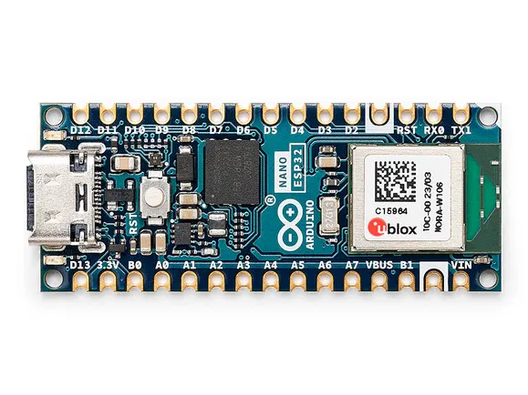

# Arduino® Nano ESP32 中文介绍

## 概述

Arduino Nano ESP32 搭载 **NORA-W106** 模块（内置 ESP32-S3 芯片），支持 **Wi-Fi®** 和 **蓝牙® 5.0+**，是物联网开发的理想设备。其经典的 Nano 外形尺寸兼容大量硬件配件，并支持 **Arduino** 和 **MicroPython** 编程。

### 主要特点
- **紧凑设计**：采用 Nano 外形尺寸，适合嵌入式项目。  
- **无线连接**：支持 Wi-Fi® 和蓝牙®，适用于物联网应用。  
- **多语言支持**：无缝切换 Arduino 和 MicroPython 编程，提供 [MicroPython 入门教程](http://docs.arduino.cc/nano-esp32)。  
- **Arduino IoT Cloud 兼容**：快速构建 IoT 项目，通过 [Arduino IoT Cloud 应用](https://cloud.arduino.cc/)远程监控（2023年8月起支持）。  
- **HID 支持**：通过 USB 模拟键盘/鼠标等设备。  

---

## 技术规格

| 参数项               | 规格说明                                                                 |
|----------------------|--------------------------------------------------------------------------|
| 微控制器             | u-blox® NORA-W106 （ESP32-S3）                                           |
| USB接口              | USB-C®                                                                  |
| 内置 LED 引脚        | 13                                                                      |
| 内置 RGB LED 引脚    | 14-16                                                                   |
| 数字 I/O 引脚        | 14                                                                      |
| 模拟输入引脚         | 8                                                                       |
| PWM引脚              | 所有引脚（最多同时5个）                                                 |
| 外部中断             | 所有数字引脚                                                            |
| 无线网络             | u-blox® NORA-W106 （ESP32-S3）                                           |
| 蓝牙                 | u-blox® NORA-W106 （ESP32-S3）                                           |
| UART                 | 2x                                                                     |
| I2C                  | 1x（A4: SDA, A5: SCL）                                                  |
| SPI                  | D11 (COPI), D12 (CIPO), D13 (SCK)，任意 GPIO 作为 CS 引脚                |
| I/O 电压             | 3.3 V                                                                  |
| 输入电压（标称）     | 6-21V                                                                  |
| 每个 I/O 引脚源电流  | 40mA                                                                   |
| 每个 I/O 引脚灌电流  | 28mA                                                                   |
| 时钟速度             | 高达 240 MHz                                                           |
| ROM                  | 384 kB                                                                 |
| SRAM                 | 512 kB                                                                 |
| 外部闪存             | 128 Mbit (16 MB)                                                       |
| 尺寸                 | 18mm (宽) × 45mm (长)                                                  |

---

## 常见问题

**Q: Nano ESP32 是否兼容 MicroPython？**  
A: 是！该板完全支持 MicroPython。

**Q: 如何为 Nano ESP32 供电？**  
A: 可通过以下两种方式供电：  
1. **USB-C 端口**（激活 VBUS 引脚输出）。  
2. **VIN 引脚**（输入电压范围：5-18V）。  

**Q: 它使用官方的 ESP32 内核吗？**  
A: 是的，需通过 Arduino IDE 的板管理器安装 **Arduino Nano ESP32 内核**。  

**Q: 是否兼容通用 ESP32 开发板的程序？**  
A: 完全兼容，可无缝移植其他 ESP32 设备的代码。  