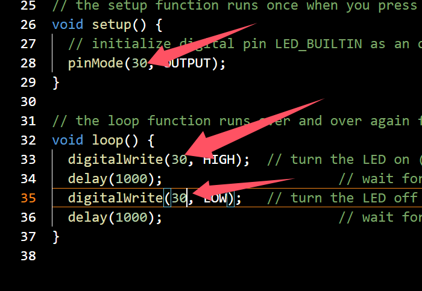
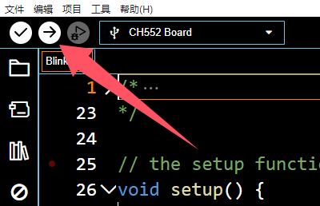

## CH552T核心板

# 一、模块基本参数

1. 电源电压：5V
2. 串口电平：5V
3. 下载方式：USB
4. GPIO数：16
5. 模块尺寸：20X26（mm）
6. PWR：电源指示灯
7. P30：板载指示灯
8. 项目地址：https://github.com/DeqingSun/ch55xduino

## 二、板子连接方式

## 三、开发环境搭建（基于Arduino IDE）

1. 通过 Arduino 板管理器。这是现在推荐的安装方式。
启动 Arduino-IDE。在 File（文件）->preferences（首选项） 的 Settings（开发板管理器地址） 选项卡中，输入
https://raw.githubusercontent.com/DeqingSun/ch55xduino/ch55xduino/package_ch55xduino_mcs51_index.json

- 如果你无法直接连接Github下载Arduino支持包，请在Arduino中使用以下链接。
https://cos.thinkcreate.us/package_ch55xduino_mcs51_newest_cloudflare_index.json

作为附加 Boards Manager URL。

+ 打开 Tools（工具）->Board（开发板）：...->Boards Manager（开发板管理器）

+ 在搜索行输入 ch' 找到 Ch55xduino

+ 点击列表条目
+ 单击 Install（安装）。
现在您应该在 Tools（工具）->Board（开发板） 的列表中找到一个新的条目 CH55x Boards：...
+ 从列表中选择 CH552 板

+ 从 File（文件）->Examples（示例）->01 打开标准 Blink 示例。基础知识->Blink

+ 更改 Blink 示例中的引脚编号。例如，我们板卡P3_0 上有 LED，则写入引脚 30。

+ 通过点击编译它 验证

### 注意：
+ 如果你的板子以前从来没有用过 ch55xduino，你需要让 ch55x 芯片进入 bootloader 模式。您需要断开 USB ，并按住开发板上的“P36”键后插USB线，使其进入Bootloader。并点击 上传。此外，空白的新芯片将自动进入 bootloader。
+ 这里的36,37是USB线，在使用USB连接电脑使用时请不要连接任何其它传感器等。