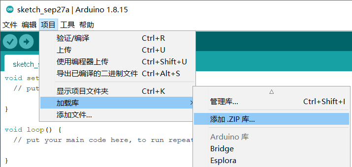

# esp32C3mini

<table border="1">
<tr>
  <td align="center"></td>
  <td align="center"></td>
</tr>
<tr>
<td style="background-color:rgb(232,232,232,0.5) "colspan="3" align="center"> <a href="https://item.taobao.com/item.htm?id=696843715193"><font style="font-size:16px">esp32C3mini</font></a></td>
</tr>
</table>

## 简介

esp32C3mini是采用esp32-C3FH4芯片设计的mini开发板，板卡直接通过TypeC数据线连接电脑使用arduinoIDE进行编程，该开发板板载天线，支持蓝牙和wifi功能，支持接入物联网平台blinker，可快速扩展物联网学习及项目使用。同时板卡将所有IO口保留为半孔形态，将开发板基础功能浓缩于23*30mm大小的PCB上，可以更加方便嵌入在各种大小项目中。

                  
## 产品规格参数

Mcu ：esp32-C3FH4 32位RISC-V单核处理器 运行频率高达160MHZ

WIFI : 802.11B/G/N协议、2.4G、支持STATION\SOFTAP\SOFTAP+STATION\混杂模式

蓝牙：Bluetooth5.0

主芯片工作电压：3.3V

功耗：深度睡眠功耗43μA

芯片资源：400KB SRAM、384KB ROM、4M flash(内置)

引脚接口：GPIO(带PWM) x 11、串口 x 2(USB串口和UART串口)、I2C x 1、SPI x 1、ADC x 4

板子尺寸：23*30mm


## 引脚定义图


## 使用教程

### Arduino开发环境安装

参考链接：https://arduino.me/a/esp32

1.下载安装arduinoIDE
https://arduino.me/download 在网站中下载arduinoIDE 

2.下载安装esp32package
该安装有两种办法
+ 本地安装
  打开Arduino IDE菜单 > 文件 >首选项，在 附加开发板管理器网址 输入框中，填入以下网址：https://arduino.me/packages/esp32.json
   下载社区打包的esp32安装包https://www.123pan.com/s/dJrKVv-bZXB.html，直接运行。
（注意：若要配合blinker使用，推荐下载安装2.0.9版本）
+ 在线安装（注意此方法可能会受网络信号影响导致无法正常安装）
  打开arduinoIDE菜单＞工具 >开发板>开发板管理 搜索esp32, 在线安装esp32 
 


3.安装blinker库文件
（备注：若不使用blinker物联网平台控制，可取消该步骤）
+ 下载blinker Arduino库：https://diandeng.tech/dev
+ 通过Arduino IDE 菜单>项目>加载库>添加.ZIP库 导入到库，如图：




4.选择板卡、端口、配置参数 
+ 工具 > 开发板 > ESP32 Arduino并选择“ ESP32C3 Dev Module ”
+ 工具 > 端口，然后选择所连接的 ESP32C3Mini 的串口名称
+ 在arduinoIDE菜单栏 > 工具中将USB CDC On Boot 设置成Enabled，将Flash Mode 设置成DIO

## 示例程序

### 点灯程序及上传 (LED)


点亮ESP32C3mini板载LED灯，该LED灯是连接在8号引脚中，所以程序我们只需要控制8号引脚交替输出高低电平就能控制板载LED的交替亮灭。例程如下：

```C
int led = 8;
void setup() {
  // initialize digital pin led as an output
  pinMode(led, OUTPUT);
}

void loop() {
  digitalWrite(led, HIGH);   // turn the LED off
  delay(1000);               // wait for a second
  digitalWrite(led, LOW);    // turn the LED on
  delay(1000);               // wait for a second
}
```

### 网页wifi控制LED (WiFi_LED)

使用ESP32C3mini做一个WiFi web Server，通过web网页来控制板载LED。
  在示例代码中修改ssid 和password，分别对应连接热点的账号及密码。通过串口打印出的IP地址进入网页控制板载LED。
```c
#include <WiFi.h>

const char* ssid     = "xxxx";  // 设置wifi名称
const char* password = "xxxxxxx";  // 设置wifi密码

WiFiServer server(80);

void setup()
{
    Serial.begin(115200);
    pinMode(8, OUTPUT);      // 设置LED引脚模式

    delay(10);

    // 我们首先连接到WiFi网络

    Serial.println();
    Serial.println();
    Serial.print("正在连接到 ");
    Serial.println(ssid);

    WiFi.begin(ssid, password);

    while (WiFi.status() != WL_CONNECTED) {
        delay(500);
        Serial.print(".");
    }

    Serial.println("");
    Serial.println("WiFi已连接。");
    Serial.println("IP地址: ");
    Serial.println(WiFi.localIP());
    
    server.begin();

}

void loop(){
 WiFiClient client = server.available();   // 监听传入的客户端

  if (client) {                             // 如果有客户端连接，
    Serial.println("新客户端。");           // 在串口端打印一条消息
    String currentLine = "";                // 创建一个字符串来保存客户端传入的数据
    while (client.connected()) {            // 当客户端连接时循环
      if (client.available()) {             // 如果有字节可从客户端读取，
        char c = client.read();             // 读取一个字节，然后
        Serial.write(c);                    // 在串口监视器上打印出来
        if (c == '\n') {                    // 如果字节是换行符

          // 如果当前行为空，表示连续收到两个换行符。
          // 这是客户端HTTP请求的结束，因此发送响应：
          if (currentLine.length() == 0) {
            // HTTP头总是以响应代码开始（例如HTTP/1.1 200 OK）
            // 和一个内容类型，以便客户端知道接下来是什么，然后是一个空行：
            client.println("HTTP/1.1 200 OK");
            client.println("Content-type:text/html");
            client.println();

            // HTTP响应的内容跟在头之后：
            client.print("点击 <a href=\"/H\">这里</a> 关闭8号引脚上的LED。<br>");
            client.print("点击 <a href=\"/L\">这里</a> 打开8号引脚上的LED。<br>");

            // HTTP响应以另一个空行结束：
            client.println();
            // 跳出while循环：
            break;
          } else {    // 如果收到换行符，则清除currentLine：
            currentLine = "";
          }
        } else if (c != '\r') {  // 如果收到的不是回车符，
          currentLine += c;      // 将其添加到currentLine的末尾
        }

        // 检查客户端请求是否为"GET /H"或"GET /L"：
        if (currentLine.endsWith("GET /H")) {
          digitalWrite(8, HIGH);               // GET /H 打开LED
        }
        if (currentLine.endsWith("GET /L")) {
          digitalWrite(8, LOW);                // GET /L 关闭LED
        }
      }
    }
    // 关闭连接：
    client.stop();
    Serial.println("客户端已断开连接。");
  }
}
```

### blinker_wifi（物联网远程）控制LED (Blinker_WIFI_LED)
   该例程使用blinker可以将ESP32C3mini配置连接至云平台，操作app，即可通过WiFi云端控制板载LED。

+ 确认已经正确安装Blinker库文件
+ 打开blinker app 点击右上角 + 号>独立设备>网络接入，添加完成后记住设备密钥，随后写入示例。


+ 用arduinoIDE打开示例程序 文件>示例>blinker>blinker_hello>hello_WIFI，修改代码里面的auth ssid password三个数据值，分别对应blinker中设备的密钥、连接热点的账号及密码。随后确认板卡型号和下载串口号正确后，上传程序
  


+ 等待blinker中设备在线，点击按键观察ESP32C3mini的板载LED控制情况

```c

#define BLINKER_WIFI

#include <Blinker.h>

char auth[] = "Your Device Secret Key";
char ssid[] = "Your WiFi network SSID or name";
char pswd[] = "Your WiFi network WPA password or WEP key";

// 新建组件对象
BlinkerButton Button1("btn-abc");
BlinkerNumber Number1("num-abc");

int counter = 0;

// 按下按键即会执行该函数
void button1_callback(const String & state)
{
    BLINKER_LOG("get button state: ", state);
    digitalWrite(LED_BUILTIN, !digitalRead(LED_BUILTIN));
}

// 如果未绑定的组件被触发，则会执行其中内容
void dataRead(const String & data)
{
    BLINKER_LOG("Blinker readString: ", data);
    counter++;
    Number1.print(counter);
}

void setup()
{
    // 初始化串口
    Serial.begin(115200);
    BLINKER_DEBUG.stream(Serial);
    BLINKER_DEBUG.debugAll();
    
    // 初始化有LED的IO
    pinMode(LED_BUILTIN, OUTPUT);
    digitalWrite(LED_BUILTIN, HIGH);
    // 初始化blinker
    Blinker.begin(auth, ssid, pswd);
    Blinker.attachData(dataRead);

    Button1.attach(button1_callback);
}

void loop() {
    Blinker.run();
}
```

### blinker蓝牙控制LED (Blinker_BLE_LED)
  通过blinker搜索连接ESP32C3mini蓝牙，便可操作blinker APP通过蓝牙控制板载LED
+ 同上在blinker app中右上角 + 号>独立设备>蓝牙接入，随后载入默认app示例
+ 搜索周围蓝牙设备并连接
+ 下载例程 文件>示例>blinker>blinker_hello>hello_BLE


+ 等待blinker中蓝牙设备在线，点击按键观察ESP32C3mini的板载LED控制情况

```c
#define BLINKER_BLE

#include <Blinker.h>

BlinkerButton Button1("btn-abc");
BlinkerNumber Number1("num-abc");

int counter = 0;

void button1_callback(const String & state)
{
    BLINKER_LOG("get button state: ", state);
    digitalWrite(LED_BUILTIN, !digitalRead(LED_BUILTIN));
}

void dataRead(const String & data)
{
    BLINKER_LOG("Blinker readString: ", data);
    counter++;
    Number1.print(counter);
}

void setup()
{
    Serial.begin(115200);
    BLINKER_DEBUG.stream(Serial);
    
    pinMode(LED_BUILTIN, OUTPUT);
    digitalWrite(LED_BUILTIN, HIGH);
    
    Blinker.begin();
    Blinker.attachData(dataRead);

    Button1.attach(button1_callback);
}

void loop()
{
    Blinker.run();
}
```


### GPIO驱动 (GPIO_LED)
  将ESP32C3mini所有IO口驱动，连接LED，实现流水灯效果
```c
const int ledPins[] = {0, 1, 2, 3, 4, 5, 6, 7, 10, 20, 21};
const int numLeds = sizeof(ledPins) / sizeof(ledPins[0]);

void setup() {
  // 初始化所有LED引脚为输出模式
  for (int i = 0; i < numLeds; i++) {
    pinMode(ledPins[i], OUTPUT);
    digitalWrite(ledPins[i], LOW); // 确保所有LED初始状态为关闭
  }
}

void loop() {
  // 依次点亮每个LED
  for (int i = 0; i < numLeds; i++) {
    digitalWrite(ledPins[i], HIGH); // 点亮LED
    delay(1000); // 延迟200毫秒
    digitalWrite(ledPins[i], LOW); // 关闭LED
  }
}
```
### 模拟(PWM)输出 (PWM_LED)
  该例程设置模拟输出（PWM）接口驱动ESP32C3mini板载LED呼吸效果变化
```c
const int ledPin = 8;  // LED连接在8号引脚

void setup() {
  pinMode(ledPin, OUTPUT);  // 设置LED引脚为输出模式
}

void loop() {
  // 增加亮度
  for (int brightness = 0; brightness <= 255; brightness++) {
    analogWrite(ledPin, brightness);  // 设置LED亮度
    delay(10);  // 调整延迟以改变呼吸速度
  }

  // 减少亮度
  for (int brightness = 255; brightness >= 0; brightness--) {
    analogWrite(ledPin, brightness);
    delay(10);
  }
}
```

### 模拟输入 (analoglN)
串口打印电位器模拟输入数值，注意该串口使用默认USB串口通信
```c
void setup() {
  Serial.begin(115200);  // 初始化串口通信
}

void loop() {
  int sensorValue = analogRead(A0);  // 读取A0引脚的模拟值
  Serial.println(sensorValue);       // 打印读取到的值
  delay(500);                        // 延迟500毫秒
}
```
  
### 串口 (Serial) 
使用UART串口即引脚20 、21来连接串口通信模块，如语音识别模块，进行通信，以下例程是搭配语音识别模块串口通信例程，当识别到对应开灯指令词时候，对应打开ESP32C3mini板载LED，识别到关灯识别词时，关闭LED。

```c

void setup() {

Serial.begin(115200);//调试输出信息
pinMode(8,OUTPUT);
delay(5000);
Serial.write(0x01);
delay(1000);

}

void loop() {
    if(Serial.available() > 0){
      byte SerialNowData = 0;
      SerialNowData = Serial.read();
      delay(10);
      if(SerialNowData == 0x01)//识别到打开空调
          digitalWrite(8,LOW);
      else if(SerialNowData == 0x02)//识别到关闭空调
          digitalWrite(8,HIGH);
  
   }
}
```

硬件接线：ESP32C3mini与语音识别模块对应接线  VCC-5v  GND-GND TX-A20 RX-A21


### IIC  (IIC_OLED)
在arduino IDE中选择，工具>>库管理中搜索U8g2库并安装，使用SSD1306的 0.96寸的OLED连接主板。 OLED引脚与主板引脚对应连接VCC-5V GND-GND SDA-A8  SCL-A9


```c
#include <U8g2lib.h>
 
#ifdef U8X8_HAVE_HW_SPI
#include <SPI.h>
#endif
#ifdef U8X8_HAVE_HW_I2C
#include <Wire.h>
#endif

U8G2_SSD1306_128X64_NONAME_F_SW_I2C u8g2(U8G2_R0, /* 时钟=*/ SCL, /* 数据=*/ SDA, /* 重置=*/ U8X8_PIN_NONE);    // 低速I2C
 
void setup(void) {
  u8g2.begin();
//  u8x8.setFlipMode(1);   // 设置数字从1到3，屏幕文字将旋转180度
}
 
void loop(void) {
  u8g2.clearBuffer();                   // 清除内部内存
  u8g2.setFont(u8g2_font_ncenB08_tr);   // 选择合适的字体
  u8g2.drawStr(0,15,"Hello World!");    // 将内容写入内部内存
  u8g2.drawStr(0,30,"Hello World!");
  u8g2.drawStr(0,40,"Hello World!");
  u8g2.sendBuffer();                    // 将内部内存传输到显示器
//  delay(1000);  
}
```
### SPI接口 (SPI_ST7789)
  以驱动ST7789TFT屏幕为例，该屏幕采用SPI接口驱动，需要Arduino_ST7789.h 和Adafruit_GFX.h，所以在使用前先安装对应3个驱动库。 在arduinoIDE中选择，工具>>库管理 搜索Adafruit_GFX Library库并安装，随后搜索Adafruit_busio库并安装，最后搜索Adadruit_ST7789库并安装

```c
#include <Adafruit_GFX.h>    // Core graphics library
#include <Adafruit_ST7789.h> // Hardware-specific library for ST7789
#include <SPI.h>


  // For the breakout board, you can use any 2 or 3 pins.
  // These pins will also work for the 1.8" TFT shield.
  #define TFT_CS        7
  #define TFT_RST        10 // Or set to -1 and connect to Arduino RESET pin
  #define TFT_DC         3


// OPTION 1 (recommended) is to use the HARDWARE SPI pins, which are unique
// to each board and not reassignable. For Arduino Uno: MOSI = pin 11 and
// SCLK = pin 13. This is the fastest mode of operation and is required if
// using the breakout board's microSD card.

Adafruit_ST7789 tft = Adafruit_ST7789(TFT_CS, TFT_DC, TFT_RST);

// OPTION 2 lets you interface the display using ANY TWO or THREE PINS,
// tradeoff being that performance is not as fast as hardware SPI above.
//#define TFT_MOSI 11  // Data out
//#define TFT_SCLK 13  // Clock out

//Adafruit_ST7789 tft = Adafruit_ST7789(TFT_CS, TFT_DC, TFT_MOSI, TFT_SCLK, TFT_RST);


float p = 3.1415926;

void setup(void) {
  Serial.begin(9600);
  Serial.print(F("Hello! ST77xx TFT Test"));

  // Use this initializer (uncomment) if using a 1.3" or 1.54" 240x240 TFT:
  tft.init(240, 240);           // Init ST7789 240x240

  // OR use this initializer (uncomment) if using a 1.69" 280x240 TFT:
  //tft.init(240, 280);           // Init ST7789 280x240

  // OR use this initializer (uncomment) if using a 2.0" 320x240 TFT:
  //tft.init(240, 320);           // Init ST7789 320x240

  // OR use this initializer (uncomment) if using a 1.14" 240x135 TFT:
  //tft.init(135, 240);           // Init ST7789 240x135
  
  // OR use this initializer (uncomment) if using a 1.47" 172x320 TFT:
  //tft.init(172, 320);           // Init ST7789 172x320

  // OR use this initializer (uncomment) if using a 1.9" 170x320 TFT:
  //tft.init(170, 320);           // Init ST7789 170x320

  // SPI speed defaults to SPI_DEFAULT_FREQ defined in the library, you can override it here
  // Note that speed allowable depends on chip and quality of wiring, if you go too fast, you
  // may end up with a black screen some times, or all the time.
  //tft.setSPISpeed(40000000);
  Serial.println(F("Initialized"));

  uint16_t time = millis();
  tft.fillScreen(ST77XX_BLACK);
  time = millis() - time;

  Serial.println(time, DEC);
  delay(500);

  // large block of text
  tft.fillScreen(ST77XX_BLACK);
  testdrawtext("Lorem ipsum dolor sit amet, consectetur adipiscing elit. Curabitur adipiscing ante sed nibh tincidunt feugiat. Maecenas enim massa, fringilla sed malesuada et, malesuada sit amet turpis. Sed porttitor neque ut ante pretium vitae malesuada nunc bibendum. Nullam aliquet ultrices massa eu hendrerit. Ut sed nisi lorem. In vestibulum purus a tortor imperdiet posuere. ", ST77XX_WHITE);
  delay(1000);

  // tft print function!
  tftPrintTest();
  delay(4000);

  // a single pixel
  tft.drawPixel(tft.width()/2, tft.height()/2, ST77XX_GREEN);
  delay(500);

  // line draw test
  testlines(ST77XX_YELLOW);
  delay(500);

  // optimized lines
  testfastlines(ST77XX_RED, ST77XX_BLUE);
  delay(500);

  testdrawrects(ST77XX_GREEN);
  delay(500);

  testfillrects(ST77XX_YELLOW, ST77XX_MAGENTA);
  delay(500);

  tft.fillScreen(ST77XX_BLACK);
  testfillcircles(10, ST77XX_BLUE);
  testdrawcircles(10, ST77XX_WHITE);
  delay(500);

  testroundrects();
  delay(500);

  testtriangles();
  delay(500);

  mediabuttons();
  delay(500);

  Serial.println("done");
  delay(1000);
}

void loop() {
  tft.invertDisplay(true);
  delay(500);
  tft.invertDisplay(false);
  delay(500);
}

void testlines(uint16_t color) {
  tft.fillScreen(ST77XX_BLACK);
  for (int16_t x=0; x < tft.width(); x+=6) {
    tft.drawLine(0, 0, x, tft.height()-1, color);
    delay(0);
  }
  for (int16_t y=0; y < tft.height(); y+=6) {
    tft.drawLine(0, 0, tft.width()-1, y, color);
    delay(0);
  }

  tft.fillScreen(ST77XX_BLACK);
  for (int16_t x=0; x < tft.width(); x+=6) {
    tft.drawLine(tft.width()-1, 0, x, tft.height()-1, color);
    delay(0);
  }
  for (int16_t y=0; y < tft.height(); y+=6) {
    tft.drawLine(tft.width()-1, 0, 0, y, color);
    delay(0);
  }

  tft.fillScreen(ST77XX_BLACK);
  for (int16_t x=0; x < tft.width(); x+=6) {
    tft.drawLine(0, tft.height()-1, x, 0, color);
    delay(0);
  }
  for (int16_t y=0; y < tft.height(); y+=6) {
    tft.drawLine(0, tft.height()-1, tft.width()-1, y, color);
    delay(0);
  }

  tft.fillScreen(ST77XX_BLACK);
  for (int16_t x=0; x < tft.width(); x+=6) {
    tft.drawLine(tft.width()-1, tft.height()-1, x, 0, color);
    delay(0);
  }
  for (int16_t y=0; y < tft.height(); y+=6) {
    tft.drawLine(tft.width()-1, tft.height()-1, 0, y, color);
    delay(0);
  }
}

void testdrawtext(char *text, uint16_t color) {
  tft.setCursor(0, 0);
  tft.setTextColor(color);
  tft.setTextWrap(true);
  tft.print(text);
}

void testfastlines(uint16_t color1, uint16_t color2) {
  tft.fillScreen(ST77XX_BLACK);
  for (int16_t y=0; y < tft.height(); y+=5) {
    tft.drawFastHLine(0, y, tft.width(), color1);
  }
  for (int16_t x=0; x < tft.width(); x+=5) {
    tft.drawFastVLine(x, 0, tft.height(), color2);
  }
}

void testdrawrects(uint16_t color) {
  tft.fillScreen(ST77XX_BLACK);
  for (int16_t x=0; x < tft.width(); x+=6) {
    tft.drawRect(tft.width()/2 -x/2, tft.height()/2 -x/2 , x, x, color);
  }
}

void testfillrects(uint16_t color1, uint16_t color2) {
  tft.fillScreen(ST77XX_BLACK);
  for (int16_t x=tft.width()-1; x > 6; x-=6) {
    tft.fillRect(tft.width()/2 -x/2, tft.height()/2 -x/2 , x, x, color1);
    tft.drawRect(tft.width()/2 -x/2, tft.height()/2 -x/2 , x, x, color2);
  }
}

void testfillcircles(uint8_t radius, uint16_t color) {
  for (int16_t x=radius; x < tft.width(); x+=radius*2) {
    for (int16_t y=radius; y < tft.height(); y+=radius*2) {
      tft.fillCircle(x, y, radius, color);
    }
  }
}

void testdrawcircles(uint8_t radius, uint16_t color) {
  for (int16_t x=0; x < tft.width()+radius; x+=radius*2) {
    for (int16_t y=0; y < tft.height()+radius; y+=radius*2) {
      tft.drawCircle(x, y, radius, color);
    }
  }
}

void testtriangles() {
  tft.fillScreen(ST77XX_BLACK);
  uint16_t color = 0xF800;
  int t;
  int w = tft.width()/2;
  int x = tft.height()-1;
  int y = 0;
  int z = tft.width();
  for(t = 0 ; t <= 15; t++) {
    tft.drawTriangle(w, y, y, x, z, x, color);
    x-=4;
    y+=4;
    z-=4;
    color+=100;
  }
}

void testroundrects() {
  tft.fillScreen(ST77XX_BLACK);
  uint16_t color = 100;
  int i;
  int t;
  for(t = 0 ; t <= 4; t+=1) {
    int x = 0;
    int y = 0;
    int w = tft.width()-2;
    int h = tft.height()-2;
    for(i = 0 ; i <= 16; i+=1) {
      tft.drawRoundRect(x, y, w, h, 5, color);
      x+=2;
      y+=3;
      w-=4;
      h-=6;
      color+=1100;
    }
    color+=100;
  }
}

void tftPrintTest() {
  tft.setTextWrap(false);
  tft.fillScreen(ST77XX_BLACK);
  tft.setCursor(0, 30);
  tft.setTextColor(ST77XX_RED);
  tft.setTextSize(1);
  tft.println("Hello World!");
  tft.setTextColor(ST77XX_YELLOW);
  tft.setTextSize(2);
  tft.println("Hello World!");
  tft.setTextColor(ST77XX_GREEN);
  tft.setTextSize(3);
  tft.println("Hello World!");
  tft.setTextColor(ST77XX_BLUE);
  tft.setTextSize(4);
  tft.print(1234.567);
  delay(1500);
  tft.setCursor(0, 0);
  tft.fillScreen(ST77XX_BLACK);
  tft.setTextColor(ST77XX_WHITE);
  tft.setTextSize(0);
  tft.println("Hello World!");
  tft.setTextSize(1);
  tft.setTextColor(ST77XX_GREEN);
  tft.print(p, 6);
  tft.println(" Want pi?");
  tft.println(" ");
  tft.print(8675309, HEX); // print 8,675,309 out in HEX!
  tft.println(" Print HEX!");
  tft.println(" ");
  tft.setTextColor(ST77XX_WHITE);
  tft.println("Sketch has been");
  tft.println("running for: ");
  tft.setTextColor(ST77XX_MAGENTA);
  tft.print(millis() / 1000);
  tft.setTextColor(ST77XX_WHITE);
  tft.print(" seconds.");
}

void mediabuttons() {
  // play
  tft.fillScreen(ST77XX_BLACK);
  tft.fillRoundRect(25, 10, 78, 60, 8, ST77XX_WHITE);
  tft.fillTriangle(42, 20, 42, 60, 90, 40, ST77XX_RED);
  delay(500);
  // pause
  tft.fillRoundRect(25, 90, 78, 60, 8, ST77XX_WHITE);
  tft.fillRoundRect(39, 98, 20, 45, 5, ST77XX_GREEN);
  tft.fillRoundRect(69, 98, 20, 45, 5, ST77XX_GREEN);
  delay(500);
  // play color
  tft.fillTriangle(42, 20, 42, 60, 90, 40, ST77XX_BLUE);
  delay(50);
  // pause color
  tft.fillRoundRect(39, 98, 20, 45, 5, ST77XX_RED);
  tft.fillRoundRect(69, 98, 20, 45, 5, ST77XX_RED);
  // play color
  tft.fillTriangle(42, 20, 42, 60, 90, 40, ST77XX_GREEN);
}

```

  ESP32C3mini与ST7789TFT屏幕对应接线


## 其他资料

Esp32C3mini原理图:

Esp32官方学习资料：
https://docs.espressif.com/projects/esp-idf/zh_CN/latest/esp32c3/get-started/index.html

### FAQ
#### 无法上传程序怎样操作？

Esp32C3mini需要进入下载模式才能正常下载，进入下载模式可以有两种方法操作，

一、上电后 先按BOOT按键，再按RST按键，再依次松开RST和BOOT按键。

二、先按住BOOT按键，再给Esp32C3mini插USB线给主板通电

#### 上传程序后为啥没执行？

因为上传程序后主板没有自动复位功能，需要按下RST按键或者重新给主板上电才会复位执行程序

#### 使用串口例程无法打印数据怎样操作？

在arduinoIDE菜单栏 工具栏将USB CDC On Boot 设置成Enabled，Flash Mode 设置成DIO