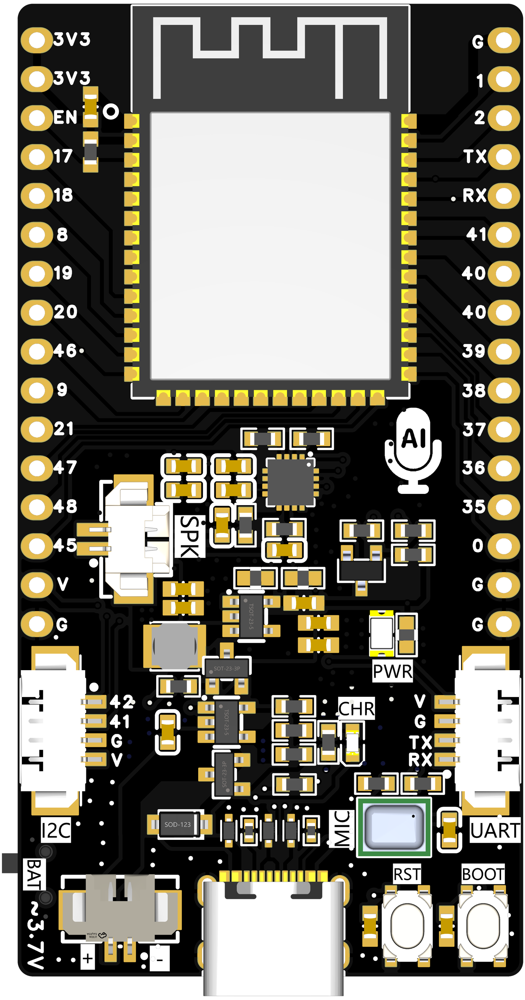
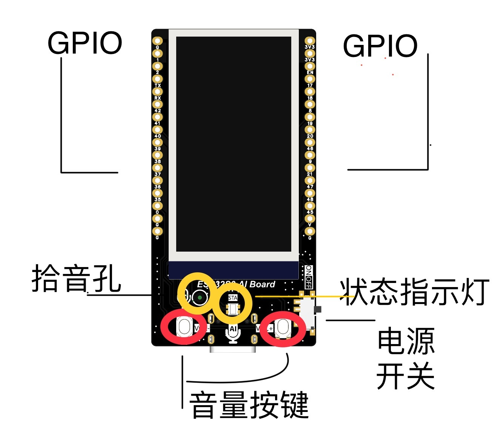
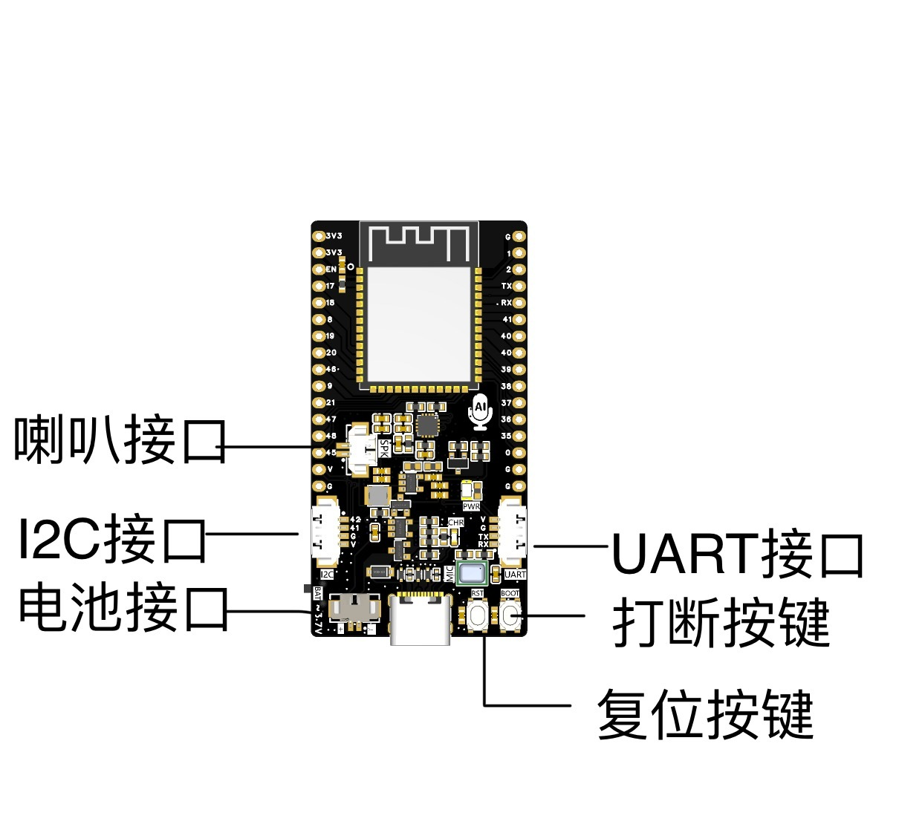
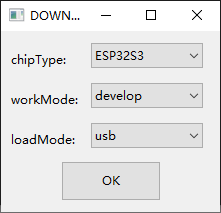
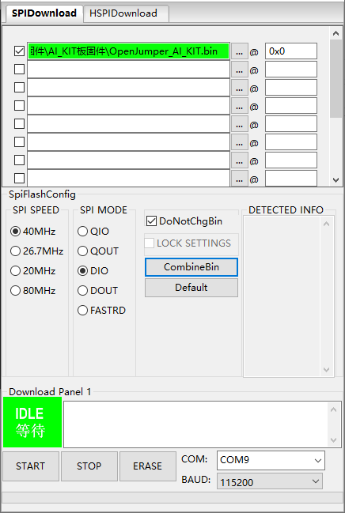
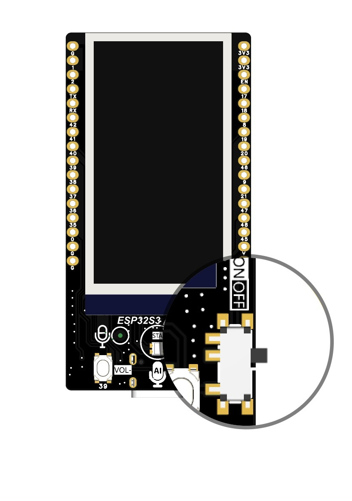

# ESP32-S3 AI Board 文档

## 一、概述

ESP32-S3 AI Board 是一款集成了 ESP32-S3 芯片的开发板，开发板集成了 1.9 寸的 LCD 屏幕、麦克风以及音频解码功放等功能，专门为人工智能应用而设计优化。

### 主要特点

- **强大的 ESP32-S3 芯片**：采用双核 Tensilica Xtensa® LX7 CPU，主频最高可达 240 MHz，能够高效处理复杂的计算任务。
  - 具备丰富的外设接口，如多个 GPIO（通用输入输出引脚）、并保留了独立的 I2C、UART 等扩展接口，方便连接各种传感器和外设。
  - 保留电池接口，支持接入 3.7V 锂电池给主板供电，同时也能通过 USB 给电池充电。
  - 搭载 1.9 寸的 LCD 屏幕，屏幕显示清晰，能够为用户带来直观的操作界面与视觉体验。
  - 具备麦克风功能和音频解码功放功能，可精准捕捉声音信号，满足多种语音交互场景下的声音采集需求。能够实现语音识别、大模型接入等人工智能应用场景的基本功能。
  - 精心专为人工智能应用而设计优化，无论是算法适配还是功能拓展，均以人工智能应用需求为导向，最大程度地发挥在人工智能领域的应用潜力。

## 二、硬件接口

1. **电源接口**：通常采用常见的 USB-C 或 Micro-USB 接口供电，输入电压为 5V。
2. **电池接口**：MX1.25-2P 端子，支持 1.25 线头的锂电池供电，供电电压为 3.7V。
3. **RST 按键**：用于主板程序复位。
4. **BOOT 按键**：可用于 AI 对话打断专用按键。
5. **vol+/vol-**：独立按键，可用于对话时硬件调整音量。
6. **屏幕**：1.9 寸 IPS 液晶屏，分辨率：170*320。
7. **GPIO 接口**：提供多个可编程的 GPIO 引脚，可用于控制 LED 灯、读取按钮状态、连接外部电路等。例如，可以通过配置 GPIO 引脚的电平高低来实现对外部设备的开关控制。
8. **I2C 接口**：常用于连接低速的 I2C 设备，如温度传感器、加速度计等。I2C 接口只需要两根信号线（SDA 数据线和 SCL 时钟线）就可以实现多设备的通信。
9. **UART 接口**：可用于串口通信，方便与计算机或其他具有串口功能的设备进行数据交互，例如用于调试信息的输出或者接收来自外部设备的命令。

## 三、软件支持

1. **开发环境**：支持多种集成开发环境（IDE），如 Arduino IDE。在 Arduino IDE 中，有专门针对 ESP32-S3 AI Board 的板卡定义和示例代码库，方便开发者快速上手编写程序。
   - 也可以使用 ESP-IDF（Espressif IoT Development Framework），这是 Espressif 官方提供的更底层的开发框架，适合对硬件和系统有深入了解并且需要定制化开发的用户。
2. **AI 软件库**：集成了如 ESP-AI-SDK 之类的软件库，该库提供了方便的 API 来调用 AI 功能。例如，在进行语音识别时，可以通过调用相应的 API 函数来初始化语音识别引擎、设置识别参数、获取识别结果等。

## 四、应用场景

1. **智能家居**：可以作为智能家居系统的核心控制器。通过连接各种传感器（如人体红外传感器、温湿度传感器等）实现环境监测，并根据检测到的信息自动控制家电设备（如智能灯、智能空调等）的运行。
2. **智能安防**：连接摄像头模块后，利用图像识别功能对监控画面进行分析。例如，可以识别是否有陌生人闯入特定区域，一旦检测到异常情况则触发报警装置（如发送警报到用户手机或者启动本地警报器）。

## 五、使用教程

### 小智 AI 对话助手快速上手教程

1. 下载固件上传软件 `flash_download_tool`。

2. 选择小智 AI 对话专用固件。

3. 配置参数。
   
   
4. 注意：下载时需要打开电源开关，如下图所示。
   
5. 上传固件。

### 主板 Arduino 开发例程

1. GPIO 点灯示例程序。
2. I2C 接口示例程序------驱动 OLED 液晶屏。
3. UART 接口示例程序------驱动语音识别模块。

## 六、注意事项

1. **电源稳定性**：在使用过程中，确保输入电源的稳定性。不稳定的电源可能导致开发板无法正常工作或者损坏芯片。
2. **散热问题**：当进行高强度的计算任务（如复杂的 AI 模型推理）时，开发板可能会产生一定的热量。应确保开发板有良好的散热环境，避免长时间在高温环境下工作。
3. **电磁兼容性**：如果将开发板应用于复杂的电磁环境中，需要注意电磁兼容性问题。可能需要采取屏蔽措施或者合理布局电路，以避免干扰其他设备或者被其他设备干扰。

固件下载链接：http://download.openjumper.cn/AI_KIT1.rar