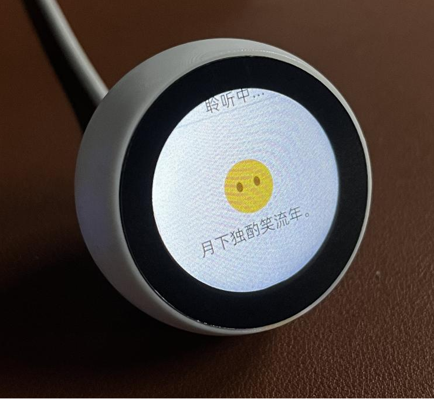
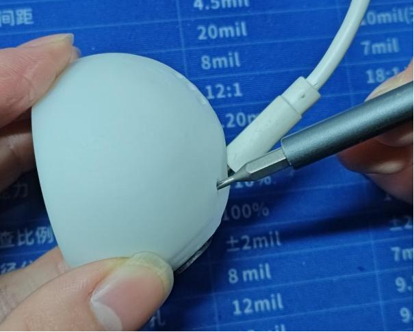
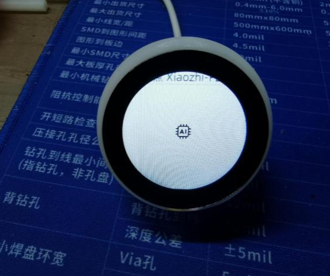
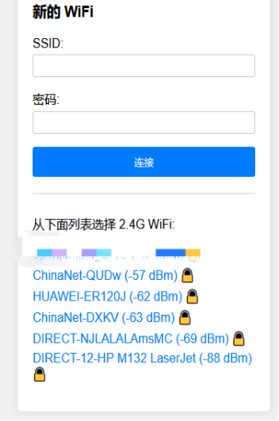
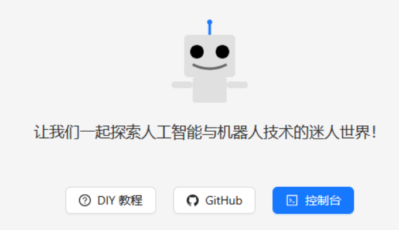
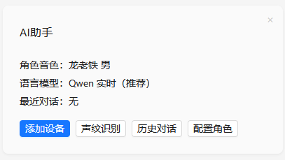
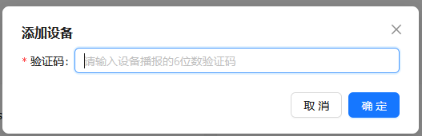

# 1.28寸圆屏AI助手快速使用说明

## 使用步骤

1. **通电**  
   使用Type-C数据线（连接到手机电源或电脑USB）给AI助手通电。

2. **配置键操作**  
   快速按下配置键（USB孔旁边的小孔，里面有一个按键，可以使用小螺丝刀等工具伸入小孔按下按键）。此时屏幕会刷新一次，显示"请连接热点 xiaozhi-xxxxxx"。

 

   **备注**：如果没有小工具按配置键，也可以在开机后等待2分钟左右，设备在未连接任何网络的情况下，屏幕会刷新显示"请连接热点 xiaozhi-xxxxx"。

3. **连接热点**  
   使用手机或电脑搜索热点"xiaozhi-xxxxx"并连接，随后进入配网模式，输入AI助手需要连接的热点网络（即当前环境的WiFi热点），在正确输入SSID和密码后，点击"连接"。连接成功后，屏幕会提示3秒后自动重启。

   

4. **重启并获取验证码**  
   重启后，AI助手会自动连接你设置的网络。连接成功后，屏幕和语音会提示一个6位数的验证码，需要记住这个验证码。

5. **注册并添加设备**  
   使用手机或电脑（确认手机或电脑已经联网）打开浏览器，输入 `xiaozhi.me`，进入控制台（首次使用需要注册）。注册成功后，点击**新建智能体**，输入**AI助手**（或您喜欢的名字），随后点击**添加设备**。

  
  
   

   同时可以根据自身要求配置角色内容，也可以使用默认角色。

6. **输入验证码**  
   输入刚记录下来的设备**验证码**。如果没有记住验证码，可以使用"你好小智"唤醒AI助手，屏幕会显示该验证码，并语音播报。

7. **完成设置**  
   屏幕出现"待命"字样，表示AI助手已准备好，可以开始对话。

   固件下载链接：http://download.openjumper.cn/Firmware_Moji_v0.9.9_0x00_2025-01-22.bin