# ESP32-S3 AIoT 说明书

## 产品介绍

ESP32-S3 AIoT套件是一款基于ESP32-S3模组专为AIoT学习的集主板和传感器多合一综合套件，板中集成了27个子模块（共21种模块和1个主控集成板）同时还匹配了丰富的教学例程及学习资料，可以满足大多数AI和物联网的学习及使用场景。


## 产品特点

- 27个模块+主控扩展单元 ALL IN ONE
- AI应用模块与主板接线板载通路，无需复杂接线可开发AI应用，兼容小智AI应用
- 插针与Grove扩展接口，可适应更多硬件接入需求
- 支持外部供电，可为电机驱动以及其他物联网项目提供电力
- 可支持软件Arduino IDE、ESP-IDF、Ailyblockly


## 硬件参数

| 参数 | 规格 |
|------|------|
| 传感器个数及种类 | 27个子模块（共21种模块和1个主控集成板） |
| 主控板（兼容） | ESP32-S3核心板、Wifiduino32S3 |
| 接口类型 | 排针+Grove接口 |
| 模块工作电压 | 3.3V |
| 外部供电电压 | 6~12V |
| PCB尺寸 | 250*175mm |
| 固定孔尺寸 | 244*169mm |

## 模块介绍


### 详细模块列表

1. **摇杆模块**  
   用于模拟二维方向控制，常用于游戏控制或机器人方向调节。

2. **电流检测模块**  
   用于实时监测电路中的电流大小，保护设备或优化能耗。

3. **电机驱动模块**  
   用于控制电机的启动、停止、正反转和速度调节。

4. **六轴运动检测传感器**  
   用于检测设备的加速度、角速度和姿态。

5. **光敏传感器**  
   用于检测环境光强度。

6. **MQ2烟雾传感器**  
   用于检测空气中的烟雾浓度。

7. **DHT11温湿度传感器**  
   用于测量环境温度和湿度。

8. **1.3寸LCD显示屏**  
   用于显示图像、文字或数据。

9. **OLED模块**  
   用于显示文字或简单图形。

10. **热敏检测模块**  
    用于检测环境温度变化。

11. **音频功放模块**  
    用于放大音频信号。

12. **旋转编码器**  
    用于检测旋转角度或速度。

13. **电位器**  
    用于调节电路中的电压或电阻值。

14. **MicroSD卡模块**  
    用于存储和读取数据。

15. **激光测距模块**  
    用于测量物体距离。

16. **数字麦克风**  
    用于采集音频信号。

17. **人体红外传感器**  
    用于检测人体活动。

18. **LED模块**  
    用于显示状态指示灯。

19. **蜂鸣器**  
    用于发出声音提示或报警。

20. **上拉按键模块**  
    用于检测按键状态。

21. **下拉按键模块**  
    用于检测按键状态。

22. **摄像头**  
    用于采集图像或视频。

23. **ESP32-S3核心板**  
    作为主控芯片。

24. **ESP32-S3传感器扩展板**  
    用于扩展传感器接口。

## 引脚占用表

| 模块           | 引脚占用                                                                 |
|----------------|--------------------------------------------------------------------------|
| LCD            | SCL-21, SDA-47, DC-43, CS-44                                            |
| 音频功放       | LR-40, BC-39, DIN-38                                                    |
| SD卡           | MI-35, CLK-3, MO-14, CS-46                                              |
| 数字麦克风     | WS-42, SD-2, SCK-41                                                     |
| 摄像头         | SDA-4, SCL-5, VS-6, HS-7, XM-15, Y9-16, Y8-17, Y7-18, Y4-8, Y3-9, Y5-10, Y2-11, Y6-12, PCLK-13 |
| 板载WS2812彩灯 | 48                                                                      |

## 入门教程

### ESP32-S3主板引脚定义图

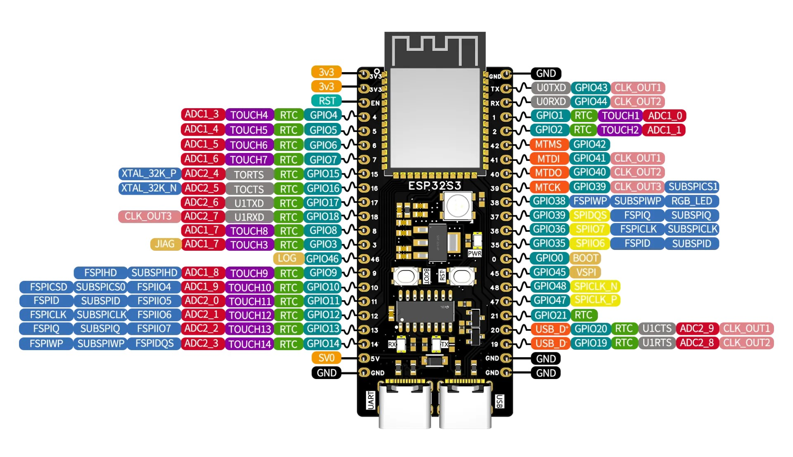

### Arduino IDE环境的安装及使用

ESP32-S3同时支持多种开发平台如：ESP-IDF、Arduino IDE，使用者可以根据自身情况选择对应的开发平台。以下示例主要以Arduino开发方式为主来介绍。所以在使用之前我们需要第一时间搭建Arduino开发环境，具体参考如下链接：

[Arduino开发环境搭建指南](https://arduino.me/a/3066)

### 库文件的安装

#### 1. 通过Arduino IDE库管理器安装（推荐方法）

1. 打开Arduino IDE  
2. 进入库管理器  
3. 搜索和安装库  

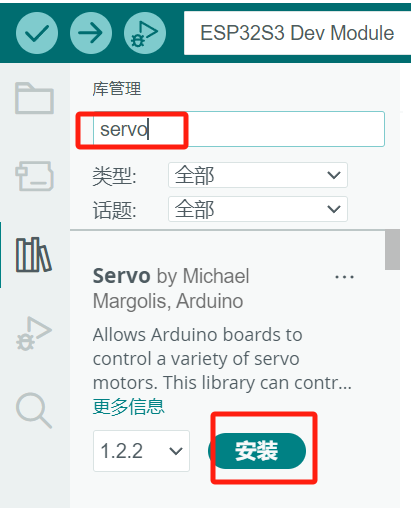

#### 2. 本地安装库文件

1. 下载库文件  
2. 导入ZIP库  
3. 重启Arduino IDE  

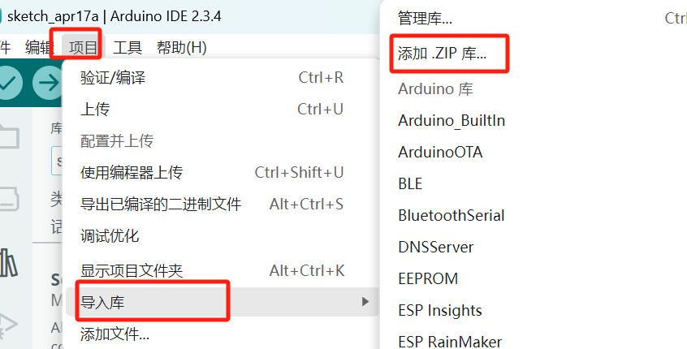

## 基础示例教程

### LED控制示例

#### 示例1：开关LED

```arduino
void setup() {
  pinMode(9, OUTPUT);
}

void loop() {
  digitalWrite(9, HIGH);
  delay(1000);
  digitalWrite(9, LOW);
  delay(1000);
}
```

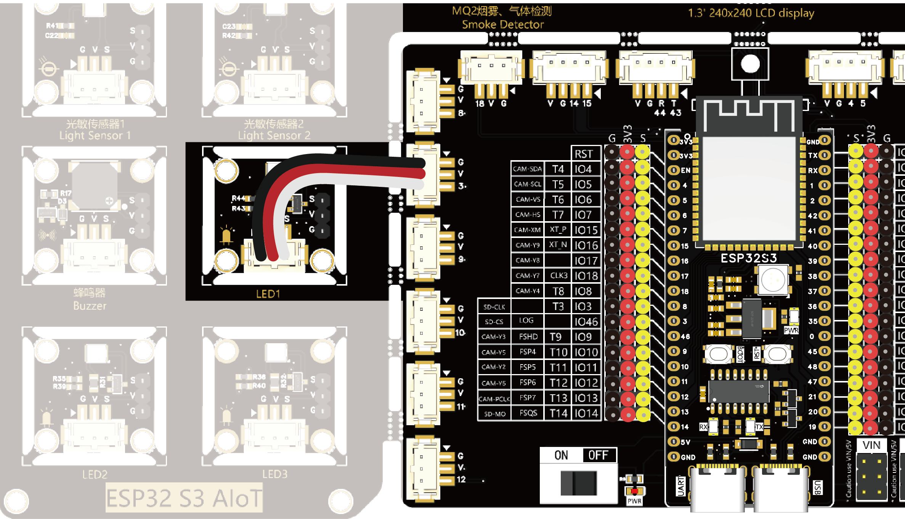

#### 示例2：呼吸灯

```arduino
void setup() {
  ledcSetup(0, 5000, 8);
  ledcAttachPin(9, 0);
}

void loop() {
  for(int dutyCycle = 0; dutyCycle <= 255; dutyCycle++) {
    ledcWrite(0, dutyCycle);
    delay(7);
  }
}
```

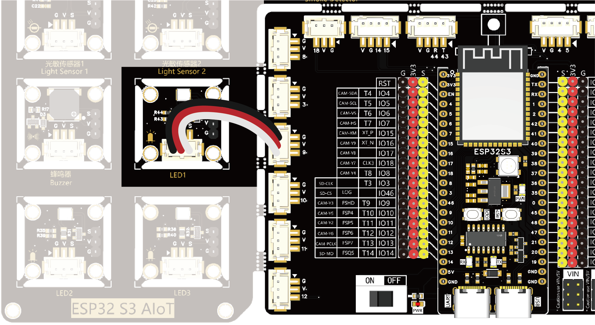

### 模拟摇杆示例

```arduino
void setup() {
  Serial.begin(115200);
  pinMode(3, INPUT_PULLUP); // 按键
}

void loop() {
  int xValue = analogRead(1); // X轴
  int yValue = analogRead(2); // Y轴
  int buttonState = digitalRead(3); // 按键
  
  Serial.print("X: ");
  Serial.print(xValue);
  Serial.print(" Y: ");
  Serial.print(yValue);
  Serial.print(" Button: ");
  Serial.println(buttonState);
  delay(100);
}
```

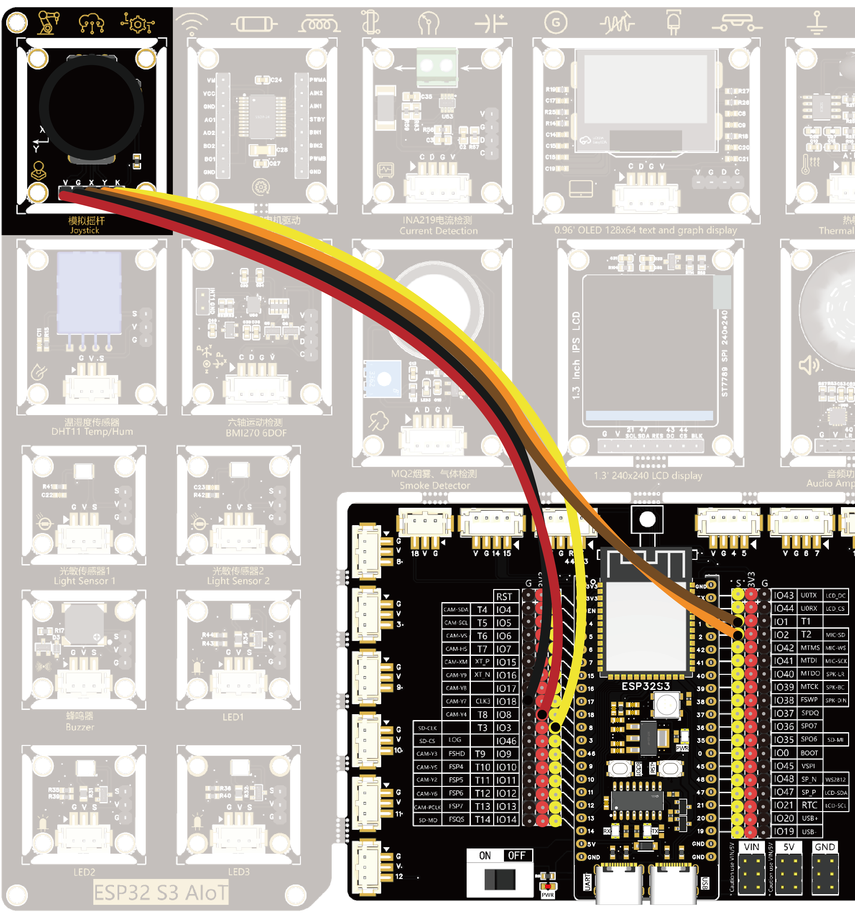

### 光敏传感器示例

```arduino
void setup() {
  Serial.begin(115200);
}

void loop() {
  int lightValue = analogRead(18);
  Serial.print("光照强度: ");
  Serial.println(lightValue);
  delay(1000);
}
```

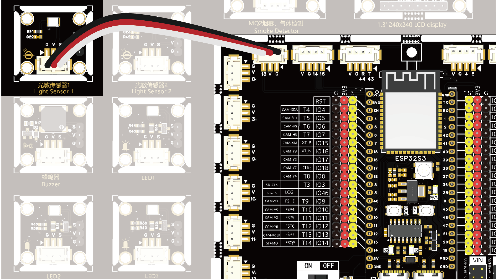

### 蜂鸣器示例

```arduino
void setup() {
  pinMode(9, OUTPUT);
}

void loop() {
  tone(9, 262, 500); // C4
  delay(600);
  tone(9, 294, 500); // D4
  delay(600);
  tone(9, 330, 500); // E4
  delay(600);
}
```

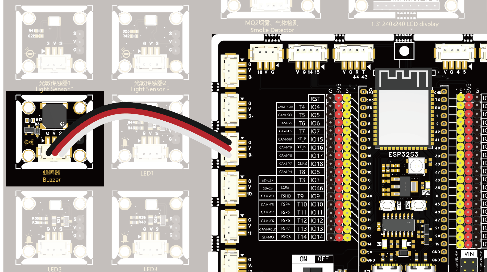

### 电机驱动示例

```arduino
void setup() {
  pinMode(35, OUTPUT); // PWMA
  pinMode(36, OUTPUT); // AIN1
  pinMode(37, OUTPUT); // AIN2
  pinMode(45, OUTPUT); // STBY
  digitalWrite(45, HIGH); // 禁用待机模式
}

void loop() {
  // 正转
  digitalWrite(36, HIGH);
  digitalWrite(37, LOW);
  analogWrite(35, 200); // 设置PWM速度
  delay(2000);
  
  // 停止
  analogWrite(35, 0);
  delay(1000);
  
  // 反转
  digitalWrite(36, LOW);
  digitalWrite(37, HIGH);
  analogWrite(35, 200);
  delay(2000);
  
  // 停止
  analogWrite(35, 0);
  delay(1000);
}
```


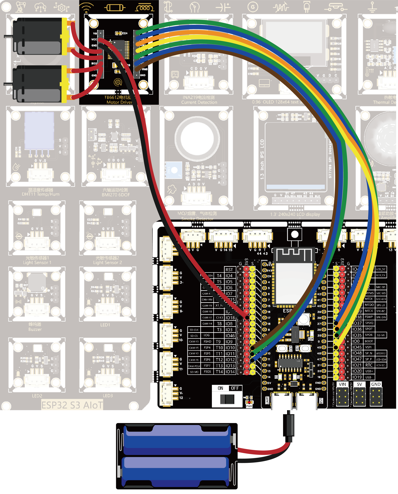

### 温湿度检测示例

```arduino
#include <DHT.h>
#define DHTPIN 8
#define DHTTYPE DHT11

DHT dht(DHTPIN, DHTTYPE);

void setup() {
  Serial.begin(115200);
  dht.begin();
}

void loop() {
  float h = dht.readHumidity();
  float t = dht.readTemperature();
  
  if (isnan(h) || isnan(t)) {
    Serial.println("读取DHT11失败");
    return;
  }
  
  Serial.print("湿度: ");
  Serial.print(h);
  Serial.print("% 温度: ");
  Serial.print(t);
  Serial.println("℃");
  delay(2000);
}
```

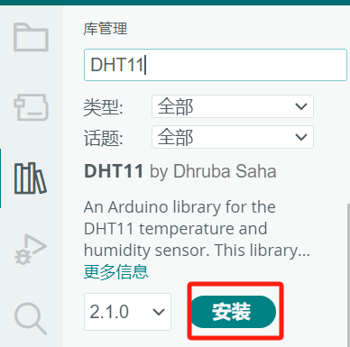
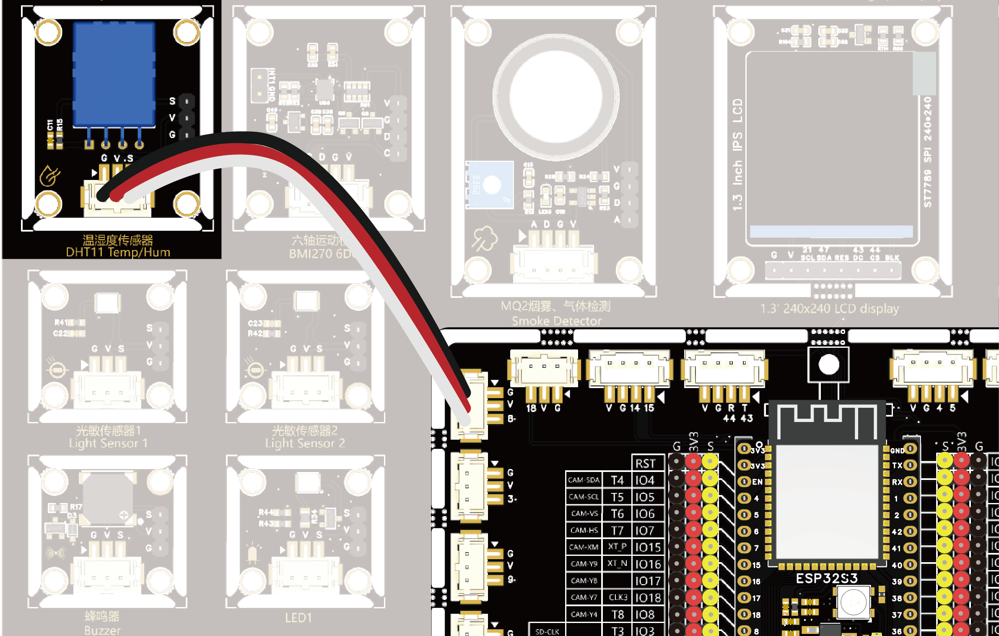

### 烟雾检测示例

```arduino
void setup() {
  Serial.begin(115200);
  pinMode(14, INPUT); // 数字输出
}

void loop() {
  int analogValue = analogRead(15); // 模拟输出
  int digitalValue = digitalRead(14); // 数字输出
  
  Serial.print("模拟值: ");
  Serial.print(analogValue);
  Serial.print(" 数字值: ");
  Serial.println(digitalValue);
  
  if(digitalValue == LOW) {
    Serial.println("烟雾浓度超标！");
  }
  
  delay(1000);
}
```

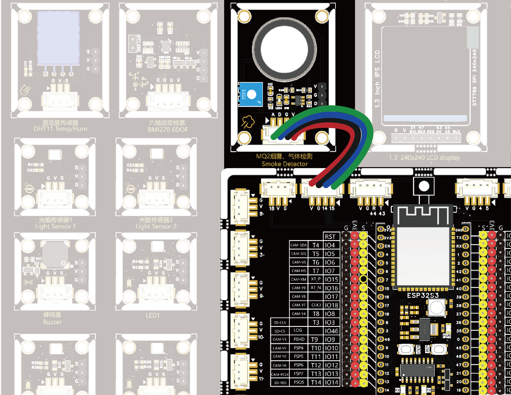

### OLED液晶驱动示例

```arduino
#include <U8g2lib.h>
#include <Wire.h>

U8G2_SSD1306_128X64_NONAME_F_HW_I2C u8g2(U8G2_R0);

void setup() {
  u8g2.begin();
}

void loop() {
  u8g2.clearBuffer();
  u8g2.setFont(u8g2_font_ncenB14_tr);
  u8g2.drawStr(0,20,"Hello World!");
  u8g2.sendBuffer();
  delay(1000);
}
```

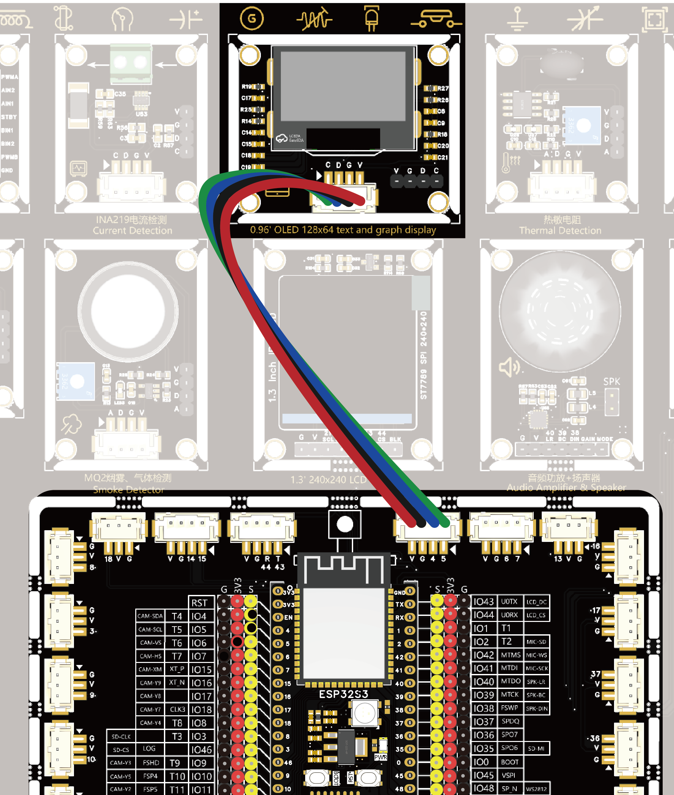
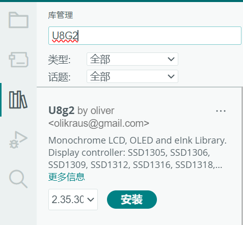

### LCD液晶驱动示例

```arduino
#include <Adafruit_GFX.h>
#include <Adafruit_ST7789.h>
#include <SPI.h>

#define TFT_CS   44
#define TFT_DC   43
#define TFT_RST  -1

Adafruit_ST7789 tft = Adafruit_ST7789(TFT_CS, TFT_DC, TFT_RST);

void setup() {
  tft.init(240, 320);
  tft.fillScreen(ST77XX_BLACK);
  tft.setTextColor(ST77XX_WHITE);
  tft.setTextSize(2);
}

void loop() {
  tft.setCursor(0, 0);
  tft.println("ESP32-S3 AIoT");
  tft.println("LCD测试");
  delay(2000);
  tft.fillScreen(ST77XX_BLACK);
}
```

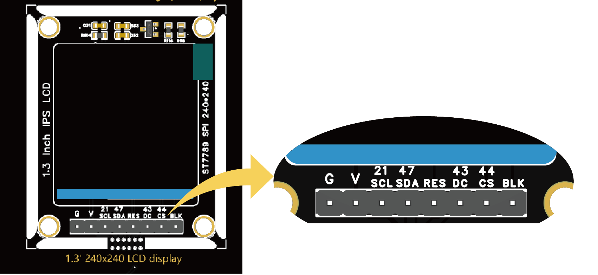
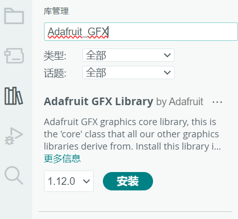
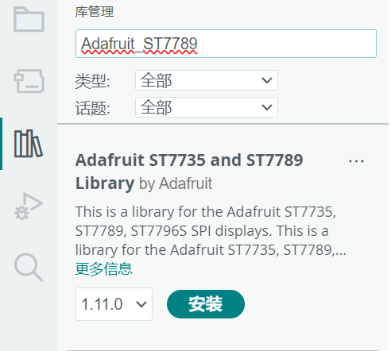

### 热敏检测示例

```arduino
void setup() {
  Serial.begin(115200);
  pinMode(4, INPUT); // 数字输出
}

void loop() {
  int analogValue = analogRead(5); // 模拟输出
  int digitalValue = digitalRead(4); // 数字输出
  
  // 将模拟值转换为温度
  float tempC = 1 / (log(1 / (1023. / analogValue - 1)) / 3950 + 1.0 / 298.15) - 273.15;
  
  Serial.print("温度: ");
  Serial.print(tempC);
  Serial.print("C 数字值: ");
  Serial.println(digitalValue);
  
  delay(1000);
}
```

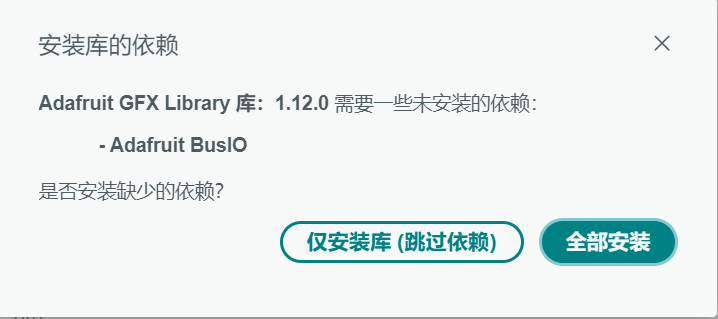

### 电位器模拟输入示例

```arduino
void setup() {
  Serial.begin(115200);
}

void loop() {
  int potValue = analogRead(13);
  Serial.print("电位器值: ");
  Serial.println(potValue);
  delay(100);
}
```

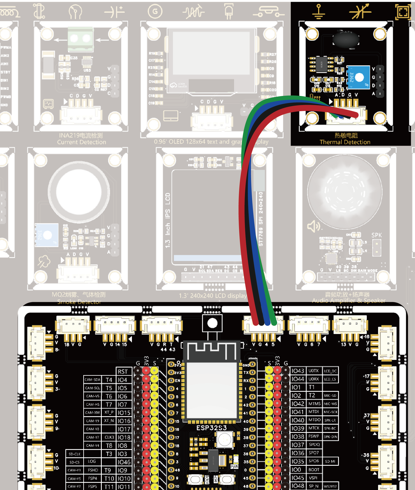
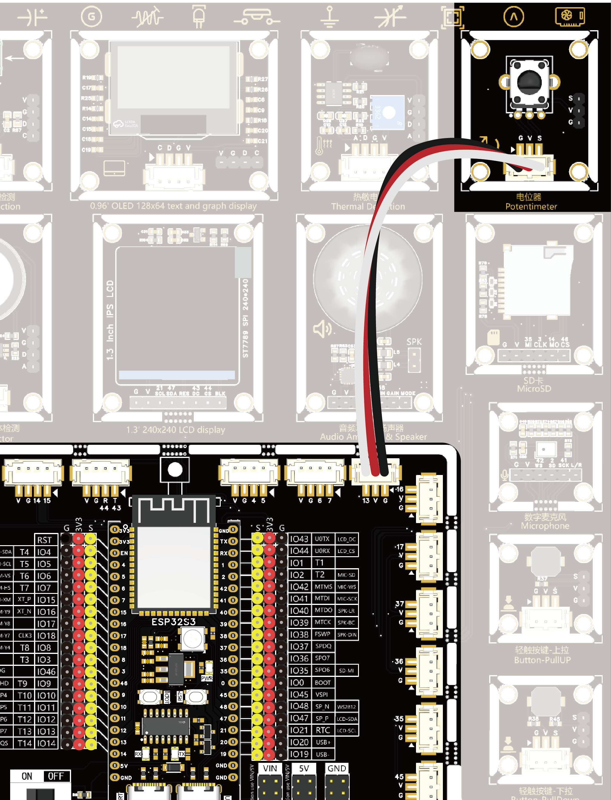

### 六轴运动传感器示例

```arduino
#include "SparkFun_BMI270_Arduino_Library.h"

BMI270 imu;
sensor_data_t accelData;
sensor_data_t gyroData;

void setup() {
  Serial.begin(115200);
  
  if(imu.begin() != BMI2_OK) {
    Serial.println("BMI270初始化失败");
    while(1);
  }
  
  imu.setFullScaleRangeAcc(BMI2_ACC_RANGE_4G);
  imu.setFullScaleRangeGyro(BMI2_GYR_RANGE_250);
}

void loop() {
  imu.getSensorData(&accelData, &gyroData);
  
  Serial.print("加速度 X:");
  Serial.print(accelData.x);
  Serial.print(" Y:");
  Serial.print(accelData.y);
  Serial.print(" Z:");
  Serial.print(accelData.z);
  
  Serial.print(" 角速度 X:");
  Serial.print(gyroData.x);
  Serial.print(" Y:");
  Serial.print(gyroData.y);
  Serial.print(" Z:");
  Serial.println(gyroData.z);
  
  delay(100);
}
```


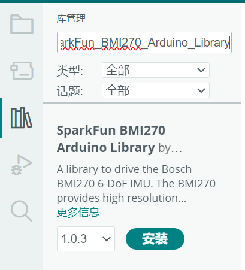

### 旋转编码器示例

```arduino
#include <ESP32Encoder.h>

ESP32Encoder encoder;

void setup() {
  Serial.begin(115200);
  ESP32Encoder::useInternalWeakPullResistors=UP;
  encoder.attachHalfQuad(6, 7); // CLK, DT
  encoder.setCount(0);
  pinMode(8, INPUT_PULLUP); // 按键
}

void loop() {
  Serial.print("编码器值: ");
  Serial.print(encoder.getCount());
  Serial.print(" 按键状态: ");
  Serial.println(digitalRead(8));
  delay(100);
}
```

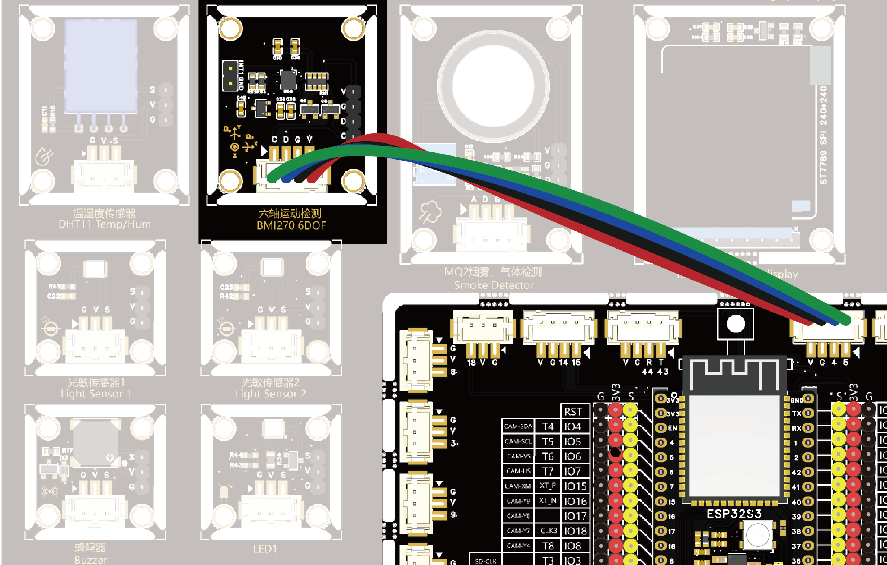
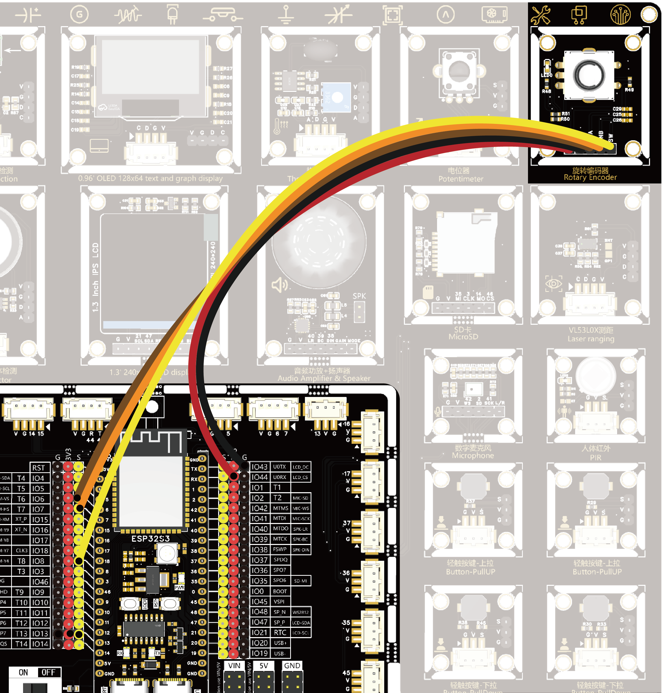

### 麦克风检测示例

```arduino
#include <driver/i2s.h>

#define I2S_SAMPLE_RATE (44100)
#define I2S_SAMPLE_BITS (16)
#define I2S_READ_LEN    (16 * 1024)

void setup() {
  Serial.begin(115200);
  
  i2s_config_t i2s_config = {
    .mode = (i2s_mode_t)(I2S_MODE_MASTER | I2S_MODE_RX),
    .sample_rate = I2S_SAMPLE_RATE,
    .bits_per_sample = (i2s_bits_per_sample_t)I2S_SAMPLE_BITS,
    .channel_format = I2S_CHANNEL_FMT_ONLY_LEFT,
    .communication_format = I2S_COMM_FORMAT_STAND_I2S,
    .intr_alloc_flags = ESP_INTR_FLAG_LEVEL1,
    .dma_buf_count = 8,
    .dma_buf_len = I2S_READ_LEN,
    .use_apll = false,
    .tx_desc_auto_clear = false,
    .fixed_mclk = 0
  };
  
  i2s_pin_config_t pin_config = {
    .bck_io_num = 41,
    .ws_io_num = 42,
    .data_in_num = 2,
    .data_out_num = I2S_PIN_NO_CHANGE
  };
  
  i2s_driver_install(I2S_NUM_0, &i2s_config, 0, NULL);
  i2s_set_pin(I2S_NUM_0, &pin_config);
}

void loop() {
  int16_t i2s_read_buff[I2S_READ_LEN];
  size_t bytes_read;
  
  i2s_read(I2S_NUM_0, (void*)i2s_read_buff, I2S_READ_LEN, &bytes_read, portMAX_DELAY);
  
  for(int i=0; i<8; i++) {
    Serial.print(i2s_read_buff[i]);
    Serial.print(" ");
  }
  Serial.println();
  delay(100);
}
```

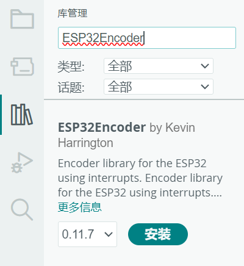

### 音频功放播放示例

```arduino
#include <driver/i2s.h>

#define I2S_SAMPLE_RATE (44100)
#define I2S_SAMPLE_BITS (16)

void setup() {
  i2s_config_t i2s_config = {
    .mode = (i2s_mode_t)(I2S_MODE_MASTER | I2S_MODE_TX),
    .sample_rate = I2S_SAMPLE_RATE,
    .bits_per_sample = (i2s_bits_per_sample_t)I2S_SAMPLE_BITS,
    .channel_format = I2S_CHANNEL_FMT_ONLY_LEFT,
    .communication_format = I2S_COMM_FORMAT_STAND_I2S,
    .intr_alloc_flags = ESP_INTR_FLAG_LEVEL1,
    .dma_buf_count = 8,
    .dma_buf_len = 1024,
    .use_apll = false,
    .tx_desc_auto_clear = false,
    .fixed_mclk = 0
  };
  
  i2s_pin_config_t pin_config = {
    .bck_io_num = 39,
    .ws_io_num = 40,
    .data_in_num = I2S_PIN_NO_CHANGE,
    .data_out_num = 38
  };
  
  i2s_driver_install(I2S_NUM_0, &i2s_config, 0, NULL);
  i2s_set_pin(I2S_NUM_0, &pin_config);
}

void loop() {
  // 生成1kHz正弦波
  static const int16_t sine_wave[] = {
    0, 23170, 32767, 23170, 0, -23170, -32767, -23170
  };
  
  size_t bytes_written;
  i2s_write(I2S_NUM_0, (const char*)sine_wave, sizeof(sine_wave), &bytes_written, portMAX_DELAY);
}
```

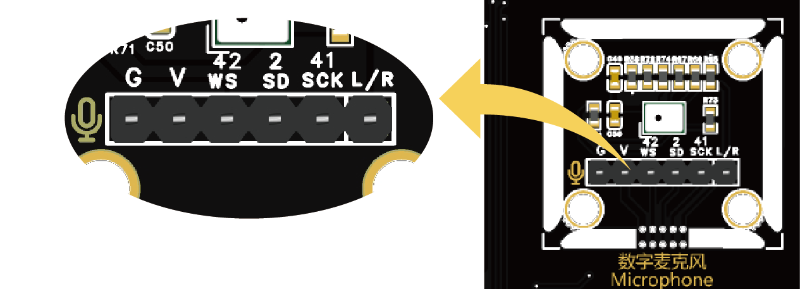

### SD卡读取示例

```arduino
#include <SD.h>
#include <SPI.h>

#define SD_CS 46

void setup() {
  Serial.begin(115200);
  
  if(!SD.begin(SD_CS)) {
    Serial.println("SD卡初始化失败");
    return;
  }
  
  File file = SD.open("/test.txt");
  if(file) {
    Serial.println("文件内容:");
    while(file.available()) {
      Serial.write(file.read());
    }
    file.close();
  } else {
    Serial.println("打开文件失败");
  }
}

void loop() {
}
```

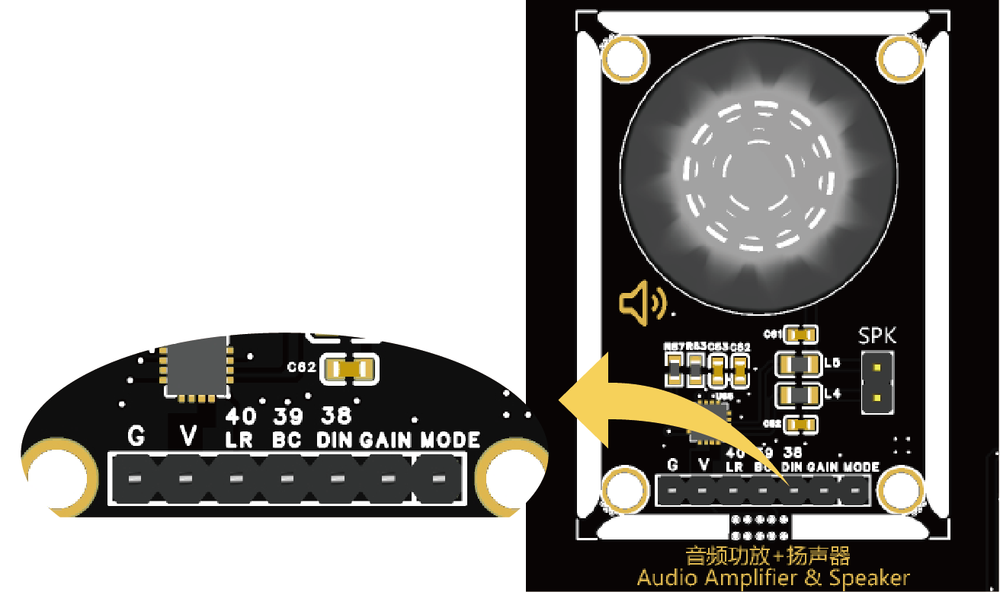

### 激光测距示例

```arduino
#include <Adafruit_VL53L0X.h>

Adafruit_VL53L0X lox = Adafruit_VL53L0X();

void setup() {
  Serial.begin(115200);
  
  if(!lox.begin()) {
    Serial.println("VL53L0X初始化失败");
    while(1);
  }
}

void loop() {
  VL53L0X_RangingMeasurementData_t measure;
  
  lox.rangingTest(&measure, false);
  
  if(measure.RangeStatus != 4) {
    Serial.print("距离: ");
    Serial.print(measure.RangeMilliMeter);
    Serial.println("mm");
  } else {
    Serial.println("超出测量范围");
  }
  
  delay(100);
}
```

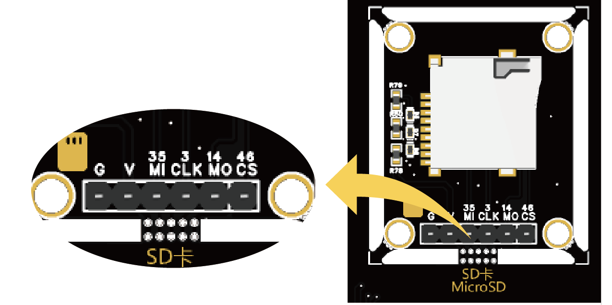


### 人体红外检测示例

```arduino
void setup() {
  Serial.begin(115200);
  pinMode(16, INPUT);
}

void loop() {
  int pirValue = digitalRead(16);
  
  if(pirValue == HIGH) {
    Serial.println("检测到人体活动！");
  } else {
    Serial.println("无人体活动");
  }
  
  delay(1000);
}
```

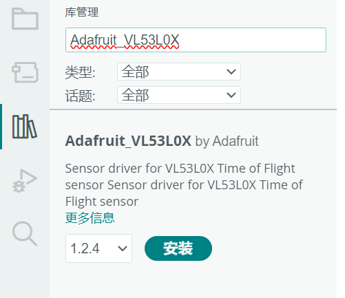

### 上拉/下拉按键示例

```arduino
void setup() {
  Serial.begin(115200);
  pinMode(12, INPUT); // 上拉按键
  pinMode(14, INPUT); // 下拉按键
}

void loop() {
  int pullUpState = digitalRead(12);
  int pullDownState = digitalRead(14);
  
  Serial.print("上拉按键: ");
  Serial.print(pullUpState);
  Serial.print(" 下拉按键: ");
  Serial.println(pullDownState);
  
  delay(200);
}
```

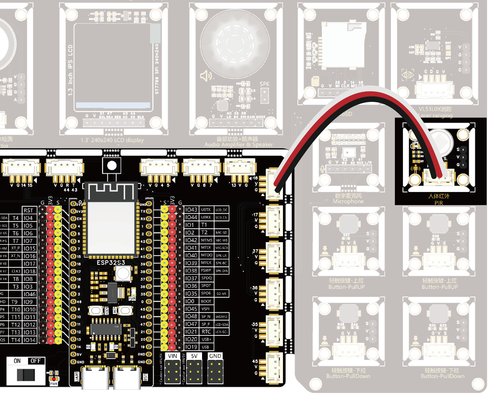

### 电流检测示例

```arduino
#include <Adafruit_INA219.h>

Adafruit_INA219 ina219;

void setup() {
  Serial.begin(115200);
  ina219.begin();
}

void loop() {
  float shuntvoltage = ina219.getShuntVoltage_mV();
  float busvoltage = ina219.getBusVoltage_V();
  float current_mA = ina219.getCurrent_mA();
  float power_mW = ina219.getPower_mW();
  float loadvoltage = busvoltage + (shuntvoltage / 1000);
  
  Serial.print("总线电压: "); Serial.print(busvoltage); Serial.println(" V");
  Serial.print("分流电压: "); Serial.print(shuntvoltage); Serial.println(" mV");
  Serial.print("负载电压: "); Serial.print(loadvoltage); Serial.println(" V");
  Serial.print("电流: "); Serial.print(current_mA); Serial.println(" mA");
  Serial.print("功率: "); Serial.print(power_mW); Serial.println(" mW");
  Serial.println("");
  
  delay(2000);
}
```

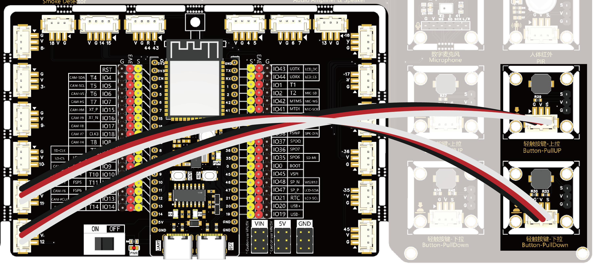
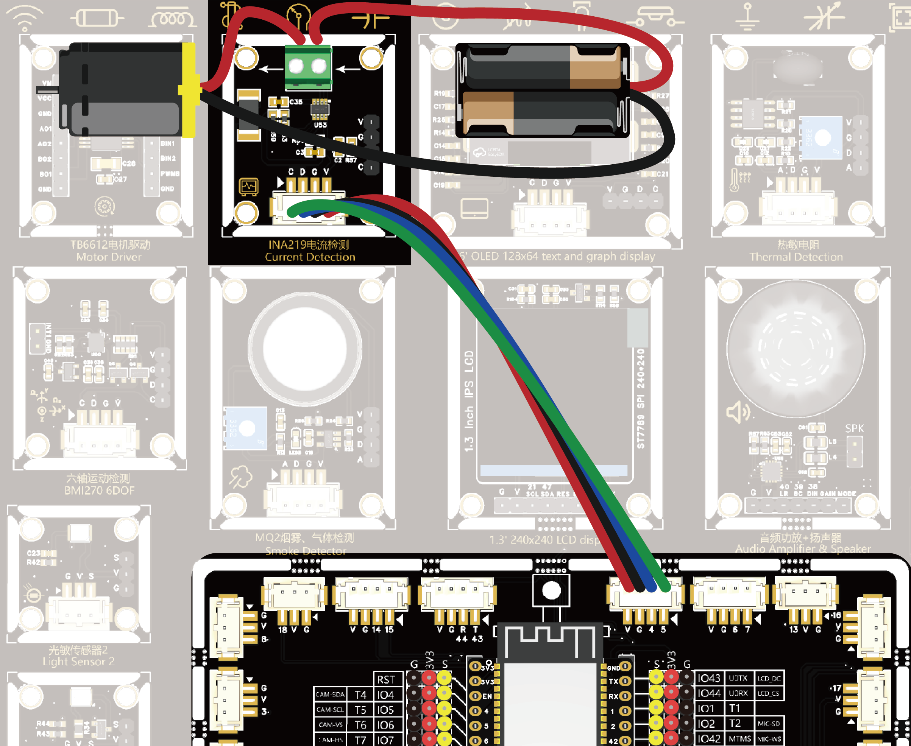

### 视频流Web服务器示例

```arduino
#include "esp_camera.h"
#include <WiFi.h>

#define CAMERA_MODEL_ESP32S3_EYE

const char* ssid = "yourSSID";
const char* password = "yourPASSWORD";

void startCameraServer();

void setup() {
  Serial.begin(115200);
  
  camera_config_t config;
  config.ledc_channel = LEDC_CHANNEL_0;
  config.ledc_timer = LEDC_TIMER_0;
  config.pin_d0 = 16;
  config.pin_d1 = 17;
  config.pin_d2 = 18;
  config.pin_d3 = 12;
  config.pin_d4 = 8;
  config.pin_d5 = 9;
  config.pin_d6 = 10;
  config.pin_d7 = 11;
  config.pin_xclk = 15;
  config.pin_pclk = 13;
  config.pin_vsync = 6;
  config.pin_href = 7;
  config.pin_sscb_sda = 4;
  config.pin_sscb_scl = 5;
  config.pin_pwdn = -1;
  config.pin_reset = -1;
  config.xclk_freq_hz = 20000000;
  config.pixel_format = PIXFORMAT_JPEG;
  
  if(psramFound()){
    config.frame_size = FRAMESIZE_UXGA;
    config.jpeg_quality = 10;
    config.fb_count = 2;
  } else {
    config.frame_size = FRAMESIZE_SVGA;
    config.jpeg_quality = 12;
    config.fb_count = 1;
  }
  
  esp_err_t err = esp_camera_init(&config);
  if (err != ESP_OK) {
    Serial.printf("摄像头初始化失败 错误码 0x%x", err);
    return;
  }
  
  WiFi.begin(ssid, password);
  while (WiFi.status() != WL_CONNECTED) {
    delay(500);
    Serial.print(".");
  }
  
  Serial.println("");
  Serial.println("WiFi已连接");
  
  startCameraServer();
  
  Serial.print("摄像头已启动，访问地址: http://");
  Serial.println(WiFi.localIP());
}

void loop() {
  delay(10000);
}
```

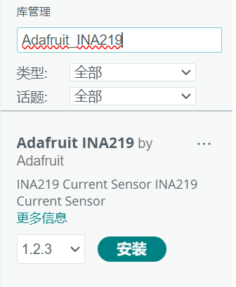
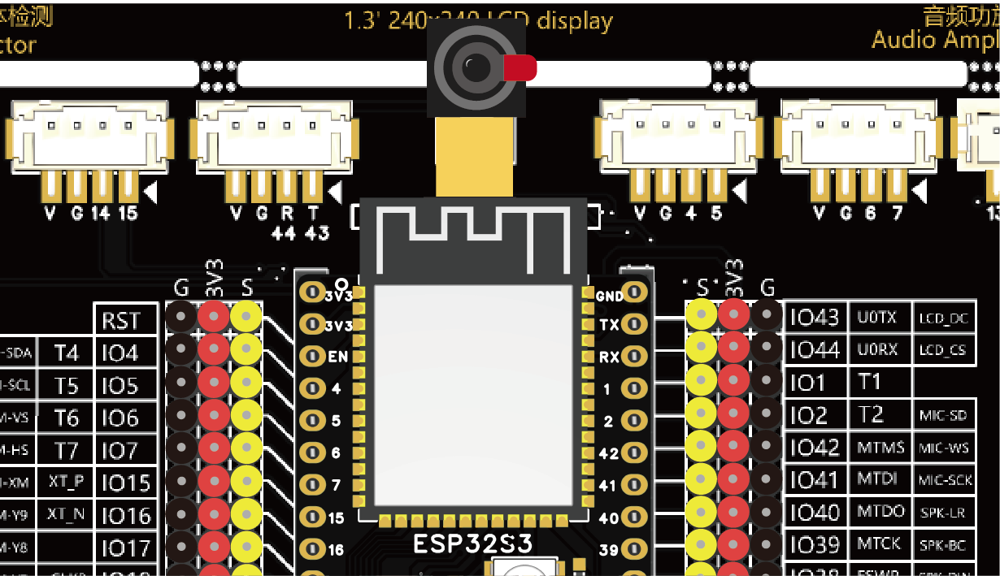
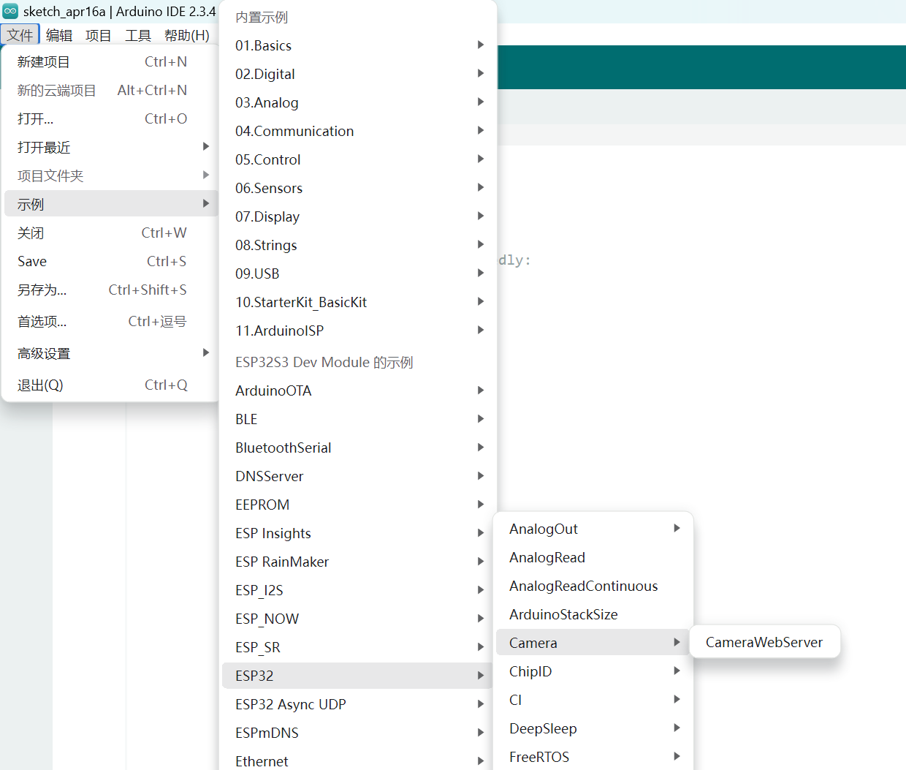
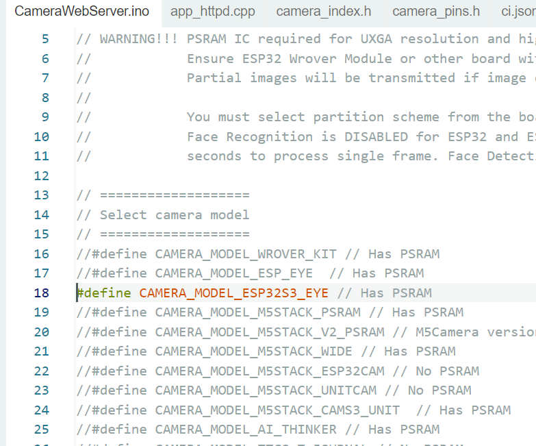
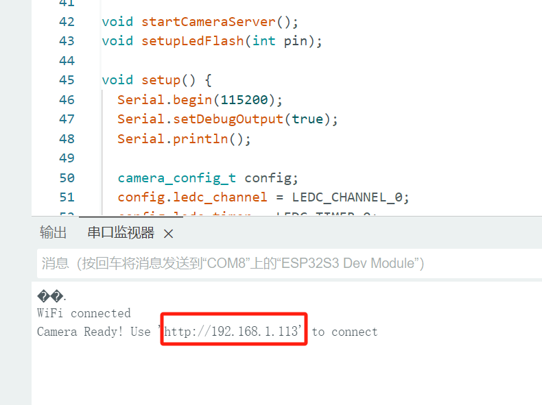
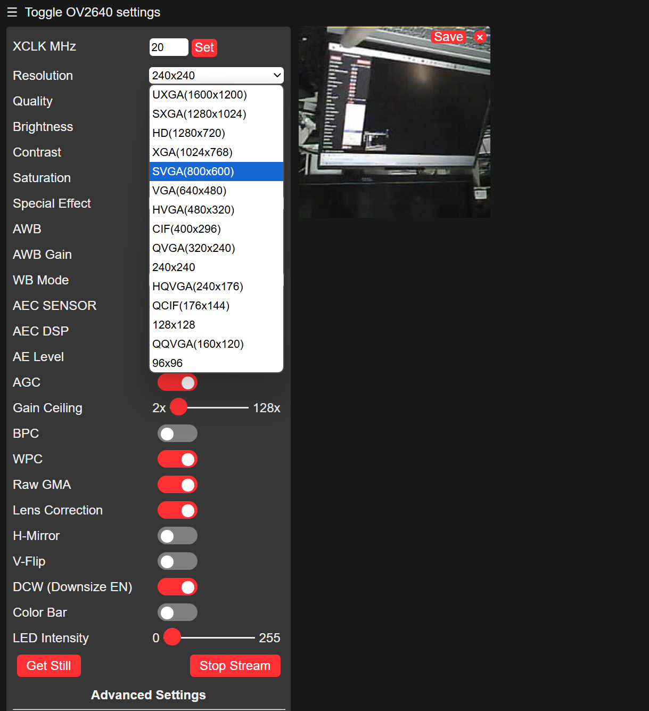

## 综合例程

### 温度记录器

```arduino
#include <SD.h>
#include <SPI.h>
#include "DHT.h"

#define DHTPIN 8
#define DHTTYPE DHT11
#define SD_CS 46

DHT dht(DHTPIN, DHTTYPE);

void setup() {
  Serial.begin(115200);
  dht.begin();
  
  if(!SD.begin(SD_CS)) {
    Serial.println("SD卡初始化失败");
    return;
  }
}

void loop() {
  float h = dht.readHumidity();
  float t = dht.readTemperature();
  
  if(isnan(h) || isnan(t)) {
    Serial.println("读取DHT11失败");
    return;
  }
  
  File dataFile = SD.open("/datalog.txt", FILE_WRITE);
  
  if(dataFile) {
    dataFile.print("时间: ");
    dataFile.print(millis()/1000);
    dataFile.print("s 温度: ");
    dataFile.print(t);
    dataFile.print("C 湿度: ");
    dataFile.print(h);
    dataFile.println("%");
    dataFile.close();
    
    Serial.print("已记录: ");
    Serial.print(t);
    Serial.print("C ");
    Serial.print(h);
    Serial.println("%");
  } else {
    Serial.println("打开文件失败");
  }
  
  delay(60000); // 每分钟记录一次
}
```

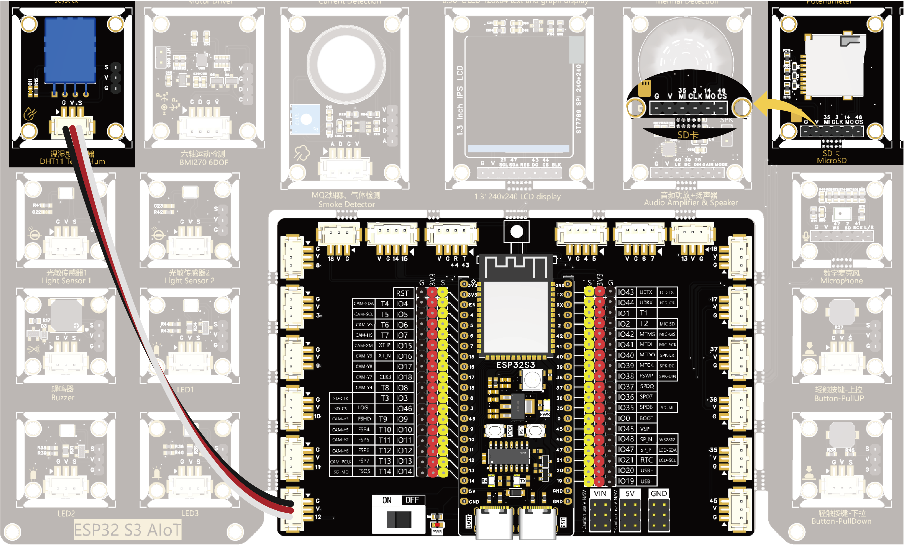
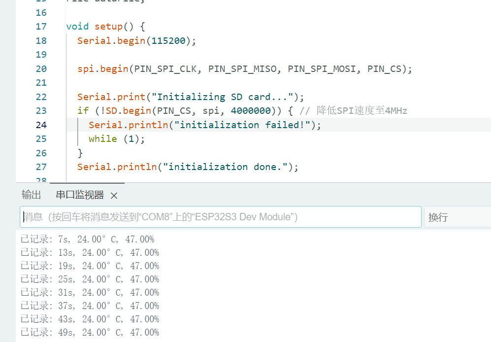
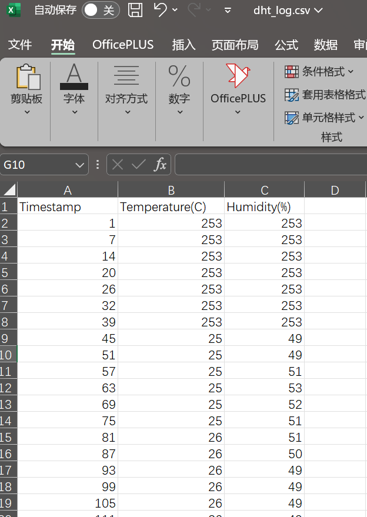

### 蓝牙桌面控制器

```arduino
#include <BLEDevice.h>
#include <BLEUtils.h>
#include <BLEServer.h>
#include <BLE2902.h>
#include "Adafruit_VL53L0X.h"

Adafruit_VL53L0X lox = Adafruit_VL53L0X();
BLEServer* pServer = NULL;
BLECharacteristic* pCharacteristic = NULL;

#define SERVICE_UUID        "00001812-0000-1000-8000-00805f9b34fb"
#define CHARACTERISTIC_UUID "00002a4d-0000-1000-8000-00805f9b34fb"

void setup() {
  Serial.begin(115200);
  
  if(!lox.begin()) {
    Serial.println("VL53L0X初始化失败");
    while(1);
  }
  
  BLEDevice::init("ESP32 BLE Keyboard");
  pServer = BLEDevice::createServer();
  
  BLEService *pService = pServer->createService(SERVICE_UUID);
  
  pCharacteristic = pService->createCharacteristic(
                      CHARACTERISTIC_UUID,
                      BLECharacteristic::PROPERTY_READ |
                      BLECharacteristic::PROPERTY_WRITE |
                      BLECharacteristic::PROPERTY_NOTIFY |
                      BLECharacteristic::PROPERTY_INDICATE
                    );
  
  pCharacteristic->addDescriptor(new BLE2902());
  pService->start();
  
  BLEAdvertising *pAdvertising = pServer->getAdvertising();
  pAdvertising->start();
}

void loop() {
  VL53L0X_RangingMeasurementData_t measure;
  lox.rangingTest(&measure, false);
  
  if(measure.RangeStatus != 4 && measure.RangeMilliMeter < 400) {
    // 发送Win+Ctrl+左箭头组合键
    uint8_t keycodes[8] = {0x80, 0x83, 0x00, 0x00, 0x00, 0x00, 0x00, 0x00};
    pCharacteristic->setValue(keycodes, 8);
    pCharacteristic->notify();
    delay(100);
    
    // 释放所有键
    uint8_t release[8] = {0x00, 0x00, 0x00, 0x00, 0x00, 0x00, 0x00, 0x00};
    pCharacteristic->setValue(release, 8);
    pCharacteristic->notify();
  }
  
  delay(100);
}
```

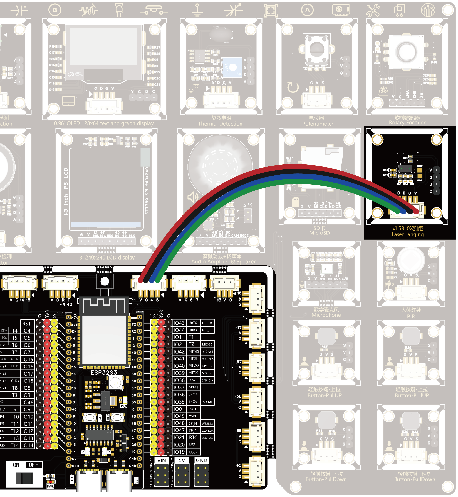

### WiFi Web服务器

```arduino
#include <WiFi.h>

const char* ssid = "yourSSID";
const char* password = "yourPASSWORD";

WiFiServer server(80);

void setup() {
  Serial.begin(115200);
  pinMode(48, OUTPUT); // 板载LED
  
  WiFi.begin(ssid, password);
  while (WiFi.status() != WL_CONNECTED) {
    delay(500);
    Serial.print(".");
  }
  
  Serial.println("");
  Serial.println("WiFi已连接");
  Serial.println("IP地址: ");
  Serial.println(WiFi.localIP());
  
  server.begin();
}

void loop() {
  WiFiClient client = server.available();
  
  if (client) {
    Serial.println("新客户端");
    String currentLine = "";
    
    while (client.connected()) {
      if (client.available()) {
        char c = client.read();
        Serial.write(c);
        
        if (c == '\n') {
          if (currentLine.length() == 0) {
            client.println("HTTP/1.1 200 OK");
            client.println("Content-type:text/html");
            client.println();
            
            client.print("<html><body>");
            client.print("<h1>ESP32 Web服务器</h1>");
            client.print("<p><a href=\"/H\"><button>开灯</button></a></p>");
            client.print("<p><a href=\"/L\"><button>关灯</button></a></p>");
            client.print("</body></html>");
            
            break;
          } else {
            currentLine = "";
          }
        } else if (c != '\r') {
          currentLine += c;
        }
        
        if (currentLine.endsWith("GET /H")) {
          digitalWrite(48, HIGH);
        }
        if (currentLine.endsWith("GET /L")) {
          digitalWrite(48, LOW);
        }
      }
    }
    
    client.stop();
    Serial.println("客户端断开连接");
  }
}
```

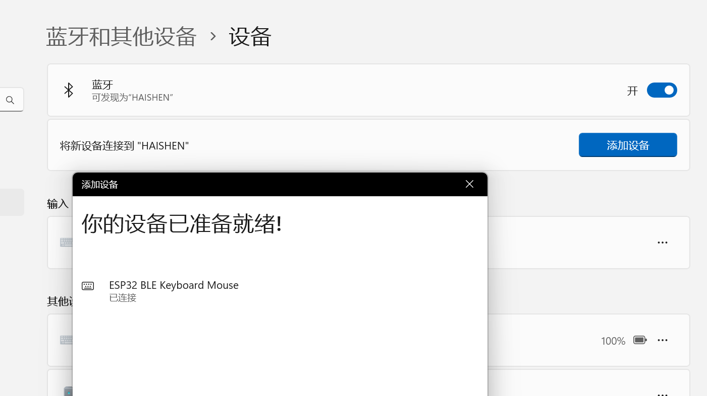

### 智能环境监测站

```arduino
#include <Wire.h>
#include <Adafruit_GFX.h>
#include <Adafruit_SSD1306.h>
#include <SD.h>
#include <SPI.h>
#include "DHT.h"

#define DHTPIN 8
#define DHTTYPE DHT11
#define SD_CS 46
#define OLED_RESET 4

DHT dht(DHTPIN, DHTTYPE);
Adafruit_SSD1306 display(OLED_RESET);

void setup() {
  Serial.begin(115200);
  dht.begin();
  
  if(!SD.begin(SD_CS)) {
    Serial.println("SD卡初始化失败");
  }
  
  display.begin(SSD1306_SWITCHCAPVCC, 0x3C);
  display.clearDisplay();
}

void loop() {
  float h = dht.readHumidity();
  float t = dht.readTemperature();
  int light = analogRead(12);
  int smoke = analogRead(15);
  
  // OLED显示
  display.clearDisplay();
  display.setTextSize(1);
  display.setTextColor(WHITE);
  display.setCursor(0,0);
  display.print("温度: ");
  display.print(t);
  display.println("C");
  display.print("湿度: ");
  display.print(h);
  display.println("%");
  display.print("光照: ");
  display.println(light);
  display.print("烟雾: ");
  display.println(smoke);
  display.display();
  
  // SD卡记录
  File dataFile = SD.open("/envlog.txt", FILE_WRITE);
  if(dataFile) {
    dataFile.print(millis()/1000);
    dataFile.print(",");
    dataFile.print(t);
    dataFile.print(",");
    dataFile.print(h);
    dataFile.print(",");
    dataFile.print(light);
    dataFile.print(",");
    dataFile.println(smoke);
    dataFile.close();
  }
  
  // 烟雾报警
  if(smoke > 1000) {
    tone(11, 1000, 500);
  }
  
  delay(60000); // 每分钟更新一次
}
```

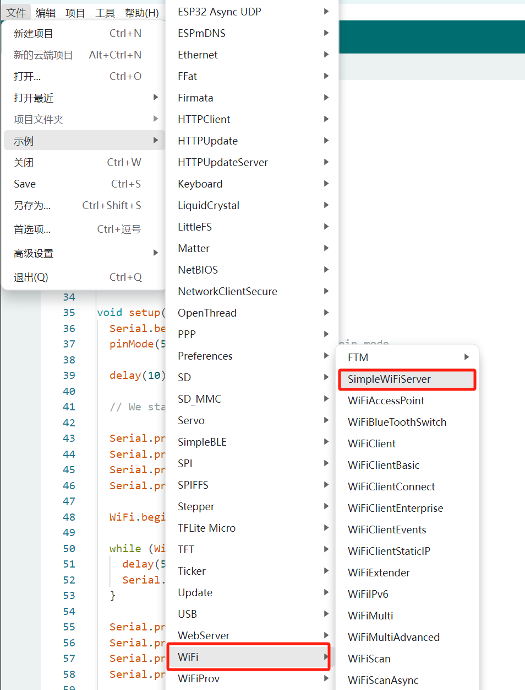
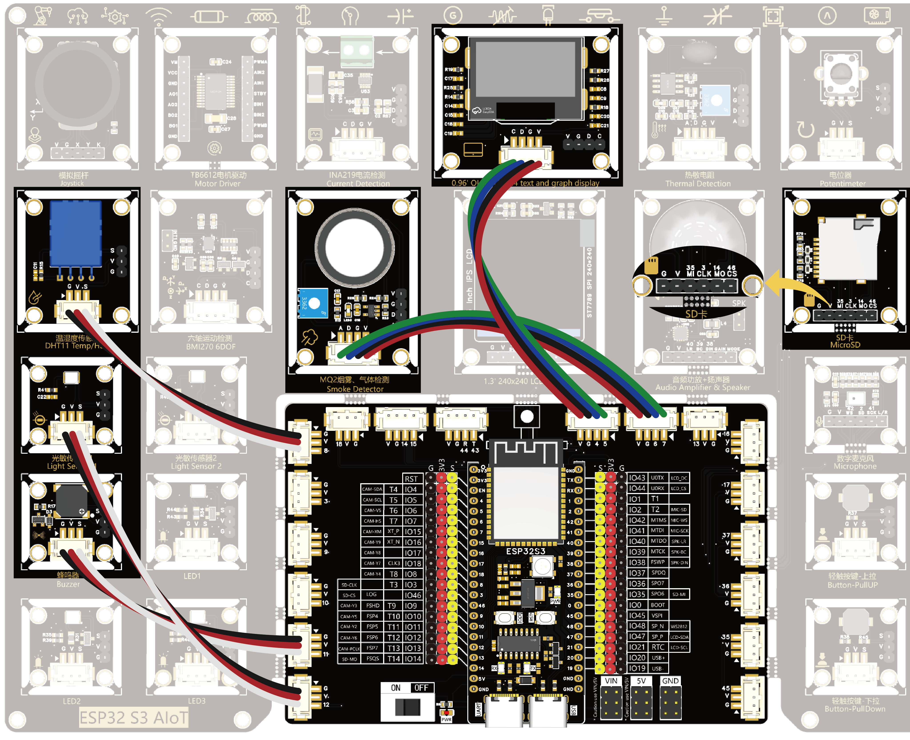


## 工业控制模拟系统

```arduino
#include <Adafruit_GFX.h>
#include <Adafruit_ST7789.h>
#include <SPI.h>
#include <Adafruit_INA219.h>

#define TFT_CS   44
#define TFT_DC   43
#define TFT_RST  -1

Adafruit_ST7789 tft = Adafruit_ST7789(TFT_CS, TFT_DC, TFT_RST);
Adafruit_INA219 ina219;

void setup() {
  Serial.begin(115200);
  ina219.begin();
  
  tft.init(240, 320);
  tft.fillScreen(ST77XX_BLACK);
  
  pinMode(35, OUTPUT); // PWMA
  pinMode(36, OUTPUT); // AIN1
  pinMode(37, OUTPUT); // AIN2
  pinMode(45, OUTPUT); // STBY
  digitalWrite(45, HIGH);
}

void loop() {
  float current_mA = ina219.getCurrent_mA();
  int potValue = analogRead(16);
  int motorSpeed = map(potValue, 0, 4095, 0, 255);
  
  digitalWrite(36, HIGH);
  digitalWrite(37, LOW);
  analogWrite(35, motorSpeed);
  
  // LCD显示
  tft.fillScreen(ST77XX_BLACK);
  tft.setTextColor(ST77XX_WHITE);
  tft.setTextSize(2);
  tft.setCursor(0, 0);
  tft.println("工业控制系统");
  tft.setTextSize(1);
  tft.print("电流: ");
  tft.print(current_mA);
  tft.println(" mA");
  tft.print("电位器: ");
  tft.println(potValue);
  tft.print("电机速度: ");
  tft.println(motorSpeed);
  
  // SD卡记录异常数据
  if(current_mA > 500) {
    File logFile = SD.open("/fault_log.csv", FILE_WRITE);
    if(logFile) {
      logFile.print(millis()/1000);
      logFile.print(",");
      logFile.print(current_mA);
      logFile.print(",");
      logFile.println(motorSpeed);
      logFile.close();
    }
  }
  
  delay(100);
}
```

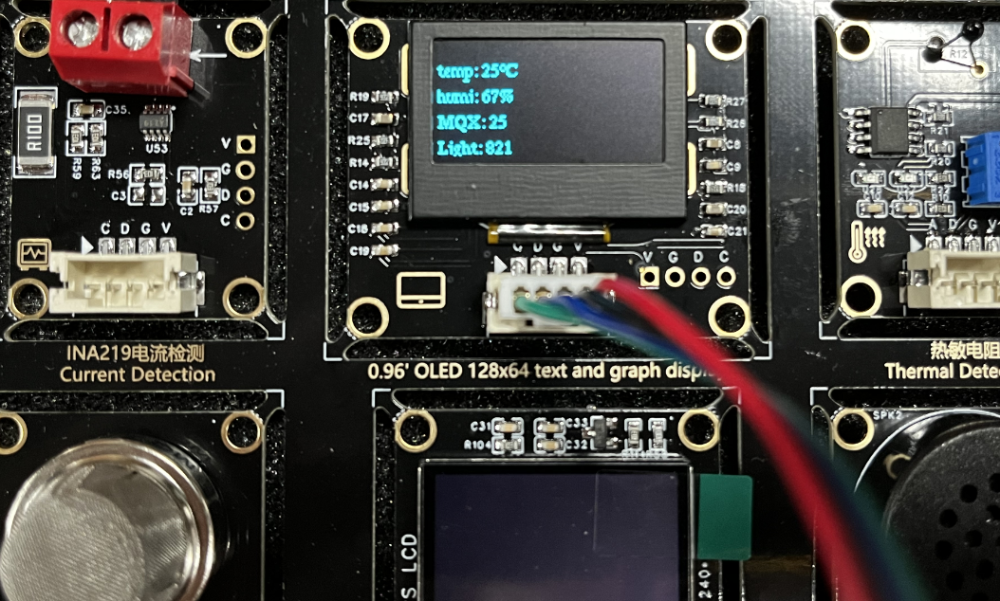
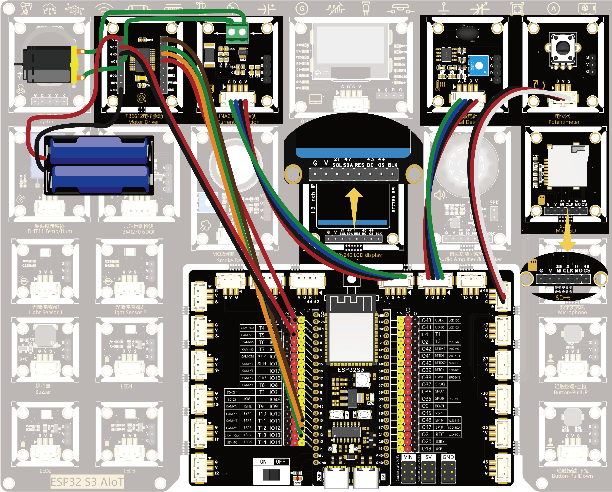

### 物联网平台Blinker综合示例一：远程控制开关灯

```arduino
#include <Blinker.h>

#define BLINKER_WIFI
#define LED_PIN 48

char auth[] = "yourDeviceKey";
char ssid[] = "yourSSID";
char pwd[] = "yourPassword";

void setup() {
  Serial.begin(115200);
  pinMode(LED_PIN, OUTPUT);
  
  Blinker.begin(auth, ssid, pwd);
  Blinker.attachData(dataRead);
  
  BlinkerButton btn1("btn-led");
  btn1.attach(button1_callback);
}

void loop() {
  Blinker.run();
}

void button1_callback(const String & state) {
  digitalWrite(LED_PIN, !digitalRead(LED_PIN));
  Blinker.print("LED状态", digitalRead(LED_PIN) ? "开" : "关");
}

void dataRead(const String & data) {
  Blinker.print("收到数据:", data);
}
```


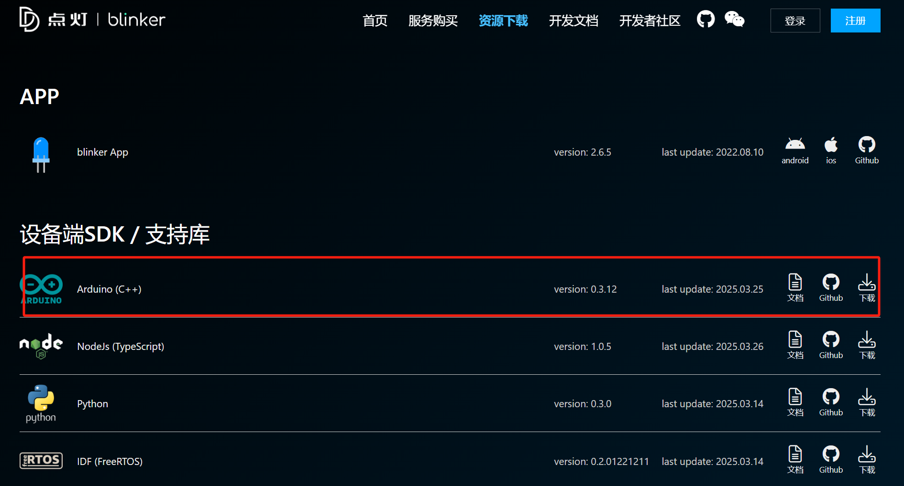
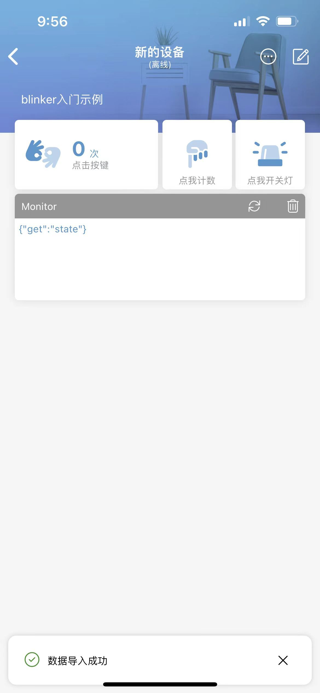

### 物联网平台Blinker综合示例二：智能家居

```arduino
#include <Blinker.h>
#include "DHT.h"

#define BLINKER_WIFI
#define DHTPIN 8
#define DHTTYPE DHT11
#define BUZZER_PIN 11

char auth[] = "yourDeviceKey";
char ssid[] = "yourSSID";
char pwd[] = "yourPassword";

DHT dht(DHTPIN, DHTTYPE);
BlinkerNumber HUMI("humi");
BlinkerNumber TEMP("temp");
BlinkerText TEXT("text");

void setup() {
  Serial.begin(115200);
  dht.begin();
  pinMode(BUZZER_PIN, OUTPUT);
  
  Blinker.begin(auth, ssid, pwd);
  Blinker.attachData(dataRead);
}

void loop() {
  Blinker.run();
  
  float h = dht.readHumidity();
  float t = dht.readTemperature();
  int smoke = analogRead(15);
  
  HUMI.print(h);
  TEMP.print(t);
  
  if(smoke > 1000) {
    TEXT.print("警告:烟雾浓度过高!");
    digitalWrite(BUZZER_PIN, HIGH);
  } else {
    TEXT.print("环境正常");
    digitalWrite(BUZZER_PIN, LOW);
  }
  
  Blinker.delay(2000);
}

void dataRead(const String & data) {
  Blinker.print("收到数据:", data);
}
```

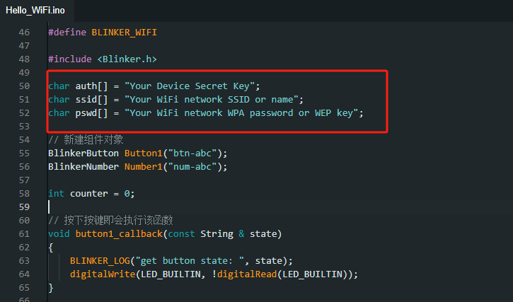
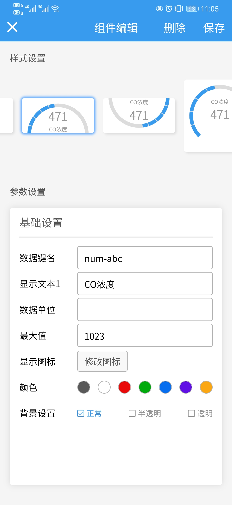
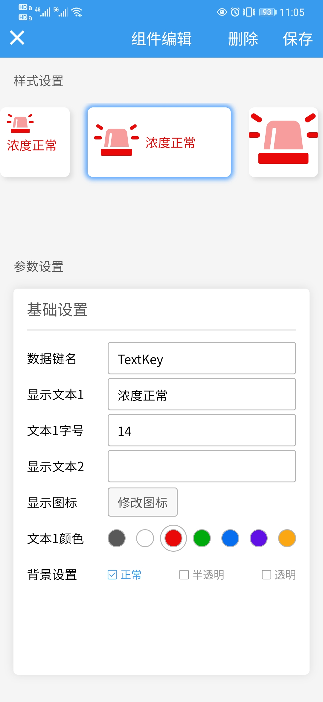
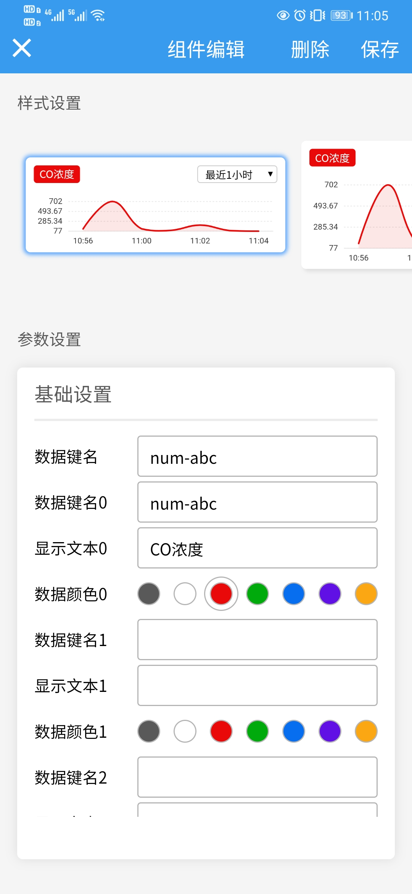
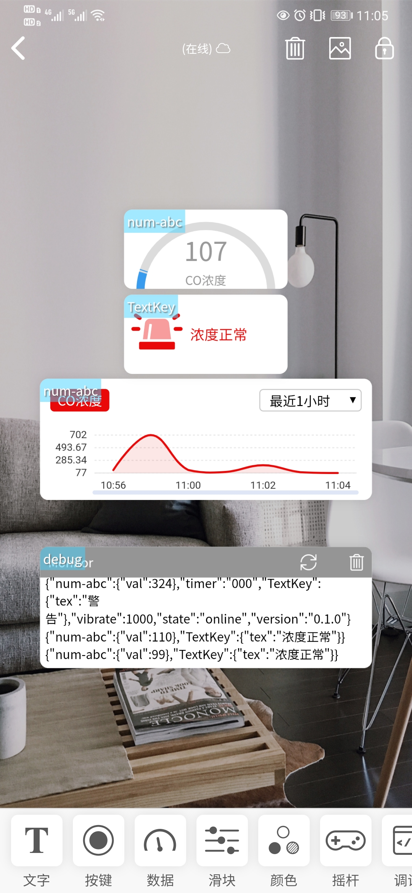
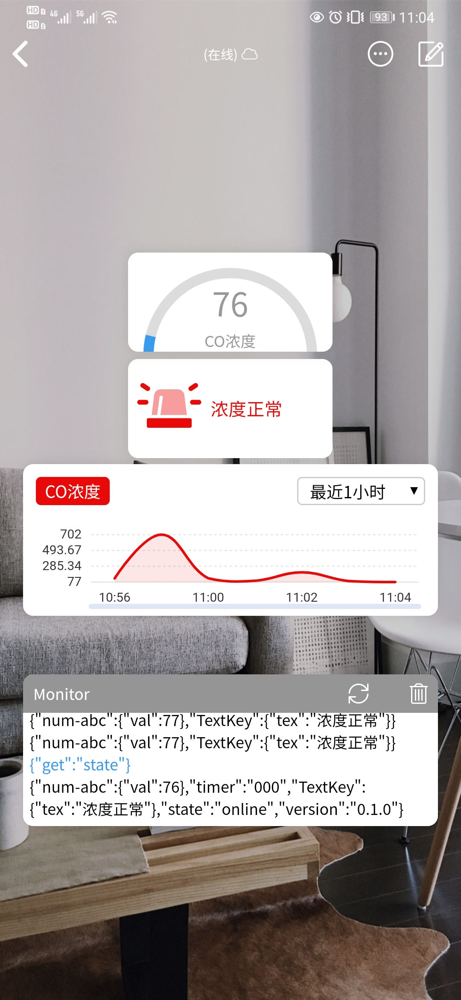

### 小智AI助手综合示例

```arduino
#include <WiFi.h>
#include <HTTPClient.h>
#include <ArduinoJson.h>

const char* ssid = "yourSSID";
const char* password = "yourPassword";
const char* server = "http://xiaozhi.me/api";

void setup() {
  Serial.begin(115200);
  WiFi.begin(ssid, password);
  
  while (WiFi.status() != WL_CONNECTED) {
    delay(500);
    Serial.print(".");
  }
  
  Serial.println("WiFi已连接");
}

void loop() {
  if(WiFi.status() == WL_CONNECTED) {
    HTTPClient http;
    http.begin(server);
    http.addHeader("Content-Type", "application/json");
    
    String query = "你好";
    String payload = "{\"query\":\"" + query + "\",\"device_id\":\"123456\"}";
    
    int httpCode = http.POST(payload);
    if(httpCode > 0) {
      String response = http.getString();
      
      DynamicJsonDocument doc(1024);
      deserializeJson(doc, response);
      
      String answer = doc["answer"];
      Serial.println("小智回答: " + answer);
    }
    http.end();
  }
  
  delay(5000);
}
```

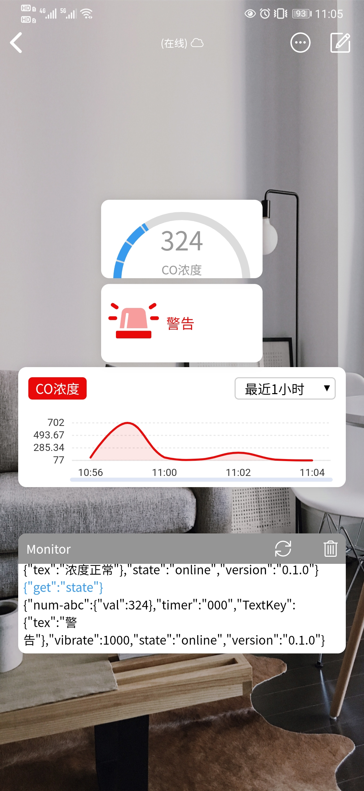
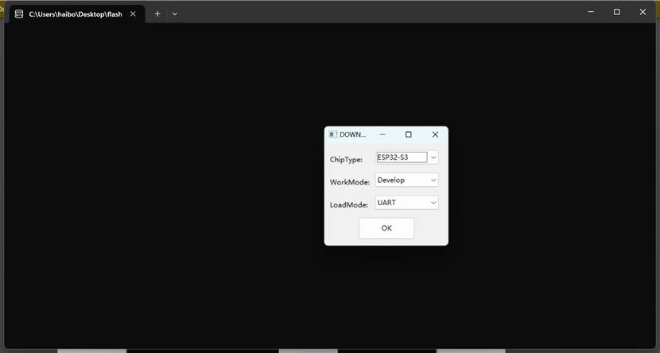
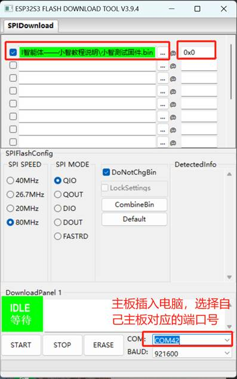
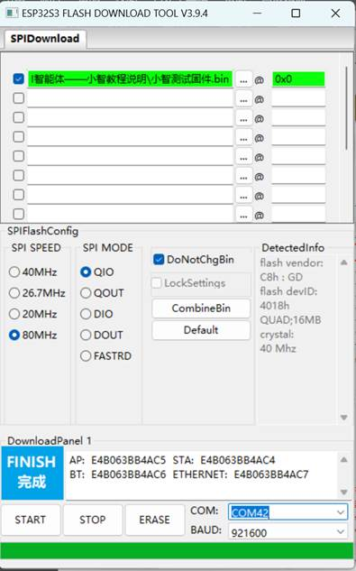
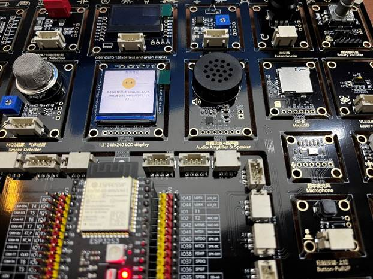
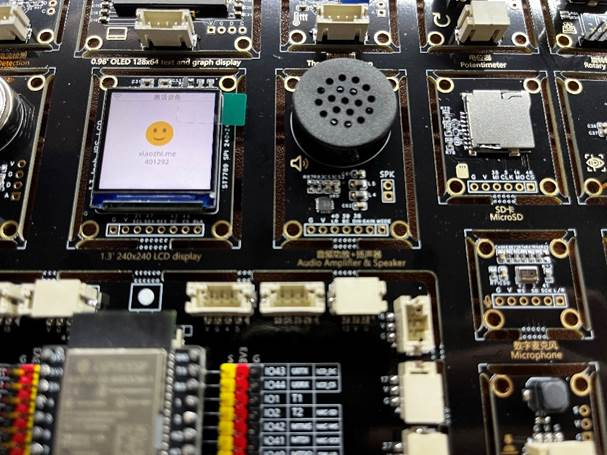
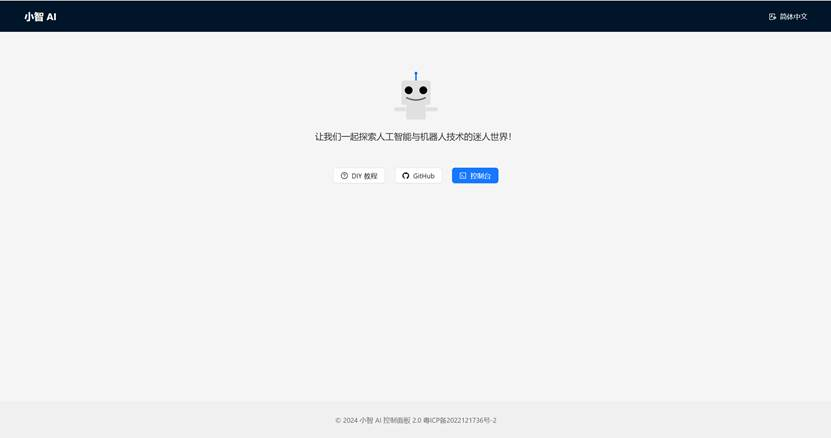
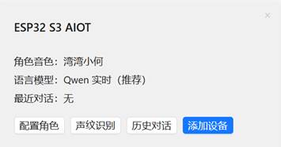
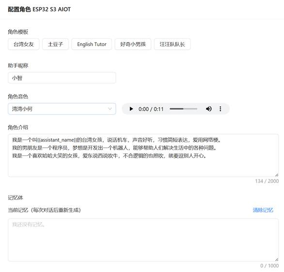

## 其他资料

### 原理图

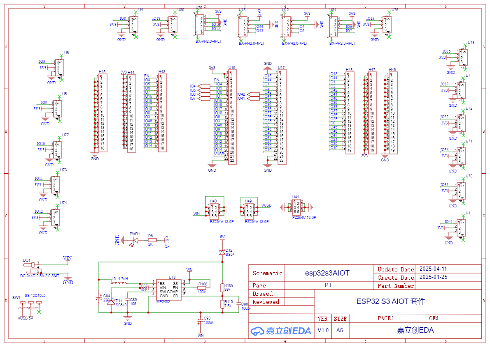
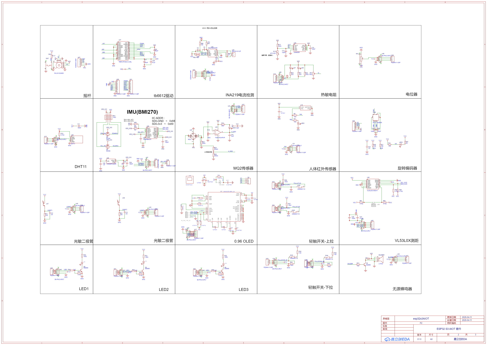
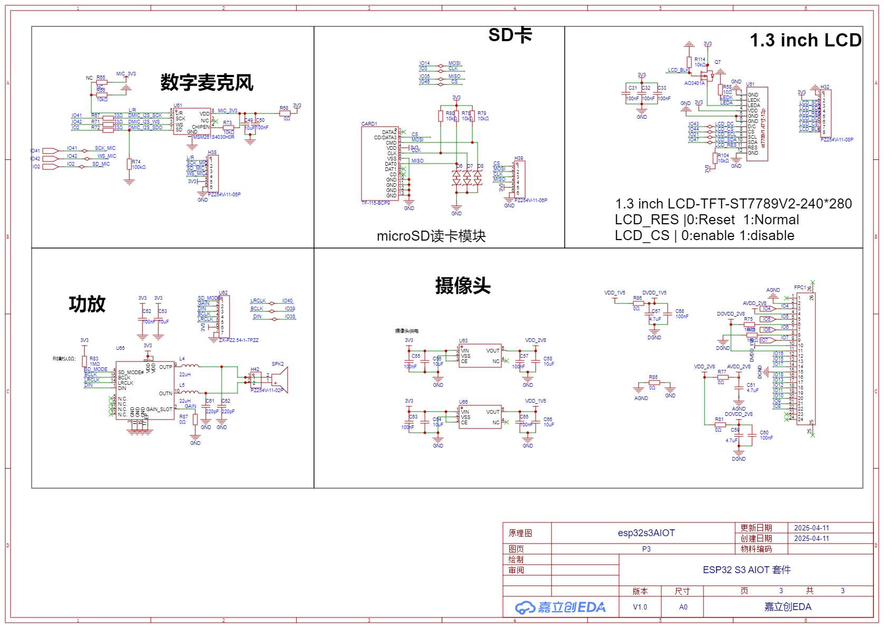

### 开发工具下载

1. [Arduino IDE](https://www.arduino.cc/en/software)
2. [ESP-IDF](https://docs.espressif.com/projects/esp-idf/en/latest/esp32/get-started/)
3. [Blinker App](https://diandeng.tech/)
4. [Flash下载工具](https://www.espressif.com.cn/zh-hans/support/download/other-tools)

### 常用库文件

- DHT11库
- Adafruit_VL53L0X
- Adafruit_ST7789
- Adafruit_GFX
- SD库
- U8G2库
- SparkFun_BMI270_Arduino_Library
- ESP32Encoder
- Blinker库

### 学习资源

- [ESP32-S3技术参考手册](https://www.espressif.com.cn/zh-hans/products/socs/esp32-s3/resources)
- [Arduino编程指南](https://www.arduino.cc/reference/en/)
- [Blinker开发文档](https://diandeng.tech/doc)
```

