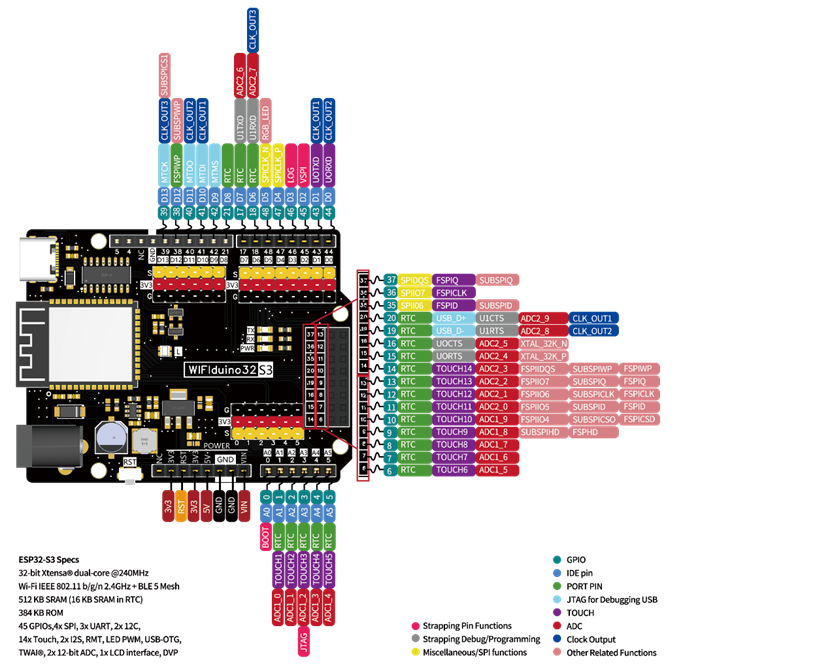
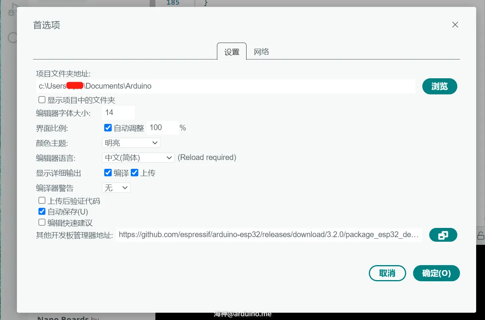
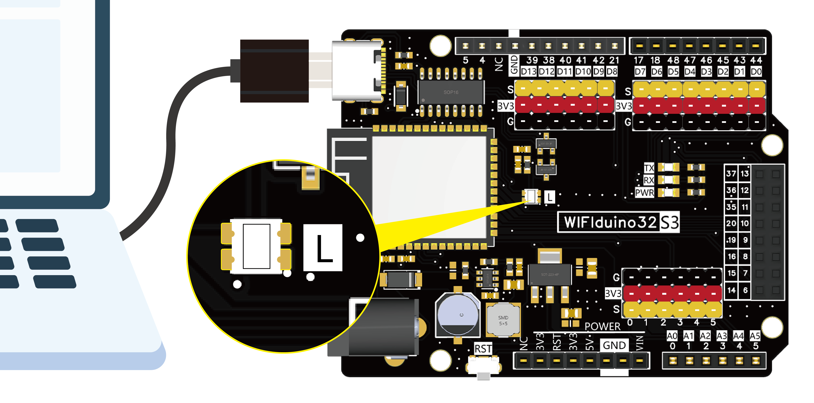
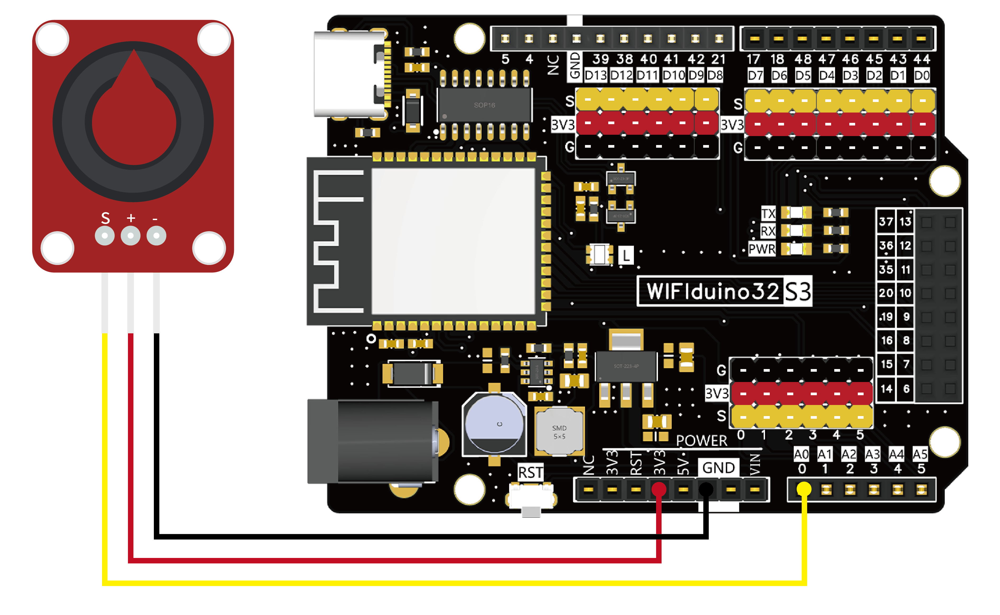
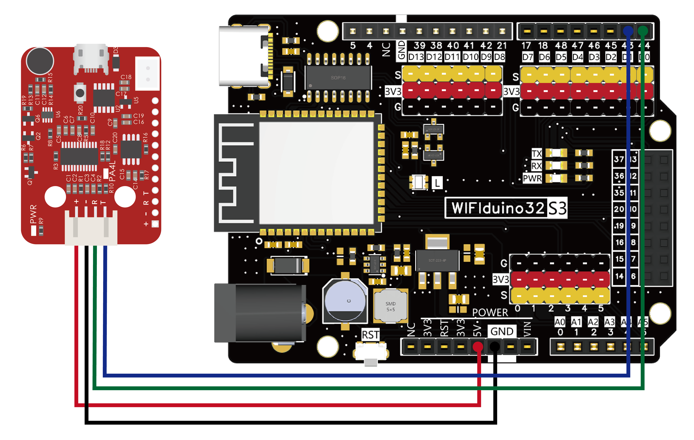
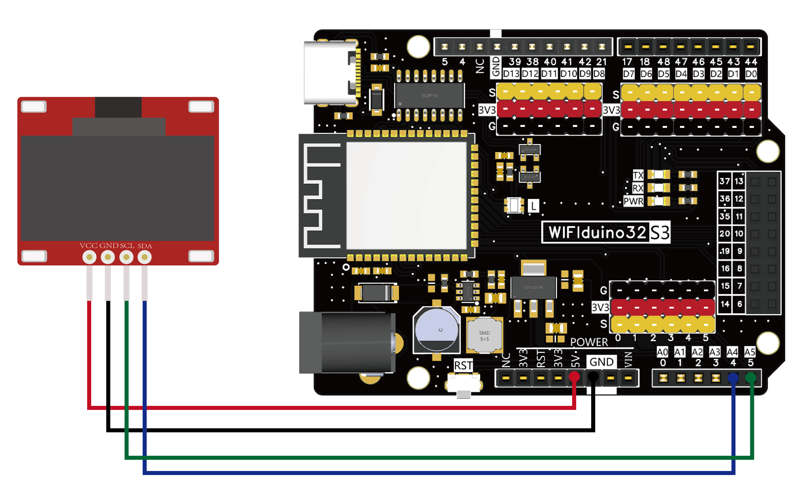

# Wifiduino32S3 资料文档

## 产品概述

Wifiduino32-S3是openjumper基于乐鑫ESP32-S3 WiFi/蓝牙双模物联网芯片设计的紧凑型开发平台。该板专为物联网设备开发、智能家居控制和嵌入式系统设计而优化，提供丰富的外设接口和强大的处理能力，适合各种无线连接应用场景。

## 主要特性

- **接口兼容**：Arduino UNO接口  
- **高性能处理器**：搭载Xtensa® 32位LX7双核处理器，主频高达240MHz  
- **无线连接**：支持2.4GHz WiFi 4和蓝牙5(LE)双模连接  
- **丰富内存**：内置512KB SRAM + 384KB ROM，可选配外部Flash  
- **多功能IO**：提供45个可编程GPIO，支持多种外设接口  
- **低功耗设计**：支持多种低功耗模式，适合电池供电应用  
- **开发友好**：兼容Arduino、ESP-IDF等多种开发环境  

## 核心参数

| 参数项          | 规格                                   |
|-----------------|----------------------------------------|
| **主控芯片**    | ESP32-S3 (Xtensa® LX7双核)             |
| **CPU主频**     | 240MHz                                 |
| **SRAM**        | 512KB                                  |
| **ROM**         | 384KB                                  |
| **外扩Psram**   | 8MB                                    |
| **外扩Flash**   | 默认16MB (可选8MB即N8R8)               |
| **无线标准**    | WiFi 802.11 b/g/n (2.4GHz), 蓝牙5.0 LE |

## 接口资源



- **GPIO**：45个（含ADC、DAC、PWM等复用）  
- **SPI**：3个  
- **I2C**：2个  
- **UART**：3个（含调试用USB转串口）  
- **USB**：OTG 1个（支持主机/设备模式）  
- **ADC**：12位精度，20个通道  
- **DAC**：8位精度，2个通道  
- **PWM**：16个通道  
- **JTAG**：1个（支持调试）  

## 使用教程（以Arduino开发为例）

### Arduino开发环境安装

1. 官网下载最新版本Arduino IDE：[https://www.arduino.cc/en/software](https://www.arduino.cc/en/software)  
2. 添加ESP32板卡支持：  
   - 在**文件 > 首选项 > 其他开发板管理地址**中添加：  
     `https://github.com/espressif/arduino-esp32/releases/download/3.2.0/package_esp32_dev_index_cn.json`  
   - 打开**工具 > 开发板 > 开发板管理**，搜索`esp32`并在线安装。  


+ 首选项设置



+ 开发板管理


### 示例程序

#### 1. 点灯程序
控制板载LED（连接在48号引脚）交替亮灭。  


#### 2. 网页WiFi控制LED
修改示例代码中的`SSID`和`password`，通过串口打印的IP地址进入网页控制LED。  

#### 3. Blinker WiFi远程控制LED
- 下载Blinker库：[https://diandeng.tech/dev](https://diandeng.tech/dev)  
- 在Arduino IDE中导入库：**项目 > 导入库 > 添加Zip库**。  
- 修改示例代码中的`auth`（设备密钥）、`SSID`和`password`。  

#### 4. Blinker 蓝牙控制LED
- 上传示例代码：**文件 > 示例 > Blinker > hello_BLE**。  
- 在Blinker App中添加蓝牙设备并控制LED。  
```arduino

#define BLINKER_BLE

#include <Blinker.h>

BlinkerButton Button1("btn-abc");
BlinkerNumber Number1("num-abc");

int counter = 0;

void button1_callback(const String & state)
{
    BLINKER_LOG("get button state: ", state);
    digitalWrite(LED_BUILTIN, !digitalRead(LED_BUILTIN));
}

void dataRead(const String & data)
{
    BLINKER_LOG("Blinker readString: ", data);
    counter++;
    Number1.print(counter);
}

void setup()
{
    Serial.begin(115200);
    BLINKER_DEBUG.stream(Serial);
    
    pinMode(LED_BUILTIN, OUTPUT);
    digitalWrite(LED_BUILTIN, HIGH);
    
    Blinker.begin();
    Blinker.attachData(dataRead);

    Button1.attach(button1_callback);
}

void loop()
{
    Blinker.run();
}
```

#### 5. GPIO驱动
实现流水灯效果，连接LED至Arduino兼容IO口。  

```arduino
const int ledPins[] = {D0, D1, D2, D3, D4, D5, D6, D7, D8, D9, D10, D11, D12, D13};
const int numLeds = sizeof(ledPins) / sizeof(ledPins[0]);

void setup() {
  // 初始化所有LED引脚为输出模式
  for (int i = 0; i < numLeds; i++) {
    pinMode(ledPins[i], OUTPUT);
    digitalWrite(ledPins[i], LOW); // 确保所有LED初始状态为关闭
  }
}

void loop() {
  // 依次点亮每个LED
  for (int i = 0; i < numLeds; i++) {
    digitalWrite(ledPins[i], HIGH); // 点亮LED
    delay(1000); // 延迟200毫秒
    digitalWrite(ledPins[i], LOW); // 关闭LED
  }
}
```


#### 6. 模拟(PWM)输出
驱动板载LED实现呼吸灯效果。  

```arduino
const int ledPin = 48;  // LED连接在8号引脚

void setup() {
  pinMode(ledPin, OUTPUT);  // 设置LED引脚为输出模式
}

void loop() {
  // 增加亮度
  for (int brightness = 0; brightness <= 255; brightness++) {
    analogWrite(ledPin, brightness);  // 设置LED亮度
    delay(10);  // 调整延迟以改变呼吸速度
  }

  // 减少亮度
  for (int brightness = 255; brightness >= 0; brightness--) {
    analogWrite(ledPin, brightness);
    delay(10);
  }
}
```


#### 7. 模拟输入
读取电位器数值并通过串口打印。  
 

```arduino
void setup() {
  Serial.begin(115200);  // 初始化串口通信
}

void loop() {
  int sensorValue = analogRead(A0);  // 读取A0引脚的模拟值
  Serial.println(sensorValue);       // 打印读取到的值
  delay(500);                        // 延迟500毫秒
}
```


#### 8. 串口通信（驱动语音识别模块）
使用UART串口连接语音识别模块，识别指令控制LED。  


```arduino
void setup() {

Serial.begin(115200);//调试输出信息
pinMode(48,OUTPUT);
delay(5000);
Serial.write(0x01);
delay(1000);

}

void loop() {
    if(Serial.available() > 0){
      byte SerialNowData = 0;
      SerialNowData = Serial.read();
      delay(10);
      if(SerialNowData == 0x01)//识别到打开空调
          digitalWrite(8,LOW);
      else if(SerialNowData == 0x02)//识别到关闭空调
          digitalWrite(8,HIGH);
  
   }
}
```


#### 9. I2C（SSD1306 OLED）
- 安装U8g2库：**工具 > 库管理**搜索并安装。  
- 接线：OLED的`VCC-5V`、`GND-GND`、`SDA-A4`、`SCL-A5`。  


```arduino
#include <U8g2lib.h>
 
#ifdef U8X8_HAVE_HW_SPI
#include <SPI.h>
#endif
#ifdef U8X8_HAVE_HW_I2C
#include <Wire.h>
#endif

U8G2_SSD1306_128X64_NONAME_F_SW_I2C u8g2(U8G2_R0, /* 时钟=*/ SCL, /* 数据=*/ SDA, /* 重置=*/ U8X8_PIN_NONE);    // 低速I2C
 
void setup(void) {
  u8g2.begin();
//  u8x8.setFlipMode(1);   // 设置数字从1到3，屏幕文字将旋转180度
}
 
void loop(void) {
  u8g2.clearBuffer();                   // 清除内部内存
  u8g2.setFont(u8g2_font_ncenB08_tr);   // 选择合适的字体
  u8g2.drawStr(0,15,"Hello World!");    // 将内容写入内部内存
  u8g2.drawStr(0,30,"Hello World!");
  u8g2.drawStr(0,40,"Hello World!");
  u8g2.sendBuffer();                    // 将内部内存传输到显示器
//  delay(1000);  
}
```


## 其他资料
- Wifiduino32S3原理图  
- ESP32模组资料  