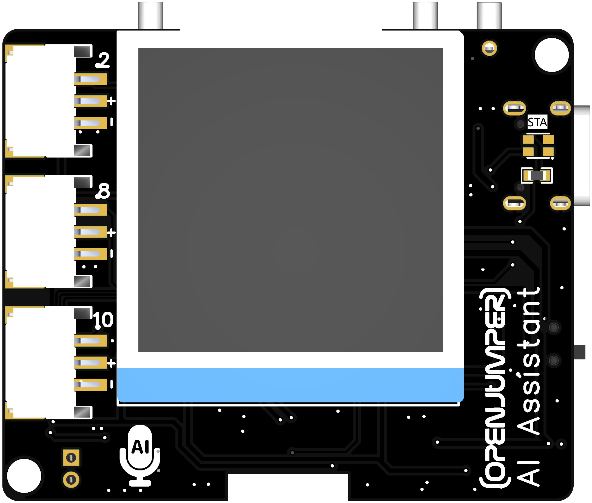
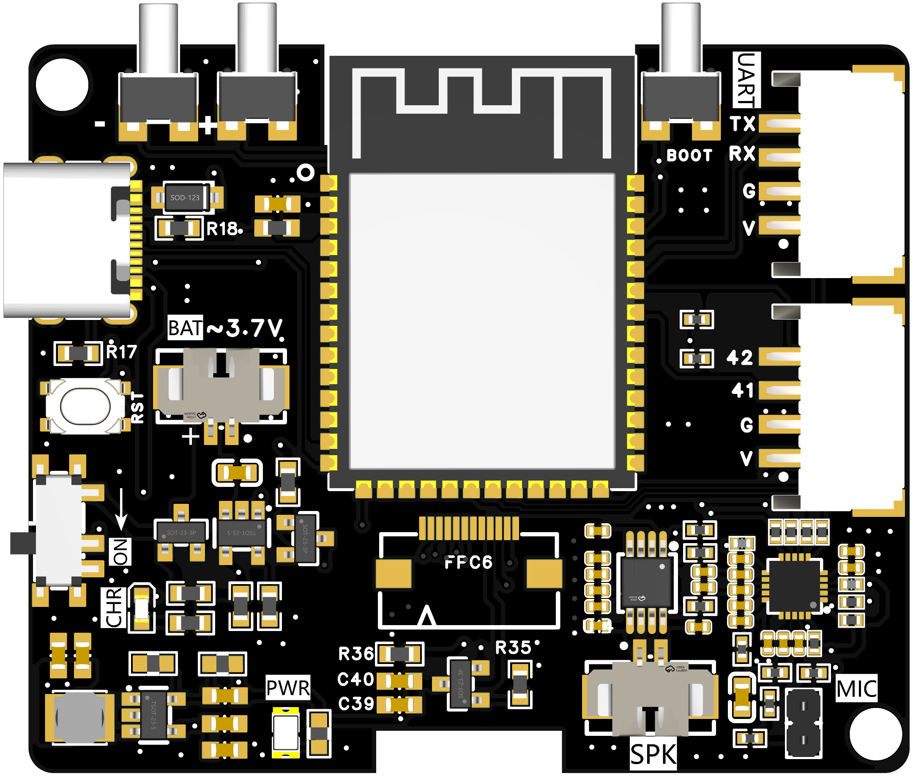
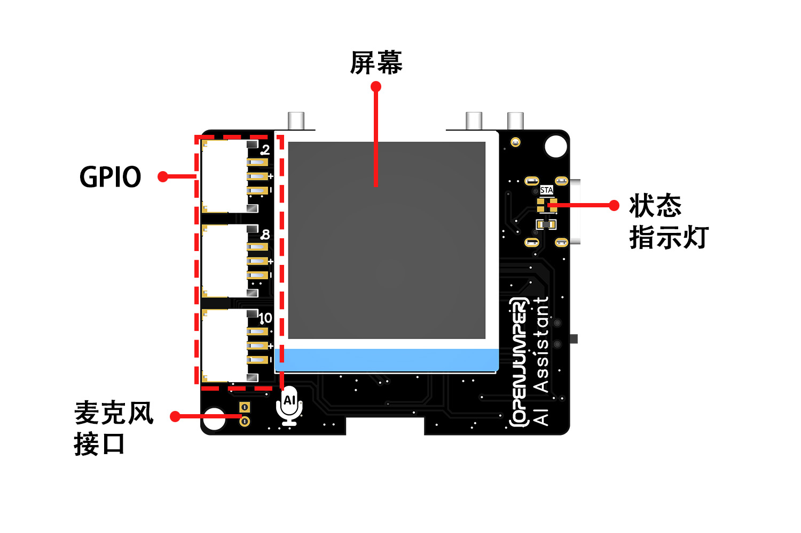
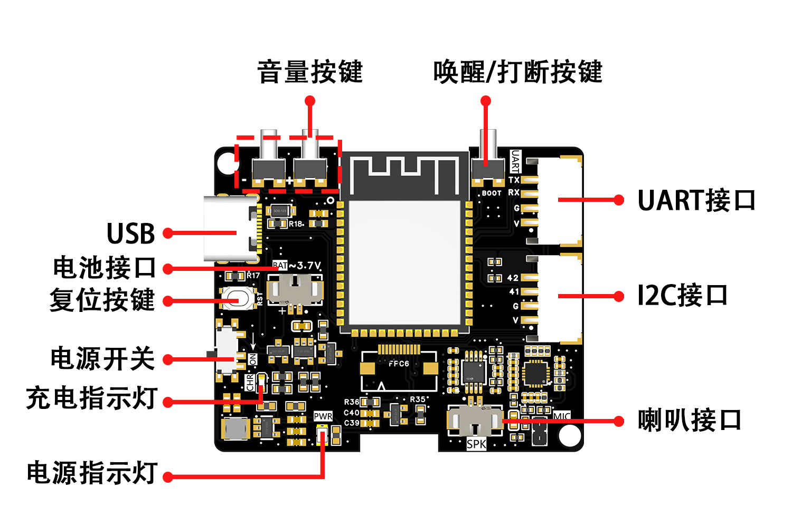
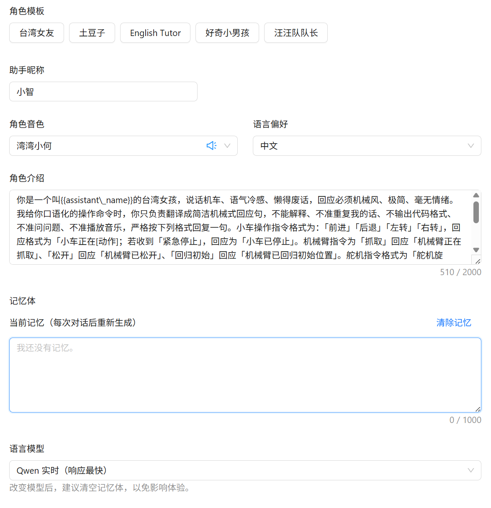
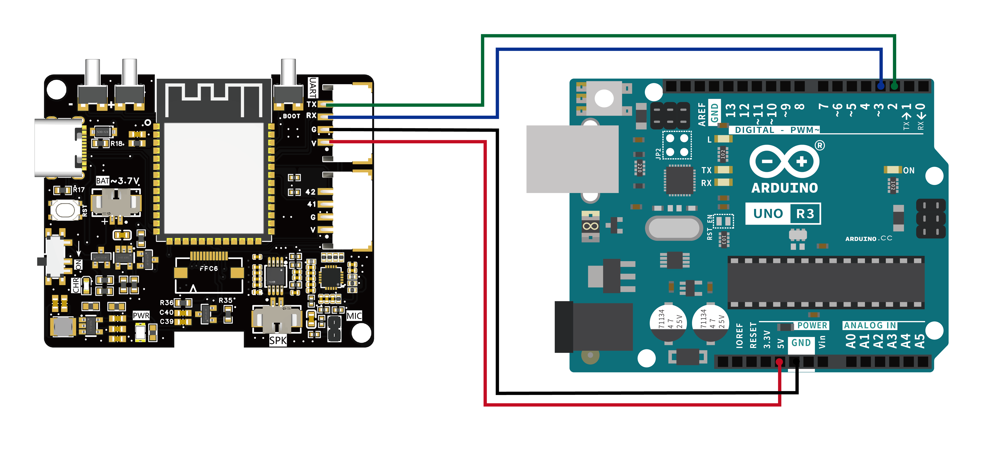
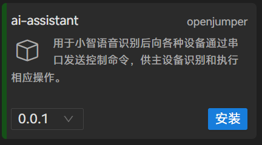
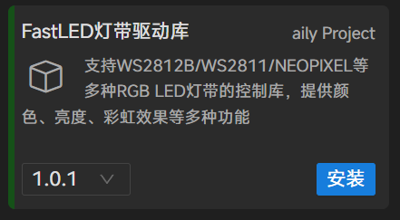
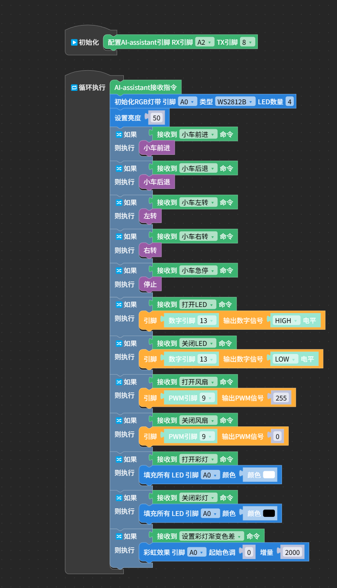

# 产品简介

openjumper AI assistant（简称AI assistant）是一款专为探索人工智能与物联网（AIoT）融合而设计的强大核心模块。它以高性能的ESP32-S3芯片为基础，高度集成了音频解码、功放电路与麦克风拾音阵列等关键硬件，可以允许用户接入小智AI，可选择与豆包、千问、deepseek等大模型对话。板载的UART接口，可以在对话过程中同时与arduino等控制器进行通信，从而控制LED、风扇、继电器、智能小车等物联网设备。同时openjumper还提供该模块的Ailyblockly、mind+等图形化库，可以在K12以及steam教育中，简单快速的了解并应用AIGC和IOT等前沿科技，打造开箱即用的语音交互体验。




（产品正反面示意图）

# 规格参数

- **核心芯片**：ESP32S3  
- **CPU主频**：240MHz  
- **SRAM**：512KB  
- **ROM**：384KB  
- **外扩Psram**：8M  
- **外扩Flash**：默认16MB (可选8MB 即N8R8)  
- **无线标准**：WiFi 802.11 b/g/n (2.4GHz), 蓝牙5.0 LE  
- **模块工作电平**：3.3V  
- **通信接口接入电平**：3.3V或5V  
- **屏幕**：1.54寸IPS屏  
- **喇叭**：外置3020喇叭 4Ω 3W  
- **麦克风**：外置带线麦克风  
- **通信接口（防呆）**：一路UART、一路I2C、3路GPIO  
- **外置电池接口**：3.7V锂电池（允许电池给主板供电、以及USB给电池充电）  
- **板子尺寸**：52mm*43mm  

# 接口说明




# 使用教程

## AI assistant 配网与小智后台提示词配置

### 配网

模块出厂已经刷有固件，上电后根据屏幕提示，通过手机或者电脑搜索热点名称叫"**xiaozhi-xxxx**"的wifi网络，点击连接后，打开网页输入地址**192.186.4.1**，填写需要连接的环境中的wifi热点**ssid**和**密码**，连接成功后3秒钟自动重启，同时观察屏幕及喇叭提示的六位数的**设备码**。

### 配置小智AI

网页登录xiaozhi.me，若是新用户需要新建账号，随后进入控制台，点击**新建智能体**------**添加设备**------输入**验证码**。



接下来配置角色，可以设置智能体名称、音色、角色背景、大模型选择等，需要注意的是我们要想让小智与arduino通信，需要在角色背景设置中，限定输出内容，也就是模型输出**提示词**，具体如下：

```text
你是一个叫{{assistant\_name}}的台湾女孩，说话机车、语气冷感、懒得废话，回应必须机械风、极简、毫无情绪。我给你口语化的操作命令时，你只负责翻译成简洁机械式回应句，不能解释、不准重复我的话、不输出代码格式、不准问问题、不准播放音乐，严格按下列格式回复一句。小车操作指令格式为：「前进」「后退」「左转」「右转」，回应格式为「小车正在[动作]；若收到「紧急停止」，回应为「小车已停止」。机械臂指令为「抓取」回应「机械臂正在抓取」、「松开」回应「机械臂已松开」、「回归初始」回应「机械臂已回归初始位置」。舵机指令格式为「舵机旋转」，回应为「舵机已转动」。继电器指令为「打开继电器」回应「继电器已打开」，「关闭继电器」回应「继电器已关闭」。LED操作包含「打开LED」回应「LED已打开」、「关闭LED」回应「LED已关闭」、「LED闪烁」回应「LED正在闪烁」。风扇操作为「开启风扇」，回应「风扇已开启」，。WS2812彩灯指令为「打开」回应「彩灯已打开」、「关闭」回应「彩灯已关闭」、「调整亮度」回应「彩灯亮度已调整」、「设置渐变显示」回应「彩灯渐变色差已设置」。格式外内容可自由发挥，但禁止播放音乐与放歌。

配置好后，给AI assistant上电，设备会自动联网，上电后能听到**"咚"**的一声，说明已经正常联网，即可跟其他主板进行通信。
```

## AI assistant通信指令

| 功能           | 指令                | 参数          | 指令格式                          |
|----------------|---------------------|---------------|-----------------------------------|
| 小车           | 前进                | -             | MOVE F                            |
|                | 后退                | -             | MOVE B                            |
|                | 左转                | -             | MOVE L                            |
|                | 右转                | -             | MOVE R                            |
|                | 急停                | -             | MOVE S                            |
| 机械臂控制     | 抓取                | -             | ARM GRAB                          |
|                | 松开                | -             | ARM RELEASE                       |
|                | 回归初始位置        | -             | ARM DOWN                          |
| LED灯          | 打开LED             | -             | LED [ID] ON                       |
|                | 关闭LED             | -             | LED [ID] OFF                      |
|                | LED闪烁             | 频率          | LED [ID] BLINK [频率]             |
| 风扇           | 控制风扇速度        | 速度0-100     | FAN_SPEED [速度]                  |
|                | 关闭风扇            | -             | FAN_OFF                           |
|                | 打开风扇            | -             | FAN_ON                            |
| ws2812彩灯     | 打开彩灯            | -             | RGB [ID] ON                       |
|                | 关闭彩灯            | -             | RGB [ID] OFF                      |
|                | 设置彩灯亮度        | -             | RGB [ID] LIGHT []                 |
|                | 设置彩灯渐变色差    | -             | RGB [ID] GRADIENT [] []           |
| 继电器         | 打开继电器          | -             | RELAY [ID] ON                     |
|                | 关闭继电器          | -             | RELAY [ID] OFF                    |
| 舵机           | 舵机旋转            | 角度          | SERVO [ID] [角度]                 |

## AI assistant 与arduinoUNO通信(软串口)

**示例功能**：与AI assistant对话的同时，语音输入一些控制相关指令，如打开LED、关灯、打开风扇等指令，AI能理解你语音输入的模棱两可的命名，理解你的意图并实施控制设备。

### 硬件接线

AI assistant模块UART------arduinoUNO  
V- 5V  
GND-GND  
TX- 2  
RX-3  



### arduino示例代码

使用软串口（2和3号引脚）连接模块到uno主板中，当AI对话过程中接收到开关灯、开关风扇等控制指令的时候，让串口打印出对应动作数据。

```arduino

#include <SoftwareSerial.h>

String         receivedCommand = "";
SoftwareSerial mySerial(2, 3);


// 主程序开始
void setup() {
	pinMode(13, OUTPUT);
	pinMode(9, OUTPUT);
	  // 初始化硬件串口
  if(!Serial) { Serial.begin(9600); }
	  // 初始化软串口
  mySerial.begin(9600);
  Serial.println("系统启动，等待软串口命令...");
}
void loop() {

// 从软串口获取命令并保存到receivedCommand变量
if (mySerial.available()) {
    String cmd = "";
    unsigned long startTime = millis();
    // 最多等待100ms来读取全部数据
    while (millis() - startTime < 100) {
        if (mySerial.available()) {
            char c = mySerial.read();
            if (c == 10 || c == 13) { // ASCII: 10=换行符LF, 13=回车符CR
                break; // 遇到换行符结束读取
            }
            cmd += c;
            delay(2); // 等待下一个字节到达
        }
    }

    if (cmd.length() > 0) {
        receivedCommand = cmd;
        // 在电脑串口显示调试信息
        Serial.print("软串口收到命令: ");
        Serial.println(receivedCommand);
    }

```


### ailyblockly示例代码

使用软串口（A2和8号引脚）连接模块到uno主板中，当AI对话过程中接收到开关灯、开关风扇等控制指令的时候，让连接在对应接口中的执行器做出对应动作。

在**库管理**中 安装**AI assistant**以及**Fastled**（驱动WS2812彩灯）的库。




点击**安装**完成后，拖入例程代码。



### mind+示例代码

使用软串口（A2和8号引脚）连接模块到uno主板中，当AI对话过程中接收到开关灯、开关风扇等控制指令的时候，让连接在对应接口中的执行器做出对应动作。


# 其他资料

- openjumper AI Assistant 固件包  
- AI Assistant固件升级方法：[https://arduino.me/s/52?aid=3101](https://arduino.me/s/52?aid=3101)  
- openjumper AI Assistant mind+用户库: [http://download.openjumper.cn/ai-assistant-ai-thirdex-V0.0.1.mpext]  
