# ESP32S3 AIOT basicV2产品资料

## 套件简介

本系列教程是针对套件的学习教程，ESP32S3 AIOT BasicV2套件是一款基于esp32S3模组专为AIOT学习的集主板和传感器多合一综合套件，板中集成了多个子模块(按键、蜂鸣器、LED、光敏传感器、LCD、数字麦克风、SD卡、音频功放模块、温湿度传感器、气压传感器、摄像头)同时还匹配了丰富的教学例程及学习资料，可以满足大多数AI和物联网的学习及使用场景。

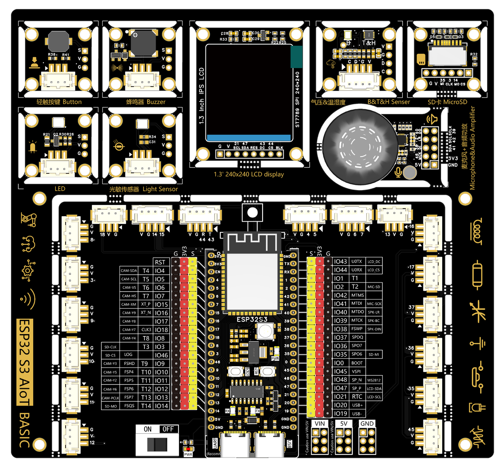

## 产品特点

- 9种模块+主控扩展单元 ALL IN ONE
- AI应用模块与主板接线板载通路，无需复杂接线可开发AI应用，兼容小智AI应用
- 插针与grove扩展接口，可适应更多硬件接入需求
- 支持外部供电，可为电机驱动以及其他物联网项目提供电力
- 可支持软件arduinoIDE\ESP-idf\aily blockly

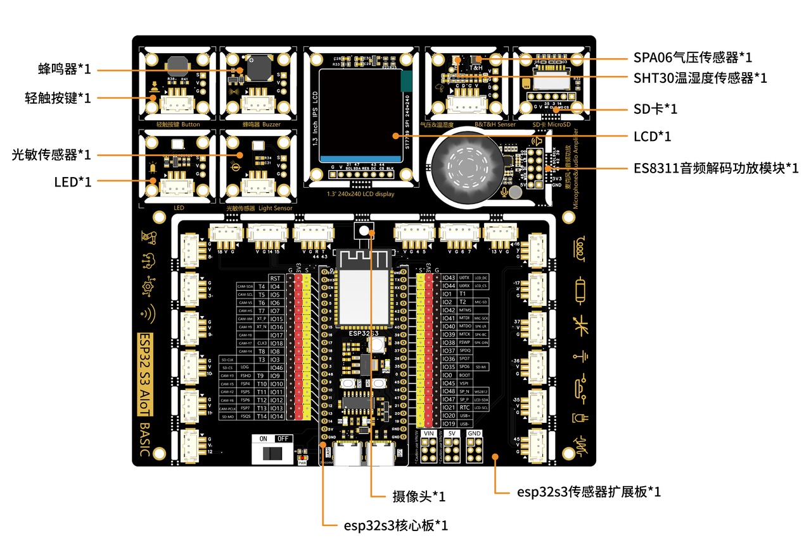

## 产品参数

- 传感器个数及种类：9个子模块
- 主控板（兼容）：esp32s3核心板
- 接口类型：排针+grove接口
- 模块工作电压：3.3V
- 外部供电电压（推荐）：6~12V
- PCB尺寸：145\*135mm
- 固定孔内径：3mm

## 引脚占用表

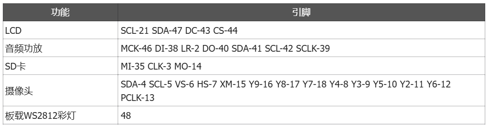

**点击图片可查看完整电子表格**

## 资料教程

在学习使用以下例程前，需按要求准备好软件开发环境，我们提供2种开发学习方式教程说明，一是图形化AI编程软件 Ailyblockly，二是arduino IDE。以下是环境安装及快速上手教程。

### 环境安装

Ailyblockly 开发环境安装及快速使用教程  
[esp32S3 arduino开发环境安装、驱动库安装、快速使用](https://arduino.me/a/3066)教程

## 基础示例

### 呼吸灯

将LED模块通过3P连接线连接至9号IO口，使用以下程序做一个呼吸灯效果

**Ailyblockly代码**

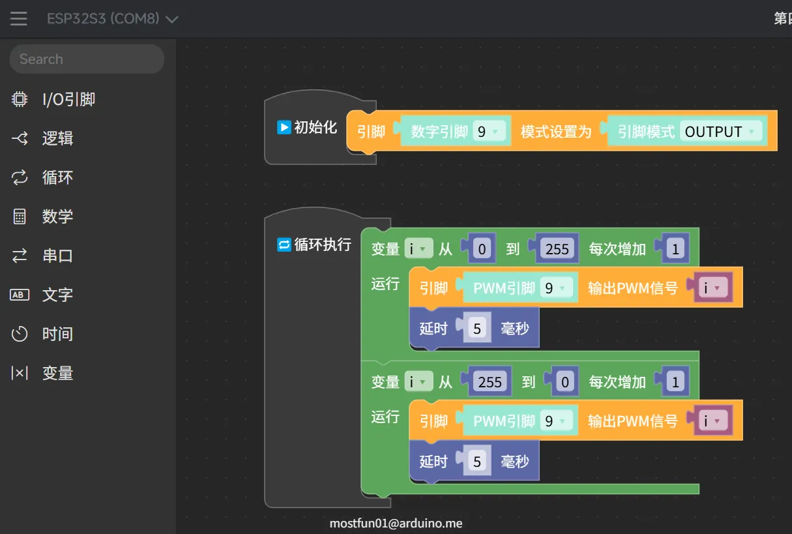

### 光敏检测

将LED模块通过3P线连接在9号IO，光敏模块连接在8号IO排针上，该例程实现光敏传感器随着光线变化，控制LED闪亮快慢，当光线越弱，闪灯越急促。

aily blockly示例

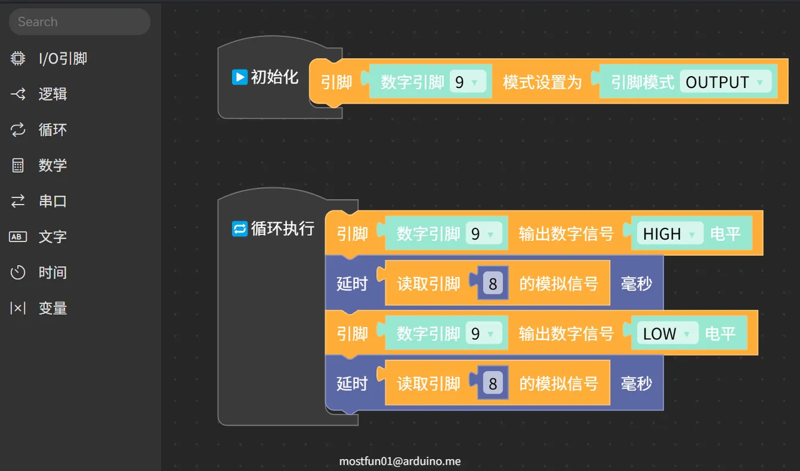

### 蜂鸣器

蜂鸣器通过震动发出声音，我们将蜂鸣器连接在3号GPIO中，通过程序使蜂鸣器播放音乐。

aily blockly示例

首先在库管理------安装ArduinoTone驱动库

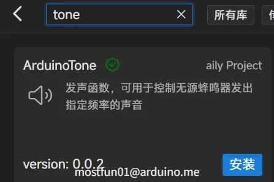

程序驱动蜂鸣器播放小星星音乐

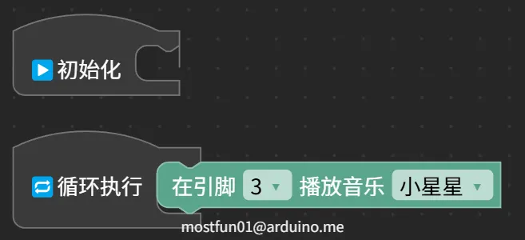

### 按键检测

使用onebutton库检测按键的轻按、长按、松开等状态，并用串口打印出来。例程中将按键通过3P线连接在6号IO排针上。

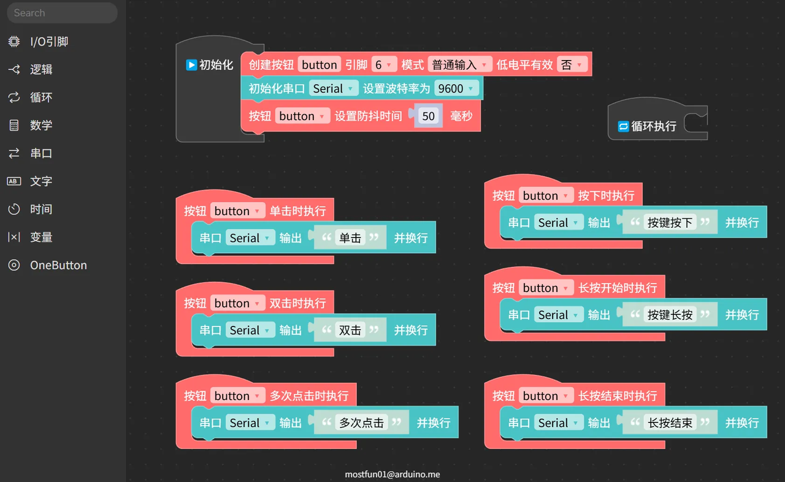

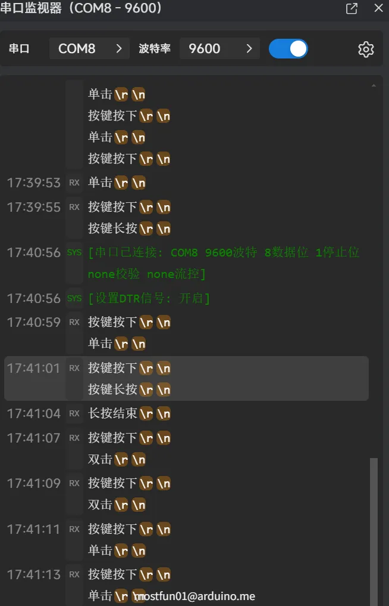

### 温湿度检测

将温湿度模块通过4P线连接在 4、5号引脚的座子上，该例程实现串口输出sht30传感器输出环境温度和湿度。

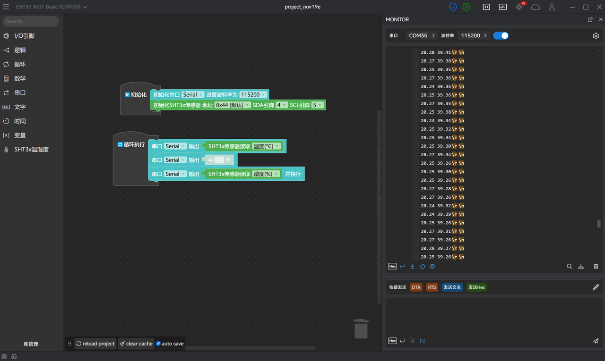

### 气压检测

将气压模块通过4P线连接在 4、5号引脚的座子上，该例程实现串口输出spa06传感器输出压力值，温度，海拔高度。

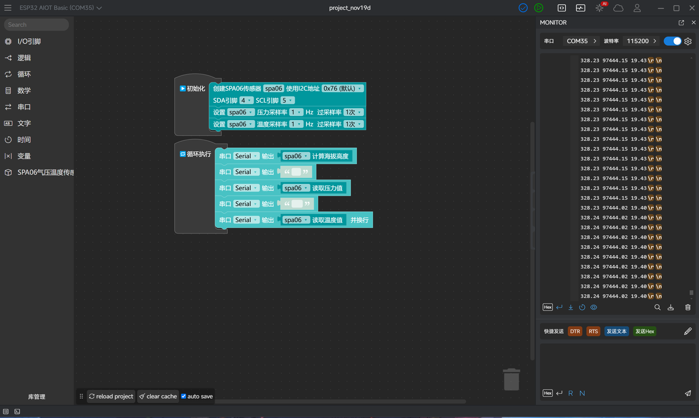

### 音频播放

音频功放模块默认已经连接在主板引脚上，无需额外接线。例程驱动音频模块播放音乐

### SD卡读写

aily blockly示例程序，在SD卡中新建一个data.txt文件，并写入Hello，World! 文字。

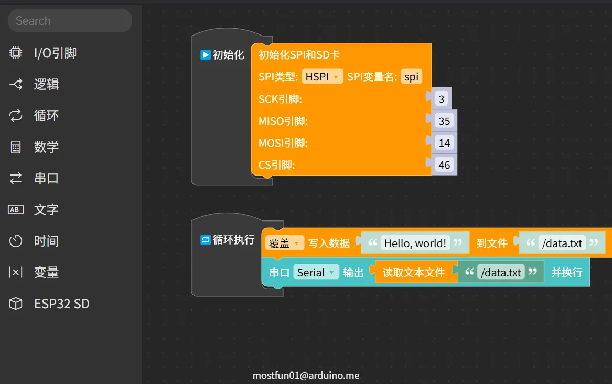

arduino示例程序参考链接：[ESP32 S3 AIOT基础示例17------SD卡读写 - Arduino中文社区](https://arduino.me/s/52?aid=3122)

### LCD显示

arduino示例程序参考链接：[ESP32 S3 AIOT基础示例10------LCD驱动 - Arduino中文社区](https://arduino.me/s/52?aid=3115)

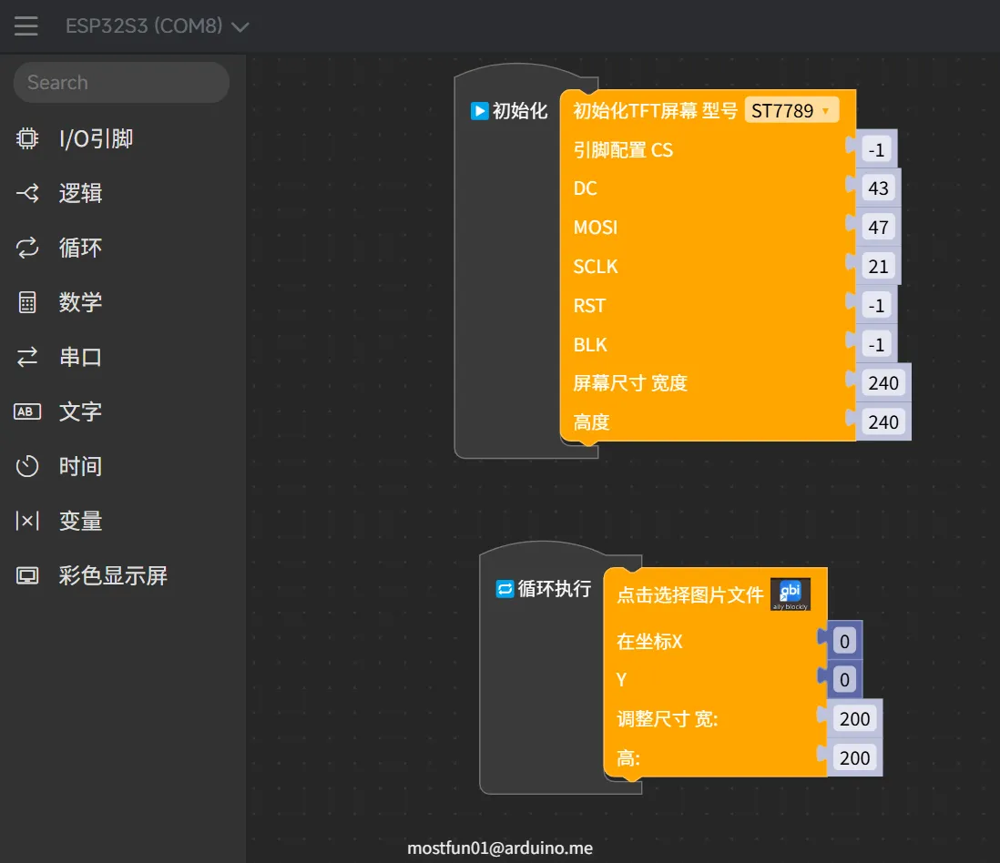

## 综合例程

### 蓝牙键盘

电脑蓝牙连接esp32蓝牙，两者蓝牙连接后，可以使用连接在esp32上的 按键作为输入，按下按键后，控制电脑桌面翻页。

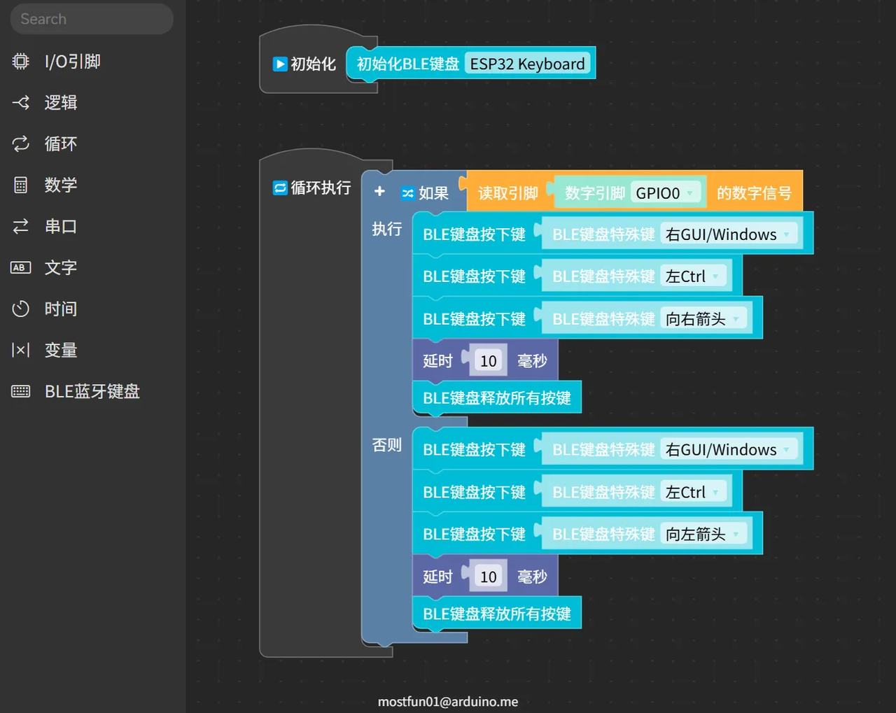

上传代码后，打开电脑蓝牙，搜索热备，当搜索到ESPP32 BLE Keyboard Mouse，连接后，即可通过按键来控制电脑桌面

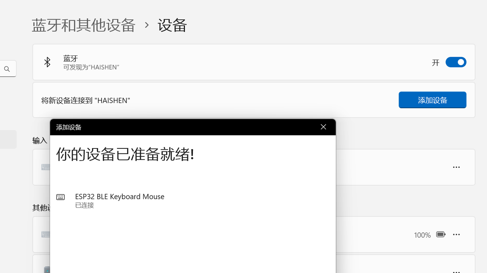

### 物联网平台blinker接入

参考链接：[ESP32 S3 AIOT 综合示例------blinker远程控制开关灯 - Arduino中文社区](https://arduino.me/s/52?aid=3098)

### 小智AI对话机器人

要想在aily上面使用basic的小智相关程序需要进行一些配置（开发板版本只能选择3.2.1）

需要将以下分区文件放到新建项目目录下的以下路径：xxx\\.temp\\sketch

[**\[partitions.csv\]**](https://ucnvly56m0g3.feishu.cn/docx/UW48dXPdwotfDfxIKYgcYBJqnec)

再在aily上面进行如下图所示的配置选择

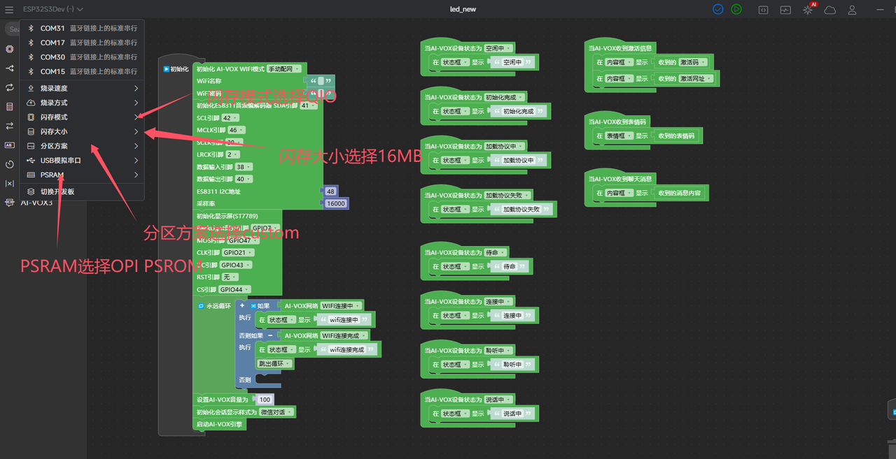

#### 1.ai聊天机器人示例

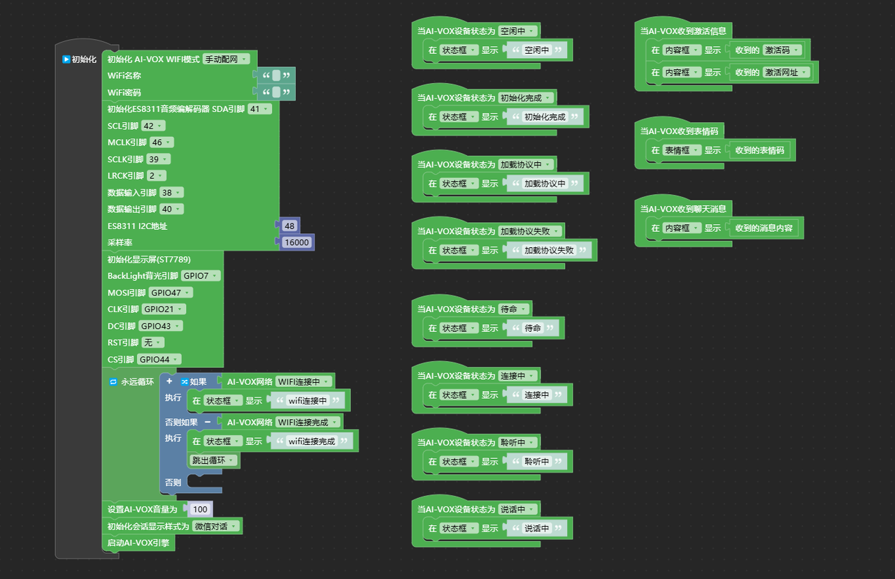

#### 2.ai聊天机器人控制led示例

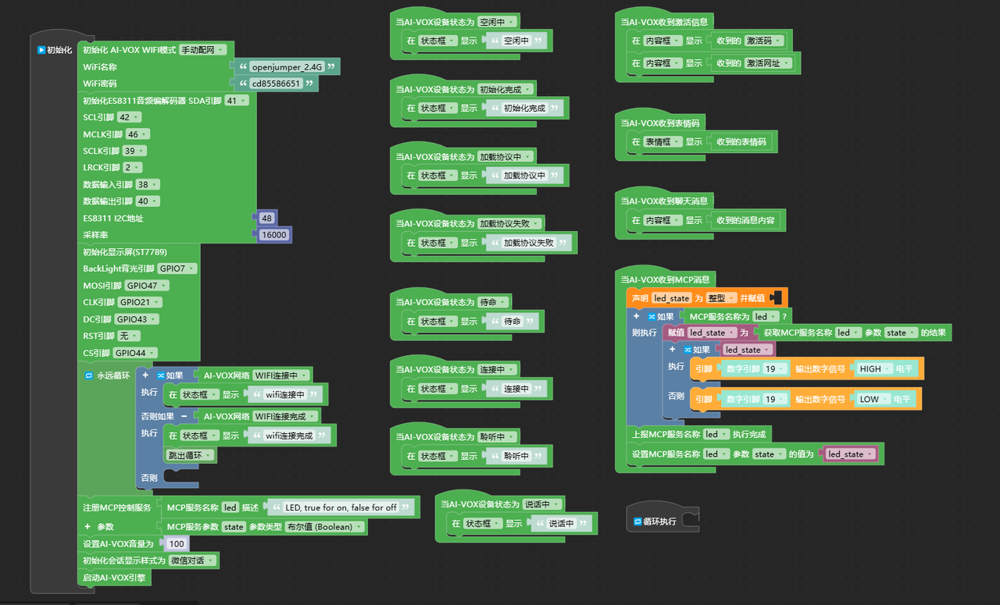

#### 3.ai聊天机器人控制舵机示例

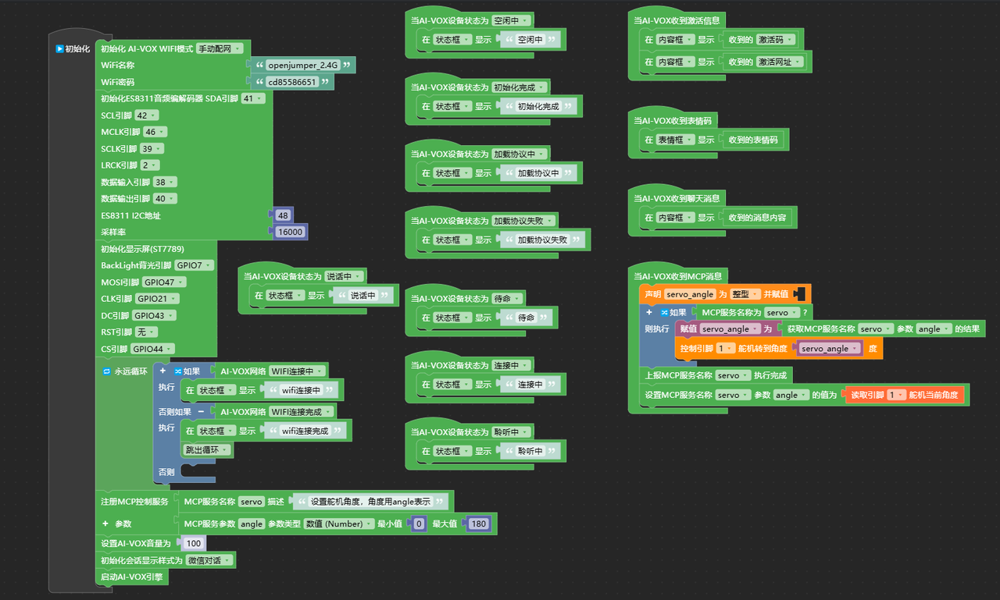