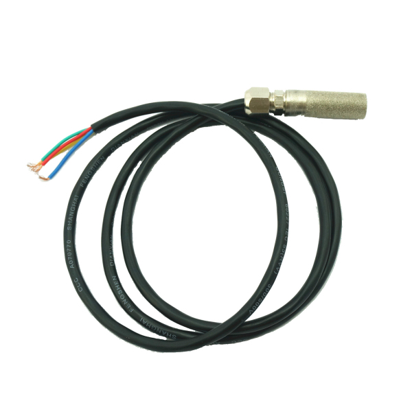

# 土壤温湿度传感器

## 概述

土壤的温度、湿度检测是农业领域的重要的两个指标。该传感器能够胜任监控土壤温度、湿度条件的这种应用。传感器内部集成度SHT1X提供这种高精度的要求。温度的精度最高可以达到0.4℃，湿度的精度达到%3 RH。传感器密封在外壳内部，所以你不必担心腐蚀性的问题。



## SHT11参数

+ 温度测量范围：-40 ~ +123.8°C

+ 湿度测量范围 ：	0 ~ 100% RH

+ 温度测量精度 ：	±0.4°C

+ 湿度测量精度：	±3%RH

+ 导线长度：	1m

## SHT10参数


+ 温度测量范围 ：	-40 ~ +123.8°C
  
+ 湿度测量范围 ：	0 ~ 100% RH
  
+ 温度测量精度 ：	±0.5°C
  
+ 湿度测量精度 ：	±4.5%RH
  
+ 导线长度 ：	1m

 

## 引脚定义

|符号| 颜色| 名称| 作用|
|:--|:--|:--|:--|
|S 	|黄色 	|SCK 	|时钟信号|
|+| 	红色 |	VDD |	电源|
|– 	|黑色或绿色 |	GND |	地|
|D |	蓝色 |	DATA |	数据输出|

## Arduino示例代码：

```C++
/******** www.openjumper.cn ************/
/******* humidity&temperature test ******/

#include <Sensirion.h>

const uint8_t dataPin  =  2;
const uint8_t clockPin =  3;

float temperature;
float humidity;
float dewpoint;

Sensirion tempSensor = Sensirion(dataPin, clockPin);

void setup()
{
  Serial.begin(9600);
}

void loop()
{
  tempSensor.measure(&temperature, &humidity, &dewpoint);

  Serial.print("Temperature: ");
  Serial.print(temperature);
  Serial.print(" C, Humidity: ");
  Serial.print(humidity);
  Serial.print(" %, Dewpoint: ");
  Serial.print(dewpoint);
  Serial.println(" C");
  
  delay(5000);  
}
```


## 常见问答

1、该土壤传感器外壳材料是什么？
>答：铜镀铝合金，所以不必太担心腐蚀性问题。

2、该传感器能直接插土壤里吗？
>答：自然情况下都可以直接插土壤里。放在露天环境土壤中，遇到下雨情况也没有关系，下雨、浇水都是正常的工作环境。

3、如果土壤里水太多会不会出问题？
>答：时间长湿度饱和就不会显示温湿度数据，需要把外壳拧下，晾一会再装上使用就可以恢复数据。

4、可以测试混凝土温湿度吗，怎么测？

> 答：可以，可以采取预埋或者凝固后打孔插入测试。

## 其他文档

+ [humidity_sensor_SHT1x_SHT7x_E](http://www.openjumper.cn/wp-content/uploads/2013/07/humidity_sensor_SHT1x_SHT7x_E.pdf)

+ [Sensirion](http://www.openjumper.cn/wp-content/uploads/2013/07/Sensirion.rar)