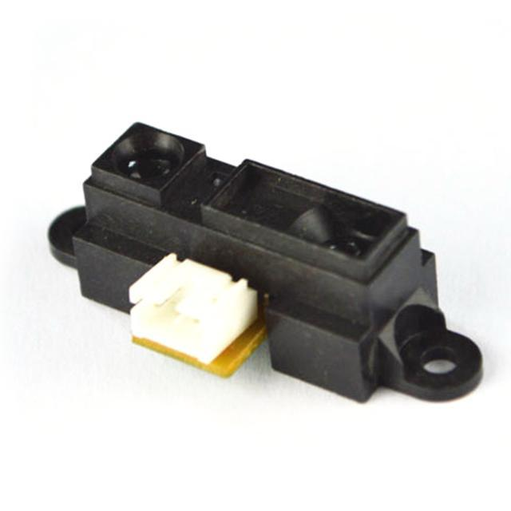
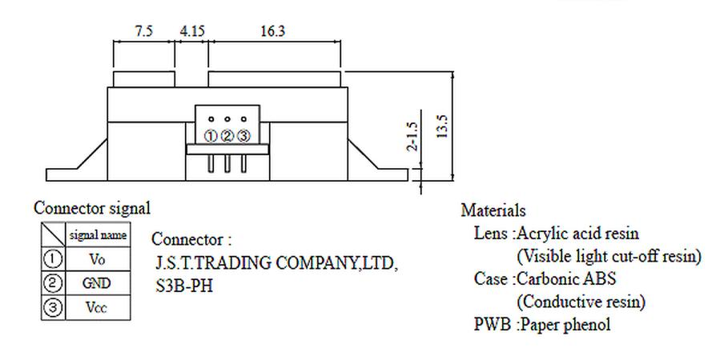
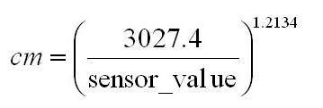

# 红外测距传感器

## 概述

GP2D12 是一款Sharp公司生产的红外线测距传感器，广泛应用在各个领域。 Sharp的红外传感器都是基于一个原理，三角测量原理。红外发射器按照一定的角度发射红外光束，当遇到物体以后，光束会反射回来，如图1所示。反射回来的红外光线被CCD检测器检测到以后，会获得一个偏移值L，利用三角关系，在知道了发射角度a，偏移距L，中心矩X，以 及滤镜的焦距f以后，传感器到物体的距离D就可以通过几何关系计算出来了。 此传感器可以用于机器人的测距、避障以及高级的路径规划，是机器视觉及其应用领域的不错选择。



[点我购买](https://item.taobao.com/item.htm?id=537529879461)


## 技术参数

+ 型号：2Y0A21

+ 电压：4.5-5.5V

+ 电流：33-40mA

+ 端口：模拟量

+ 检测距离：20-150cm

## 产品特性

- 模拟量输出，需要有AD转换器的单片机控制
    
- 输出与距离成反比非线性关系
    
- AD位数越高测距效果越精确，10位AD可达0.1cm
    
- 基于三角测量法原理
    
- 工作温度 -10℃~+60℃
    
- 模拟输出噪声：<200mV
  
- 峰值功耗：约200mA
    
- 更新频率/周期：25Hz/40ms

## 型号对比

目前Sharp的红外线传感器有如下几种类型：

+ GP2D02 （串口输出）探测范围 10cm-80cm

+ GP2D05 （数字输出）探测范围 固定的24cm

+ GP2D12 （模拟输出）探测范围 10cm-80cm

+ GP2D15 （数字输出）探测范围 24cm GP2D120 （模拟输出）探测范围 4cm-30cm

+ GP2YOAO2YK （模拟输出）探测范围 20cm-150cm 

+ GP2Y0D02YK （数字输出）探测范围 80cm

 

## 引脚定义图



## Arduino驱动示例 

示例为距离检测，距离转换公式：



### 示例一
```C++
int ir_sensor = A0;
void setup() {
//initialize serial communications at 9600 bps
Serial.begin(9600);
}
 
void loop() {
int sensor_value = analogRead(ir_sensor); //read the sensor value
int distance_cm = pow(3027.4/sensor_value, 1.2134); //convert readings to distance(cm)
Serial.println(distance_cm); //print the sensor value
delay(500);//delay 500ms (0.5 second)
}
```


### 示例二
读取100次检测数据，输出平均值
```C++
int ir_sensor = A0;
 
void setup() {
//initialize serial communications at 9600 bps
Serial.begin(9600);
}
 
void loop() {
int distance = average_value(100); //loop 100 times and get its average
Serial.println(distance); //print the sensor value
delay(500);//delay 500ms (0.5 second)
}
int average_value(int average_count) {
int sum = 0;
for(int i=0; i<average_count; i++) {
int sensor_value = analogRead(ir_sensor); //read the sensor value
int distance_cm = pow(3027.4/sensor_value, 1.2134); //convert readings to distance(cm)
sum = sum + distance_cm;
}
return(sum/average_count);
}
```

## 其他文档

手册：[GP2Y0A21YK0F](http://openjumper.cn/wp-content/uploads/2014/04/gp2y0a21yk0f.pdf)

