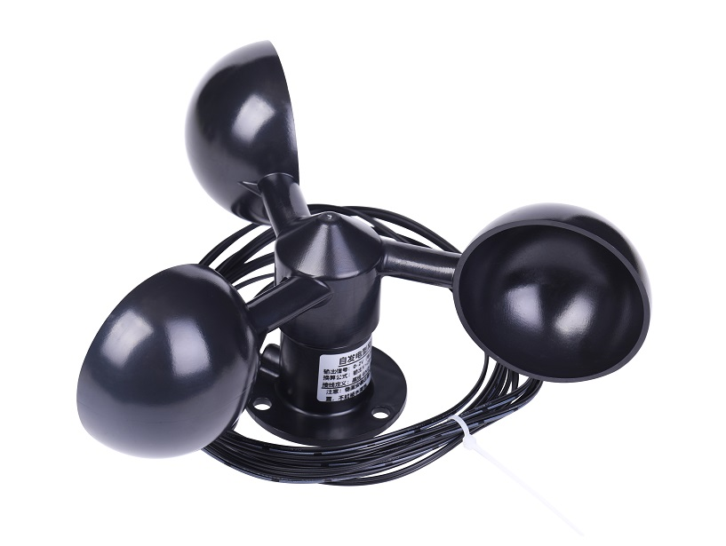
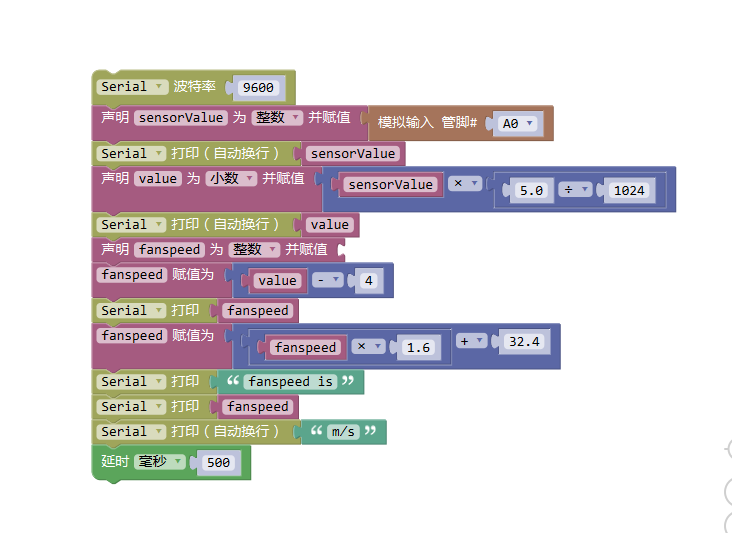

# Arduino风速传感器

## 简介

风速传感器为防雨淋设计，采用三个直径6CM的半球碗，呈120度分支安装，在风力的作用下，可以产生旋转，风速越大，旋转越快。风力旋转组件旋转时，直径约22CM，其带动一个小直流发电机产生直流电压，风速越高，产生的直流电压越高，最高可产生2V直流电压

风速传感器现被广泛运用于物联网项目中，该传感器输出模拟电压值，配合arduino的驱动，使测量风速变得更加简单。同时风速传感器可连续监测地点的风速风量大小，能够对所处巷道的风速进行实时显示。

注意：稳固安装在已于检测环境风位置，不能被水浸泡，本风速传感器为简易型构造，精度一般，仅适用于各种控制器做环境风速检测，采集信号电压值信号以进行控制使用，不适用于气象预报级别的应用。




[点我购买](https://item.taobao.com/item.htm?id=568898535894)


## 参数

+ 量程：100KM/H

+ 输出信号：0-2V（电压输出型无需供电）

+ 底座部件材料：ABS注塑工艺

+ 底盘直径：57MM

+ 信号线：约3米

+ 产品净重：140g

+ 计算公式：输出电压V*25=米/秒 M/S

## 接线定义

黑线：GND

黑线白纹：信号

  
## 特点

+ 体积小，携带方便，安装简捷
  
+ 量程宽，稳定性好
  
+ 结构设计合理，外观质量佳
  
+ 数据信息线新能好，信号输出距离长，抗外界干扰能力强

## 应用范围

可广泛应用于温室、环境保护、气象站、船舶、码头、养殖等环境的风速测量。

## Arduino驱动示例

```C++
/******www.openjumper.cn*********/
/******windspeed test**********/

void setup() {
  Serial.begin(9600);
}
void loop() {
  int sensorValue = analogRead(A0);
 // Serial.println(sensorValue);
  float value = sensorValue * (5.0 / 1024.0);
//  Serial.println(value);
  float fanspeed = value - 0.4 ;
 // Serial.print( fanspeed );
  fanspeed = fanspeed * 1.6*32.4 ;
  Serial.print("fanspeed is ");
  Serial.print( fanspeed );
  Serial.println( "m/s" );
 delay(500);

}
```
### Arduino Mixly图形化程序



[mixly程序下载](http://download.openjumper.cn/mixly/windspeed.mix)