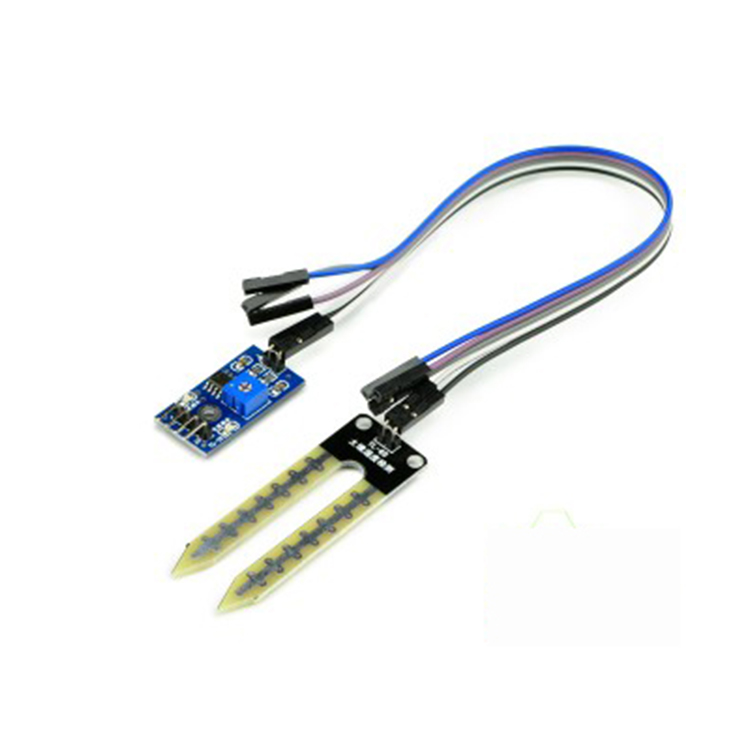

# 土壤湿度计检测模块

## 概述

通过电位器调节土壤湿度控制阀值，可以自动对菜园，花园自动浇水，家庭花盆土壤湿度的控制，可以应用在各种电子比赛，电子积木，arduino设计等。

[点我购买](https://item.taobao.com/item.htm?id=537703695315)

## 产品特性

+ 表面采用镀镍处理，有加宽的感应面积，可以提高导电性能，防止接触土壤容易生锈的问题，延长使用寿命

+ 可以宽范围控制土壤的湿度，通过电位器调节控制相应阀值，湿度低于设定值时, DO输出高电平，高于设定值时，DO输出低电平

+ 比较器采用LM393芯片，工作稳定

+ 设有固定螺栓孔，方便安装

## 产品参数

+ 工作电压：3.3V-5V

+ PCB尺寸：3.2cm * 1.4m

+ 电源指示灯（红色）和数字开关量输出指示灯（绿色）

## 端口说明

|符号|名称|说明|
|:--|:--|:--|
|VCC |电源正极| 外接3.3V-5V|
| GND |电源负极 |外接GND|
| DO | 小板数字信号输出接口（0和1） ||
| AO  |小板模拟信号输出||

## 使用说明

+ 传感器适用于土壤的湿度检测;

+ 模块中蓝色的电位器是用于土壤湿度的阀值调节，顺时针调节，控制的湿度会越大，逆时针越小;

+ 数字量输出D0可以与单片机直接相连，通过单片机来检测高低电平，由此来检测土壤湿度;

+ 小板模拟量输出AO可以和AD模块相连，通过AD转换，可以获得土壤湿度更精确的数值；

注:电源极性不能接反，否则有可能将芯片烧坏，开关信号指示灯亮时输出低电平，不亮输出高电平，输号输出的电平接近于电源电压。
