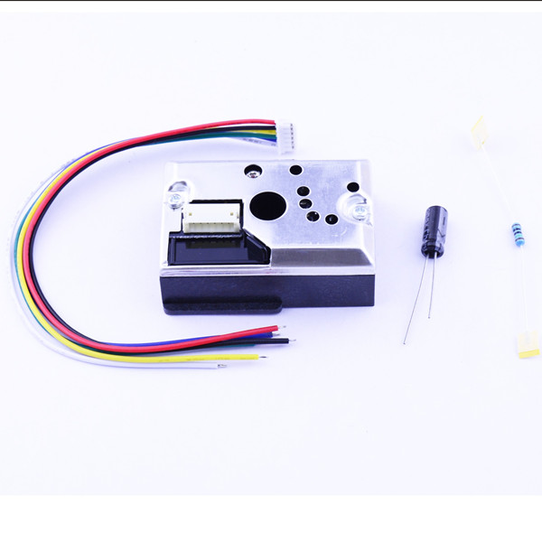
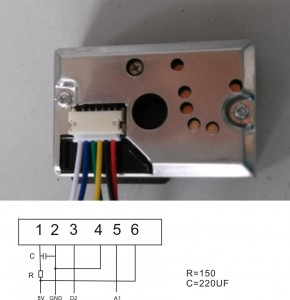

# Sharp GP2Y10 空气质量传感器

## 概述

空气质量越来越成为广大国民关注的严重问题，作为一名创客，你是否想通过自己动手检测出自己身处的环境中的空气质量情况，并为它做点什么呢？

Sharp光学粉尘传感器（GP2Y1010AU0F）对于像香烟烟雾这样的颗粒十分敏感，因此常用于空气净化系统。 红外线发射二极管和光电晶体管对角式地排列在这款设备中，能够检测到空气粉尘中的反射光。这款传感器的电流消耗很低（最大电流20mA，通常11mA），并且能够在高达7伏的直流电下启动。传感器的模拟输出电压是同标准灰尘密度成比例的，其灵敏度为0.5V/0.1mg/m3。将它连接到Arduino上时，需要一个150欧的电阻器和220uF的电容器。



[点我购买](https://item.taobao.com/item.htm?id=538663118194)


## 模块参数

+ 工作电压：5-7V

+ 运行温度：-10~65℃

+ 消耗电流：最大电流20mA

## Arduino驱动示例

  


**设置排列线**
1.V-LED
2.LED-GND
3.LED
4.S-GND
5.V0
6.VCC


|传感器引脚|Arduino引脚| 
|:--|:--| 
|Vled|5V(150欧电阻)| 
|LED-GND|GND| 
|LED|D2| 
|S-GND|GND| 
|V0|A0| 
|Vcc|5V| 


```C++
/*
 Standalone Sketch to use with a Arduino UNO and a
 Sharp Optical Dust Sensor GP2Y1010AU0F
*/

int measurePin = 0; //Connect dust sensor to Arduino A0 pin
int ledPower = 2;   //Connect 3 led driver pins of dust sensor to Arduino D2

int samplingTime = 280;
int deltaTime = 40;
int sleepTime = 9680;

float voMeasured = 0;
float calcVoltage = 0;
float dustDensity = 0;

void setup(){
  Serial.begin(9600);
  pinMode(ledPower,OUTPUT);
}

void loop(){
  digitalWrite(ledPower,LOW); // power on the LED
  delayMicroseconds(samplingTime);

  voMeasured = analogRead(measurePin); // read the dust value

  delayMicroseconds(deltaTime);
  digitalWrite(ledPower,HIGH); // turn the LED off
  delayMicroseconds(sleepTime);

  // 0 - 5V mapped to 0 - 1023 integer values
  // recover voltage
  calcVoltage = voMeasured * (5.0 / 1024.0);

  // linear eqaution taken from http://www.howmuchsnow.com/arduino/airquality/
  // Chris Nafis (c) 2012
  dustDensity = 0.17 * calcVoltage - 0.1;

  Serial.print("Raw Signal Value (0-1023): ");
  Serial.print(voMeasured);

  Serial.print(" - Voltage: ");
  Serial.print(calcVoltage);

  Serial.print(" - Dust Density: ");
  Serial.println(dustDensity); // unit: mg/m3

  delay(1000);
}
```

## 其他文档

[mixly程序下载](http://download.openjumper.cn/mixly/pm2.5.mix)

[gp2y1010au_e](http://www.openjumper.cn/wp-content/uploads/2014/03/gp2y1010au_e.pdf)