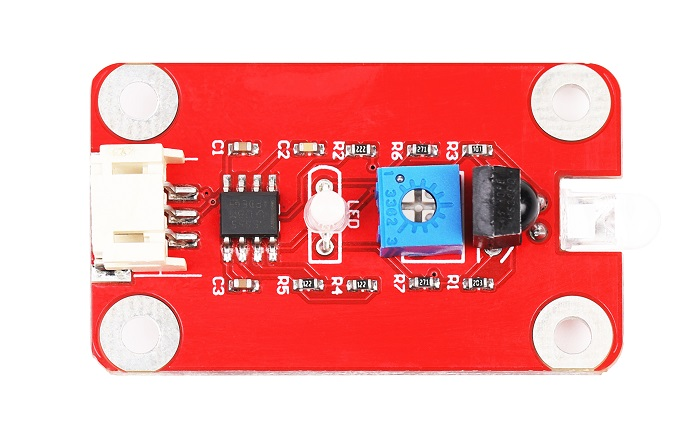

# 红外避障传感器

<table border="1">

<tr>
  <td align="center"></td>
  <td align="center"></td>
  <td align="center"></td>
</tr>
<tr>
  <td style="background-color:rgb(232,232,232,0.5) "colspan="3" align="center"> <a href="https://item.taobao.com/item.htm?id=538725129526"><font style="font-size:16px">红外避障传感器</font></a> </td>
</tr>

<tr>
  <td align="center"></td>
  <td align="center"></td>
  <td align="center"></td>
</tr>
<tr>
  <td style="background-color:rgb(232,232,232,0.5)" colspan="3" align="center"><a href="https://item.taobao.com/item.htm?id=592197759068"><font style="font-size:16px">红外避障传感器 防反接</font></a></td>
</tr>
</table>

## 概述

传感器发射红外线,根据反射红外光探测前方障碍物，无障碍物时输出高电平,有障碍时输出低电平，在信号输出同时有指示灯指示状态，无障碍物时LED为绿，有障碍物时为红。同时内置38Khz信号发生器，抗干扰能力强，中部设有固定螺栓孔，方便安装。


## 模块参数

+ 尺寸：15 X 53mm
  
+ 信号类型：数字输出
  
+ 工作电压：5V
  
+ 探测距离：3～30cm（不同物体反射率不定）
  
+ 红绿双色LED指示：无障碍物时为绿色，有障碍物时为红色
  
+ 2K电位器：距离调节

## 端口说明

+ OUT ：信号输出
  
+ +：VCC
  
+ – ：GND
  
  

## 示例程序

### arduino程序

```C++
    /*OJ IR Switch module
     www.openjumper.cn
     */

     int Sensor_pin = 2;

     void setup() {
       Serial.begin(9600);
     }
     void loop() {
       int sensorValue = digitalRead(Sensor_pin);
       Serial.println(sensorValue);
       delay(100);
     }
```
### mixly程序


## 相关文档

[mixly程序下载](http://download.openjumper.cn/mixly/ir-switch.mix)

[IR-Switch-schematic](http://www.openjumper.cn/wp-content/uploads/2012/08/IR-Switch-schematic.pdf)
