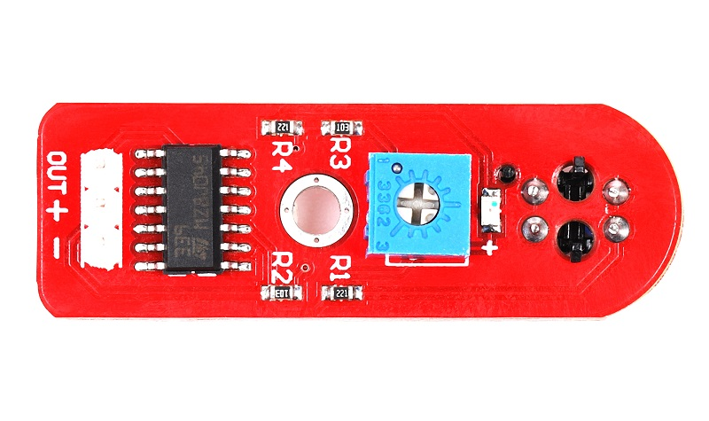
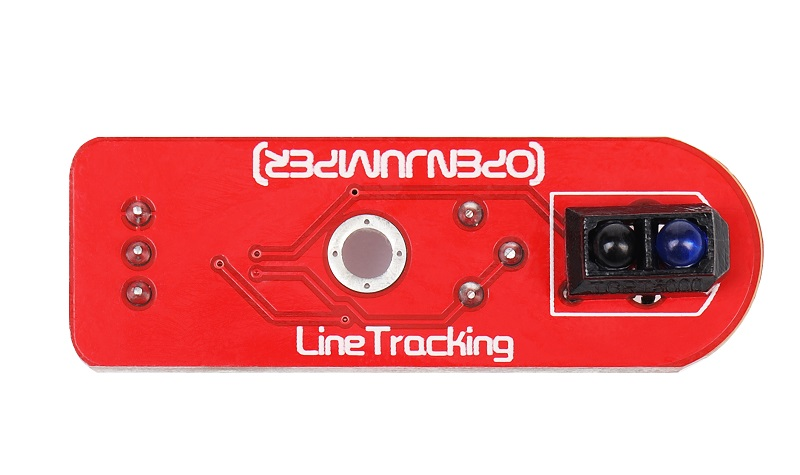
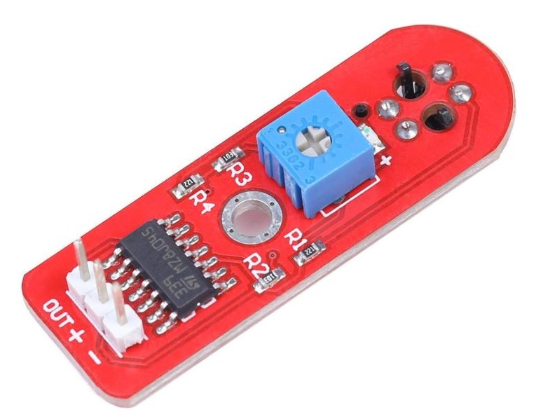
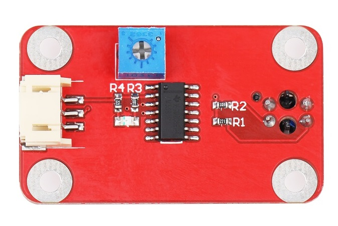
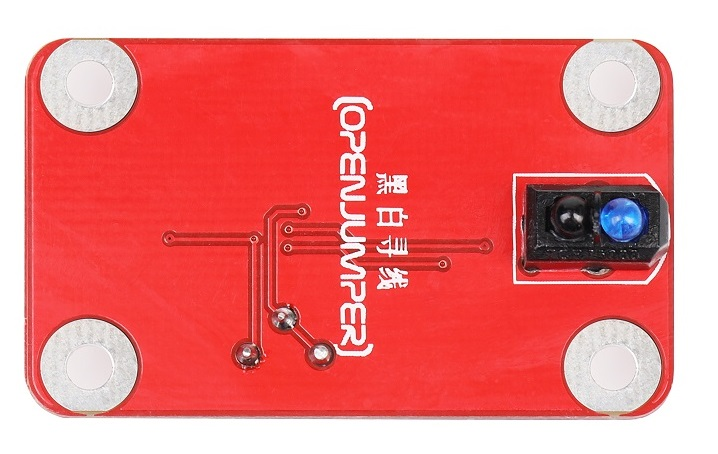
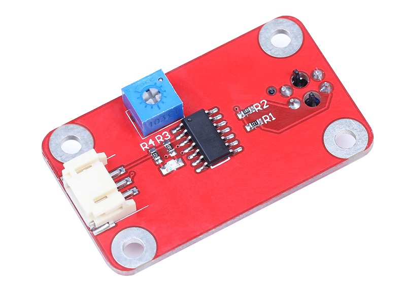
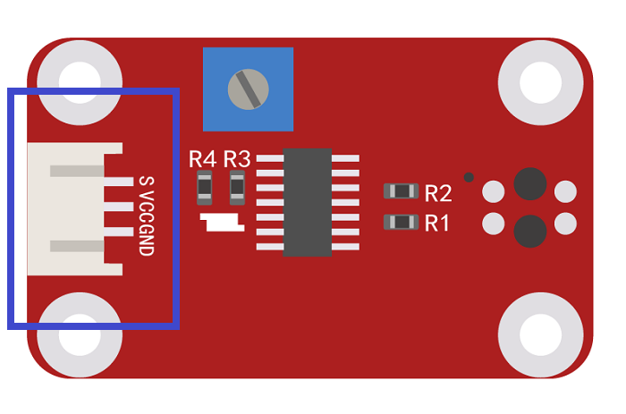
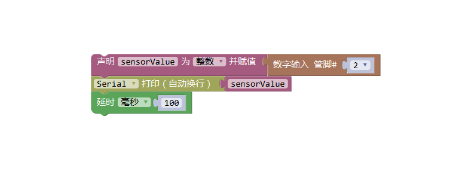

# 红外循迹传感器

<table border="1">

<tr>
  <td align="center"></td>
  <td align="center"></td>
  <td align="center"></td>
</tr>
<tr>
  <td style="background-color:rgb(232,232,232,0.5) "colspan="3" align="center"><a href="https://item.taobao.com/item.htm?id=537862408479"> <font style="font-size:16px">红外循迹传感器</font></a> </td>
</tr>

<tr>
  <td align="center"></td>
  <td align="center"></td>
  <td align="center"></td>
</tr>
<tr>
  <td style="background-color:rgb(232,232,232,0.5)" colspan="3" align="center"><a href="https://item.taobao.com/item.htm?id=591606480985"><font style="font-size:16px">红外循迹传感器 防反接</font></a></td>
</tr>
</table>

## 概述

红外巡线传感器模块的原理是利用红外对管检测自己发出的红外线对反射光（深色反射弱，浅色反射强）。寻线传感器可以帮助你的机器人进行白线或者黑线的跟踪，可以检测白底中的黑线，也可以检测黑底中的白线，检测到黑线返回低电平。是光电寻线机器人的必备传感器。　　


## 模块参数

+ 工作电压：5V  

+ 尺寸：45*16mm  

+ 输出电平：TTL电平(黑线低电平，白线高电平)  

## 端口说明

+ OUT：信号输出

+ +：VCC

+ –：GND
  
  

## Arduino示例程序：

```C++
/*OJ Line Tracking Sensor
www.openjumper.cn
*/

int Sensor_pin = 2;

void setup() {
  Serial.begin(9600);
}
void loop() {
  int sensorValue = digitalRead(Sensor_pin);
  Serial.println(sensorValue);
  delay(100);
}
```

## Mixly图形化示例程序 

  

## 其他文档

[mixly程序下载](http://download.openjumper.cn/mixly/line-tracking.mix)

[schematic:Line-Tracking-Sensor](http://openjumper.cn/wp-content/uploads/2012/08/Line-Tracking-Sensor.pdf)
