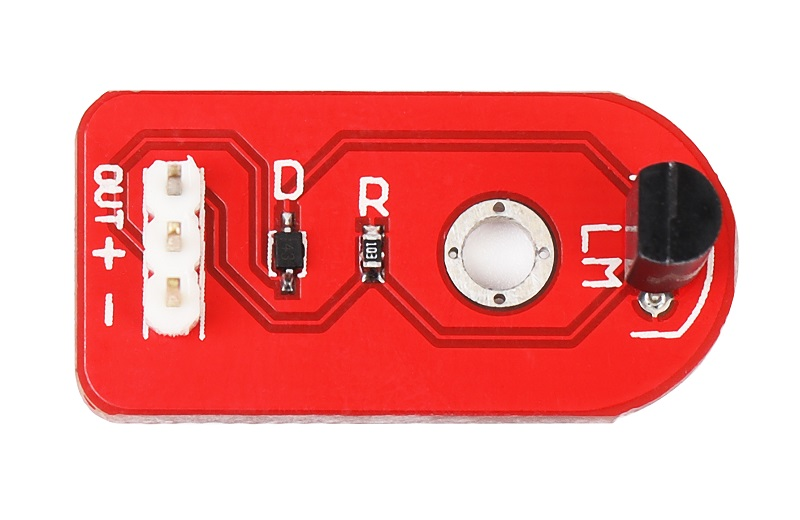
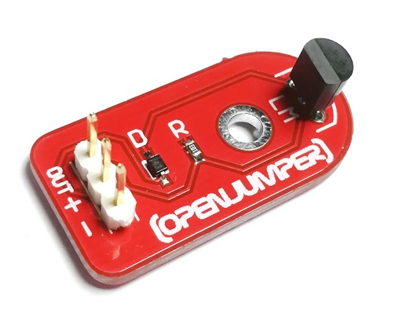
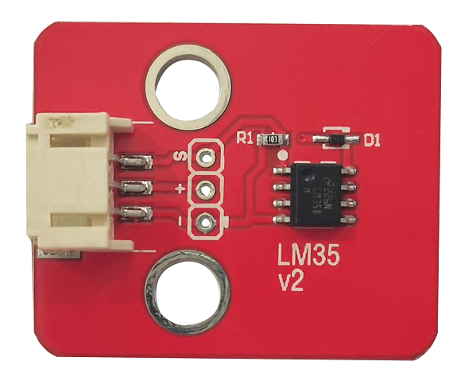
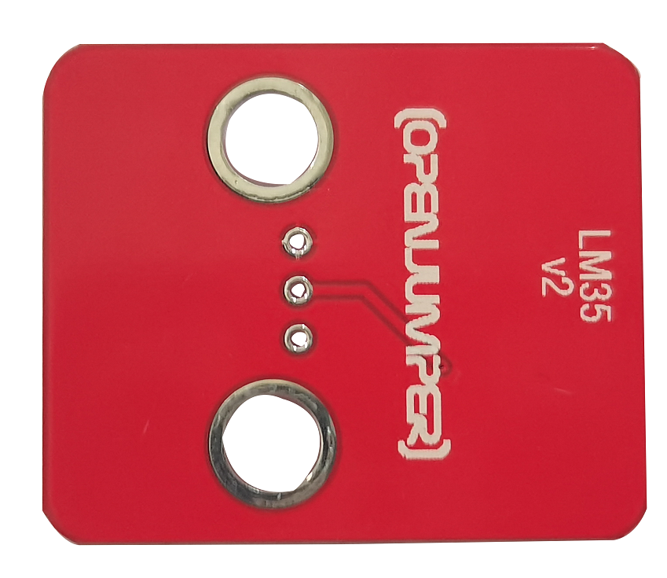
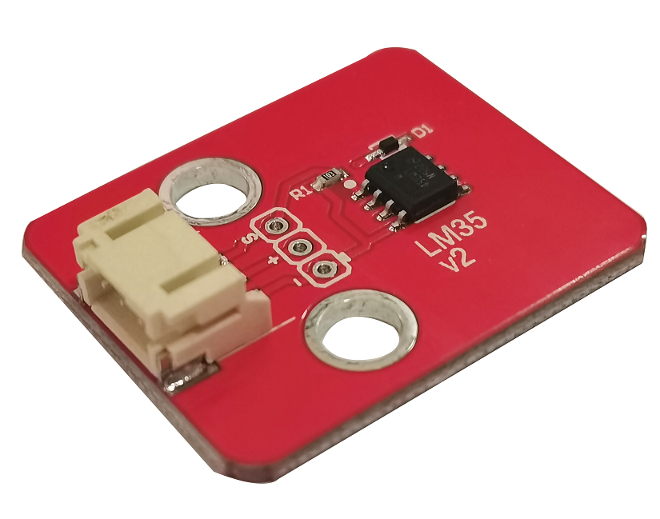
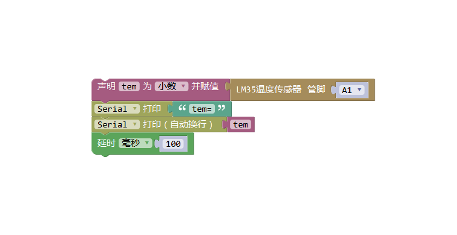

# LM35模拟温度传感器

<table border="1">

<tr>
  <td align="center"></td>
  <td align="center"></td>
  <td align="center"></td>
</tr>
<tr>
  <td style="background-color:rgb(232,232,232,0.5) "colspan="3" align="center"> <a href="https://item.taobao.com/item.htm?id=538794108978"><font style="font-size:16px">LM35模拟温度传感器</font></a> </td>
</tr>

<tr>
  <td align="center"></td>
  <td align="center"></td>
  <td align="center"></td>
</tr>
<tr>
  <td style="background-color:rgb(232,232,232,0.5)" colspan="3" align="center"><a href="https://item.taobao.com/item.htm?id=591826809907"><font style="font-size:16px">LM35模拟温度传感器 防反接</font></a></td>
</tr>
</table>

## 概述

LM35线性温度传感器是一种得到广泛使用的温度传感器，工作温度范围较大，模块适用于许多特殊场合。测量温度范围为0℃～100℃，输出电压与温度成正比，温度每上升一度，电压升高10毫伏。LM35线性温度传感器与Arduino专用传感器扩展板结合使用，可以非常容易地实现与环境温度感知相关的互动效果。　　


## 产品参数

+ 尺寸：28 × 12mm
  
+ 主要芯片：LM35DZ
  
+ 工作电压： 5V
  
+ 输出信号：模拟信号
  
## 端口说明

+ s：信号
  
+ +：VCC
  
+ – ：GND
  


## 产品特性

+ 线性变化系数：+10mv/℃

+ 输出电压：模块在工作电压情况下输出电压范围为0—1V
  
+ 温度测量范围：0℃～100℃
  
+ 温度测量精度：±0.5℃
  
## 示例程序

```C++
    /*OJ LM35 module 
     www.openjumper.cn
     */
    int potPin = 4;                   //设置模拟口4为LM35的信号输入端口 
     float temperature = 0;           //设置temperature为浮点变量 
     long val=0;                      //设置val为长整数变量 

     void setup() 
     { 
     Serial.begin(9600);//设置波特率 
     } 

     void loop ()                      
     { 
        val=analogRead(potPin);//温度传感器LM35接到模拟PIN4上；val变量为从LM35信号口读取到的数值 
       temperature = (val*0.0048828125*100);   //把读取到的val转换为温度数值,系数一：0.00488125=5/1024,0~5V对应模拟口读数1~1024,系数二：100=1000/10,1000是毫伏与伏的转换；10是每10毫伏对应一度温升。 
        Serial.print("Tep=  "); 
        Serial.print(temperature); 
        Serial.println(" C"); 
         delay(500);//延时500毫秒，这里也就是刷新速度。 

     }
```  

## 相关文档

[datasheet](http://www.openjumper.cn/wp-content/uploads/2012/08/datasheet.pdf)   
[lm35-schematic](http://www.openjumper.cn/wp-content/uploads/2012/08/lm35-schematic.pdf) 

## 常见问答

1、该温度传感器测温范围是多少？
> 答：测温元件为LM35DZ，测温范围为0~100℃。 

2、输出电压范围是多少？
> 答：输出电压范围为0~1V

## 图形化编程



[mixly程序下载](http://download.openjumper.cn/mixly/lm35.mix)