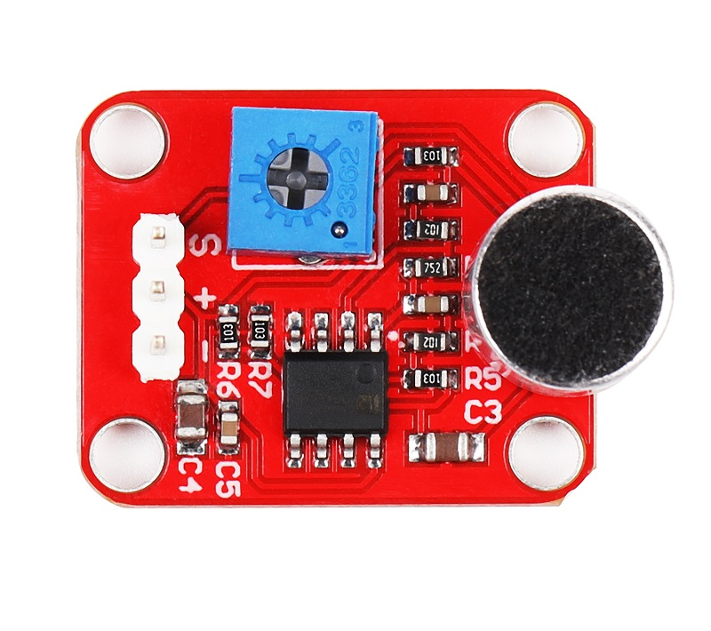
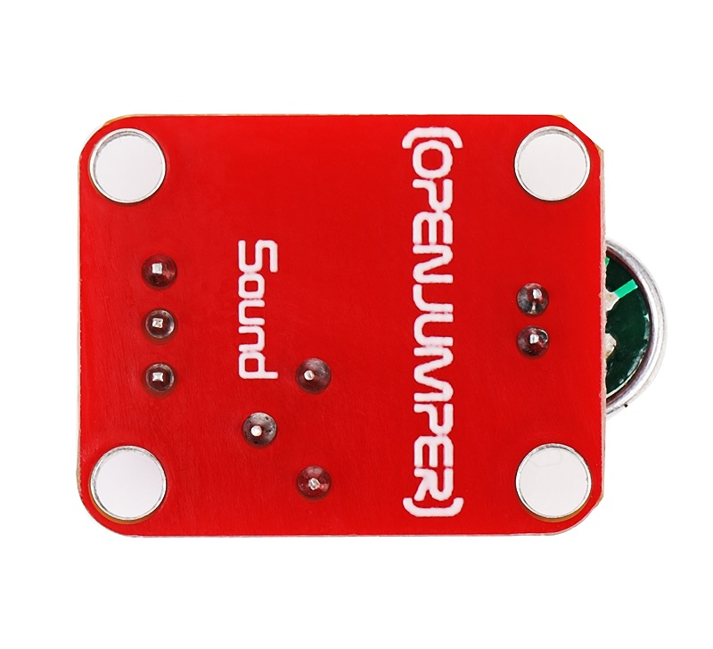
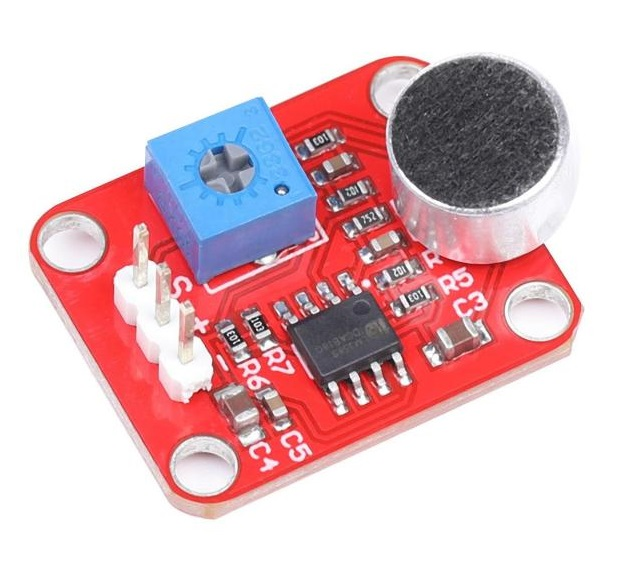
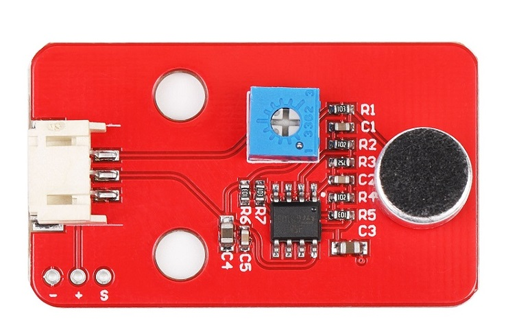
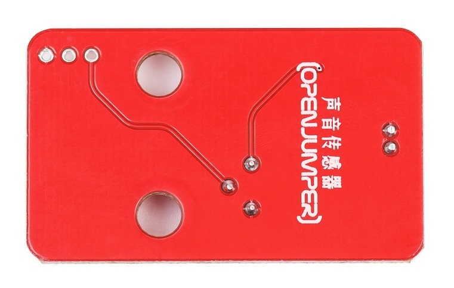
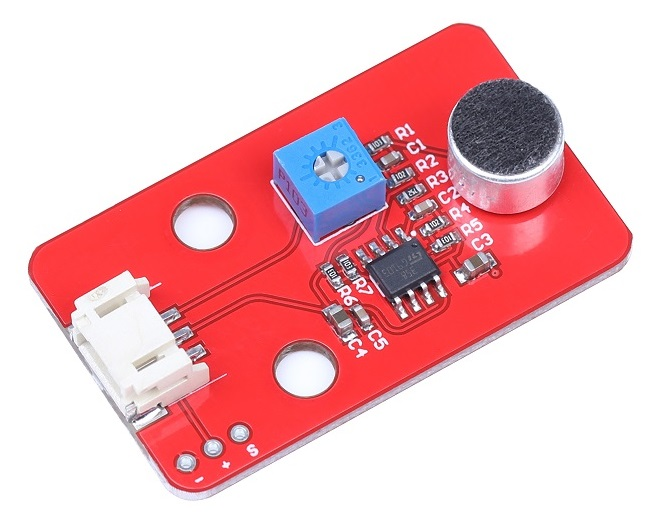
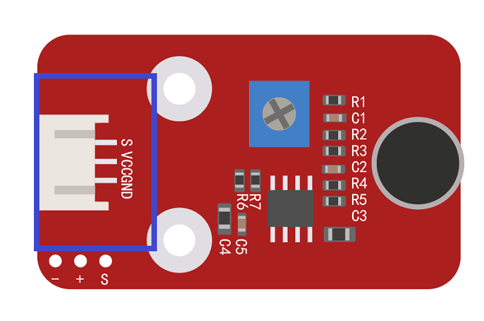

# 模拟声音传感器

<table border="1">

<tr>
  <td align="center"></td>
  <td align="center"></td>
  <td align="center"></td>
</tr>
<tr>
  <td style="background-color:rgb(232,232,232,0.5) "colspan="3" align="center"><a href="https://item.taobao.com/item.htm?id=552870162002"> <font style="font-size:16px">声音传感器</font></a> </td>
</tr>

<tr>
  <td align="center"></td>
  <td align="center"></td>
  <td align="center"></td>
</tr>
<tr>
  <td style="background-color:rgb(232,232,232,0.5)" colspan="3" align="center"><a href="https://item.taobao.com/item.htm?id=591606240808"><font style="font-size:16px">声音传感器 防反接</font></a></td>
</tr>
</table>

## 概述

模拟声音传感器可以检测周围环境声音大小，Arduino可以通过模拟输入接口对其输出信号进行采集。你可以使用它制作声控开关等有趣的互动作品。  


## 特性参数

+ 尺寸：25*20mm
  
+ 工作电压：5V
  
+ 主要芯片：LM358、驻极体话筒
  
+ 输出信号：模拟值
  
+ 其他：一个10K可调电位器(调节灵敏度)
  
## 端口说明

+ S：信号输出

+ +：VCC

+ –：GND



## 示例程序

```C++
void setup() {
  Serial.begin(9600);
}
void loop() {
  int sensorValue = analogRead(A0);
  Serial.println(sensorValue);
  delay(100);
}
```   
## 常见问答

1、声音传感器可以用来录音吗？
> 答：不能。  

2、该声音传感器是经过放大输出的吗？
> 答：通过驻极体采集声音值大小，经过放大电路输出模拟值。

## 其他文档

[mixly程序下载](http://download.openjumper.cn/mixly/sound-sensor.mix)

[Sound Sensor Schematic: Sound-sensor-schematic ](http://www.openjumper.cn/wp-content/uploads/2012/08/Sound-sensor-schematic.pdf)  

[Datasheet：sound-sensor](http://www.openjumper.cn/wp-content/uploads/2012/08/sound-sensor.pdf)