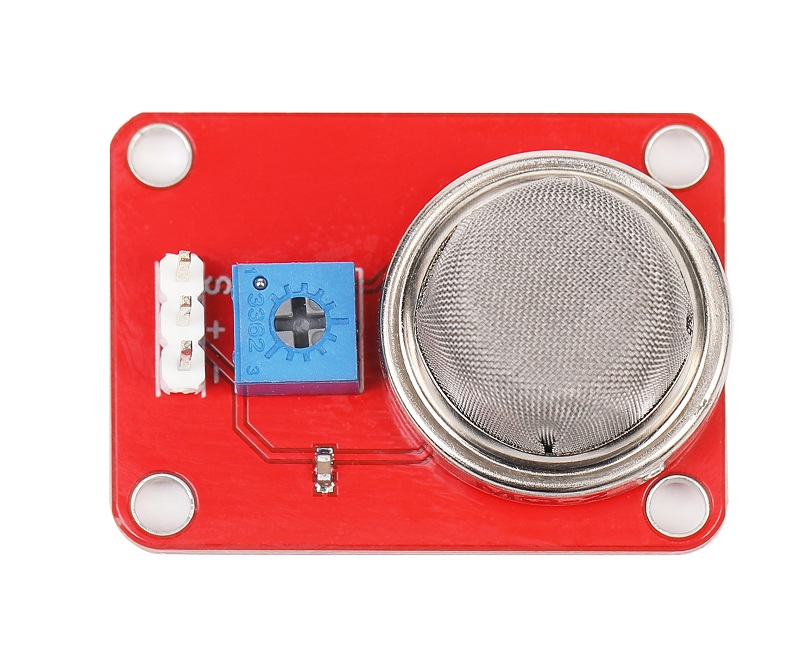
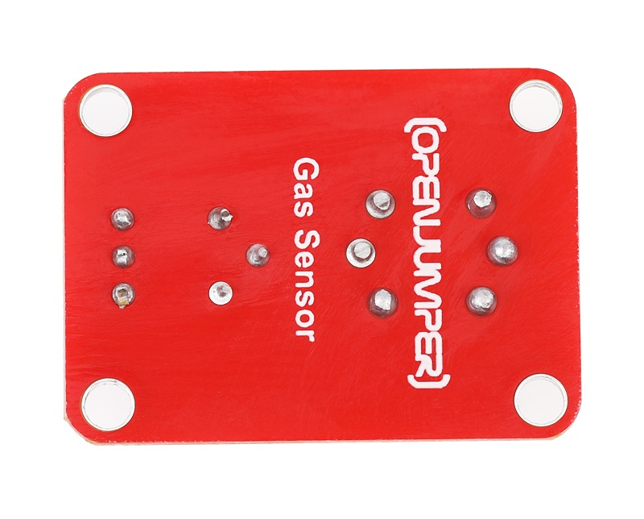
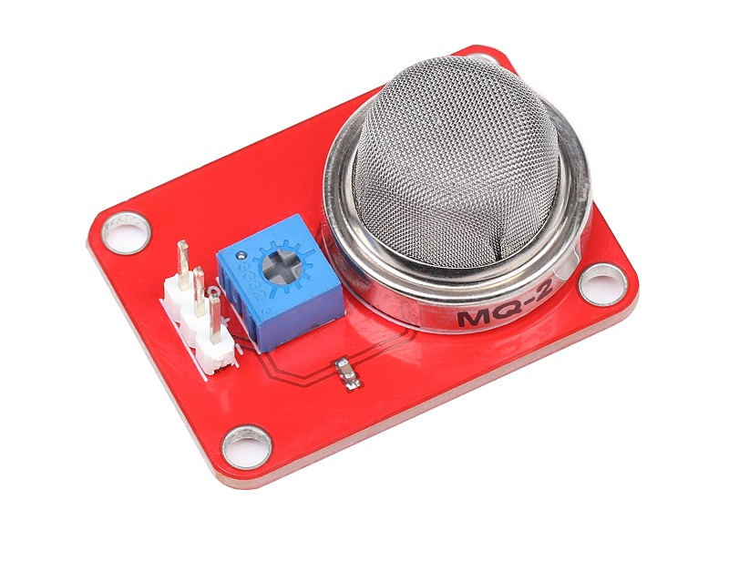
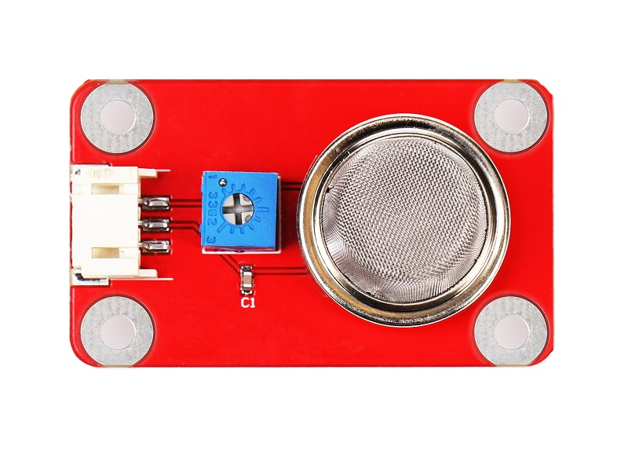
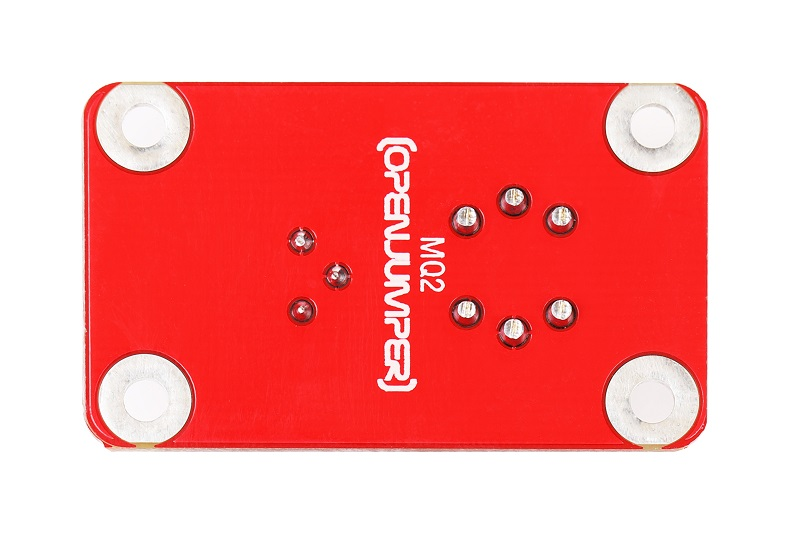
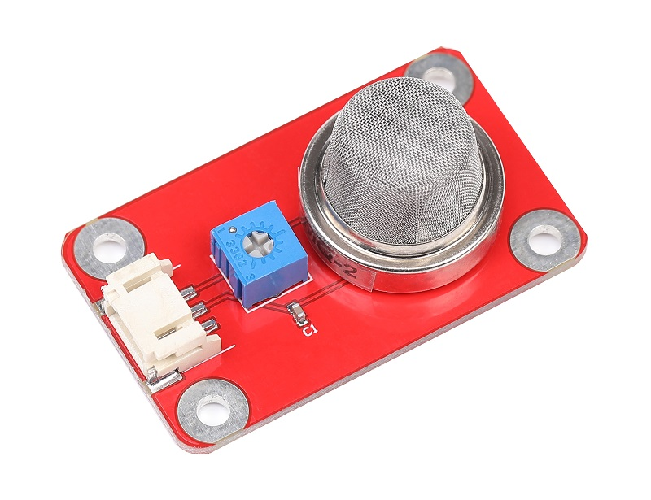
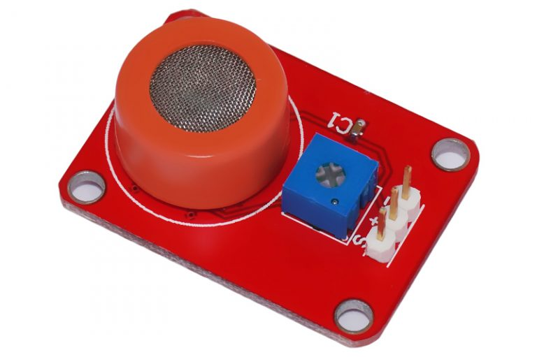
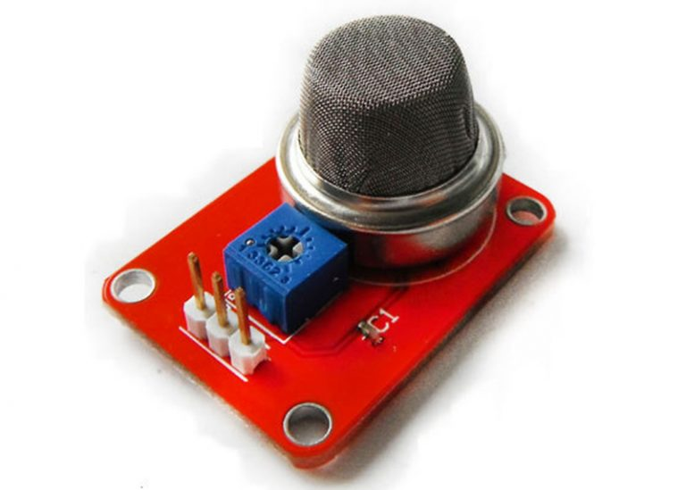
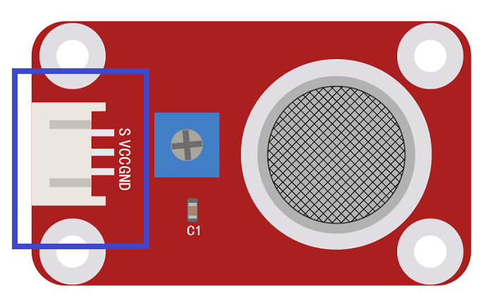

# MQ-X气体传感器

## 概述

MQ系列气体传感器所使用的气敏材料是在清洁空气中电导率较低的二氧化锡(SnO2)。当传感器所处环境中存在可燃气体时，传感器的电导率随空气中可燃气体浓度的增加而增大。使用简单的电路即可将电导率的变化转换为与该气体浓度相对应的输出信号。它被广泛应用于家庭和工厂的气体泄漏监测。 

## 型号说明

### 1.MQ-2 检测气体：液化气、丙烷、氢气   
<table border="1">

<tr>
  <td align="center"></td>
  <td align="center"></td>
  <td align="center"></td>
</tr>
<tr>
  <td style="background-color:rgb(232,232,232,0.5) "colspan="3" align="center"> <a href="https://item.taobao.com/item.htm?id=552694363238"><font style="font-size:16px"> 气体传感器</font></a> </td>
</tr>

<tr>
  <td align="center"></td>
  <td align="center"></td>
  <td align="center"></td>
</tr>
<tr>
  <td style="background-color:rgb(232,232,232,0.5)" colspan="3" align="center"><a href="https://item.taobao.com/item.htm?id=591606064532"><font style="font-size:16px">气体传感器 防反接</font></a></td>
</tr>
</table>

这种传感器可检测多种可燃性气体。它对液化气、丙烷、氢气的灵敏度高，对天然气和其它可燃蒸汽的检测也很理想。

### 2.MQ-3  检测气体：酒精  

   

[点我购买](https://item.taobao.com/item.htm?id=537814264641)  

这种传感器可检测多种浓度酒精气氛。它对酒精的灵敏度高，可以抵抗汽油、烟雾、水蒸气的干扰。

### 3.MQ-5  检测气体：丁烷、丙烷、甲烷

 

[点我购买](https://item.taobao.com/item.htm?id=552869438314)

这种传感器可检测多种可燃性气体，特别是天然气。它对丁烷、丙烷、甲烷的灵敏度高，对甲烷和丙烷可较好的兼顾。

尺寸：35x25mm

## 端口说明

+ S：信号输出

+ +：VCC

+ –：GND



### 特殊事项

+ **加热器**
    >电压对于内部加热器来说是相当重要的。在OpenJumper的MQ系列气体传感器模块中，使用5V给加热器供电，这样可以很快的使加热器达到50-60摄氏度，加热器通电后，大约过3分钟，返回的电压值才能稳定。

+ **负债电阻**
    >在该模块上有一个可调负载电阻，阻值越低，传感器越不灵敏；阻值越高，对于高浓度的气体越不准确。如果你的测量环境只有一种要测量的特定气体，且知道其浓度，则可以通过调节该电阻来校准创传感器（请在传感器加热至稳定后校准）。  

+ **预热**   
    >MQ传感器需要预热一段时间后，才能输出稳定的数据。


## 示例程序

```C++
/*
MQ-X Gas Sensors
www.openjumper.cn
*/
int Gas_Sensors = A0;  // connect your Gas Sensors to A0
void setup() {
  // initialize serial communications at 9600 bps:
  Serial.begin(9600); 
}

void loop() {
  // read the analog in value:
  int sensorValue = analogRead(Gas_Sensors);                      
  // print the value of Gas Sensors:
  Serial.print("Gas Sensors = " );                       
  Serial.println(sensorValue);       
  delay(500);                     
}
```


## Mixly图形化编程示例程序


## 相关文档

+ [mixly程序下载](http://download.openjumper.cn/mixly/mq2.mix)

+ [MQ2](http://openjumper.cn/wp-content/uploads/2012/08/MQ2.pdf)  

+ [MQ3](http://openjumper.cn/wp-content/uploads/2012/08/MQ3.pdf)  

+ [MQ5](http://openjumper.cn/wp-content/uploads/2012/08/MQ5.pdf)  

+ [MQXschematic：MQX-schematic](http://openjumper.cn/wp-content/uploads/2012/08/MQX-schematic.pdf)  
