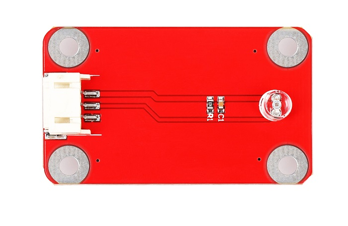
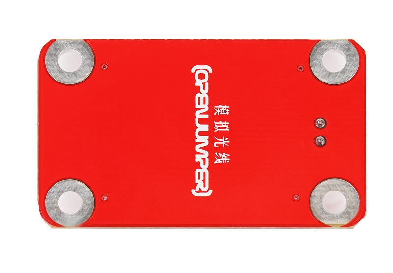
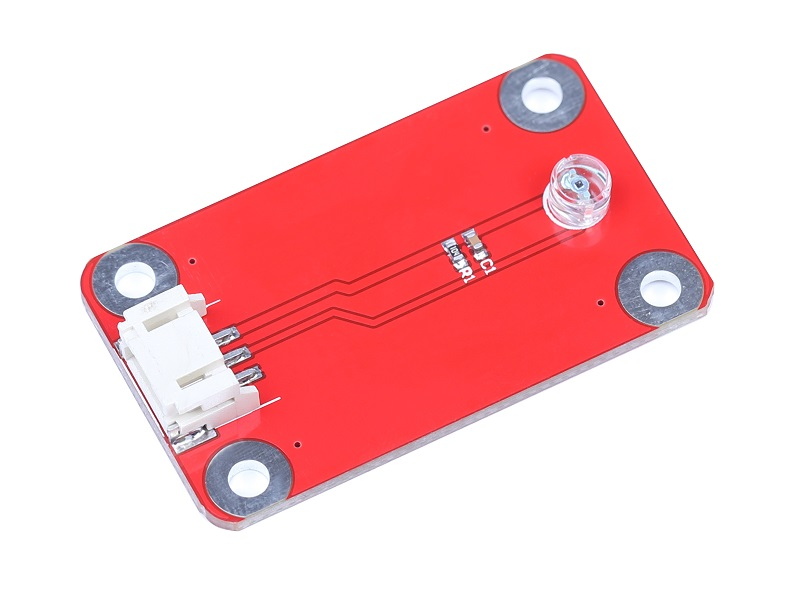
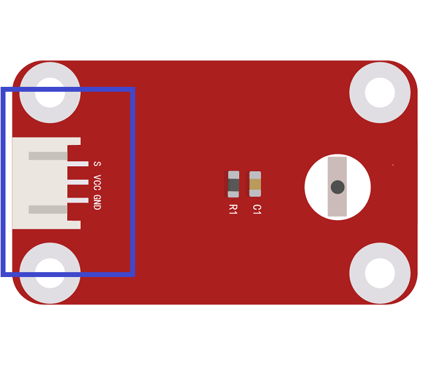

# 模拟光敏传感器
## 概述

光敏电阻器是利用半导体的光电导效应制成的一种电阻值随入射光的强弱而改变的电阻器，又称为光电导探测器。当入射光强，电阻减小，入射光弱，电阻增大。可用来对周围环境光的强度进行检测，结合Arduino控制器可实现光的测量，可通过3P传感器连接线与Arduino专用传感器扩展板结合使用，可以制作光感相关的互动作品，四周设有固定螺栓孔，方便安装。 

<table border="1">

<tr>
  <td align="center"></td>
  <td align="center"></td>
  <td align="center"></td>
</tr>
<tr>
  <td style="background-color:rgb(232,232,232,0.5) "colspan="3" align="center"> <a href="https://item.taobao.com/item.htm?id=591987142157"><font style="font-size:16px"> 模拟光敏传感器</font></a> </td>
</tr>
</table>


## 模块参数

+ 尺寸：15mm×35mm
  
+ 工作电压：5V
  
+ 信号类型：模拟输出
  
+ 光敏探头：5537光敏探头
  
+ 环境温度： –30℃— +70℃

## 端口说明

+ OUT：信号输出
  
+ +：VCC
  
+ –：GND
  
 

## 示例程序
```C++
    /*OJ light sensor 
     www.openjumper.cn
     */

     void setup() {
       Serial.begin(9600);
     }
     void loop() {
       int sensorValue = analogRead(A0);
       Serial.println(sensorValue);
       delay(100);
     }
```

 

## 相关文档

[mixly程序下载](http://download.openjumper.cn/mixly/analog-light-sensor.mix)

[light-Sensor-schematic](http://www.openjumper.cn/wp-content/uploads/2012/08/light-Sensor-schematic.pdf)

