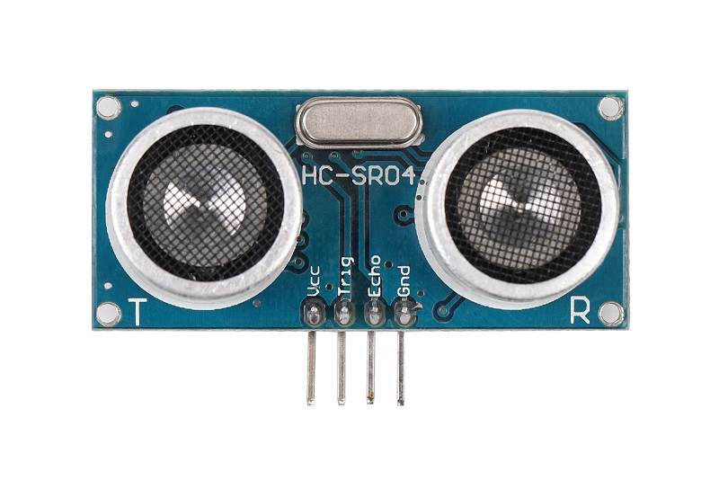

# SR04超声波传感器

## 概述

超声波传感器是利用超声波的特性研制而成的传感器。SR04是最常见的超声波传感器之一，在arduino开发中超声波传感器SR04主要用来测距，相比其他测距传感器有着简单易用、灵敏度高等特点。对于超声波传感器各种特性，超声波检测广泛应用在工业、国防、生物医学等方面。

<table border="1">

<tr>
  <td align="center"></td>
  <td align="center"></td>
  <td align="center"></td>
</tr>
<tr>
  <td style="background-color:rgb(232,232,232,0.5) "colspan="3" align="center"> <a href="https://item.taobao.com/item.htm?id=538445370024"><font style="font-size:16px"> SR04超声波传感器</font></a> </td>
</tr>
<tr>
  <td align="center"></td>
  <td align="center"></td>
  <td align="center"></td>
</tr>
<tr>
  <td style="background-color:rgb(232,232,232,0.5) "colspan="3" align="center"> <a href="https://item.taobao.com/item.htm?id=630804885023"><font style="font-size:16px"> SR04超声波传感器 防反接</font></a> </td>
</tr>
</table>


## 超声波传感器工作原理

- 采用IO触发测距，给至少10us的高电平信号；
  
- 模块自动发送8个40KHz的方波，自动检测是否有信号返回；

- 有信号返回，通过IO输出一高电平，高电平持续的时间就是超声波从发射到返回的时间．距离=(高电平时间*声速(340m/s))/2。
  
## 模块参数
  + 尺寸：长×宽×高 45\*20*15
  
  + 工作电压：5V
  
  + 感应角度：不大于15度
  
  + 探测距离：3cm-450cm
  
  + 精度：可达0.2cm

## 引脚定义

  + vcc-VCC
 
  + trig-控制端
  
  + echo-接收端
  
  + gnd-GND

## Arduino示例程序
```C++
const int TrigPin = 2; 
const int EchoPin = 3; 
float cm; 
void setup() 
{ 
  Serial.begin(9600); 
  pinMode(TrigPin, OUTPUT); 
  pinMode(EchoPin, INPUT); 
} 
void loop() 
{ 
  //发一个10ms的高脉冲去触发TrigPin 
  digitalWrite(TrigPin, LOW); 
  delayMicroseconds(2); 
  digitalWrite(TrigPin, HIGH); 
  delayMicroseconds(10); 
  digitalWrite(TrigPin, LOW); 

  cm = pulseIn(EchoPin, HIGH) / 58.0; //算成厘米 
  cm = (int(cm * 100.0)) / 100.0; //保留两位小数 
  Serial.print(cm); 
  Serial.print("cm"); 
  Serial.println(); 
  delay(1000); 
}
```
你也可以使用我们提供的类库驱动SR04超声波模块。

## 常见问答

1、超声波模块检测距范围是多少？

> 答：正常测量情况下测量距离范围和为3cm-450cm，是超声波模块本身决定。

2、用arduino驱动超声波模块，为何返回数据一直为0？  

> 答：首先检查你程序是否下载对，然后检查超声波传感器连线是否连接对。可以从侧面思考，换两个IO口测试。最后不行，再考虑是模块问题。（当然这种情况是非常小的）。
> 
## Mixly图形化示例程序


## 相关文档

+ [mixly程序下载](http://download.openjumper.cn/mixly/sr04.mix)

+ Arduino用SR04类库 ：[SR04](http://www.openjumper.cn/wp-content/uploads/2013/04/SR04.rar)

