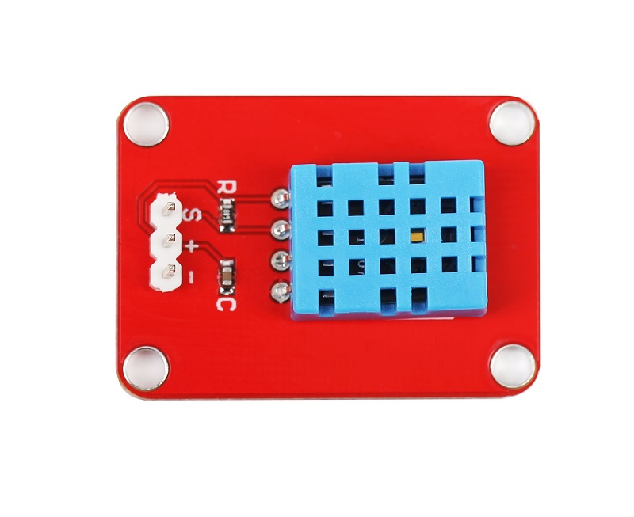
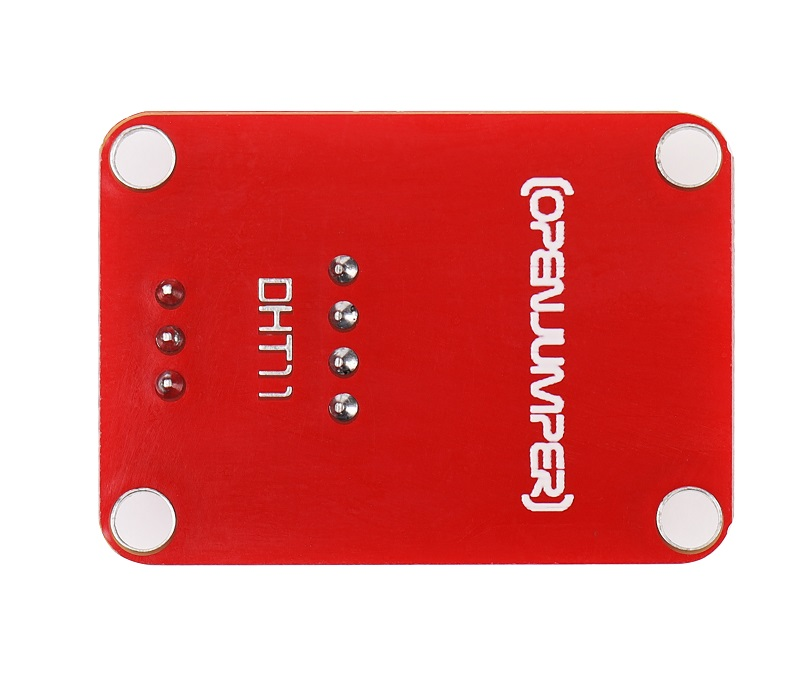
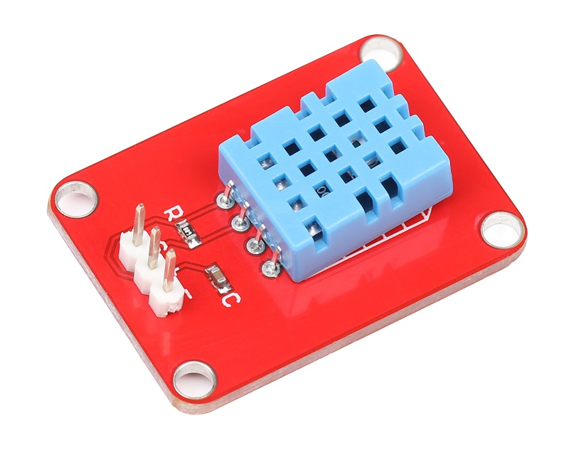
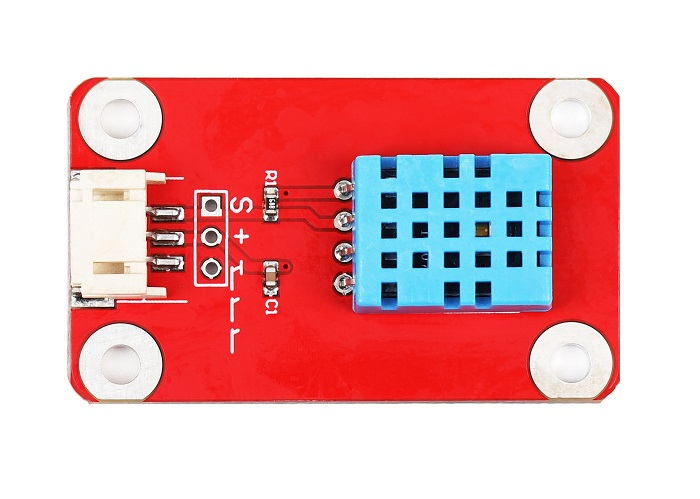
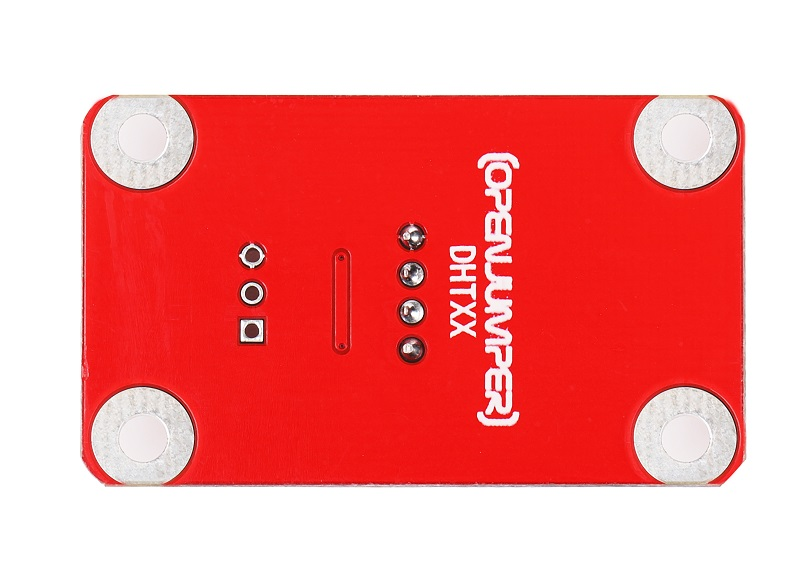
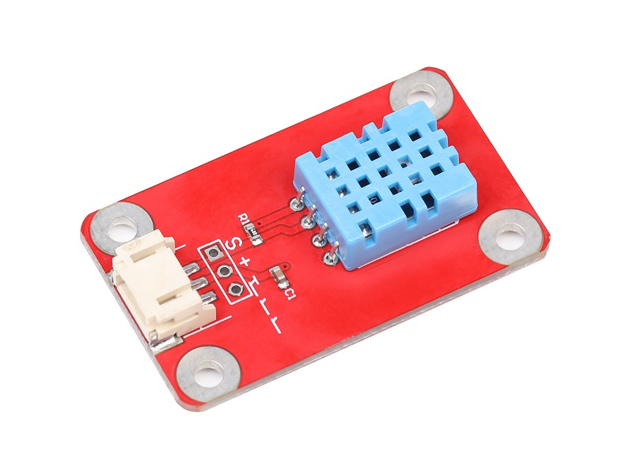
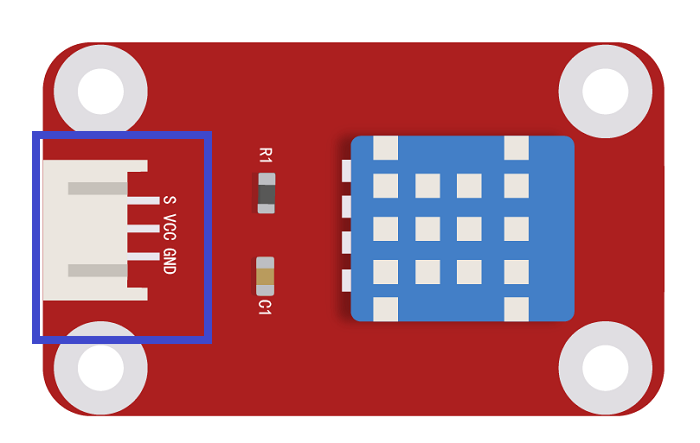

# DHT11数字温湿度传感器

<table border="1">
<tr>
  <td align="center"></td>
  <td align="center"></td>
  <td align="center"></td>
</tr>
<tr>
  <td style="background-color:rgb(232,232,232,0.5) "colspan="3" align="center"> <a href="https://item.taobao.com/item.htm?id=538167033463"><font style="font-size:16px">DHT11数字温湿度传感器</font></a> </td>
</tr>

<tr>
  <td align="center"></td>
  <td align="center"></td>
  <td align="center"></td>
</tr>
<tr>
  <td style="background-color:rgb(232,232,232,0.5)" colspan="3" align="center"><a href="https://item.taobao.com/item.htm?id=591982754683"><font style="font-size:16px">DHT11数字温湿度传感器 防反接</font></a></td>
</tr>
</table>

## 概述

DHT11数字温湿度传感器是一款含有已校准数字信号输出的温湿度复合传感器。它采用专用的数字模块采集技术和温湿度传感技术，确保产品具有极高的可靠性与卓越的长期稳定性。 DHT11采用单总线方式与arduino进行数据传输，单线制串行接口，使系统集成变得简易快捷。超小的体积、极低的功耗，信号传输距离可达20米以上，使其成为各类应用甚至最为苛刻的应用场合的最佳选则。


## 模块参数

+ 尺寸：35x25mm

+ 工作电压：5V

+ 信号类型：数字信号

## 模块特性

+ 供电电流：最大2.5Ma

+ 温度范围：0-50℃误差±2℃

+ 湿度范围：20-90%RH误差±5%RH

+ 响应时间: 1/e(63%) 6-30s

+ 采样周期间隔不得低于1秒钟
  
## 端口说明

+ S：信号输出

+ +：VCC

+ –：GND



## Arduino示例程序

```C++

double Fahrenheit(double celsius)
{
return 1.8 * celsius + 32;
}    //摄氏温度度转化为华氏温度

double Kelvin(double celsius)
{
 return celsius + 273.15;
} //摄氏温度转化为开氏温度
        
// 露点（点在此温度时，空气饱和并产生露珠）
// 参考: http://wahiduddin.net/calc/density_algorithms.htm

double dewPoint(double celsius, double humidity)
{
        double A0= 373.15/(273.15 + celsius);
        double SUM = -7.90298 * (A0-1);
        SUM += 5.02808 * log10(A0);
        SUM += -1.3816e-7 * (pow(10, (11.344*(1-1/A0)))-1) ;
        SUM += 8.1328e-3 * (pow(10,(-3.49149*(A0-1)))-1) ;
        SUM += log10(1013.246);
        double VP = pow(10, SUM-3) * humidity;
        double T = log(VP/0.61078); // temp var<br />return (241.88 * T) / (17.558-T);
        }
        

// 快速计算露点，速度是5倍dewPoint()
// 参考: http://en.wikipedia.org/wiki/Dew_point

double dewPointFast(double celsius, double humidity)
{
        double a = 17.271;
        double b = 237.7;
        double temp = (a * celsius) / (b + celsius) + log(humidity/100);
        double Td = (b * temp) / (a - temp);<br />return Td;
 }
        
```

```C++
#include <dht11.h>
dht11 DHT11;
#define DHT11PIN 2


void setup()
{
        Serial.begin(9600);
        Serial.println("DHT11 TEST PROGRAM ");
        Serial.print("LIBRARY VERSION: ");
        Serial.println(DHT11LIB_VERSION);
        Serial.println();
}
        

void loop()
{
        Serial.println("n");
        

int chk = DHT11.read(DHT11PIN);


Serial.print("Read sensor: ");
switch (chk)
{
        case DHTLIB_OK:
        Serial.println("OK");
        break;
        case DHTLIB_ERROR_CHECKSUM:
        Serial.println("Checksum error");
        break;
        case DHTLIB_ERROR_TIMEOUT:
        Serial.println("Time out error");
        break;
        default:
        Serial.println("Unknown error");
        break;
        }
        

Serial.print("Humidity (%): ");
Serial.println((float)DHT11.humidity, 2);

Serial.print("Temperature (oC): ");
Serial.println((float)DHT11.temperature, 2);


Serial.print("Temperature (oF): ");
Serial.println(Fahrenheit(DHT11.temperature), 2);

Serial.print("Temperature (K): ");
Serial.println(Kelvin(DHT11.temperature), 2);

Serial.print("Dew Point (oC): ");
Serial.println(dewPoint(DHT11.temperature, DHT11.humidity));


Serial.print("Dew PointFast (oC): ");
Serial.println(dewPointFast(DHT11.temperature, DHT11.humidity));


delay(2000);
}
```
## Mixly图形化示例程序  


## 相关文档

+ [mixly程序下载](http://download.openjumper.cn/mixly/dht11.mix)

+ 技术手册：[DHT11](http://openjumper.cn/wp-content/uploads/2012/08/DHT11.pdf)

+ 库文件：[DHT111](http://openjumper.cn/wp-content/uploads/2012/08/DHT111.zip)

+ 原理图：[DHT11-schematic](http://openjumper.cn/wp-content/uploads/2012/08/DHT11-schematic.pdf)

