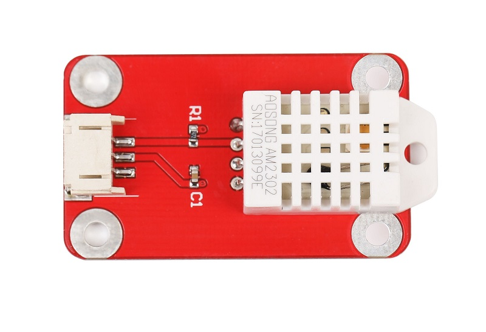
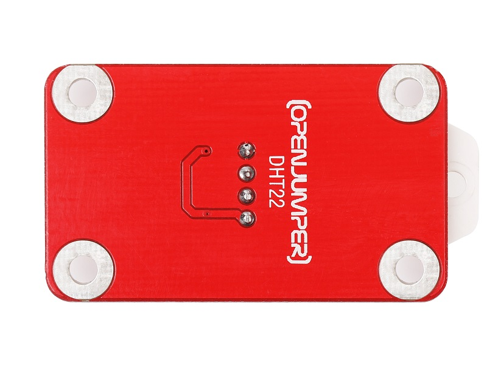
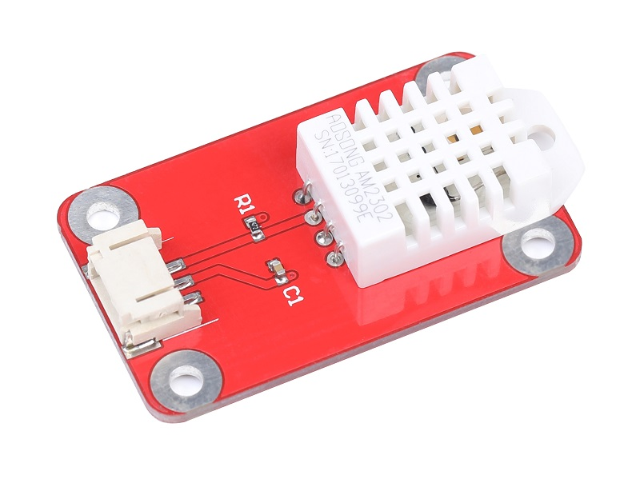
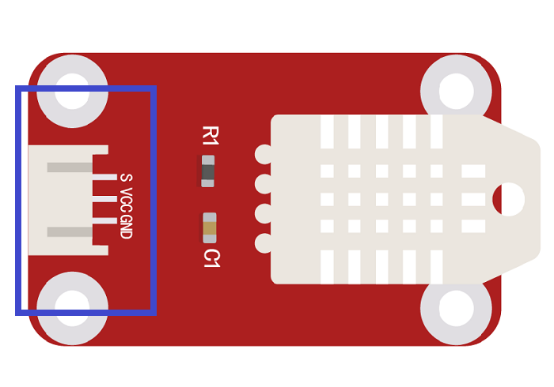
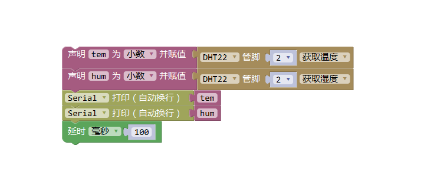

# DHT22温湿度传感器
## 概述

DHT22数字温湿度传感器是一款含有已校准数字信号输出的温湿度复合传感器。它应用专用的数字模块采集技术和温湿度传感技术，确保产品具有极高的可靠性与卓越的长期稳定性。

<table border="1">

<tr>
  <td align="center"></td>
  <td align="center"></td>
  <td align="center"></td>
</tr>
<tr>
  <td style="background-color:rgb(232,232,232,0.5) "colspan="3" align="center"> <a href="https://item.taobao.com/item.htm?id=591649672925"><font style="font-size:16px">DHT22温湿度传感器</font></a> </td>
</tr>
</table>


## 产品特点

+ 传感器包括一个电容式感湿元件和一个NTC测温元件，并与一个高性能8位单片机相连接。因此该产品具有品质卓越、超快响应、抗干扰能力强、性价比极高等优点。

+ 单线制串行接口，使系统集成变得简易快捷。

+ 超小的体积、极低的功耗，信号传输距离可达20米以上，使其成为各类应用甚至最为苛刻的应用场合的最佳选则。

+ 产品连接方便，可直接插接到Arduino传感器扩展板上。

+ DHT22数字温湿度传感器精度较高，可以替代昂贵的进口SHT10温湿度传感器。相比DHT11，输出精度更高。


## 模块参数

+ 尺寸：35x25mm

+ 工作电压：5V

+ 信号类型：数字信号

## 端口说明

+ S：信号输出

+ +：VCC

+ –：GND



## 模块特性

+ 温度范围：-40-80℃ 分辨率0.1℃  误差±0.5℃

+ 湿度范围：0-100%RH 分辨率0.1%RH 误差±2%RH

## Arduino 驱动实例
```C++
    // Example testing sketch for various DHT humidity/temperature sensors
    // Written by ladyada, public domain

    #include <DHT.h>

    #define DHTPIN 2 // what digital pin we're connected to

    // Uncomment whatever type you're using!
    //#define DHTTYPE DHT11 // DHT 11
    #define DHTTYPE DHT22 // DHT 22 (AM2302), AM2321
    //#define DHTTYPE DHT21 // DHT 21 (AM2301)

    // Connect pin 1 (on the left) of the sensor to +5V
    // NOTE: If using a board with 3.3V logic like an Arduino Due connect pin 1
    // to 3.3V instead of 5V!
    // Connect pin 2 of the sensor to whatever your DHTPIN is
    // Connect pin 4 (on the right) of the sensor to GROUND
    // Connect a 10K resistor from pin 2 (data) to pin 1 (power) of the sensor

    // Initialize DHT sensor.
    // Note that older versions of this library took an optional third parameter to
    // tweak the timings for faster processors. This parameter is no longer needed
    // as the current DHT reading algorithm adjusts itself to work on faster procs.
    DHT dht(DHTPIN, DHTTYPE);

    void setup() {
     Serial.begin(9600);
     Serial.println("DHTxx test!");

     dht.begin();
    }

    void loop() {
     // Wait a few seconds between measurements.
     delay(2000);

     // Reading temperature or humidity takes about 250 milliseconds!
     // Sensor readings may also be up to 2 seconds 'old' (its a very slow sensor)
     float h = dht.readHumidity();
     // Read temperature as Celsius (the default)
     float t = dht.readTemperature();
     // Read temperature as Fahrenheit (isFahrenheit = true)
     float f = dht.readTemperature(true);

     // Check if any reads failed and exit early (to try again).
     if (isnan(h) || isnan(t) || isnan(f)) {
     Serial.println("Failed to read from DHT sensor!");
     return;
     }

     // Compute heat index in Fahrenheit (the default)
     float hif = dht.computeHeatIndex(f, h);
     // Compute heat index in Celsius (isFahreheit = false)
     float hic = dht.computeHeatIndex(t, h, false);

     Serial.print("Humidity: ");
     Serial.print(h);
     Serial.print(" %\t");
     Serial.print("Temperature: ");
     Serial.print(t);
     Serial.print(" *C ");
     Serial.print(f);
     Serial.print(" *F\t");
     Serial.print("Heat index: ");
     Serial.print(hic);
     Serial.print(" *C ");
     Serial.print(hif);
     Serial.println(" *F");
    }
```
## 图形化示例程序



## 其他文件

+ [mixly程序下载](http://download.openjumper.cn/mixly/dht22.mix)

+ 数据手册：[DHT22](http://www.openjumper.cn/wp-content/uploads/2014/02/DHT22.pdf)

+ 库文件：[DHT22 库文件](https://github.com/adafruit/DHT-sensor-library)（以github作者更新为准）

+ 本地库文件：[DHT22lib](http://pan.baidu.com/s/1kVBPux5)

