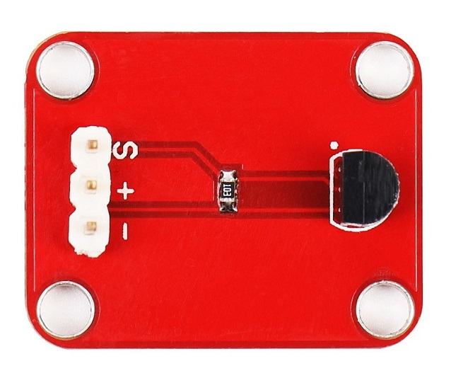
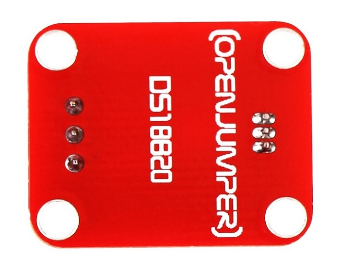
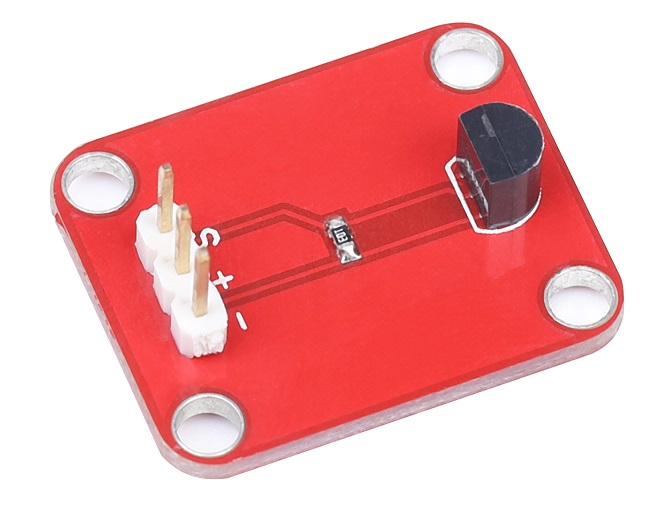
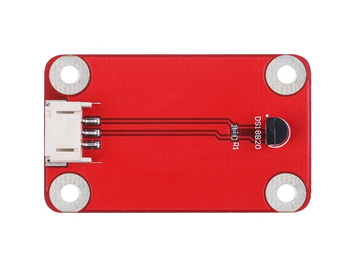
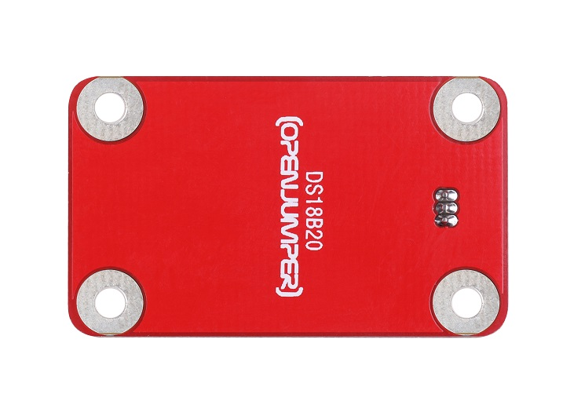
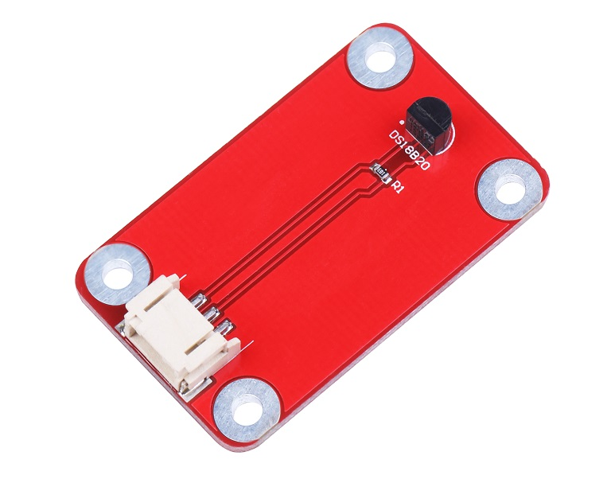
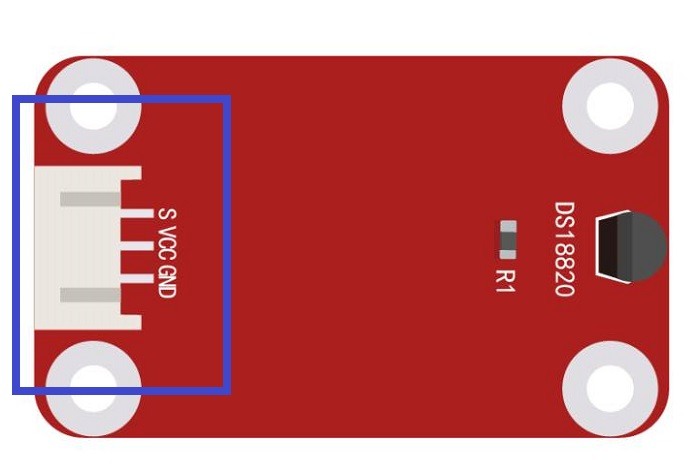
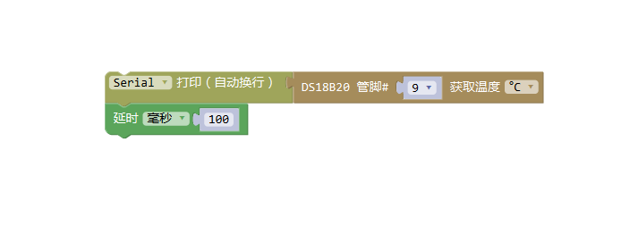

# DS18B20数字温度传感器

<table border="1">
<tr>
  <td align="center"></td>
  <td align="center"></td>
  <td align="center"></td>
</tr>
<tr>
  <td style="background-color:rgb(232,232,232,0.5) "colspan="3" align="center"> <a href="https://item.taobao.com/item.htm?id=537606850488"><font style="font-size:16px">DS18B20数字温度传感器</font></a> </td>
</tr>

<tr>
  <td align="center"></td>
  <td align="center"></td>
  <td align="center"></td>
</tr>
<tr>
  <td style="background-color:rgb(232,232,232,0.5)" colspan="3" align="center"><a href="https://item.taobao.com/item.htm?id=592197763443"><font style="font-size:16px">DS18B20数字温度传感器 防反接</font></a></td>
</tr>
</table>

## 概述

基于DS18B20的数字温度传感器，可以用来对环境温度进行定量的检测。DS18B20数字温度传感器是美国DALLAS公司生产的一总线数字温度传感器。其测温范围－55℃～＋125℃，固有测温分辨率0.5℃，支持多点组网功能，多个DS18B20可以并联在唯一的三线上，实现多点测温，测量结果以9~12位数字量方式串行传送。DS18B20数字温度传感器与Arduino专用传感器扩展板结合使用，可以非常容易地实现与环境温度感知相关的互动效果。


## 模块参数

+ 尺寸：19mm*26mm

+ 工作电压：5V

+ 温度测量范围：-55℃ ~ +125℃

+ 测量精度：±0.5 °C（-10 °C至+85 °C范围内）

+ 转换精度：9~12位A/D转换精度

+ 分辨率：0.5℃

## 端口说明

+ S : 信号输出

+ \+ : VCC

+ – : GND
  


## 示例程序

```C++
#include <OneWire.h>
#include <DallasTemperature.h>
// Data wire is plugged into port 2 on the Arduino
#define ONE_WIRE_BUS 2
// Setup a oneWire instance to communicate with any OneWire devices (not just Maxim/Dallas temperature ICs)
OneWire oneWire(ONE_WIRE_BUS);
// Pass our oneWire reference to Dallas Temperature. 
DallasTemperature sensors(&oneWire);

void setup(void)
{
  // start serial port
  Serial.begin(9600);
  Serial.println("Dallas Temperature IC Control Library Demo");

  // Start up the library
  sensors.begin();
}

void loop(void)
{ 
  // call sensors.requestTemperatures() to issue a global temperature 
  // request to all devices on the bus
  Serial.print("Requesting temperatures...");
  sensors.requestTemperatures(); // Send the command to get temperatures
  Serial.println("DONE");

  Serial.print("Temperature for the device 1 (index 0) is: ");
  Serial.println(sensors.getTempCByIndex(0));  
}
```

## 常见问答

可以同时采养多路温度传感器值吗？

> 答：DS18B20是采样单总线通信方式，一条线上可以挂0~255个设备，只需要一个数字I/O口。需控制距离在0.5米以内。我们不提供相应例程，用户自行解决实际中遇到的问题。

## Arduino Mixly图形化程序



## 其他文档

+ [mixly程序下载](http://download.openjumper.cn/mixly/ds18b20.mix)

+ DS18B20 lib :[DallasTemperature](http://openjumper.cn/wp-content/uploads/2012/08/DallasTemperature.zip)

+ [OneWire](http://openjumper.cn/wp-content/uploads/2012/08/OneWire.zip)

+ schematic :[DS18B20](http://openjumper.cn/wp-content/uploads/2012/08/DS18B20.pdf)

+ [DS18B20+_PDF_C9753_2017-01-03](http://openjumper.cn/wp-content/uploads/2012/08/DS18B20-_PDF_C9753_2017-01-03.pdf)

