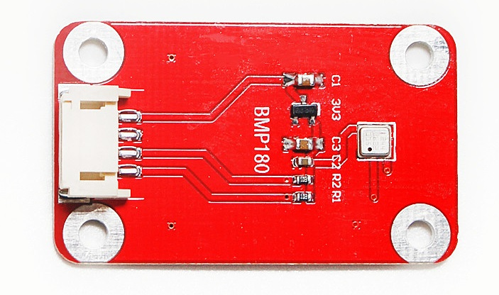

# 气压传感器 BMP180

<table border="1">
<tr>
  <td align="center"></td>
  <td align="center"></td>
</tr>
<tr>
  <td style="background-color:rgb(232,232,232,0.5) "colspan="3" align="center"> <a href="https://item.taobao.com/item.htm?id=557748052848"><font style="font-size:16px">气压传感器 BMP180</font></a> </td>
</tr>

<tr>
  <td align="center"></td>
  <td align="center"></td>
</tr>
<tr>
  <td style="background-color:rgb(232,232,232,0.5)" colspan="2" align="center"><a href="https://item.taobao.com/item.htm?id=591604328133"><font style="font-size:16px">气压传感器 BMP180 防反接</font></a></td>
</tr>
</table>

## 概述

BMP180是一款高精度、小体积、超低能耗的压力传感器，可以应用在移动设备中它的性能卓越，绝对精度最低可以达到0.03hPa，并且耗电极低，只有3μA
BMP180采用强大的8-pin陶瓷无引线芯片承载（LCC）超薄封装，可以通过I2C总线直接与各种微处理器相连


## 技术规格

+ 压力范围：300～1100hPa（海拔9000米 ～ -500米）

+ 电源电压：5V(VCC)  VDDA 1.62V-3.6V

+ LCC8封装：无铅陶瓷载体封装（LCC）

+ 低功耗：5μA，在标准模式

+ 高精度：  
  低功耗模式下，分辨率为0.06hPa（0.5米）  
  高线性模式下，分辨率为0.03hPa（0.25米）

温度输出

+ 接口：IIC接口

+ SL1反应时间：7.5ms

+ 待机电流：0.1μA

+ 工作电压：5V
 
+ 工作范围：-40～+85℃


## 典型应用

温度，大气压强，海拔高度测量,室内室外导航，垂直速度指示（上升/下沉速度）。

## 示例程序
```C++
/* SFE_BMP180 altitude example sketch

This sketch shows how to use the Bosch BMP180 pressure sensor
as an altimiter.
https://www.sparkfun.com/products/11824

Like most pressure sensors, the BMP180 measures absolute pressure.
Since absolute pressure varies with altitude, you can use the pressure
to determine your altitude.

Because pressure also varies with weather, you must first take a pressure
reading at a known baseline altitude. Then you can measure variations
from that pressure

Hardware connections:

- (GND) to GND
+ (VDD) to 3.3V

(WARNING: do not connect + to 5V or the sensor will be damaged!)

You will also need to connect the I2C pins (SCL and SDA) to your
Arduino. The pins are different on different Arduinos:

Any Arduino pins labeled:  SDA  SCL
Uno, Redboard, Pro:        A4   A5
Mega2560, Due:             20   21
Leonardo:                   2    3

Leave the IO (VDDIO) pin unconnected. This pin is for connecting
the BMP180 to systems with lower logic levels such as 1.8V

Have fun! -Your friends at SparkFun.

The SFE_BMP180 library uses floating-point equations developed by the
Weather Station Data Logger project: http://wmrx00.sourceforge.net/

Our example code uses the "beerware" license. You can do anything
you like with this code. No really, anything. If you find it useful,
buy me a beer someday.

V10 Mike Grusin, SparkFun Electronics 10/24/2013
V1.1.2 Updates for Arduino 1.6.4 5/2015
*/

// Your sketch must #include this library, and the Wire library.
// (Wire is a standard library included with Arduino.):

#include <SFE_BMP180.h>
#include <Wire.h>

// You will need to create an SFE_BMP180 object, here called "pressure":

SFE_BMP180 pressure;

double baseline; // baseline pressure

void setup()
{
  Serial.begin(9600);
  Serial.println("REBOOT");

  // Initialize the sensor (it is important to get calibration values stored on the device).

  if (pressure.begin())
    Serial.println("BMP180 init success");
  else
  {
    // Oops, something went wrong, this is usually a connection problem,
    // see the comments at the top of this sketch for the proper connections.

    Serial.println("BMP180 init fail (disconnected?)\n\n");
    while(1); // Pause forever.
  }

  // Get the baseline pressure:
  
  baseline = getPressure();
  
  Serial.print("baseline pressure: ");
  Serial.print(baseline);
  Serial.println(" mb");  
}

void loop()
{
  double a,P;
  
  // Get a new pressure reading:

  P = getPressure();

  // Show the relative altitude difference between
  // the new reading and the baseline reading:

  a = pressure.altitude(P,baseline);
  
  Serial.print("relative altitude: ");
  if (a >= 0.0) Serial.print(" "); // add a space for positive numbers
  Serial.print(a,1);
  Serial.print(" meters, ");
  if (a >= 0.0) Serial.print(" "); // add a space for positive numbers
  Serial.print(a*3.28084,0);
  Serial.println(" feet");
  
  delay(500);
}


double getPressure()
{
  char status;
  double T,P,p0,a;

  // You must first get a temperature measurement to perform a pressure reading.
  
  // Start a temperature measurement:
  // If request is successful, the number of ms to wait is returned.
  // If request is unsuccessful, 0 is returned.

  status = pressure.startTemperature();
  if (status != 0)
  {
    // Wait for the measurement to complete:

    delay(status);

    // Retrieve the completed temperature measurement:
    // Note that the measurement is stored in the variable T.
    // Use '&T' to provide the address of T to the function.
    // Function returns 1 if successful, 0 if failure.

    status = pressure.getTemperature(T);
    if (status != 0)
    {
      // Start a pressure measurement:
      // The parameter is the oversampling setting, from 0 to 3 (highest res, longest wait).
      // If request is successful, the number of ms to wait is returned.
      // If request is unsuccessful, 0 is returned.

      status = pressure.startPressure(3);
      if (status != 0)
      {
        // Wait for the measurement to complete:
        delay(status);

        // Retrieve the completed pressure measurement:
        // Note that the measurement is stored in the variable P.
        // Use '&P' to provide the address of P.
        // Note also that the function requires the previous temperature measurement (T).
        // (If temperature is stable, you can do one temperature measurement for a number of pressure measurements.)
        // Function returns 1 if successful, 0 if failure.

        status = pressure.getPressure(P,T);
        if (status != 0)
        {
          return(P);
        }
        else Serial.println("error retrieving pressure measurement\n");
      }
      else Serial.println("error starting pressure measurement\n");
    }
    else Serial.println("error retrieving temperature measurement\n");
  }
  else Serial.println("error starting temperature measurement\n");
}

```


## Micro：bit图形化示例程序
  


## 相关资料

+ [mixly程序下载](http://download.openjumper.cn/mixly/bmp180.mix)

+ 程序：[BMP180_Breakout_Arduino_Library-master](http://openjumper.cn/wp-content/uploads/2016/05/BMP180_Breakout_Arduino_Library-master.zip)

+ 手册：[BST-BMP180](http://openjumper.cn/wp-content/uploads/2016/05/BST-BMP180.pdf)

+ 原理图：[sch](http://openjumper.cn/wp-content/uploads/2016/05/sch.pdf)

