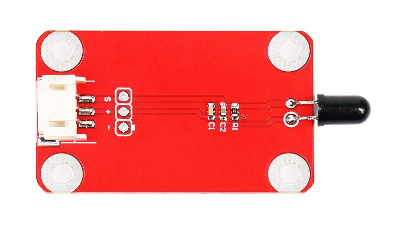
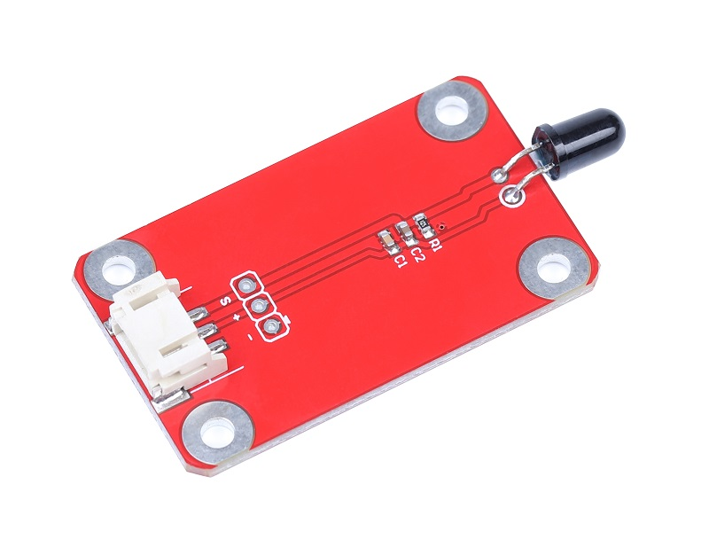
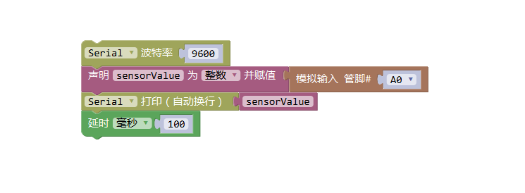

# 红外火焰传感器
## 概述

红外火焰传感器主要是用来探测周围火焰发出的红外光线，模块输出模拟信号，在灭火机器人比赛中常利用红外火焰传感器检测火源来寻找目标。探测角度大于40度。

<table border="1">

<tr>
  <td align="center"></td>
  <td align="center"></td>
  <td align="center"></td>
</tr>
<tr>
  <td style="background-color:rgb(232,232,232,0.5) "colspan="3" align="center"><a href="https://item.taobao.com/item.htm?id=599912790880"><font style="font-size:16px">红外火焰传感器</font></a> </td>
</tr>
</table>


## 参数

+ 工作电压：5V

+ 尺寸：25mm*20mm

+ 工作温度：-25~70℃

+ 探测距离：20~100cm

+ 探测光线波长：940nm

+ 输出信号：模拟信号
  
## 引脚定义
+ S：信号

+ +：VCC

+ -：GND

## Arduino示例程序

```C++
/*OJ flame module
  www.openjumper.cn
  */

  void setup() {
    Serial.begin(9600);
  }
  void loop() {
    int sensorValue = analogRead(A0);
    Serial.println(sensorValue);
    delay(100);
  }
```
## Mixly图形化示例程序



[mixly程序下载](http://download.openjumper.cn/mixly/infrared-flame.mix)