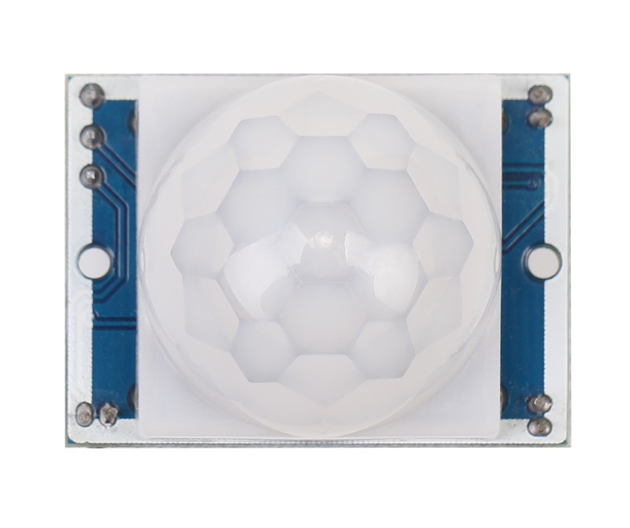
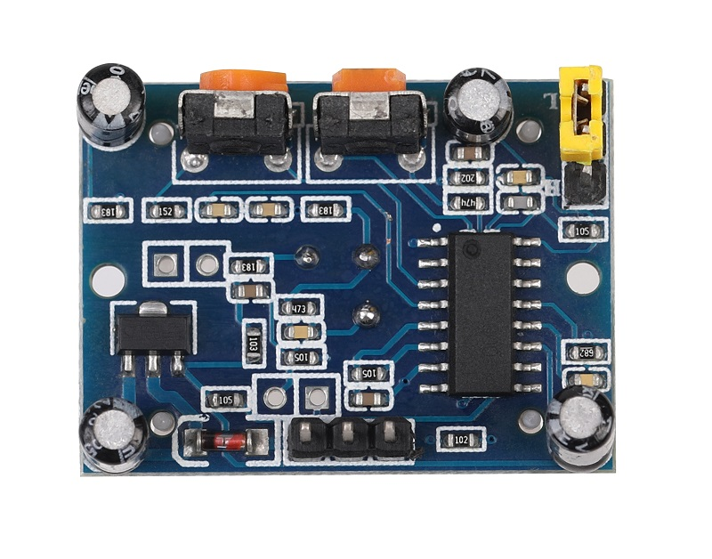
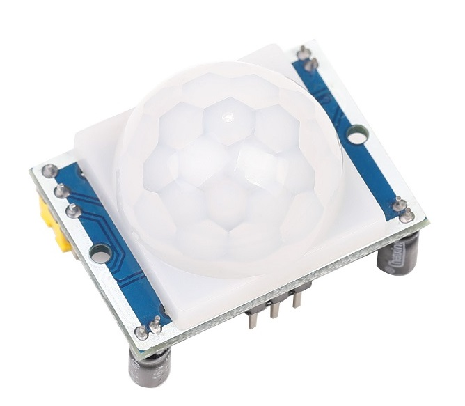
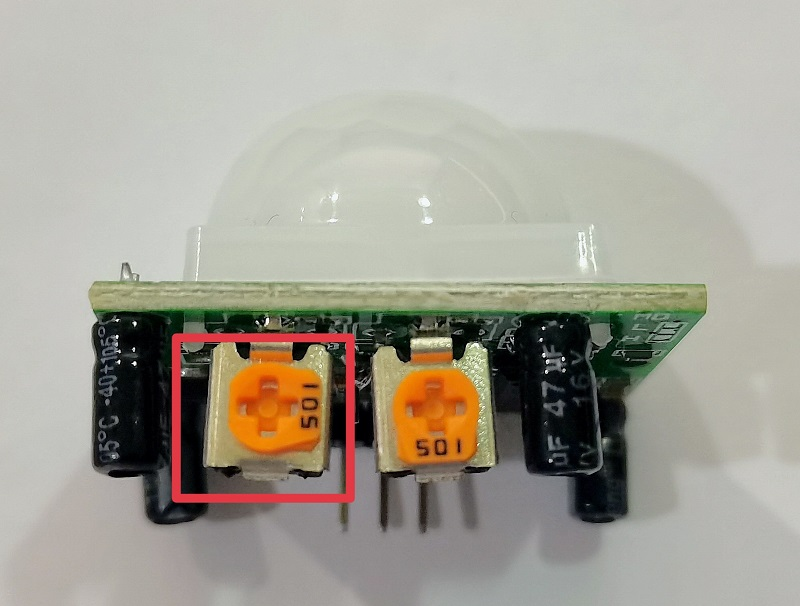

# SR501人体红外感应模块

## 概述

人体都有恒定的体温，一般在37度，所以会发出特定波长10UM左右的红外线，被动式红外探头就是靠探测人体发射的10UM左右的红外线而进行工作的。人体发射的10UM左右的红外线通过菲泥尔滤光片增强后聚集到红外感应源上。红外感应源通常采用热释电元件，这种元件在接收到人体红外辐射温度发生变化时就会失去电荷平衡，向外释放电荷，后续电路经检测处理后就能产生报警信号。

<table border="1">

<tr>
  <td align="center"></td>
  <td align="center"></td>
  <td align="center"></td>
</tr>
<tr>
  <td style="background-color:rgb(232,232,232,0.5) "colspan="3" align="center"> <a href="https://item.taobao.com/item.htm?id=552766236635"><font style="font-size:16px">SR501人体红外感应模块</font></a></td>
</tr>
</table>

## 概述

1.这种探头是以探测人体辐射为目标的。所以热释电元件对波长为10UM左右的红外辐射必须非常敏感。

2.为了仅仅对人体的红外辐射敏感，在它的辐射照面通常覆盖有特殊的菲泥尔滤光片，使环境的干扰受到明显的控制作用。

3.被动红外探头，其传感器包含两个互相串联或并联的热释电元。而且制成的两个电极化方向正好相反，环境背景辐射对两个热释元件几乎具有相同的作用，使其产生释电效应相互抵消，于是探测器无信号输出。

4.一旦人侵入探测区域内，人体红外辐射通过部分镜面聚焦，并被热释电元接收，但是两片热释电元接收到的热量不同，热释电也不同，不能抵消，经信号处理而报警。

5.菲泥尔滤光片根据性能要求不同，具有不同的焦距(感应距离)，从而产生不同的监控视场，视场越多，控制越严密。

## 注意

**模块持续输出高电平是因为检测距离过大灵敏度过高，逆时针旋转电位器90度可以调节至较为合适的灵敏度，具体角度可根据使用场景的不同进行微调。**



## 模块参数

+ 工作电压：DC5V至20V

+ 静态功耗：65μA

+ 电平输出：高3.3V，低0V

+ 延时时间：可调(0.3秒~18秒)

+ 封锁时间：0.2秒

+ 触发方式：L不可重复，H可重复，默认值为H(跳帽选择)

+ 感应范围：小于120度锥角，7米以内

+ 工作温度：-15~+70度


## 触发方式

**L不可重复，H可重复。可跳线选择，默认为H**

 - **不可重复触发方式：** 即感应输出高电平后，延时时间一结束，输出将自动从高电平变为低电平。 

 - **可重复触发方式：** 即感应输出高电平后，在延时时间段内，如果有人体在其感应范围内活动，其输出将一直保持高电平，直到人离开后才延时将高电平变为低电平(感应模块检测到人体的每一次活动后会自动顺延一个延时时间段，并且以最后一次活动的时间为延时时间的起始点)。 

**可调节封锁时间 及检测距离调节** 

 - **封锁时间：** 感应模块在每一次感应输出后(高电平变为低电平)，可以紧跟着设置一个封锁时间，在此时间段内感应器不接收任何感应信号。此功能可以实现(感应输出时间和封锁时间)两者的间隔工作，可应用于间隔探测产品；同时此功能可有效抑制负载切换过程中产生的各种干扰。(默认封锁时间2.5S)

 + **调节检测距离：** 通过调节两个变阻器调节灵敏度和检测距离  

## 模块优缺点

**优点：** 本身不发任何类型的辐射，器件功耗很小，隐蔽性好。价格低廉。

**缺点：**

+ 容易受各种热源、光源干扰

+ 被动红外穿透力差，人体的红外辐射容易被遮挡，不易被探头接收。

+ 易受射频辐射的干扰。

+ 环境温度和人体温度接近时，探测和灵敏度明显下降，有时造成短时失灵。

## 抗干扰

+ 防小动物干扰

+ 防电磁干扰

+ 防强灯光干扰

## 安装

红外线热释电人体传感器只能安装在室内，其误报率与安装的位置和方式有极大的关系，正确的安装应满足下列条件：

   + 红外线热释电传感器应离地面2.0-2.2米。

   + 红外线热释电传感器远离空调, 冰箱，火炉等空气温度变化敏感的地方。
 
   + 红外线热释电传感器探测范围内不得隔屏、家具、大型盆景或其他隔离物。
   
   + 红外线热释电传感器不要直对窗口，否则窗外的热气流扰动和人员走动会引起误报，有条件的最好把窗帘拉上。红外线热释电传感器也不要安装在有强气流活动的地方。  

红外线热释电传感器对人体的敏感程度还和人的运动方向关系很大。热释电红外传感器对于径向移动反应最不敏感, 而对于横切方向 (即与半径垂直的方向)移动则最为敏感. 在现场选择合适的安装位置是避免红外探头误报、求得最佳检测灵敏度极为重要的一环。

## 示例程序

```C++
/*OJ PIR Motion Sensor
 www.openjumper.cn
 */
int Sensor= 2;
void setup() {
   Serial.begin(9600);
   pinMode(Sensor, INPUT);
}
void loop() {
   int SensorState = digitalRead(Sensor);
   Serial.println(SensorState);
   delay(100);      
}
```
## 常见问答

SR501人体红外感应模块三个引脚怎么定义的？

> 答：取下菲涅尔透镜外壳，模块上有丝印标记，VCC、OUT、GND分别对应接主控器的VCC、信号、GND。

## 其他资料

[mixly程序下载](http://download.openjumper.cn/mixly/sr501.mix)